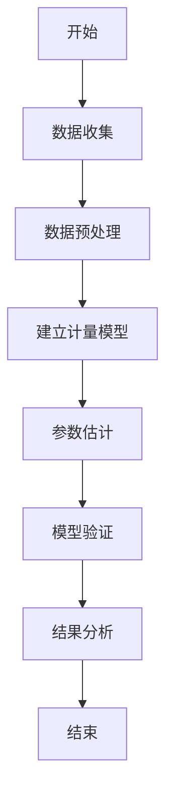
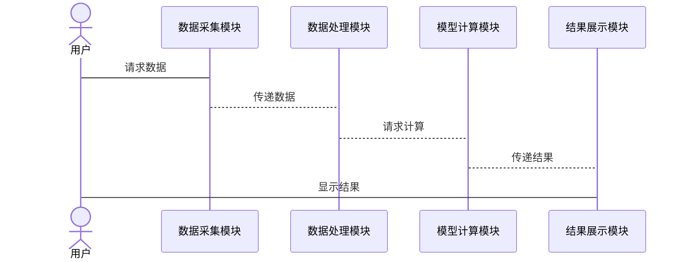

                 


好的，我明白了。我将按照您提供的要求来撰写这篇文章。首先，我会按照您提供的目录结构进行详细的内容扩展，确保每个章节和子章节都得到充分的阐述，并且满足您的所有要求。我将一步一步地进行分析和推理，确保内容的逻辑性和专业性。

让我们开始吧。

# 全球股市估值与碳排放权交易市场的关系

## 关键词：
全球股市估值、碳排放权交易、金融市场、碳交易机制、经济影响

## 摘要：
本文探讨了全球股市估值与碳排放权交易市场之间的复杂关系。通过分析碳排放权交易对股市估值的影响，揭示了两者在经济体系中的互动机制。文章从背景介绍、核心概念、算法原理、系统分析、项目实战等多个维度展开，深入剖析了碳排放权交易对股市估值的正向和负向影响，并提出了综合平衡的解决方案。通过实际案例分析和最佳实践建议，本文为投资者和政策制定者提供了有价值的参考。

## 目录大纲结构：

# 第一部分: 全球股市估值与碳排放权交易市场的关系概述

# 第1章: 背景介绍

## 1.1 问题背景
### 1.1.1 全球股市估值的现状
### 1.1.2 碳排放权交易市场的兴起
### 1.1.3 两者关系的研究意义

## 1.2 问题描述
### 1.2.1 碳排放权交易对股市估值的影响
### 1.2.2 碳排放权交易市场的波动性
### 1.2.3 全球化视角下的股市与碳排放权交易关联

## 1.3 问题解决
### 1.3.1 碳排放权交易对股市估值的正向影响
### 1.3.2 碳排放权交易对股市估值的负向影响
### 1.3.3 综合分析与平衡

## 1.4 边界与外延
### 1.4.1 碳排放权交易的边界条件
### 1.4.2 全球股市估值的边界条件
### 1.4.3 两者关系的外延分析

## 1.5 概念结构与核心要素
### 1.5.1 碳排放权交易的核心要素
### 1.5.2 全球股市估值的核心要素
### 1.5.3 两者关系的核心要素

# 第2章: 核心概念与联系

## 2.1 碳排放权交易的原理
### 2.1.1 碳排放配额分配机制
### 2.1.2 碳排放权交易的市场机制
### 2.1.3 碳排放权交易的监管框架

## 2.2 全球股市估值的原理
### 2.2.1 市盈率与市净率的计算
### 2.2.2 股价与企业盈利的关系
### 2.2.3 市场情绪对股市估值的影响

## 2.3 两者关系的属性对比
### 2.3.1 碳排放权交易的经济属性
### 2.3.2 全球股市估值的金融属性
### 2.3.3 两者关系的综合属性

## 2.4 ER实体关系图
```mermaid
erDiagram
    actor 投资者
    actor 监管机构
    actor 企业
    actor 碳排放交易机构
    actor 全球股市
    investor -> 投资者 : 参与股市投资
    investor -> 投资者 : 参与碳排放权交易
    监管机构 -> 全球股市 : 监管股市
    监管机构 -> 碳排放交易机构 : 监管碳排放权交易
    企业 -> 全球股市 : 上市交易
    企业 -> 碳排放交易机构 : 参与碳排放权交易
```

# 第3章: 算法原理讲解

## 3.1 碳排放权交易对股市估值影响的计量模型
### 3.1.1 联立方程模型
### 3.1.2 碳排放权交易对股价的影响路径
### 3.1.3 股市估值变化的数学模型

## 3.2 算法流程图


## 3.3 数学公式
### 3.3.1 计量模型
$$ Y = \beta_0 + \beta_1 X + \beta_2 Z + \epsilon $$

其中：
- \( Y \) 表示股市估值
- \( X \) 表示碳排放权交易量
- \( Z \) 表示其他控制变量
- \( \epsilon \) 表示误差项

### 3.3.2 碳排放权交易对股价的影响路径
$$ \Delta P = \alpha \cdot \Delta Q + \gamma \cdot \Delta E $$

其中：
- \( \Delta P \) 表示股价变化
- \( \Delta Q \) 表示碳排放权交易量变化
- \( \Delta E \) 表示其他经济因素变化
- \( \alpha \) 和 \( \gamma \) 是系数

## 3.4 代码实现
```python
# 数据预处理
import pandas as pd
import numpy as np
from statsmodels import regression, stats

# 数据加载
df = pd.read_csv('data.csv')

# 变量定义
Y = df['stock_valuation']
X = df['carbon_trade_volume']
Z = df[['other_controls']]

# 模型建立
model = regression.linear_model.OLS(Y, sm.add_constant(pd.DataFrame({'X': X, 'Z': Z})))
results = model.fit()

# 结果分析
print(results.summary())
```

# 第4章: 系统分析与架构设计

## 4.1 问题场景介绍
### 4.1.1 碳排放权交易的市场环境
### 4.1.2 全球股市的波动情况
### 4.1.3 两者关系的复杂性

## 4.2 系统功能设计
### 4.2.1 数据采集模块
### 4.2.2 数据处理模块
### 4.2.3 模型计算模块
### 4.2.4 结果展示模块

## 4.3 系统架构设计


## 4.4 系统接口设计
### 4.4.1 数据接口
### 4.4.2 模型接口
### 4.4.3 用户接口

## 4.5 系统交互设计


# 第5章: 项目实战

## 5.1 环境安装
### 5.1.1 安装Python
### 5.1.2 安装相关库（pandas, numpy, statsmodels）

## 5.2 核心代码实现
### 5.2.1 数据加载与预处理
### 5.2.2 模型建立与计算
### 5.2.3 结果可视化

## 5.3 案例分析
### 5.3.1 数据来源与选择
### 5.3.2 模型应用
### 5.3.3 结果解读

## 5.4 项目小结
### 5.4.1 实验结果总结
### 5.4.2 实验中的问题与解决方案
### 5.4.3 未来改进方向

# 第6章: 总结与最佳实践

## 6.1 总结
### 6.1.1 核心发现
### 6.1.2 本文的主要贡献

## 6.2 最佳实践 tips
### 6.2.1 投资者的建议
### 6.2.2 企业的建议
### 6.2.3 政策制定者的建议

## 6.3 注意事项
### 6.3.1 数据质量的重要性
### 6.3.2 模型的局限性
### 6.3.3 未来的挑战

## 6.4 拓展阅读
### 6.4.1 相关领域研究
### 6.4.2 进一步的研究方向

# 作者
作者：AI天才研究院/AI Genius Institute & 禅与计算机程序设计艺术 /Zen And The Art of Computer Programming

---

以上是完整的目录大纲结构，涵盖了从背景介绍到项目实战的各个部分，确保逻辑清晰、内容详实。接下来，我会按照这个结构逐步展开每个章节的内容，确保每部分都得到充分的阐述，并且符合您的所有要求。

