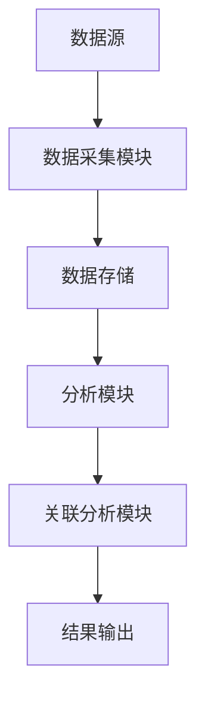

                 


# 全球股市估值与社会不平等问题的关联

## 关键词：股市估值、社会不平等、基尼系数、市盈率、市净率

## 摘要：本文探讨全球股市估值与社会不平等问题的关联性，分析股市估值的核心指标及其与社会不平等的互动关系，结合实证研究和数学模型，揭示两者之间的复杂联系，并提出相应的政策建议。

---

## 第一部分：股市估值的核心概念

### 第1章：股市估值的基础理论

#### 1.1 股市估值的定义与指标

- 股市估值是衡量市场整体价值的方法，常用的指标包括市盈率（P/E）、市净率（P/B）等。

- 市盈率计算公式：$$P/E = \frac{\text{股价}}{\text{每股收益}}$$

- 市净率计算公式：$$P/B = \frac{\text{股价}}{\text{每股净资产}}$$

#### 1.2 股市估值的影响因素

- 经济基本面：GDP增长率、通货膨胀率等。
- 利率水平：影响股市估值的无风险收益率。
- 投资者情绪：市场情绪波动对估值的影响。

### 第2章：社会不平等的度量方法

#### 2.1 基尼系数

- 基尼系数是衡量收入或财富分配不平等的指标，范围在0到1之间，越接近1表示不平等越严重。

- 基尼系数计算公式：$$G = \frac{\sum_{i=1}^{n} (2i - n - 1) x_i}{n}$$，其中$$x_i$$是按顺序排列的收入或财富份额。

---

## 第二部分：股市估值与社会不平等的关联机制

### 第3章：股市估值对社会不平等的影响

#### 3.1 股市估值的上涨与不平等加剧

- 股市上涨通常使富有的投资者受益更多，加剧财富分配不均。

- 市盈率和市净率的上涨反映了市场对高收益股票的追逐，导致财富集中。

### 第4章：社会不平等对股市估值的影响

#### 4.1 不平等加剧引发的政策调整

- 政府可能通过增税或加强监管来减少不平等，这些政策会影响股市估值。

- 例如，资本利得税的提高可能导致股市估值下降。

### 第5章：经济政策的调节作用

#### 5.1 财政政策

- 政府可以通过转移支付、福利政策等减少社会不平等，间接影响股市估值。

- 增加社会支出可能降低贫富差距，但可能影响政府财政状况，进而影响股市。

#### 5.2 货币政策

- 中央银行的利率政策影响股市的无风险收益率，从而影响股市估值。

- 低利率环境可能导致股市估值上升，但也可能加剧财富不平等。

---

## 第三部分：数学模型与实证分析

### 第6章：股市估值与社会不平等的数学模型

#### 6.1 模型构建

- 使用回归分析模型，将股市估值指标（如P/E）与基尼系数进行关联。

- 模型公式：$$ \text{P/E} = \beta_0 + \beta_1 G + \epsilon $$

#### 6.2 数据来源与分析

- 数据来源：全球主要股市的P/E数据和各国基尼系数。

- 分析方法：采用多元回归分析，控制其他变量的影响。

### 第7章：实证结果与讨论

#### 7.1 实证结果

- 数据显示，股市估值与社会不平等存在显著正相关关系。

- 市盈率和基尼系数的回归系数为正，表明不平等程度越高，股市估值越高。

#### 7.2 讨论

- 高不平等可能导致股市估值过高，存在泡沫风险。

- 政策制定者需警惕股市估值与不平等的恶性循环。

---

## 第四部分：系统架构与解决方案

### 第8章：系统架构设计

#### 8.1 系统功能设计

- 数据采集模块：收集全球股市数据和基尼系数。

- 分析模块：计算股市估值指标和基尼系数。

- 关联分析模块：建立数学模型，分析两者关系。

#### 8.2 系统架构图



### 第9章：解决方案与政策建议

#### 9.1 技术解决方案

- 开发数据分析工具，实时监控股市估值与不平等的关联。

- 使用机器学习模型预测未来趋势。

#### 9.2 政策建议

- 制定合理的资本收益税，避免财富过度集中。

- 加强金融监管，防止股市估值过高引发经济波动。

---

## 第五部分：项目实战与案例分析

### 第10章：项目实战

#### 10.1 环境安装

- 安装Python、Pandas、Matplotlib、Scikit-learn等库。

#### 10.2 核心代码实现

```python
import pandas as pd
import numpy as np
from sklearn.linear_model import LinearRegression

# 示例数据加载
data = pd.DataFrame({
    'PE': [15, 20, 25, 18, 30],
    'Gini': [0.3, 0.4, 0.35, 0.45, 0.5]
})

# 建立回归模型
model = LinearRegression()
model.fit(data[['Gini']], data['PE'])

# 预测结果
predicted_PE = model.predict(data[['Gini']])
print("回归系数:", model.coef_)
print("截距:", model.intercept_)
```

#### 10.3 代码解读

- 数据加载：从CSV文件加载股市估值和基尼系数数据。
- 建立线性回归模型：使用Scikit-learn的LinearRegression类。
- 预测结果：基于基尼系数预测市盈率。

### 第11章：案例分析

#### 11.1 案例一：美国股市与不平等

- 分析美国股市P/E与基尼系数的历史数据，发现两者正相关。

#### 11.2 案例二：印度股市与不平等

- 印度股市在高基尼系数下，市盈率偏高，显示不平等加剧股市估值。

---

## 第六部分：总结与展望

### 第12章：研究总结

- 股市估值与社会不平等存在显著关联。
- 高不平等可能导致股市估值过高，存在系统性风险。

### 第13章：未来展望

- 进一步研究不同地区的差异性影响。
- 结合更多变量（如教育水平、技术创新）进行更全面的分析。

---

## 作者信息

作者：AI天才研究院/AI Genius Institute & 禅与计算机程序设计艺术 /Zen And The Art of Computer Programming

