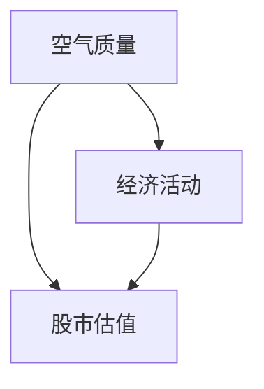
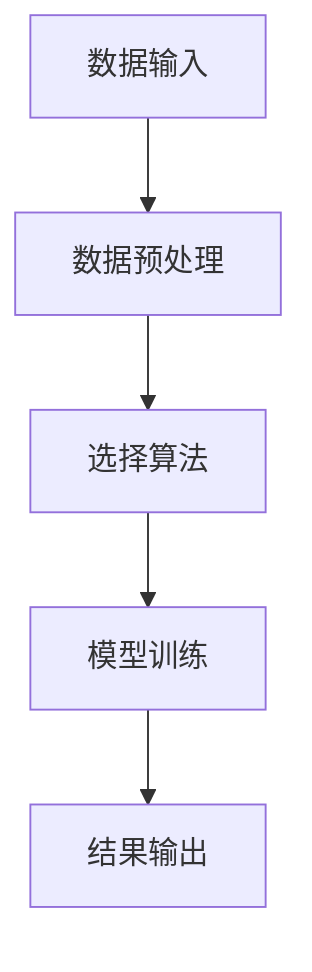
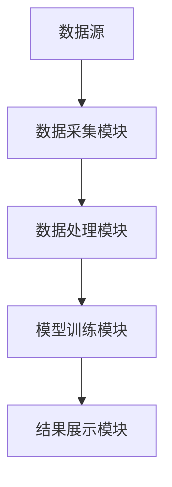

                 


# 全球股市估值与空气质量改善措施的关系

## 关键词：全球股市估值、空气质量改善、环境经济关系、相关性分析、回归模型

## 摘要：  
本文探讨了全球股市估值与空气质量改善措施之间的关系，通过数据分析、模型构建和案例研究，揭示了空气质量对股市估值的潜在影响。文章从背景介绍、核心概念、算法原理、系统架构、项目实战到最佳实践，全面分析了这一跨学科问题，为投资者和政策制定者提供了有价值的参考。

---

# 第一部分: 全球股市估值与空气质量改善措施的背景与概念

## 第1章: 问题背景与研究意义

### 1.1 问题背景

#### 1.1.1 全球股市估值的基本概念
股市估值是衡量市场健康状况的重要指标，通常通过市盈率（P/E ratio）、市净率（P/B ratio）等指标来衡量。全球主要股市指数（如道琼斯指数、标普500、纳斯达克指数等）反映了不同地区的经济表现。

#### 1.1.2 空气质量改善措施的现状
空气质量改善措施包括减少工业排放、推广清洁能源、实施车辆限行等政策。这些措施直接影响经济活动，进而可能影响股市估值。

#### 1.1.3 空气质量对经济活动的影响
空气质量差可能导致健康问题、生产效率下降，从而影响企业盈利能力和股市估值。例如，污染严重的地区可能面临更高的医疗支出和更低的劳动生产力。

### 1.2 研究意义

#### 1.2.1 理论意义
通过分析空气质量与股市估值的关系，可以更好地理解环境因素对经济活动的影响，丰富环境经济学的理论研究。

#### 1.2.2 实践意义
帮助投资者和政策制定者在决策时考虑空气质量改善措施的潜在影响，优化投资策略和政策设计。

---

## 第2章: 核心概念与定义

### 2.1 全球股市估值

#### 2.1.1 股市估值的定义
股市估值是市场对上市公司资产价值的评估，通常通过股价与基本面指标（如净利润、营业收入）的比值来衡量。

#### 2.1.2 主要股市指数
- 道琼斯指数（DJIA）
- 标普500指数（S&P 500）
- 纳斯达克指数（NASDAQ）
- 日经225指数（Nikkei 225）

#### 2.1.3 影响股市估值的因素
- 宏观经济指标（GDP、利率、通货膨胀）
- 企业盈利状况
- 投资者情绪
- 政治经济环境

### 2.2 空气质量改善措施

#### 2.2.1 空气质量的定义与指标
空气质量通常通过空气质量指数（AQI）衡量，AQI综合考虑PM2.5、PM10、SO2、NO2、CO和O3等污染物的浓度。

#### 2.2.2 空气质量改善的主要措施
- 工业污染治理
- 清洁能源推广
- 交通限行政策
- 垃圾焚烧管理

#### 2.2.3 空气质量改善与经济活动的关系
空气质量改善可能通过降低健康成本、提高劳动效率等方式间接影响股市估值。

---

## 第3章: 空气质量与股市估值的关系模型

### 3.1 概念属性特征对比

| 概念 | 属性 | 特征 |
|------|------|------|
| 空气质量 | 数据来源 | 环境监测站 |
|      | 指标 | AQI、PM2.5、PM10 |
| 股市估值 | 数据来源 | 股票交易所 |
|      | 指标 | P/E ratio、P/B ratio |

### 3.2 ER实体关系图


---

# 第二部分: 算法原理与数学模型

## 第4章: 算法原理

### 4.1 数据预处理

#### 4.1.1 数据清洗
- 删除缺失值
- 处理异常值

#### 4.1.2 数据标准化
对空气质量数据和股市估值数据进行标准化处理，确保模型输入一致。

### 4.2 算法选择

#### 4.2.1 回归分析
用于分析空气质量对股市估值的线性关系。

#### 4.2.2 时间序列分析
用于分析空气质量改善措施对股市估值的长期影响。

### 4.3 算法流程


---

## 第5章: 数学模型与公式

### 5.1 空气质量指数与股市估值的相关性分析

#### 5.1.1 相关系数计算
$$ r = \frac{\sum (x_i - \bar{x})(y_i - \bar{y})}{\sqrt{\sum (x_i - \bar{x})^2 \sum (y_i - \bar{y})^2}} $$

### 5.2 回归分析模型

#### 5.2.1 线性回归模型
$$ y = \beta_0 + \beta_1 x + \epsilon $$

其中：
- $y$ 表示股市估值
- $x$ 表示空气质量指数
- $\beta_0$ 和 $\beta_1$ 为回归系数
- $\epsilon$ 为误差项

---

## 第6章: 系统分析与架构设计方案

### 6.1 系统功能设计

#### 6.1.1 数据采集模块
负责从环境监测站和股票交易所获取空气质量数据和股市估值数据。

#### 6.1.2 数据处理模块
对数据进行清洗和标准化处理。

#### 6.1.3 模型训练模块
基于回归分析或时间序列分析模型进行训练。

#### 6.1.4 结果展示模块
将模型结果以图表形式展示，便于分析。

### 6.2 系统架构设计



---

## 第7章: 项目实战

### 7.1 环境安装

```bash
pip install pandas numpy sklearn matplotlib
```

### 7.2 核心实现代码

```python
import pandas as pd
import numpy as np
from sklearn.linear_model import LinearRegression
import matplotlib.pyplot as plt

# 数据加载
data = pd.read_csv('air_quality_stock.csv')

# 数据预处理
data = data.dropna()
data = (data - data.mean()) / data.std()

# 特征与目标变量分离
X = data[['AQI', 'PM2.5', 'PM10']]
y = data['stock_valuation']

# 模型训练
model = LinearRegression()
model.fit(X, y)

# 模型结果
print('回归系数:', model.coef_)
print('回归截距:', model.intercept_)

# 可视化
plt.scatter(data.index, y, color='r', label='实际值')
plt.scatter(data.index, model.predict(X), color='b', label='预测值')
plt.legend()
plt.show()
```

### 7.3 实际案例分析

假设我们有空气质量数据和股市估值数据，可以通过上述代码进行分析。例如，当AQI上升时，股市估值可能会下降，回归系数可以量化这种影响。

---

## 第8章: 最佳实践

### 8.1 小结
空气质量改善措施可能通过影响经济活动间接影响股市估值。回归分析和时间序列分析是常用的工具。

### 8.2 注意事项
- 数据质量对模型结果影响重大。
- 模型可能受到其他变量的干扰，需进行多因素调整。

### 8.3 拓展阅读
- 《环境经济学导论》
- 《统计学习惯论》

---

# 结语

通过本文的分析，我们揭示了空气质量改善措施对股市估值的潜在影响。投资者和政策制定者可以利用这些研究成果优化决策。

---

# 作者

作者：AI天才研究院/AI Genius Institute & 禅与计算机程序设计艺术 /Zen And The Art of Computer Programming

