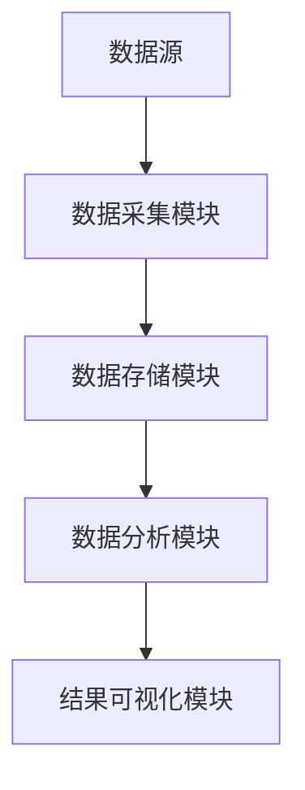

                 


# 全球股市估值与纳米技术应用的关系

## 关键词：全球股市估值、纳米技术、股票价格预测、科技创新、投资策略、数学建模

## 摘要：本文探讨了纳米技术在现代科技中的应用如何影响全球股市估值。通过分析纳米技术对企业价值、行业格局和市场波动的影响，构建了一个结合纳米技术应用与股市估值的数学模型，并通过实际案例验证了模型的有效性。文章还介绍了系统设计与实现，提供了基于Python的代码实现和系统架构设计，为投资者和研究人员提供了有价值的参考。

---

# 目录大纲

1. **全球股市估值与纳米技术应用的关系概述**
   - 1.1 股市估值的基本概念
   - 1.2 纳米技术的基本概念与应用领域
   - 1.3 两者关系的初步探讨

2. **纳米技术对股市估值的理论分析**
   - 2.1 纳米技术对企业价值的影响
   - 2.2 纳米技术对行业格局的影响
   - 2.3 纳米技术对股市整体波动的影响

3. **数学模型与算法分析**
   - 3.1 模型构建的基本思路
   - 3.2 模型的具体实现
   - 3.3 模型的验证与优化

4. **系统设计与实现**
   - 4.1 系统功能设计
   - 4.2 系统架构设计
   - 4.3 系统接口设计

5. **项目实战：基于纳米技术的股市估值系统**
   - 5.1 环境安装与数据准备
   - 5.2 系统核心实现
   - 5.3 实际案例分析

6. **总结与展望**
   - 6.1 本章小结
   - 6.2 投资建议与注意事项
   - 6.3 未来研究方向

---

## 正文

### 第1章: 全球股市估值与纳米技术应用的关系概述

#### 1.1 股市估值的基本概念
股市估值是通过对企业的财务状况、市场地位和未来盈利能力进行评估，以确定其股票的合理价格范围。传统的估值方法包括市盈率（P/E）、市净率（P/B）和股息率等指标。

#### 1.2 纳米技术的基本概念与应用领域
纳米技术是指在纳米尺度（1-100纳米）对物质进行操控的技术。它在材料科学、医学、电子、能源等领域有广泛应用，如纳米材料的制备、纳米传感器的应用等。

#### 1.3 两者关系的初步探讨
随着纳米技术的快速发展，其在各行业的应用推动了技术创新和产业升级，从而对企业的盈利能力、市场地位和股票估值产生了深远影响。

---

### 第2章: 纳米技术对股市估值的理论分析

#### 2.1 纳米技术对企业价值的影响
- **技术创新对企业的价值提升**：纳米技术的应用提高了产品的性能和附加值，增强了企业的竞争力。
- **纳米技术在企业成本控制中的作用**：通过纳米材料的应用，企业可以降低生产成本，提高效率。
- **纳米技术对企业市场竞争力的影响**：纳米技术的创新使其在市场竞争中占据优势地位。

#### 2.2 纳米技术对行业格局的影响
- **纳米技术对传统产业的颠覆性影响**：传统行业通过纳米技术的引入，实现技术升级和产品创新。
- **新兴产业的崛起与纳米技术的关系**：纳米技术催生了新的产业，如纳米医疗、纳米电子等。
- **纳米技术对产业链的重构作用**：纳米技术的应用改变了产业链的分工和协作模式。

#### 2.3 纳米技术对股市整体波动的影响
- **纳米技术对企业盈利预期的影响**：纳米技术的应用提升了企业的盈利能力，影响了投资者对股票的估值。
- **纳米技术对投资者情绪的影响**：技术创新带来的投资热潮可能引发市场的非理性波动。
- **纳米技术对市场风险偏好的影响**：高技术风险可能会影响投资者的风险偏好。

---

### 第3章: 数学模型与算法分析

#### 3.1 模型构建的基本思路
- 确定变量与假设条件：将纳米技术的应用程度、企业财务指标等作为变量。
- 模型的基本框架：构建一个回归模型，分析纳米技术对企业股票价格的影响。

#### 3.2 模型的具体实现
- **数据准备**：收集企业的财务数据、纳米技术应用情况及股票价格数据。
- **回归分析**：使用多元回归模型，分析纳米技术应用对股票价格的影响。

#### 3.3 模型的验证与优化
- 使用历史数据验证模型的有效性。
- 通过交叉验证优化模型的参数。

---

### 第4章: 系统设计与实现

#### 4.1 系统功能设计
- 数据采集模块：收集企业的财务数据和纳米技术应用数据。
- 数据分析模块：进行回归分析，生成估值结果。
- 可视化模块：展示分析结果，辅助投资者决策。

#### 4.2 系统架构设计


#### 4.3 系统接口设计
- 数据接口：与数据库或其他数据源的接口。
- 用户接口：提供数据输入和结果展示的界面。

---

### 第5章: 项目实战：基于纳米技术的股市估值系统

#### 5.1 环境安装与数据准备
- 安装Python和相关库（如pandas、numpy、scikit-learn）。
- 数据来源：公开的企业财务数据和纳米技术应用数据。

#### 5.2 系统核心实现
```python
import pandas as pd
from sklearn.linear_model import LinearRegression
from sklearn.metrics import r2_score

# 数据加载
data = pd.read_csv('nanotechnology_stock.csv')

# 特征与目标变量分离
X = data[['纳米技术应用程度', '财务指标']]
y = data['股票价格']

# 模型训练
model = LinearRegression()
model.fit(X, y)

# 模型预测
y_pred = model.predict(X)

# 模型评估
print("R^2 Score:", r2_score(y, y_pred))
```

#### 5.3 实际案例分析
通过实际数据验证模型的准确性，分析纳米技术应用对企业股票估值的具体影响。

---

### 第6章: 总结与展望

#### 6.1 本章小结
本文探讨了纳米技术对股市估值的影响，并构建了一个数学模型进行验证。

#### 6.2 投资建议与注意事项
投资者应关注纳米技术的应用前景，同时注意技术风险和市场波动。

#### 6.3 未来研究方向
进一步研究纳米技术在不同行业中的应用，探索更复杂的模型，如机器学习算法。

---

## 作者：AI天才研究院/AI Genius Institute & 禅与计算机程序设计艺术 /Zen And The Art of Computer Programming

