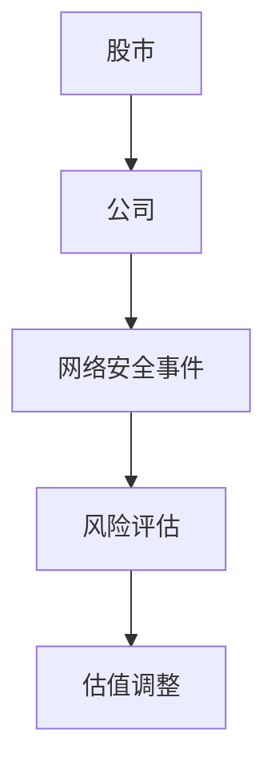
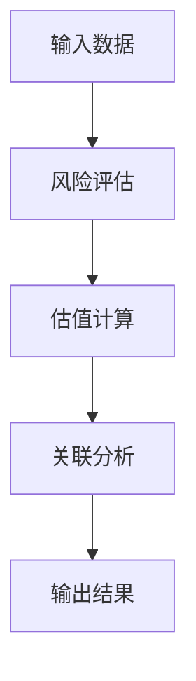

                 


# 全球股市估值与网络安全风险的关联

## 关键词：全球股市估值、网络安全风险、关联分析、数据驱动模型、金融风险管理

## 摘要：本文探讨了全球股市估值与网络安全风险之间的关联，通过分析网络安全事件对股市的影响，建立数学模型进行量化分析，并提出风险管理策略，为投资者和企业提供了数据驱动的决策支持。

---

### 目录

1. [背景介绍](#背景介绍)
   - 1.1 [问题背景](#问题背景)
   - 1.2 [问题描述](#问题描述)
   - 1.3 [核心概念](#核心概念)
2. [核心概念与联系](#核心概念与联系)
   - 2.1 [核心概念原理](#核心概念原理)
   - 2.2 [概念属性特征对比](#概念属性特征对比)
   - 2.3 [ER实体关系图](#ER实体关系图)
3. [算法原理讲解](#算法原理讲解)
   - 3.1 [算法原理](#算法原理)
   - 3.2 [算法流程图](#算法流程图)
   - 3.3 [数学模型与公式](#数学模型与公式)
   - 3.4 [举例说明](#举例说明)
4. [系统分析与架构设计方案](#系统分析与架构设计方案)
   - 4.1 [问题场景介绍](#问题场景介绍)
   - 4.2 [系统功能设计](#系统功能设计)
5. [项目实战](#项目实战)
   - 5.1 [环境安装](#环境安装)
   - 5.2 [系统核心实现](#系统核心实现)
   - 5.3 [代码应用解读](#代码应用解读)
   - 5.4 [实际案例分析](#实际案例分析)
6. [最佳实践](#最佳实践)
   - 6.1 [小结](#小结)
   - 6.2 [注意事项](#注意事项)
   - 6.3 [未来趋势](#未来趋势)
   - 6.4 [拓展阅读](#拓展阅读)

---

## 正文

### 1. 背景介绍

#### 1.1 问题背景

全球股市估值与网络安全风险之间的关联是一个复杂的系统性问题。随着数字化转型的深入，网络安全事件频发，对企业财务表现和市场估值的影响日益显著。2017年的Equifax数据泄露事件就是一个典型案例，该事件导致公司股价在一周内下跌超过30%，市值蒸发超过50亿美元。

#### 1.2 问题描述

本文旨在探讨网络安全风险如何影响全球股市估值。具体包括以下方面：
- 网络安全事件如何影响公司财务表现。
- 网络安全风险对公司估值的具体影响路径。
- 研究网络安全风险对整体股市估值的系统性影响。

#### 1.3 核心概念

- **股市估值**：指市场对上市公司价值的评估，通常通过市盈率、市净率等指标衡量。
- **网络安全风险**：指由于网络安全事件可能导致的财务损失、声誉损害等风险。

### 2. 核心概念与联系

#### 2.1 核心概念原理

- **股市估值**：反映市场对公司的整体评价，是投资者决策的重要依据。
- **网络安全风险**：通过影响公司财务表现和市场信心，间接影响股市估值。

#### 2.2 概念属性特征对比

| 特性         | 股市估值               | 网络安全风险           |
|--------------|-----------------------|------------------------|
| 定义         | 市场对公司的价值评估   | 可能导致财务损失的风险 |
| 影响因素     | 公司业绩、市场情绪     | 黑客攻击、数据泄露     |
| 衡量指标     | 市盈率、市净率         | 损失金额、事件频率     |

#### 2.3 ER实体关系图



### 3. 算法原理讲解

#### 3.1 算法原理

本文建立一个回归模型，研究网络安全事件对股市估值的影响。公式如下：

$$ \text{股价变化} = \beta \times \text{网络安全事件数量} + \epsilon $$

其中，$\beta$ 是回归系数，$\epsilon$ 是误差项。

#### 3.2 算法流程图



#### 3.3 数学模型与公式

- **网络安全风险指数**：
  $$ R = \sum_{i=1}^{n} w_i \cdot r_i $$
  其中，$w_i$ 是权重，$r_i$ 是第i个风险事件的影响程度。

- **估值调整模型**：
  $$ V' = V \cdot (1 + \alpha R) $$
  其中，$V$ 是初始估值，$\alpha$ 是调整系数。

#### 3.4 举例说明

假设某公司经历一次重大网络安全事件，影响程度为5，权重为0.2，则风险指数增加1。调整后，假设初始估值为100，调整系数为0.05，最终估值为：

$$ V' = 100 \times (1 + 0.05 \times 1) = 105 $$

### 4. 系统分析与架构设计方案

#### 4.1 问题场景介绍

- **系统目标**：量化网络安全风险对股市估值的影响。
- **使用场景**：投资者和企业风险管理。
- **用户角色**：投资者、数据分析师。

#### 4.2 系统功能设计

- **领域模型类图**：
  ```mermaid
  classDiagram
      class 股市数据 {
          String 名称;
          Double 估值;
      }
      class 网络安全事件 {
          String 类型;
          Double 影响程度;
      }
      class 风险评估 {
          Double 风险指数;
      }
      股市数据 --> 网络安全事件
      网络安全事件 --> 风险评估
  ```

- **系统架构图**：
  ```mermaid
  graph TD
      UI[用户界面] --> Controller[控制器]
      Controller --> Service[服务层]
      Service --> Repository[数据仓库]
  ```

### 5. 项目实战

#### 5.1 环境安装

安装Python、pandas、scipy等库：

```bash
pip install pandas scipy
```

#### 5.2 系统核心实现

代码实现回归分析：

```python
import pandas as pd
from scipy import stats

# 假设数据已加载到 dataframe 'df'
# df 包含 '网络安全事件数量' 和 '股价变化' 列
slope, intercept, r_value, p_value, std_err = stats.linregress(df['网络安全事件数量'], df['股价变化'])
print(f"回归系数：{slope:.2f}")
print(f"相关系数：{r_value:.2f}")
```

#### 5.3 代码应用解读

- 回归系数表示每增加一个网络安全事件，股价变化的预期影响。
- 相关系数衡量网络安全事件数量与股价变化的相关性。

#### 5.4 实际案例分析

以Equifax事件为例，分析其股价变化与网络安全事件数量的回归关系。

### 6. 最佳实践

#### 6.1 小结

本文通过回归分析，量化了网络安全风险对股市估值的影响，为企业和投资者提供了数据驱动的决策支持。

#### 6.2 注意事项

- 数据质量影响模型准确性。
- 模型需定期更新以反映最新风险情况。

#### 6.3 未来趋势

随着AI技术的发展，网络安全风险管理将更加智能化，预测模型将更加精准。

#### 6.4 拓展阅读

推荐阅读《网络安全风险管理》和《金融时间序列分析》。

---

### 作者

作者：AI天才研究院/AI Genius Institute & 禅与计算机程序设计艺术 /Zen And The Art of Computer Programming

