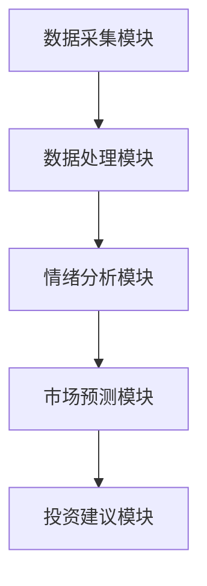
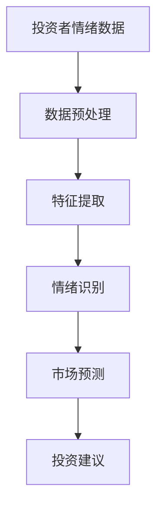

                 


# 全球股市估值与脑机接口在情绪管理中的应用

> 关键词：全球股市估值，脑机接口，情绪管理，投资决策，市场预测，数据驱动

> 摘要：本文探讨了全球股市估值与脑机接口在情绪管理中的应用。通过分析情绪在股市中的影响，结合脑机接口技术，提出了一种基于情绪数据的股市估值方法。文章详细介绍了情绪数据的采集、处理与分析，构建了情绪驱动的股市预测模型，并通过系统架构设计展示了如何将脑机接口技术应用于实际投资决策中。

---

## 第1章：背景介绍与核心概念

### 1.1 全球股市估值概述

#### 1.1.1 股市估值的基本概念
股市估值是通过对公司财务数据和市场信息的分析，确定股票合理价格的过程。常见的估值方法包括市盈率（P/E）、市净率（P/B）和股息率等。

#### 1.1.2 股市估值的核心方法
- **市盈率法**：通过比较股票价格与每股收益的比率，评估股票的相对价值。
- **市净率法**：通过比较股票价格与每股净资产的比率，评估股票的内在价值。
- **股息率法**：通过比较股票的股息与股票价格的比率，评估股票的收益能力。

#### 1.1.3 股市估值与情绪管理的关联
投资者的情绪波动会影响市场行为，从而影响股市估值。情绪管理是投资决策中的重要环节。

### 1.2 脑机接口技术概述

#### 1.2.1 脑机接口的基本原理
脑机接口（BCI）是一种通过采集和分析大脑神经信号，实现人与计算机直接交互的技术。其核心步骤包括信号采集、数据处理和输出控制。

#### 1.2.2 脑机接口在情绪管理中的应用
- **情绪监测**：通过EEG信号实时监测投资者的情绪状态。
- **情绪调节**：通过反馈机制帮助投资者控制情绪波动。

#### 1.2.3 脑机接口与股市估值的结合
将脑机接口技术应用于股市情绪分析，可以帮助投资者更好地理解情绪对市场的影响。

### 1.3 本章小结
本章介绍了全球股市估值的基本概念和方法，以及脑机接口技术在情绪管理中的应用。情绪与股市估值密切相关，脑机接口技术为情绪数据的采集和分析提供了新的可能性。

---

## 第2章：全球股市估值方法与模型

### 2.1 股市估值的基本方法

#### 2.1.1 市盈率法
市盈率法通过比较股票价格与每股收益的比率，评估股票的相对价值。公式如下：
$$ P/E = \frac{\text{股票价格}}{\text{每股收益}} $$

#### 2.1.2 市净率法
市净率法通过比较股票价格与每股净资产的比率，评估股票的内在价值。公式如下：
$$ P/B = \frac{\text{股票价格}}{\text{每股净资产}} $$

#### 2.1.3 股息率法
股息率法通过比较股票的股息与股票价格的比率，评估股票的收益能力。公式如下：
$$ \text{股息率} = \frac{\text{每股股息}}{\text{股票价格}} \times 100\% $$

### 2.2 现代股市估值模型

#### 2.2.1 CAPM模型
CAPM（资本资产定价模型）用于确定股票的预期收益率。公式如下：
$$ E(R_i) = R_f + \beta_i (R_m - R_f) $$
其中，$R_f$ 是无风险利率，$R_m$ 是市场预期收益率，$\beta_i$ 是股票的贝塔系数。

#### 2.2.2 马科维茨均值-方差模型
该模型用于构建最优投资组合。目标是最小化投资组合的方差，同时实现预期收益。公式如下：
$$ \text{最小化} \quad \sigma^2 $$
$$ \text{在约束条件下} \quad \mathbb{E}[R] = \text{目标收益} $$

#### 2.2.3 现代投资组合理论
现代投资组合理论强调分散投资以降低风险，通过组合不同资产来优化收益与风险的平衡。

### 2.3 情绪在股市估值中的作用

#### 2.3.1 投资者情绪对股市的影响
投资者情绪会影响市场行为，从而影响股市估值。例如，过度乐观的情绪可能导致市场泡沫，而过度悲观的情绪可能导致市场恐慌。

#### 2.3.2 情绪周期与股市波动
情绪周期与股市波动密切相关。例如，贪婪和恐惧情绪的交替出现会导致市场的周期性波动。

#### 2.3.3 情绪指标的量化与应用
情绪指标可以通过投资者的行为数据（如交易量、持仓变化）和市场数据（如波动率）来量化。例如，恐慌指数（VIX）是衡量市场恐慌程度的重要指标。

### 2.4 本章小结
本章详细介绍了股市估值的基本方法和现代估值模型，并探讨了情绪在股市估值中的作用。情绪指标的量化与应用为情绪驱动的股市预测提供了理论基础。

---

## 第3章：脑机接口技术在情绪管理中的应用

### 3.1 脑机接口技术的原理

#### 3.1.1 神经信号采集
脑机接口通过采集大脑神经信号（如EEG、fMRI）来获取情绪信息。

#### 3.1.2 数据处理与分析
通过数据预处理（如去噪、滤波）和特征提取（如频域特征、时域特征）来分析情绪信号。

#### 3.1.3 情绪识别算法
基于机器学习（如SVM、随机森林）对情绪信号进行分类，识别投资者的情绪状态。

### 3.2 脑机接口在情绪管理中的具体应用

#### 3.2.1 情绪监测与反馈
通过实时监测投资者的情绪状态，提供反馈以帮助其控制情绪波动。

#### 3.2.2 情绪调节技术
通过生物反馈（如心率变异性）和放松训练帮助投资者调节情绪。

#### 3.2.3 情绪数据的可视化
通过数据可视化工具（如脑电图、热图）展示投资者的情绪变化。

### 3.3 本章小结
本章详细介绍了脑机接口技术的原理及其在情绪管理中的具体应用。通过情绪监测与反馈，投资者可以更好地控制情绪波动，从而提高投资决策的理性。

---

## 第4章：脑机接口与股市情绪分析

### 4.1 情绪数据对股市的影响

#### 4.1.1 投资者情绪对股市估值的影响
投资者情绪会影响市场行为，从而影响股市估值。例如，乐观情绪可能导致股票价格上涨，而悲观情绪可能导致股票价格下跌。

#### 4.1.2 情绪指标与市场波动的关系
情绪指标（如VIX指数）与市场波动密切相关。例如，当市场恐慌指数上升时，市场波动加剧。

#### 4.1.3 情绪周期与市场预测
情绪周期与市场周期密切相关。通过分析情绪周期，可以预测市场的波动趋势。

### 4.2 脑机接口在股市情绪分析中的应用

#### 4.2.1 情绪数据的采集与处理
通过脑机接口技术采集投资者的情绪数据，并进行预处理和特征提取。

#### 4.2.2 情绪指标与市场行为的关联
通过统计分析和机器学习方法，建立情绪指标与市场行为的关联模型。

#### 4.2.3 情绪驱动的市场预测模型
基于情绪数据构建市场预测模型，预测市场走势和股票估值。

### 4.3 本章小结
本章探讨了情绪数据对股市的影响，并展示了脑机接口技术在股市情绪分析中的应用。通过情绪驱动的市场预测模型，投资者可以更好地理解情绪对市场的影响。

---

## 第5章：系统架构与实现

### 5.1 系统架构设计

#### 5.1.1 系统模块划分
- 数据采集模块：采集投资者的情绪数据。
- 数据处理模块：对情绪数据进行预处理和特征提取。
- 情绪分析模块：通过机器学习算法识别投资者的情绪状态。
- 市场预测模块：基于情绪数据预测市场走势。

#### 5.1.2 系统功能设计
- 实时监测投资者情绪状态。
- 提供情绪反馈和调节建议。
- 预测市场走势并生成投资建议。

#### 5.1.3 系统架构图


### 5.2 数据流图



### 5.3 本章小结
本章详细介绍了系统的架构设计和数据流设计，展示了如何将脑机接口技术应用于股市情绪分析。

---

## 第6章：项目实战

### 6.1 环境配置

#### 6.1.1 软件环境
- Python 3.8+
- 必要的库：numpy、pandas、scikit-learn、matplotlib。

#### 6.1.2 硬件环境
- EEG采集设备：如OpenBCI或Emotiv。
- 数据分析设备：如笔记本电脑。

### 6.2 核心实现

#### 6.2.1 数据采集与预处理
```python
import numpy as np
import pandas as pd

# 数据采集
data = pd.read_csv('emotional_data.csv')
# 数据预处理
processed_data = data.dropna().astype(float)
```

#### 6.2.2 情绪识别算法
```python
from sklearn.svm import SVC
from sklearn.model_selection import train_test_split

# 数据分割
X_train, X_test, y_train, y_test = train_test_split(processed_data.iloc[:, 1:-1], processed_data.iloc[:, -1], test_size=0.2)

# 情绪识别模型
model = SVC()
model.fit(X_train, y_train)
print("Accuracy:", model.score(X_test, y_test))
```

#### 6.2.3 市场预测模型
```python
from sklearn.linear_model import LinearRegression

# 数据分割
X_train, X_test, y_train, y_test = train_test_split(processed_data.iloc[:, 1:-1], processed_data.iloc[:, -1], test_size=0.2)

# 市场预测模型
model = LinearRegression()
model.fit(X_train, y_train)
print("R-squared:", model.score(X_test, y_test))
```

### 6.3 项目小结
本章通过具体的项目实战，展示了如何将脑机接口技术应用于股市情绪分析。通过数据采集、预处理和分析，构建了情绪驱动的市场预测模型。

---

## 第7章：总结与展望

### 7.1 总结
本文探讨了全球股市估值与脑机接口在情绪管理中的应用。通过情绪数据的采集与分析，构建了情绪驱动的市场预测模型，为投资决策提供了新的思路。

### 7.2 展望
未来，随着脑机接口技术的不断发展，情绪管理在股市估值中的应用将更加广泛。可以通过以下几个方向进行进一步研究：
- 提高脑机接口技术的精度和稳定性。
- 开发更多基于情绪数据的市场预测模型。
- 探讨情绪管理在投资组合优化中的应用。

---

## 作者

作者：AI天才研究院/AI Genius Institute & 禅与计算机程序设计艺术 /Zen And The Art of Computer Programming

---

通过本文的探讨，我们希望为投资者提供一种基于情绪数据的股市估值方法，帮助投资者更好地理解和管理情绪，从而提高投资决策的科学性和有效性。

