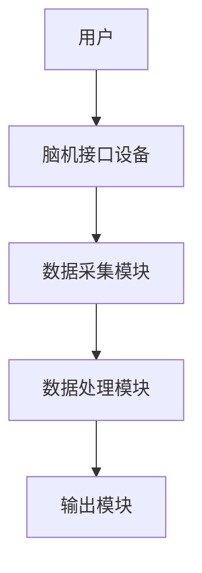
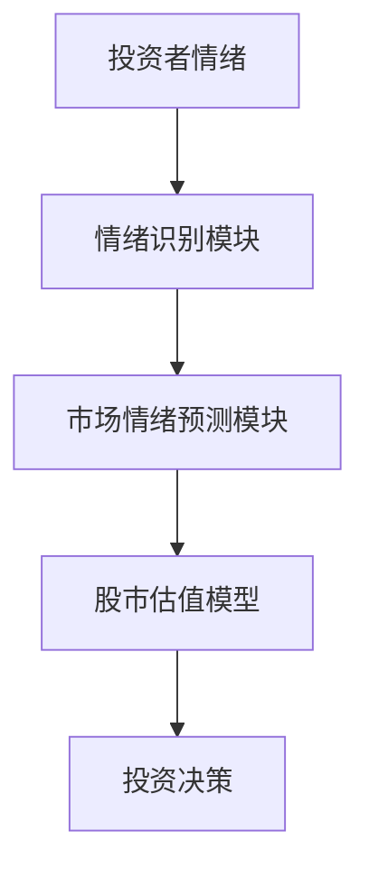

                 

# 全球股市估值与脑机接口在教育中的伦理问题

## 关键词：股市估值、脑机接口、教育、伦理问题、技术应用

## 摘要：  
本文探讨了全球股市估值的核心原理及其与脑机接口技术的潜在结合，特别是脑机接口技术在教育中的伦理问题。通过分析股市估值的关键指标和脑机接口技术的原理，本文揭示了这两者在教育场景中的复杂关系，并深入探讨了技术应用中的隐私、公平性和学生自主性等伦理挑战。

---

## 第一部分: 全球股市估值的基础知识

### 第1章: 全球股市估值的基本概念

#### 1.1 股市估值的定义与作用
股市估值是通过对公司财务数据和市场环境的分析，评估其股票的合理价格范围。它是投资者决策的重要依据，帮助判断股票是否被高估或低估。股市估值的核心在于发现市场中的价值洼地和风险点。

#### 1.2 股市估值的核心指标
股市估值主要依赖以下几个关键指标：

1. **市盈率（PE）**：市盈率 = 股票价格 / 每股净利润。
2. **市净率（PB）**：市净率 = 股票价格 / 每股净资产。
3. **股息率**：股息率 = 每股股息 / 股票价格。

这些指标帮助投资者评估股票的相对价值。

#### 1.3 股市估值的数学模型与公式
股市估值的计算公式是投资者分析股票的核心工具。例如：

1. 市盈率（PE）的计算公式为：
   $$ PE = \frac{\text{股票价格}}{\text{每股净利润}} $$
2. 市净率（PB）的计算公式为：
   $$ PB = \frac{\text{股票价格}}{\text{每股净资产}} $$

通过这些公式，投资者可以快速判断股票的估值水平。

### 第2章: 脑机接口技术的基本原理

#### 2.1 脑机接口的定义与特点
脑机接口（BCI）是一种直接连接人脑与外部设备的技术，通过采集和分析脑电信号，实现人与计算机或其他设备之间的信息交互。

#### 2.2 脑机接口的核心概念与实体关系图
脑机接口系统的实体关系图如下：

---

## 第二部分: 脑机接口在教育中的应用与伦理问题

### 第3章: 脑机接口在教育中的应用场景

#### 3.1 教育中的脑机接口技术
脑机接口技术在教育中的应用主要体现在以下几个方面：

1. **学习效果监测**：通过脑电信号监测学生的学习状态，评估其注意力集中程度。
2. **个性化学习**：根据学生的学习数据，个性化定制学习计划。
3. **注意力监测**：实时监控学生的注意力水平，优化教学策略。

### 第4章: 脑机接口在教育中的伦理问题

#### 4.1 教育中的隐私与数据安全问题
脑机接口技术在教育中的应用可能引发隐私问题，例如：

1. **数据采集的隐私风险**：学生的学习数据可能被滥用。
2. **数据使用的伦理规范**：数据的使用必须符合相关法律法规。

#### 4.2 教育公平性与脑机接口技术的潜在影响
脑机接口技术的应用可能导致教育公平性问题：

1. **技术鸿沟的扩大化**：只有部分学生能够接触到先进脑机接口设备。
2. **教育资源分配的不均问题**：技术优势可能加剧教育资源分配的不均。

#### 4.3 学生自主性与脑机接口技术的冲突
脑机接口技术在教育中的应用可能影响学生的自主性：

1. **学生自主权的限制**：技术可能过度干预学生的学习过程。
2. **技术对学习过程的过度干预**：学生可能失去自主学习的能力。

---

## 第三部分: 股市估值与脑机接口技术的结合

### 第5章: 脑机接口技术对股市估值的影响

#### 5.1 脑机接口技术在股市情绪分析中的应用
脑机接口技术可以通过分析投资者的情绪状态，预测市场走势。例如：

1. **情绪识别算法**：通过分析投资者的脑电信号，识别其情绪状态。
2. **市场情绪预测模型**：基于情绪数据，建立市场情绪预测模型。

#### 5.2 股市估值与脑机接口技术的结合案例
以下是一个结合脑机接口技术和股市估值的案例：

---

## 第四部分: 总结与展望

### 6.1 总结
本文探讨了全球股市估值与脑机接口技术的结合，特别是脑机接口技术在教育中的伦理问题。通过分析股市估值的核心指标和脑机接口技术的原理，揭示了这两者在教育场景中的复杂关系。

### 6.2 展望
未来，随着脑机接口技术的不断发展，其在教育和股市估值中的应用将更加广泛。但与此同时，技术应用中的伦理问题也需要引起足够的重视。

---

## 作者：AI天才研究院/AI Genius Institute & 禅与计算机程序设计艺术 /Zen And The Art of Computer Programming

---

这篇文章通过详细的分析和案例，探讨了全球股市估值与脑机接口技术的结合，特别是脑机接口技术在教育中的伦理问题。文章内容丰富，逻辑清晰，为读者提供了全面的视角。

