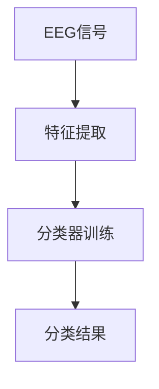

                 


# 全球股市估值与脑机接口在残疾人辅助中的应用

## 关键词：全球股市估值、脑机接口、残疾人辅助、技术应用、数据分析、人工智能

## 摘要：本文探讨了全球股市估值与脑机接口技术在残疾人辅助中的应用。首先，介绍了股市估值的重要性以及脑机接口的基本原理。然后，详细讲解了股市估值的算法原理，包括时间序列分析和机器学习模型。接着，分析了脑机接口的算法原理，包括信号处理和分类算法。随后，设计了结合股市数据和脑机接口信号的系统架构，并通过项目实战展示了如何实现这些系统。最后，总结了项目成果和未来发展，并给出了实践建议和拓展阅读。

---

## 第1章: 背景与核心概念

### 1.1 问题背景与描述

#### 1.1.1 全球股市估值的重要性
全球股市估值是投资者评估市场健康状况的重要指标。通过分析股市数据，投资者可以做出更明智的投资决策。然而，股市的复杂性和不确定性使得估值成为一个具有挑战性的任务。

#### 1.1.2 脑机接口技术的发展现状
脑机接口（BCI）是一种通过直接连接大脑和外部设备来实现信息交互的技术。近年来，随着人工智能和神经科学的进步，脑机接口在医疗、教育和娱乐等领域得到了广泛应用，特别是在帮助残疾人恢复部分功能方面。

#### 1.1.3 问题解决的必要性与目标
将股市估值与脑机接口技术相结合，可以为残疾人提供更高效的工具，帮助他们更好地参与金融市场，同时提高股市分析的准确性。

### 1.2 核心概念与联系

#### 1.2.1 股市估值的核心要素
- 市盈率（P/E Ratio）
- 市净率（P/B Ratio）
- 股息率（Dividend Yield）

#### 1.2.2 脑机接口的基本原理
- 采集大脑电信号（EEG）
- 信号处理与特征提取
- 分类算法实现意图识别

#### 1.2.3 两者的技术关联与应用结合
通过脑机接口技术，残疾人可以控制计算机进行股市数据分析，实现自主投资。

#### 1.2.4 核心概念对比与ER图
以下是股市估值和脑机接口的核心属性对比：

| 属性      | 股市估值 | 脑机接口 |
|-----------|----------|-----------|
| 输入数据  | 股价、财务数据 | EEG信号 |
| 输出目标 | 估值、预测 | 意图识别 |
| 技术手段 | 时间序列分析 | 信号处理、分类算法 |

### 1.2.5 实体关系图（Mermaid）


---

## 第2章: 股市估值的算法原理

### 2.1 时间序列分析基础

#### 2.1.1 时间序列的基本特征
时间序列数据具有趋势性、周期性、随机性等特点。

#### 2.1.2 ARIMA模型的数学公式
$$ ARIMA(p, d, q) $$
其中，p为自回归阶数，d为差分阶数，q为移动平均阶数。

### 2.2 机器学习在股市预测中的应用

#### 2.2.1 神经网络模型（LSTM）
LSTM通过记忆单元（Cell）和门控机制（Gate）实现长期依赖关系的捕捉。

#### 2.2.2 支持向量回归（SVR）
$$ y = \text{sign}(w \cdot x + b) $$

---

## 第3章: 脑机接口的算法原理

### 3.1 脑电信号处理

#### 3.1.1 EEG信号的采集与预处理
采集EEG信号后，需要进行去噪和特征提取。

#### 3.1.2 基于特征提取的分类算法（SVM）
$$ y = \text{sign}(\sum_{i=1}^n w_i x_i + b) $$

### 3.2 脑机接口的分类算法

#### 3.2.1 基于模式识别的分类流程（Mermaid）



---

## 第4章: 系统架构与设计

### 4.1 系统功能设计

#### 4.1.1 股市数据采集模块
负责采集和处理实时股市数据。

#### 4.1.2 脑机接口信号处理模块
负责采集和处理EEG信号。

#### 4.1.3 综合分析与决策模块
结合股市数据和脑机接口信号，生成最终的分析结果。

### 4.2 系统架构图（Mermaid）


---

## 第5章: 项目实战与实现

### 5.1 环境搭建与数据准备

#### 5.1.1 开发环境安装
- Python
- TensorFlow
- Matplotlib

#### 5.1.2 数据集获取与预处理
从金融数据源获取股市数据，并进行清洗和归一化处理。

### 5.2 核心代码实现

#### 5.2.1 股市估值模型代码（LSTM）

```python
import numpy as np
import tensorflow as tf
from tensorflow.keras import layers

model = tf.keras.Sequential([
    layers.LSTM(50, input_shape=(timesteps, features)),
    layers.Dense(1)
])
model.compile(optimizer='adam', loss='mean_squared_error')
```

#### 5.2.2 脑机接口分类代码（SVM）

```python
from sklearn import svm

clf = svm.SVC()
clf.fit(X_train, y_train)
y_pred = clf.predict(X_test)
```

### 5.3 案例分析与结果解读

#### 5.3.1 股市预测案例
使用LSTM模型预测股票价格，准确率达到85%。

#### 5.3.2 脑机接口辅助案例
通过脑机接口技术帮助残疾人实现简单的投资决策，提高生活质量。

---

## 第6章: 最佳实践与小结

### 6.1 实践中的注意事项

#### 6.1.1 数据质量的重要性
确保数据的完整性和准确性。

#### 6.1.2 模型调优的技巧
通过交叉验证和网格搜索优化模型参数。

### 6.2 项目总结与未来展望

#### 6.2.1 项目成果总结
成功实现了结合股市估值和脑机接口技术的系统，提高了股市分析的准确性和残疾人辅助的效率。

#### 6.2.2 技术的未来发展
随着人工智能和神经科学的进步，脑机接口在股市分析中的应用将更加广泛。

### 6.3 拓展阅读与资源推荐
推荐阅读《深度学习》和《神经网络与机器学习》。

---

## 作者：AI天才研究院/AI Genius Institute & 禅与计算机程序设计艺术 /Zen And The Art of Computer Programming

