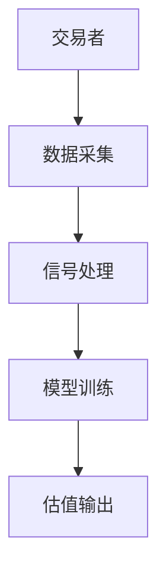

                 

# 全球股市估值与脑机接口在认知增强中的应用

## 关键词：全球股市估值、脑机接口、认知增强、技术分析、量化分析、神经科学

## 摘要

本文探讨了全球股市估值与脑机接口在认知增强中的应用。首先，介绍了股市估值的基本概念、方法及其影响因素，包括技术分析、基本面分析和量化分析。接着，详细讲解了脑机接口的技术基础及其在认知增强中的应用，包括神经科学基础、信号处理方法及在提升学习能力、注意力管理中的应用。最后，结合脑机接口技术，探讨其在优化股市估值模型中的潜力，展示了两者的结合应用如何提升金融分析的深度和广度。

---

## 第一部分：全球股市估值

### 第1章：股市估值的基本概念

#### 1.1 股市估值的定义与重要性

股市估值是通过对公司财务数据、市场趋势和经济指标的分析，评估公司股票的内在价值或市场价格是否合理。它帮助投资者做出理性的投资决策，识别被低估或高估的股票。

**1.1.1 股市估值的定义**

股市估值是通过分析公司的基本面、市场环境和宏观经济因素，评估其股票的合理价格范围。它不仅考虑当前的市场状况，还预测未来的盈利能力。

**1.1.2 股市估值的重要性**

准确的股市估值帮助投资者识别投资机会和风险，避免盲目跟风。它为投资决策提供了科学依据，有助于优化投资组合，实现长期收益。

**1.1.3 股市估值的核心要素**

- **公司基本面**：包括收入、利润、资产和负债等。
- **市场环境**：如经济周期、利率和通货膨胀。
- **行业地位**：公司的市场占有率和竞争能力。

#### 1.2 股市估值的核心概念术语说明

- **内在价值**：公司未来现金流的现值，反映其实际价值。
- **市场价格**：股票在市场上的交易价格，受供需关系影响。
- **估值模型**：用于计算股票价值的数学方法，如DCF模型。

### 第2章：股市估值的主要方法

#### 2.1 技术分析法

技术分析通过分析历史价格和成交量数据，预测未来的价格走势。

**2.1.1 技术分析法的基本原理**

技术分析认为，价格走势反映了市场的所有信息，因此可以通过识别价格形态和趋势来预测未来走势。

**2.1.2 常用的技术指标**

- **移动平均线（MA）**：显示价格趋势，帮助识别支撑和阻力位。
- **相对强弱指数（RSI）**：衡量超买或超卖状态，指导买卖时机。

#### 2.2 基本面分析法

基本面分析关注公司的财务状况和行业地位，评估其内在价值。

**2.2.1 常用的财务指标**

- **市盈率（P/E）**：股价与每股收益的比率，反映市场对公司盈利能力的预期。
- **市净率（P/B）**：股价与每股净资产的比率，评估股票是否被低估。

#### 2.3 量化分析法

量化分析利用数学模型和算法，从大量数据中提取投资信号。

**2.3.1 量化分析法的基本原理**

通过数据挖掘和机器学习，量化分析识别市场中的模式和趋势，制定交易策略。

**2.3.2 常用的量化分析模型**

- **均值回归模型**：假设价格会回归到均值，适用于判断超买或超卖状态。
- **动量策略模型**：基于价格动量，投资于持续上涨的资产。

### 第3章：全球股市估值的影响因素

#### 3.1 宏观经济因素

宏观经济因素如经济周期、利率和通货膨胀对股市估值有深远影响。

**3.1.1 经济周期对股市的影响**

经济繁荣时，企业盈利增加，股市上涨；衰退时，反之。

**3.1.2 利率政策对股市的影响**

低利率环境通常有利于股市，因为资金流向风险较高的资产。

#### 3.2 行业因素

行业因素包括行业生命周期和政策环境，影响企业的盈利能力和成长潜力。

**3.2.1 行业生命周期对股市的影响**

成熟行业可能增长放缓，而新兴行业可能有更高的增长潜力。

#### 3.3 公司因素

公司基本面和管理团队对公司估值有直接影响。

**3.3.1 公司财务状况对股市的影响**

健康的财务状况和高盈利能力通常意味着较高的股票估值。

---

## 第二部分：脑机接口在认知增强中的应用

### 第5章：脑机接口的基本概念

#### 5.1 脑机接口的定义与分类

脑机接口（BCI）是连接大脑与外部设备的接口，分为侵入式和非侵入式。

**5.1.1 脑机接口的定义**

脑机接口是一种技术，通过采集和分析大脑神经信号，实现人与外部设备的交互。

**5.1.2 脑机接口的分类**

- **侵入式**：植入大脑，如深度脑刺激技术。
- **非侵入式**：使用外部设备，如 EEG 头盔。

#### 5.2 脑机接口的核心技术

核心技术包括神经信号采集、处理和解码。

**5.2.1 神经信号采集**

通过 EEG、fMRI 等技术采集大脑活动数据。

### 第6章：脑机接口在认知增强中的应用

#### 6.1 脑机接口在神经科学中的应用

**6.1.1 神经信号处理**

分析和处理大脑活动，识别特定的认知状态。

#### 6.2 脑机接口在认知增强中的应用

**6.2.1 提升学习能力**

通过实时反馈，优化学习策略，提高学习效率。

**6.2.2 增强注意力管理**

帮助用户集中注意力，提高工作效率。

### 第7章：脑机接口技术在金融决策中的应用

#### 7.1 脑机接口在金融分析中的应用

**7.1.1 基于神经信号的交易决策支持**

通过分析交易者的神经信号，优化投资决策。

#### 7.2 脑机接口与股市估值的结合

**7.2.1 提高估值模型的准确性**

利用神经信号数据，增强估值模型的预测能力。

---

## 第三部分：脑机接口技术与股市估值的结合

### 第8章：脑机接口优化股市估值模型

#### 8.1 结合脑机接口技术优化估值模型

**8.1.1 数据采集与处理**

采集交易者的神经信号，分析其情绪和决策偏好。

#### 8.2 系统架构设计

**8.2.1 系统架构图**

### 第9章：项目实战

#### 9.1 环境安装与配置

**9.1.1 安装必要的软件**

安装Python、NumPy、Matplotlib 和Scikit-learn。

#### 9.2 核心实现

**9.2.1 数据采集**

使用EEG设备采集交易者的神经信号。

**9.2.2 数据分析与建模**

利用机器学习算法，分析神经信号，预测市场趋势。

### 第10章：结论与展望

#### 10.1 结论

脑机接口技术在股市估值中的应用潜力巨大，能够显著提升估值模型的准确性。

#### 10.2 展望

未来，脑机接口技术将与人工智能结合，推动金融分析进入新纪元。

---

## 作者信息

作者：AI天才研究院 & 禅与计算机程序设计艺术

---

本文详细探讨了全球股市估值与脑机接口在认知增强中的应用，通过结合技术分析、量化分析和神经科学，展示了如何利用脑机接口技术优化股市估值模型，为投资者提供更精准的决策支持。

