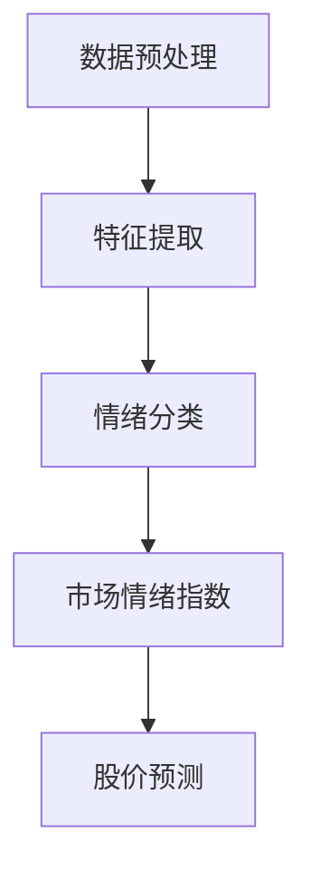
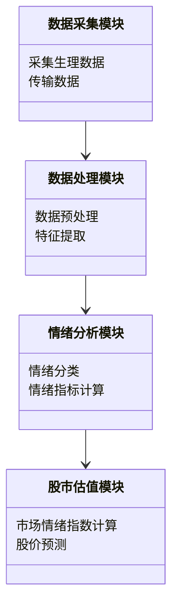
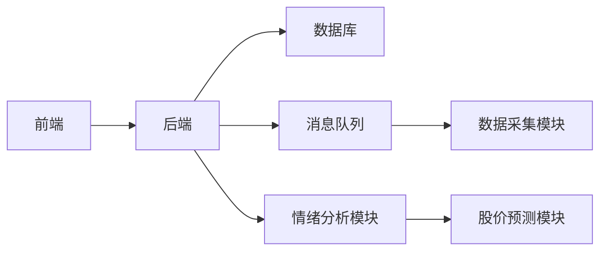
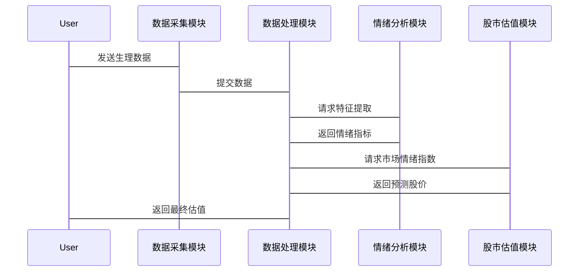

                 


# 全球股市估值与脑机接口技术的关联

## 关键词：脑机接口，股市估值，情绪分析，数据融合，人工智能

## 摘要：  
本文探讨脑机接口技术在全球股市估值中的潜在应用，分析情绪指标对股价的影响，提出基于生理数据的预测模型，结合传统估值方法，揭示技术与金融的结合趋势，为投资者提供新视角。

---

## 第一部分：背景介绍

### 第1章：全球股市估值与脑机接口技术的背景

#### 1.1 问题背景
- 全球股市估值的重要性：股市作为经济晴雨表，准确估值对投资决策至关重要。
- 脑机接口技术的发展现状：从实验室走向实际应用，实时采集生理数据。
- 两者的关联性研究意义：利用生理数据辅助股市分析，提升估值精度。

#### 1.2 问题描述
- 股市估值的传统方法依赖历史数据和市场行为，但忽视了投资者情绪的生理指标。
- 脑机接口技术能够实时采集生理数据，如心率、皮肤电反应，反映投资者情绪。
- 问题解决的必要性：如何有效利用这些数据提升估值模型的准确性。

#### 1.3 问题解决
- 脑机接口技术在股市分析中的应用前景广阔，特别是在情绪指标的量化方面。
- 技术与金融的结合将推动股市估值方法的创新。

#### 1.4 边界与外延
- 股市估值的范围界定：本文关注情绪指标对估值的影响，不涉及基本面分析。
- 脑机接口技术的应用边界：限于实时情绪数据的采集与分析。
- 两者的相互影响与外延：本文探讨技术对估值的影响，但未涉及技术本身的改进。

#### 1.5 核心要素组成
- 股市数据：包括股票价格、成交量、市场情绪指数。
- 脑机接口数据：生理指标如心率、皮肤电反应、脑电活动。
- 结合机制：数据融合与分析方法，用于优化股市估值模型。

---

## 第二部分：核心概念与联系

### 第2章：脑机接口技术的核心原理

#### 2.1 脑机接口技术的定义与原理
- 脑机接口（BCI）：通过采集和分析大脑产生的生物信号，将其转化为可被计算机识别的指令。
- 信号采集：包括EEG（脑电图）、EMG（肌电图）、EDA（皮肤电活动）等。
- 信息解码：通过机器学习算法分析生理数据，识别情绪状态。

#### 2.2 股市估值的核心原理
- 估值模型：基于历史数据和市场行为，预测未来股价。
- 影响股价的因素：市场情绪、宏观经济指标、公司基本面。
- 数据驱动的估值方法：利用大数据和机器学习提升预测精度。

#### 2.3 核心概念对比分析
| 特性         | 脑机接口技术                          | 股市估值                  |
|--------------|---------------------------------------|--------------------------|
| 数据来源     | 生理数据（心率、脑电等）               | 市场数据（价格、成交量）  |
| 应用目标     | 分析情绪状态                           | 评估股票价值              |
| 数据处理     | 信号处理与特征提取                    | 数据清洗与特征工程        |

### 第3章：脑机接口与股市估值的关联模型

#### 3.1 关联模型的构建
- 数据流分析：生理数据采集 → 情绪指标计算 → 市场情绪指数 → 股价预测。
- 情绪指标与股价波动的关系：投资者情绪影响市场行为，进而影响股价。
- 脑机接口数据对情绪指标的影响：实时捕捉情绪变化，提供新的数据源。

#### 3.2 实证分析
- 数据来源与处理方法：使用真实交易数据和实验室采集的生理数据。
- 情绪指标与股价的相关性分析：通过统计方法验证情绪指标对股价的预测能力。
- 模型的验证与优化：采用交叉验证和回测分析，评估模型的准确性和稳定性。

---

## 第三部分：算法原理讲解

### 第4章：基于脑机接口的股市情绪分析算法

#### 4.1 算法概述
- 算法目标：通过分析生理数据，提取情绪指标，预测股价波动。
- 算法基本思路：数据预处理 → 特征提取 → 情绪分类 → 市场情绪指数计算 → 股价预测。

#### 4.2 算法流程



#### 4.3 算法实现

##### 数据预处理
```python
import numpy as np
from scipy.signal import filter_design

# 示例：心率数据的滤波处理
def preprocess_eeg(eeg_signal, sampling_rate=100):
    # 设计带通滤波器
    low = 0.5
    high = 50
    b, a = filter_design.iirfilter(4, [low/sampling_rate*2, high/sampling_rate*2], 
                                    btype='bandpass', ftype='butter')
    # 应用滤波器
    filtered_signal = np.convolve(eeg_signal, a, mode='full')[:len(eeg_signal)]
    return filtered_signal
```

##### 情绪分类
```python
from sklearn.svm import SVC

# 示例：使用支持向量机进行情绪分类
def classify_emotion(features):
    model = SVC()
    model.fit(features_train, labels_train)
    return model.predict(features_test)
```

##### 市场情绪指数
```latex
$$\text{市场情绪指数} = \alpha \cdot \text{情绪强度} + \beta \cdot \text{市场波动性}$$
其中，$\alpha + \beta = 1$，$\alpha = 0.7$，$\beta = 0.3$。
```

---

## 第四部分：系统分析与架构设计

### 第5章：系统架构设计

#### 5.1 问题场景介绍
- 系统目标：构建一个实时监测投资者情绪，并预测股市估值的系统。
- 用户角色：投资者、数据分析师、系统管理员。
- 使用场景：实时监控、投资决策支持、市场情绪分析。

#### 5.2 系统功能设计

##### 领域模型



#### 5.3 系统架构设计



#### 5.4 系统接口设计
- 数据采集接口：REST API，接收生理数据。
- 情绪分析接口：返回情绪指标。
- 股价预测接口：返回市场情绪指数和预测股价。

#### 5.5 系统交互流程图



---

## 第五部分：项目实战

### 第6章：项目实战

#### 6.1 环境安装
- 安装必要的库：
  ```bash
  pip install numpy scipy scikit-learn matplotlib
  ```

#### 6.2 核心实现

##### 数据预处理

```python
import numpy as np
from scipy.signal import butterworth

def preprocess_data(data, sampling_rate):
    # 设计带通滤波器
    low = 0.5
    high = 50
    b, a = butterworth(sampling_rate, low, high, 'bandpass', 4)
    # 应用滤波器
    filtered_data = np.convolve(data, a, mode='same')
    return filtered_data
```

##### 情绪分类

```python
from sklearn.svm import SVC
from sklearn.model_selection import train_test_split

def train_emotion_classifier(features, labels):
    X_train, X_test, y_train, y_test = train_test_split(features, labels, test_size=0.2)
    model = SVC()
    model.fit(X_train, y_train)
    return model, model.score(X_test, y_test)
```

##### 市场情绪指数计算

```python
def compute_market_mood(emotion_scores, market_volatility):
    alpha = 0.7
    beta = 0.3
    return alpha * emotion_scores + beta * market_volatility
```

#### 6.3 代码解读与分析
- 数据预处理：去除噪声，提取有用特征。
- 情绪分类：使用SVM分类器，训练情绪识别模型。
- 市场情绪指数：结合情绪强度和市场波动性，量化市场情绪。

#### 6.4 实际案例分析
- 数据来源：假设我们有一个包含生理数据和对应股价数据的数据库。
- 数据处理：清洗和预处理生理数据。
- 情绪分析：训练模型，识别不同情绪状态。
- 股价预测：基于情绪指数和市场数据，预测未来股价。

---

## 第六部分：最佳实践

### 第7章：最佳实践

#### 7.1 小结
- 脑机接口技术为股市估值提供了新的数据源和分析方法。
- 情绪指标的引入可以提升估值模型的准确性和实时性。

#### 7.2 注意事项
- 数据隐私：处理生理数据时需遵守相关隐私保护法规。
- 模型局限性：情绪指标并非决定性因素，需结合其他指标综合分析。
- 实时性挑战：确保数据采集和分析的实时性，避免滞后影响。

#### 7.3 拓展阅读
- 推荐阅读《机器学习在金融中的应用》和《脑机接口技术入门与实践》。

---

## 作者：AI天才研究院/AI Genius Institute & 禅与计算机程序设计艺术 /Zen And The Art of Computer Programming

---

# 结语  
通过本文的探讨，我们看到了脑机接口技术在全球股市估值中的巨大潜力。未来，随着技术的进步和数据的积累，情绪指标在投资决策中的作用将更加显著。

