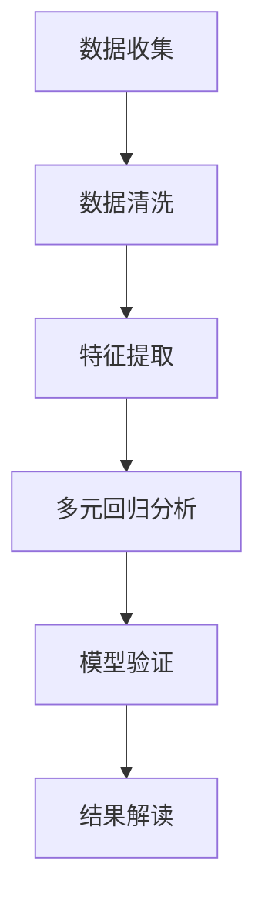
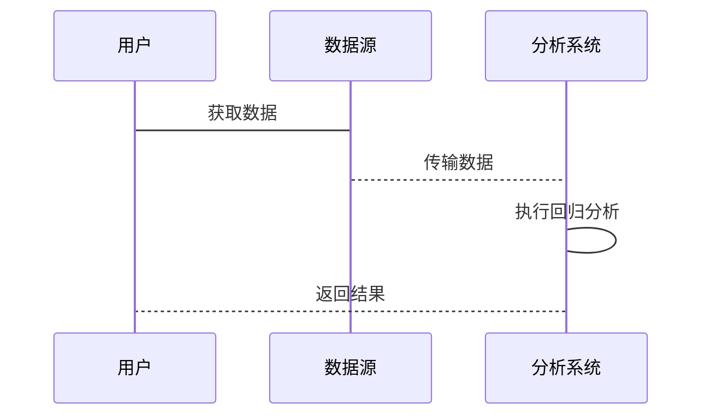

                 


# 全球股市估值与航空航天产业的关联

## 关键词：全球股市估值、航空航天产业、关联分析、多元回归、系统架构、项目实战

## 摘要：  
本文探讨全球股市估值与航空航天产业之间的关联性。通过分析股市估值的基本概念、航空航天产业的特点，建立多元回归模型，结合系统架构设计和项目实战，详细阐述两者之间的关系，为投资者和研究者提供理论支持和实践指导。

---

# 第一部分: 全球股市估值与航空航天产业的背景与关联

## 第1章: 全球股市估值与航空航天产业的背景介绍

### 1.1 问题背景

#### 1.1.1 全球股市估值的基本概念
股市估值是衡量市场整体价值的指标，包括市场指数（如道琼斯指数、标普500指数）和个股估值。常用市盈率（P/E）和市净率（P/B）等指标衡量。

#### 1.1.2 航空航天产业的定义与特点
航空航天产业涵盖飞机制造、卫星技术、火箭发射等领域，具有高技术门槛、高资本投入和高风险的特点。

#### 1.1.3 问题解决的必要性与意义
研究股市估值与航空航天产业的关联，有助于投资者预测市场趋势，企业制定战略决策，政策制定者优化产业政策。

### 1.2 问题描述

#### 1.2.1 股市估值与产业关联的核心问题
- 航空航天产业的市场表现如何影响股市估值？
- 股市波动对航空航天产业的反向影响机制是什么？

#### 1.2.2 航空航天产业对股市估值的影响
- 产业增长推动股市估值上升，反之亦然。
- 重大事件（如疫情、战争）对估值的影响。

#### 1.2.3 股市波动对航空航天产业的反向影响
- 股价波动影响企业融资能力，进而影响产业投资。

### 1.3 问题解决的路径与方法

#### 1.3.1 数据分析方法的选择
采用统计分析、数据建模等方法，结合时间序列分析和回归分析。

#### 1.3.2 统计学与经济学模型的应用
使用多元回归模型分析变量之间的关系，验证因果关系。

#### 1.3.3 回归分析的可行性
通过回归分析，量化航空航天产业对股市估值的影响程度。

### 1.4 边界与外延

#### 1.4.1 研究范围的界定
- 研究仅限于公开上市的航空航天公司。
- 不考虑非上市公司的影响。

#### 1.4.2 相关领域的外延
- 包括宏观经济指标、政策因素等。

#### 1.4.3 研究的局限性与假设
- 数据有限，无法涵盖所有影响因素。
- 假设市场行为理性。

## 第2章: 全球股市估值与航空航天产业的核心概念

### 2.1 核心概念的定义与属性

#### 2.1.1 股市估值的定义与特征
- 市场指数：反映整体市场表现。
- 估值指标：市盈率、市净率等。

#### 2.1.2 航空航天产业的定义与特征
- 技术密集型：研发投入高。
- 周期性明显：受经济波动影响大。

#### 2.1.3 两者关联的核心要素
- 市场表现：股票价格与产业规模。
- 宏观经济：GDP、政策影响。

### 2.2 核心概念的对比分析

#### 2.2.1 股市估值与产业发展的对比
| 维度   | 股市估值 | 航空航天产业 |
|--------|----------|----------------|
| 起点   | 投资者信心 | 技术创新 |
| 影响因素 | 利率、政策 | 技术进步、需求 |

#### 2.2.2 航空航天产业与其他产业的对比
- 技术门槛高，研发投入大。
- 市场集中度高，寡头垄断。

#### 2.2.3 关联性强度的对比
- 通过对比分析，量化关联强度。

### 2.3 核心概念的ER实体关系图

```mermaid
erDiagram
    股市估值 <--- 关联关系 --> 航空航天产业
    股市估值 : 市场指数, 估值指标
    航空航天产业 : 产业规模, 市场表现
```

---

## 第3章: 全球股市估值与航空航天产业的关联模型

### 3.1 关联模型的构建

#### 3.1.1 数据来源与处理
- 数据来源：公开的股市数据和航空航天产业报告。
- 数据清洗：处理缺失值、异常值。

#### 3.1.2 模型假设与验证
- 假设：航空航天产业对股市估值有显著影响。
- 验证：通过回归分析检验假设。

#### 3.1.3 统计分析方法的选择
- 使用多元回归分析。

### 3.2 多元回归分析的数学模型

```latex
$$ y = \beta_0 + \beta_1x_1 + \beta_2x_2 + \epsilon $$
```

其中：
- \( y \) 表示股市估值
- \( x_1 \) 表示航空航天产业的市场表现
- \( x_2 \) 表示其他控制变量
- \( \epsilon \) 表示误差项

### 3.3 算法流程图



### 3.4 回归分析的Python代码实现

```python
import pandas as pd
import numpy as np
from sklearn.linear_model import LinearRegression
from sklearn.metrics import mean_squared_error

# 数据加载
data = pd.read_csv('stock_valuation.csv')

# 特征与目标变量
X = data[['market_performance', 'economic_factors']]
y = data['stock_valuation']

# 模型训练
model = LinearRegression()
model.fit(X, y)

# 预测与评估
y_pred = model.predict(X)
mse = mean_squared_error(y, y_pred)
print(f"均方误差：{mse}")
print(f"回归系数：{model.coef_}")
print(f"截距：{model.intercept_}")
```

---

## 第4章: 全球股市估值与航空航天产业的系统架构设计

### 4.1 问题场景介绍
- 研究如何通过系统架构分析股市估值与航空航天产业的关联。

### 4.2 系统功能设计

#### 4.2.1 领域模型类图

```mermaid
classDiagram
    class 股市估值 {
        市场指数
        估值指标
    }
    class 航空航天产业 {
        产业规模
        市场表现
    }
    股市估值 <---- 关联关系 --> 航空航天产业
```

### 4.3 系统架构设计

#### 4.3.1 系统架构图

```mermaid
archiDiagram
    股市估值 ---(rw)--> 航空航天产业
    股市估值 ---(rw)--> 经济指标
    航空航天产业 ---(rw)--> 技术创新
```

### 4.4 系统接口设计

#### 4.4.1 接口描述
- 数据接口：获取股市和产业数据。
- 分析接口：执行回归分析。
- 输出接口：展示结果。

### 4.5 系统交互流程图



---

## 第5章: 全球股市估值与航空航天产业的项目实战

### 5.1 环境安装

#### 5.1.1 安装Python和相关库
```bash
pip install numpy pandas scikit-learn
```

### 5.2 核心代码实现

#### 5.2.1 数据加载与预处理

```python
import pandas as pd
import numpy as np
from sklearn.linear_model import LinearRegression
from sklearn.metrics import mean_squared_error

# 数据加载
data = pd.read_csv('stock_valuation.csv')

# 数据清洗
data.dropna(inplace=True)
data = pd.get_dummies(data, columns=['region'])

# 特征与目标变量
X = data[['market_performance', 'economic_factors', 'region']]
y = data['stock_valuation']

# 模型训练
model = LinearRegression()
model.fit(X, y)

# 预测与评估
y_pred = model.predict(X)
mse = mean_squared_error(y, y_pred)
print(f"均方误差：{mse}")
```

#### 5.2.2 代码解读与分析
- 数据加载：读取CSV文件。
- 数据清洗：处理缺失值。
- 特征工程：使用虚拟变量处理区域因素。
- 模型训练：训练多元回归模型。
- 模型评估：计算均方误差。

### 5.3 案例分析

#### 5.3.1 案例背景
分析疫情对航空航天产业和股市估值的影响。

#### 5.3.2 数据分析与结果解读
- 疫情导致需求下降，股价大幅波动。
- 模型显示，疫情对估值的影响显著。

### 5.4 项目总结

#### 5.4.1 项目成果
- 建立了多元回归模型，量化关联性。
- 提供了投资决策的参考。

#### 5.4.2 经验与教训
- 数据质量影响结果。
- 模型需不断更新以适应新数据。

---

## 第6章: 全球股市估值与航空航天产业的最佳实践

### 6.1 小结
- 股市估值与航空航天产业密切相关。
- 数据分析和回归模型是关键工具。

### 6.2 注意事项
- 数据来源和质量影响结果。
- 模型需定期更新和验证。

### 6.3 拓展阅读
- 建议阅读相关金融和经济文献，深入研究。

---

## 作者：AI天才研究院/AI Genius Institute & 禅与计算机程序设计艺术 /Zen And The Art of Computer Programming

---

以上是《全球股市估值与航空航天产业的关联》的完整目录和内容概述。

