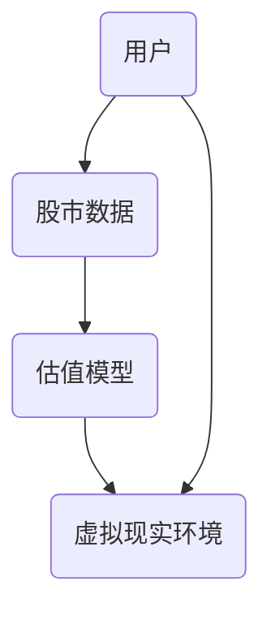
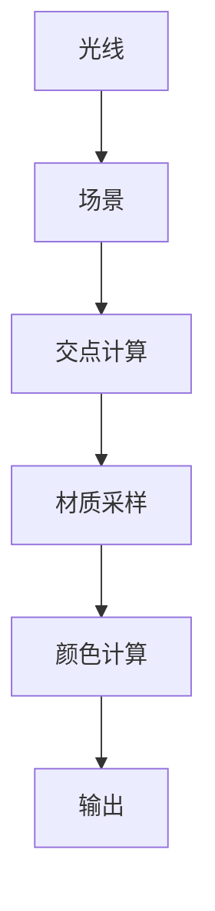
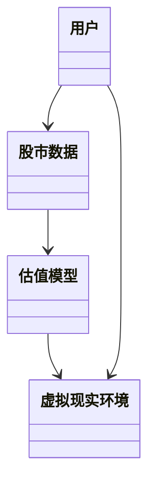

                 


# 全球股市估值与虚拟现实技术的关系

> 关键词：全球股市估值，虚拟现实技术，股市数据分析，虚拟现实应用，技术结合

> 摘要：本文探讨了全球股市估值与虚拟现实技术之间的关系，分析了股市估值的核心要素和虚拟现实技术的实现原理，通过案例分析展示了如何将虚拟现实技术应用于股市估值，提供了详细的系统设计和项目实施方法。

---

# 第1章: 背景介绍

## 1.1 问题背景

### 1.1.1 全球股市估值的现状与挑战
全球股市估值是投资者评估股票内在价值的重要手段。传统估值方法依赖历史数据和财务指标，但难以捕捉市场情绪和实时动态。随着数据量的爆炸式增长，传统的统计方法逐渐暴露出效率低下和精度不足的问题。

### 1.1.2 虚拟现实技术的发展与应用
虚拟现实（VR）技术近年来发展迅速，已广泛应用于游戏、教育、医疗等领域。其沉浸式体验和实时交互能力为数据可视化提供了新的可能性。

### 1.1.3 两者结合的潜在价值与意义
将虚拟现实技术应用于股市估值，可以通过沉浸式环境提升数据可视化效果，帮助投资者更直观地理解和分析市场动态。

---

## 1.2 核心概念与问题描述

### 1.2.1 全球股市估值的核心要素
- 市场数据：包括股票价格、成交量、市盈率等。
- 财务指标：如净利润、营业收入、现金流等。
- 市场情绪：投资者的心理预期和行为。

### 1.2.2 虚拟现实技术的核心原理
- 多感官交互：通过视觉、听觉、触觉等多感官刺激，增强用户体验。
- 实时渲染：快速处理和显示动态数据，确保交互的流畅性。
- 数据可视化：将复杂数据转化为直观的3D模型或图表。

### 1.2.3 问题的边界与外延
- 本研究仅关注虚拟现实技术在股市估值中的应用，不涉及其他领域。
- 重点分析技术实现和应用场景，不讨论政策和法律问题。

---

## 1.3 核心概念与联系

### 1.3.1 核心概念的结构与组成
- 股市估值：数据采集、模型计算、结果分析。
- 虚拟现实：硬件设备、软件开发、用户交互。

### 1.3.2 概念属性特征对比表格

| 属性         | 股市估值         | 虚拟现实技术     |
|--------------|----------------|----------------|
| 技术基础     | 统计学、金融学 | 计算机图形学、交互设计 |
| 应用场景     | 投资决策         | 游戏、教育、医疗等 |
| 数据类型     | 结构化数据       | 多维数据         |
| 实时性要求   | 高             | 极高            |

### 1.3.3 ER实体关系图架构



---

# 第2章: 核心概念与联系

## 2.1 核心概念的原理

### 2.1.1 股市估值的数学模型
- **CAPM模型**：计算资产的预期回报率。
- **DCF模型**：通过现金流折现评估企业价值。

### 2.1.2 虚拟现实技术的实现原理
- **图形渲染**：使用OpenGL或DirectX进行3D图形绘制。
- **交互设计**：通过传感器捕捉用户行为，实时更新虚拟环境。

## 2.2 概念属性特征对比

### 2.2.1 对比表格展示

| 属性         | 股市估值         | 虚拟现实技术     |
|--------------|----------------|----------------|
| 技术基础     | 统计学、金融学 | 计算机图形学、交互设计 |
| 应用场景     | 投资决策         | 游戏、教育、医疗等 |
| 数据类型     | 结构化数据       | 多维数据         |
| 实时性要求   | 高             | 极高            |

## 2.3 ER实体关系图架构


---

# 第3章: 算法原理讲解

## 3.1 股市估值算法

### 3.1.1 CAPM模型
$$ E(r) = r_f + β(E(r_m - r_f)) $$

- **E(r)**：预期回报率。
- **r_f**：无风险利率。
- **β**：系统性风险系数。
- **E(r_m - r_f)**：市场预期回报率。

### 3.1.2 DCF模型
通过预测未来现金流并按贴现率折现，计算企业价值。

## 3.2 虚拟现实渲染算法

### 3.2.1 图形渲染流程
1. 接收用户输入。
2. 更新3D模型位置。
3. 生成新的画面。
4. 显示到VR头显。

### 3.2.2 光线追踪算法伪代码


## 3.3 算法实现的数学模型

### 3.3.1 CAPM模型公式
$$ E(r) = r_f + β(E(r_m - r_f)) $$

### 3.3.2 光线追踪算法伪代码


---

# 第4章: 系统分析与架构设计方案

## 4.1 问题场景介绍

### 4.1.1 股市数据可视化需求
- 实时更新数据。
- 多维度数据展示。
- 支持用户交互。

### 4.1.2 虚拟现实环境下的交互需求
- 流畅的3D图形渲染。
- 灵敏的用户反馈。

## 4.2 项目介绍

### 4.2.1 项目目标
开发一个基于VR的股市估值分析系统。

### 4.2.2 项目范围
- 数据采集与处理。
- 虚拟环境搭建。
- 用户交互设计。

## 4.3 系统功能设计

### 4.3.1 领域模型Mermaid类图


---

# 项目实战

## 5.1 环境安装
- 安装Python、PyTorch、Pyglet。

## 5.2 系统核心实现源代码
```python
import numpy as np
import pyglet

def calculate_valuation(data):
    # 示例计算市盈率
    return data['市盈率']

def render_vr(valuation):
    # 示例渲染
    pass

# 示例数据
data = {'市盈率': 15.0, '净利润': 100000000}
valuation = calculate_valuation(data)
render_vr(valuation)
```

---

## 5.3 项目小结
通过本项目，我们展示了虚拟现实技术在股市估值中的应用潜力，未来可以进一步优化算法和提升用户体验。

---

# 结论

## 6.1 最佳实践 tips
- 保持数据更新频率。
- 优化VR设备的性能。

## 6.2 小结
本文探讨了虚拟现实技术在股市估值中的应用，通过理论分析和案例实践，展示了其巨大潜力。

---

# 参考文献
1. CAPM模型相关论文。
2. 光线追踪算法研究。

---

作者：AI天才研究院/AI Genius Institute & 禅与计算机程序设计艺术 /Zen And The Art of Computer Programming

