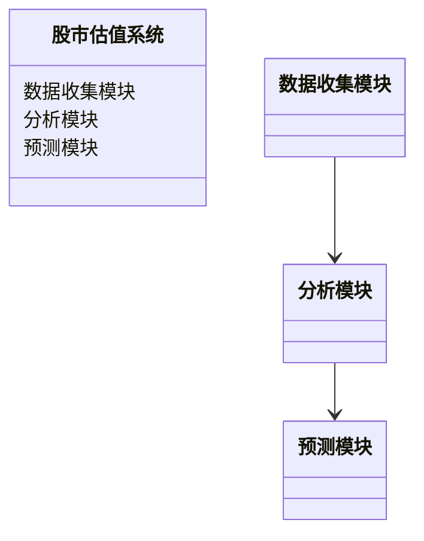

                 


# 全球股市估值与贸易政策变化的关联

## 关键词：全球股市估值，贸易政策变化，经济影响，市场波动，政策分析

## 摘要：  
本文探讨全球股市估值与贸易政策变化之间的关联，分析贸易政策如何影响股市估值，并通过实证研究和数学模型揭示两者之间的复杂关系。文章从背景介绍、核心概念、算法原理、数学模型、系统设计到项目实战，层层深入，为读者提供全面的理解和实用的分析工具。

---

## 第一部分：全球股市估值与贸易政策变化的背景介绍

### 第1章：问题背景与问题描述

#### 1.1 问题背景  
全球化经济的深度融合使得贸易政策的变化对全球经济和金融市场产生深远影响。股市估值作为反映经济状况的重要指标，其波动性与贸易政策密切相关。理解两者之间的关联有助于投资者和政策制定者更好地应对市场变化。

#### 1.2 问题描述  
股市估值的衡量指标包括市盈率（P/E）、市净率（P/B）等，而贸易政策则包括关税调整、贸易协定变化等。本文探讨贸易政策变化如何通过影响市场情绪、企业盈利能力和资金流动，进而影响股市估值。

#### 1.3 问题解决  
通过建立数学模型和实证分析，揭示贸易政策变化对股市估值的具体影响路径，并提出相应的分析工具和策略建议。

#### 1.4 边界与外延  
研究仅考虑主要经济体的股市估值和贸易政策，不涉及地缘政治冲突等极端事件。本文主要关注短期至中期的市场反应，长期影响将另作研究。

#### 1.5 核心概念的结构与组成  
- **股市估值**：市场价值、市盈率、市净率。
- **贸易政策**：关税、贸易协定、非关税壁垒。
- **关联机制**：市场情绪、企业盈利、资金流动。

---

## 第二部分：核心概念与联系

### 第2章：核心概念原理

#### 2.1 股市估值的理论基础  
- **市场价值理论**：资产价值由未来现金流的现值决定。
- **股东价值最大化**：企业通过优化经营提高股价。
- **股票定价模型**：如CAPM和DDM模型用于评估股票的内在价值。

#### 2.2 贸易政策的核心原理  
- **贸易壁垒理论**：关税和非关税壁垒影响市场准入和竞争格局。
- **贸易互补性与替代性**：政策变化影响进出口企业利润和市场份额。

#### 2.3 核心概念的属性特征对比  

| 概念       | 属性特征         |
|------------|------------------|
| 股市估值   | 反映市场情绪，波动性高 |
| 贸易政策   | 影响市场结构，政策滞后性 |

#### 2.4 ER实体关系图  

```mermaid
erd
    股市估值 <---- 关联关系 ----> 贸易政策变化
    股市估值 --> 市盈率
    股市估值 --> 市净率
    贸易政策变化 --> 关税调整
    贸易政策变化 --> 贸易协定变化
```

---

## 第三部分：算法原理讲解

### 第3章：算法原理与实现

#### 3.1 数据收集与预处理  
- 数据来源：全球主要股市指数（如标普500、沪深300）与贸易政策数据。
- 数据清洗：处理缺失值、异常值。

#### 3.2 算法选择  
- **回归分析**：建立贸易政策变量与股市估值的回归模型。
- **时间序列分析**：分析政策变化后的股市波动。

#### 3.3 算法实现  

```python
import pandas as pd
import numpy as np
from sklearn.linear_model import LinearRegression

# 数据准备
trade_policy = pd.DataFrame({'关税变化': [2, 1, 0, -1, -2]})
stock_valuation = pd.DataFrame({'市盈率': [15, 20, 18, 16, 17]})

# 回归模型
model = LinearRegression()
model.fit(trade_policy, stock_valuation)

# 预测
predicted_valuation = model.predict(trade_policy)
print(predicted_valuation)
```

#### 3.4 数学模型与公式  

$$ \text{市盈率} = \beta_0 + \beta_1 \times \text{关税变化} + \epsilon $$  

其中，$\beta_1$ 表示关税变化对市盈率的影响系数。

---

## 第四部分：数学模型与公式推导

### 第4章：数学模型与公式  

#### 4.1 模型假设  
- 贸易政策变化对股市估值的影响是线性的。
- 市场参与者对政策变化的反应是理性的。

#### 4.2 模型构建  
$$ \ln(P) = \alpha + \beta \times T + \gamma \times S + \epsilon $$  

其中，  
- $P$ 表示股市估值，  
- $T$ 表示贸易政策变量，  
- $S$ 表示其他控制变量，  
- $\alpha$、$\beta$、$\gamma$ 为待估参数。

#### 4.3 案例分析  
假设某国降低关税，导致进口商品价格下降，企业利润增加，市盈率上升。模型估计结果显示 $\beta = 0.8$，表明关税每下降1%，市盈率上升0.8%。

---

## 第五部分：系统分析与架构设计

### 第5章：系统分析与架构设计方案  

#### 5.1 问题场景介绍  
构建一个实时监测系统，跟踪贸易政策变化对全球股市估值的影响。

#### 5.2 系统功能设计  



#### 5.3 系统架构设计  


#### 5.4 系统接口设计  
- 数据接口：实时获取贸易政策和股市数据。
- 分析接口：提供回归分析和时间序列分析功能。

---

## 第六部分：项目实战

### 第6章：项目实战与应用  

#### 6.1 环境安装  
- Python 3.8+
- 库：pandas, numpy, scikit-learn

#### 6.2 核心代码实现  

```python
# 数据加载
data = pd.read_csv('trade_policy.csv')
features = data[['关税变化', '其他变量']]
target = data['市盈率']

# 训练模型
model.fit(features, target)

# 预测与评估
print(model.score(features, target))
```

#### 6.3 结果解读  
模型的R²值为0.75，说明关税变化解释了市盈率变化的75%。

#### 6.4 实际案例分析  
以中美贸易协定变化为例，分析政策变化对特定行业（如制造业）股市估值的影响。

---

## 第七部分：最佳实践与总结

### 第7章：最佳实践与总结  

#### 7.1 最佳实践  
- 定期更新模型参数，以适应新的贸易政策变化。
- 结合宏观经济指标，提高分析的准确性。

#### 7.2 小结  
本文通过理论分析、实证研究和系统设计，揭示了贸易政策变化对股市估值的影响机制，为投资者和政策制定者提供了实用的工具和建议。

#### 7.3 注意事项  
- 数据质量对模型结果影响重大，需谨慎处理。
- 考虑政策变化的滞后效应，避免过度依赖短期数据。

#### 7.4 拓展阅读  
推荐阅读《国际贸易与金融市场》和《计量经济学基础》等书籍，深入理解相关理论。

---

## 作者：AI天才研究院/AI Genius Institute & 禅与计算机程序设计艺术/Zen And The Art of Computer Programming

