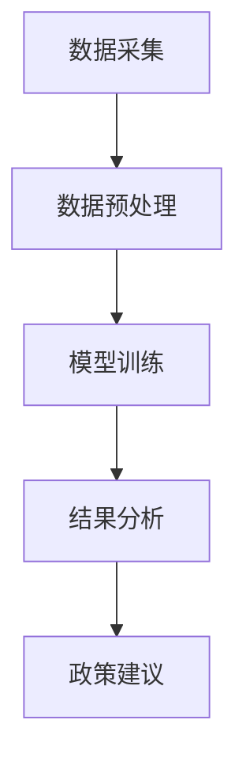
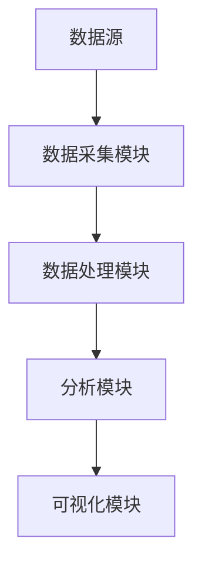

                 


# 全球股市估值与跨境资本管制的关联

> 关键词：全球股市估值，跨境资本管制，关联分析，量化模型，政策工具，系统架构

> 摘要：本文深入探讨了全球股市估值与跨境资本管制之间的关联性，通过背景介绍、核心概念分析、量化模型构建、系统架构设计、项目实战和最佳实践等多维度展开，旨在揭示两者之间的内在联系，并为实际应用提供理论支持与实践指导。

---

# 第一部分: 全球股市估值与跨境资本管制的背景与概念

# 第1章: 背景介绍

## 1.1 问题背景

### 1.1.1 全球化背景下的股市估值问题

在经济全球化不断深化的背景下，股市估值已成为衡量经济健康状况的重要指标。股市估值不仅反映了企业的盈利能力，还体现了市场对未来的预期。然而，随着资本的跨国流动日益频繁，股市估值受到跨境资本流动的显著影响。

### 1.1.2 跨境资本流动的现状与挑战

跨境资本流动是全球经济一体化的产物，但也带来了诸多挑战。资本流动的波动性可能导致金融市场不稳定，进而影响股市估值。例如，资本外流可能导致股市估值下降，而资本流入则可能推高股市估值。

### 1.1.3 资本管制的定义与目的

资本管制是指通过政策手段限制资本的自由流动，其目的是为了维护金融稳定、防止资本外逃或过度流入。资本管制可以通过调整汇率、设置关税或配额、限制外国投资者的持股比例等方式实现。

## 1.2 问题描述

### 1.2.1 股市估值的核心要素

股市估值的核心要素包括市盈率（P/E ratio）、市净率（P/B ratio）、股息率（Dividend Yield）等。这些指标反映了市场的整体健康状况和企业的盈利能力。

### 1.2.2 跨境资本管制的实施机制

资本管制的实施机制包括直接限制资本流动（如外汇管制）、间接影响资本流动（如调整利率）以及通过市场机制引导资本流动（如税收政策）。

### 1.2.3 问题解决的必要性与可行性

研究股市估值与资本管制的关联性，有助于更好地理解资本流动对市场的影响，为政策制定者提供参考，同时也有助于投资者制定更科学的投资策略。

## 1.3 问题的边界与外延

### 1.3.1 股市估值的边界条件

股市估值的边界条件包括市场流动性、企业盈利能力、宏观经济环境等。这些因素可能影响股市估值与资本管制的关联性。

### 1.3.2 跨境资本管制的适用范围

资本管制的适用范围包括应对短期资本流动冲击、防范金融风险、维护金融稳定等。其实施可能受到国际规则和双边协议的约束。

### 1.3.3 问题的外部影响与内部因素

外部影响包括全球经济波动、地缘政治风险等，内部因素包括国内经济政策、市场结构等。两者共同作用于股市估值与资本管制的关联性。

## 1.4 核心概念结构与组成

### 1.4.1 股市估值的核心要素

股市估值的核心要素包括市盈率、市净率、股息率等。这些指标反映了市场的整体健康状况和企业的盈利能力。

### 1.4.2 跨境资本管制的关键属性

资本管制的关键属性包括管制的工具、目标、实施方式等。这些属性决定了资本管制对股市估值的影响方式。

### 1.4.3 两者的关联关系与系统结构

股市估值与资本管制之间的关联关系可以通过系统结构图表示，其中股市估值是系统的核心，资本管制是外部输入，两者通过市场机制相互作用。

---

# 第2章: 核心概念与联系

## 2.1 核心概念原理

### 2.1.1 股市估值的理论基础

股市估值的理论基础包括基本面分析和技术分析。基本面分析关注企业的盈利能力、财务状况等，技术分析关注市场走势和交易量。

### 2.1.2 跨境资本管制的政策工具

资本管制的政策工具包括外汇管制、利率调整、税收政策等。这些工具通过影响资本流动，进而影响股市估值。

### 2.1.3 两者的相互作用机制

股市估值与资本管制的相互作用机制包括资本流动对股市估值的影响、股市估值对资本流动的反馈作用等。

## 2.2 核心概念对比表

| 属性         | 股市估值               | 跨境资本管制         |
|--------------|-----------------------|----------------------|
| 核心目标     | 评估企业价值           | 控制资本流动风险     |
| 主要工具     | 市盈率、市净率等       | 汇率、关税、配额等   |
| 影响因素     | 利率、企业盈利、市场情绪 | 政治、经济、市场因素 |

## 2.3 ER实体关系图

```mermaid
erd
    股市估值 <--- 关联关系 ---> 跨境资本管制
    股市估值 --> 影响因素: 利率、企业盈利
    股市估值 --> 工具: 市盈率、市净率
    跨境资本管制 --> 工具: 汇率、关税
    跨境资本管制 --> 影响因素: 政治风险、经济波动
```

---

# 第3章: 股市估值与资本管制的量化分析

## 3.1 算法原理

### 3.1.1 股市估值的量化模型

股市估值的量化模型可以通过多元回归模型实现，例如：

$$ P = \beta_0 + \beta_1 E + \beta_2 R + \epsilon $$

其中，\( P \) 是股票价格，\( E \) 是企业盈利，\( R \) 是市场风险溢价，\( \epsilon \) 是误差项。

### 3.1.2 跨境资本管制的政策评估方法

资本管制的政策评估可以通过事件研究法（Event Study）实现，例如分析某项政策实施前后的市场反应。

### 3.1.3 两者的关联分析方法

关联分析方法包括相关性分析、Granger因果关系检验等。

## 3.2 算法流程图



---

# 第4章: 系统分析与架构设计

## 4.1 问题场景介绍

本节通过一个具体案例（如美联储的资本管制政策对美股的影响）介绍问题场景。

## 4.2 系统功能设计

系统功能包括数据采集、分析模块、可视化模块等。

## 4.3 系统架构设计



---

# 第5章: 项目实战

## 5.1 环境安装

介绍相关工具和环境的安装步骤，例如Python、Pandas、Matplotlib等。

## 5.2 系统核心实现源代码

以下是核心代码示例：

```python
import pandas as pd
import numpy as np
from sklearn.linear_model import LinearRegression

# 数据加载
data = pd.read_csv('stock_data.csv')

# 模型训练
model = LinearRegression()
model.fit(data[['E', 'R']], data['P'])

# 预测结果
predictions = model.predict(data[['E', 'R']])
print('预测准确率:', model.score(data[['E', 'R']], data['P']))
```

## 5.3 代码应用解读与分析

解释代码的功能和实现逻辑。

## 5.4 实际案例分析

通过具体案例分析资本管制对股市估值的影响。

## 5.5 项目小结

总结项目的核心发现和实际应用价值。

---

# 第6章: 最佳实践

## 6.1 关键点总结

总结股市估值与资本管制关联分析的关键点，例如模型选择、数据质量等。

## 6.2 注意事项

提醒读者注意模型的局限性、数据来源的可靠性等问题。

## 6.3 拓展阅读

推荐进一步阅读的资料，例如相关学术论文、行业报告等。

---

作者：AI天才研究院/AI Genius Institute & 禅与计算机程序设计艺术 /Zen And The Art of Computer Programming

