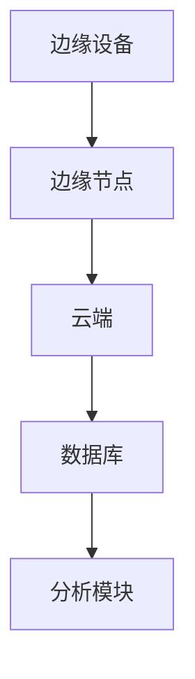

                 

# 全球股市估值与边缘计算在自动驾驶中的应用

> 关键词：全球股市估值，边缘计算，自动驾驶，股市分析，技术应用，系统架构，投资策略

> 摘要：本文探讨了全球股市估值与边缘计算在自动驾驶中的应用。首先，介绍了股市估值的基本概念和边缘计算的核心技术。然后，分析了边缘计算在自动驾驶中的具体应用，包括环境感知、决策控制和安全机制。接着，结合股市估值对自动驾驶技术的影响，探讨了投资策略和市场动态。最后，详细讲解了技术实现和项目实战，展望了未来的发展趋势。

---

## 第一部分: 全球股市估值与边缘计算概述

### 第1章: 全球股市估值基础

#### 1.1 股市估值的基本概念

股票估值是投资者对一家公司股票价值的评估，旨在确定其合理的价格范围。常见的估值方法包括市盈率（P/E）、市净率（P/B）和股息率等。

##### 1.1.1 股票估值的定义

股票估值是通过对公司财务数据、行业地位、市场前景等因素进行分析，确定股票的内在价值。投资者通常会参考这些指标来判断股票是否被高估或低估。

##### 1.1.2 市盈率与市净率的计算方法

- **市盈率（P/E）**：市盈率 = 股票价格 / 每股收益（EPS）。  
- **市净率（P/B）**：市净率 = 股票价格 / 每股净资产（BPS）。

##### 1.1.3 股票估值的影响因素

影响股票估值的因素包括公司盈利能力、行业竞争、宏观经济环境、政策法规等。

#### 1.2 股市估值的核心指标

##### 1.2.1 市盈率（P/E）的计算与应用

市盈率反映了投资者对公司未来盈利能力的预期。例如，假设某公司每股收益为2元，股票价格为40元，则市盈率为20倍。

##### 1.2.2 市净率（P/B）的计算与应用

市净率用于衡量股票价格相对于账面价值的高低。例如，某公司每股净资产为10元，股票价格为50元，则市净率为5倍。

##### 1.2.3 股息率的计算与应用

股息率 = 每股股息（Dividend） / 股票价格。例如，某公司股息为2元，股票价格为40元，则股息率为5%。

---

### 第2章: 边缘计算的基本概念

#### 2.1 边缘计算的定义与特点

边缘计算是在靠近数据源的地方进行数据处理和分析，避免了将大量数据传输到云端，提高了实时性和安全性。

##### 2.1.1 边缘计算的定义

边缘计算是在数据源附近进行数据处理和分析的技术，能够实时响应本地需求。

##### 2.1.2 边缘计算与云计算的区别

- **云计算**：数据集中处理，延迟较高。  
- **边缘计算**：数据本地处理，延迟低，实时性强。

##### 2.1.3 边缘计算的核心优势

边缘计算的优势包括低延迟、高实时性、数据隐私保护和减少带宽消耗。

#### 2.2 边缘计算的关键技术

##### 2.2.1 边缘计算的架构

边缘计算的架构包括边缘设备、边缘节点和云端三个层次。边缘设备负责数据采集，边缘节点进行数据处理，云端提供支持。

##### 2.2.2 边缘计算的通信协议

常用的通信协议包括MQTT、HTTP和CoAP等，适用于物联网环境下的数据传输。

##### 2.2.3 边缘计算的数据处理机制

边缘计算的数据处理机制包括数据过滤、压缩和本地存储，确保数据的有效性和可用性。

---

## 第二部分: 边缘计算在自动驾驶中的应用

### 第3章: 自动驾驶的核心技术与挑战

#### 3.1 自动驾驶的定义与分级

##### 3.1.1 自动驾驶的定义

自动驾驶是一种车辆在没有人类驾驶员干预的情况下，能够安全地完成行驶任务的技术。

##### 3.1.2 自动驾驶的分级

根据SAE J3016标准，自动驾驶分为L0到L5六个级别，从无自动化到完全自动化。

##### 3.1.3 自动驾驶的核心技术

自动驾驶的核心技术包括环境感知、路径规划、决策控制和实时通信。

#### 3.2 边缘计算在自动驾驶中的应用

##### 3.2.1 边缘计算在自动驾驶中的作用

边缘计算能够实时处理车辆传感器数据，提高自动驾驶的响应速度和安全性。

##### 3.2.2 自动驾驶中的实时数据处理

边缘计算通过本地处理传感器数据，减少云端依赖，提升处理效率。

##### 3.2.3 边缘计算在自动驾驶中的安全性

边缘计算能够快速响应异常情况，提高自动驾驶的安全性。

### 第4章: 边缘计算在自动驾驶中的具体应用

#### 4.1 自动驾驶中的环境感知

##### 4.1.1 基于边缘计算的环境感知技术

边缘计算通过本地处理摄像头、激光雷达和雷达数据，实现车辆周围环境的实时感知。

##### 4.1.2 多传感器融合技术

多传感器融合技术通过整合不同传感器的数据，提高环境感知的准确性和可靠性。

##### 4.1.3 基于边缘计算的实时数据处理

边缘计算能够快速处理传感器数据，确保车辆对环境变化的实时响应。

#### 4.2 自动驾驶中的决策与控制

##### 4.2.1 基于边缘计算的决策算法

边缘计算通过实时分析环境数据，制定车辆的行驶决策。

##### 4.2.2 自动驾驶中的路径规划

边缘计算帮助车辆规划最优路径，避开障碍物，确保行驶安全。

##### 4.2.3 自动驾驶中的实时控制

边缘计算能够快速调整车辆的行驶状态，确保车辆按照决策指令执行。

#### 4.3 自动驾驶中的安全机制

##### 4.3.1 边缘计算在自动驾驶安全中的作用

边缘计算通过本地安全算法，实时检测和应对安全威胁。

##### 4.3.2 自动驾驶中的安全威胁与防护

边缘计算能够识别和防御网络攻击，确保车辆数据的安全性。

##### 4.3.3 边缘计算在自动驾驶安全中的未来发展方向

未来，边缘计算将进一步提升安全性能，推动自动驾驶技术的普及。

---

## 第三部分: 全球股市估值与边缘计算的结合

### 第5章: 全球股市估值对自动驾驶技术的影响

#### 5.1 全球股市估值对自动驾驶技术的影响

##### 5.1.1 投资策略

投资者可以通过分析自动驾驶技术的市场前景，制定合理的投资策略。

##### 5.1.2 技术评估

股市估值能够反映自动驾驶技术的成熟度和市场认可度。

##### 5.1.3 市场动态

股市波动能够影响自动驾驶技术的发展速度和企业的融资能力。

---

## 第四部分: 技术实现与项目实战

### 第6章: 技术实现

#### 6.1 算法原理

##### 6.1.1 时间序列分析

时间序列分析是一种预测股票价格变化的方法，通过分析历史数据，预测未来趋势。

##### 6.1.2 边缘计算的架构设计

边缘计算的架构设计包括边缘设备、边缘节点和云端三个层次，确保数据的高效处理和传输。

#### 6.2 系统架构设计

##### 6.2.1 系统功能设计

系统功能设计包括数据采集、数据处理、决策控制和结果输出四个模块。

##### 6.2.2 系统架构图

---

### 第7章: 项目实战

#### 7.1 环境搭建

##### 7.1.1 安装Python环境

使用Anaconda或Miniconda安装Python环境，版本建议为3.8或以上。

##### 7.1.2 安装依赖库

安装Pandas、NumPy、Matplotlib等数据分析库。

#### 7.2 核心实现

##### 7.2.1 数据采集

通过API获取股票数据，并存储到本地数据库。

##### 7.2.2 数据分析

使用时间序列分析模型，预测股票价格变化。

##### 7.2.3 边缘计算实现

实现边缘计算的数据处理和分析功能，确保实时响应。

#### 7.3 案例分析

##### 7.3.1 股票价格预测

通过时间序列分析模型，预测某股票未来的价格走势。

##### 7.3.2 自动驾驶决策

基于边缘计算的环境感知和决策算法，模拟自动驾驶车辆的行驶过程。

---

## 第五部分: 总结与展望

### 第8章: 总结与展望

#### 8.1 全书总结

本文详细介绍了全球股市估值与边缘计算在自动驾驶中的应用，探讨了技术实现和项目实战。

#### 8.2 未来展望

未来，随着技术的不断发展，边缘计算在自动驾驶中的应用将更加广泛，股市估值对技术的影响也将更加深远。

---

## 作者信息

作者：AI天才研究院/AI Genius Institute & 禅与计算机程序设计艺术 /Zen And The Art of Computer Programming

---

**感谢您的阅读！如果对本文有任何疑问或建议，请随时与我们联系。**

