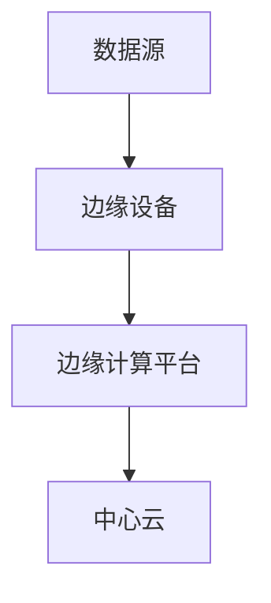
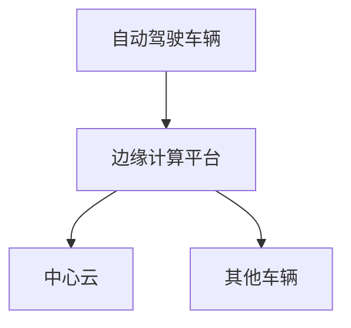
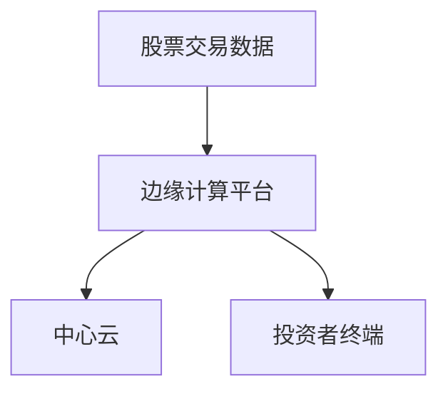

                 


# 全球股市估值与边缘计算在自动驾驶中的应用

---

## 关键词：
- 全球股市估值
- 边缘计算
- 自动驾驶
- 实时数据处理
- 数据安全与隐私保护

---

## 摘要：
本文深入探讨了全球股市估值的核心理论与边缘计算在自动驾驶中的应用，通过结合实时数据处理、系统架构设计和实际案例分析，展示了边缘计算在提升自动驾驶性能和优化股市估值效率中的关键作用。文章从背景介绍、核心原理、系统设计到项目实战，层层递进，为读者提供了一套全面的技术分析框架。

---

## 第1章: 背景介绍

### 1.1 全球股市估值的背景与概念

#### 1.1.1 股市估值的基本概念
股市估值是通过对企业的财务数据、行业地位、市场环境等多维度分析，确定股票合理价格范围的过程。常见的估值指标包括市盈率（PE）、市净率（PB）、市销率（PS）等。

#### 1.1.2 全球股市的多样性与复杂性
全球股市分布广泛，不同市场的波动性、交易规则和参与者行为差异显著。复杂性体现在宏观经济波动、政策变化、行业周期等多种因素对股市估值的影响。

#### 1.1.3 股市估值的重要性与应用场景
股市估值不仅是投资者决策的基础，也是企业并购、资产重组等经济活动的重要参考。高效准确的估值方法能够帮助投资者捕捉市场机会，规避风险。

---

### 1.2 边缘计算的基本概念与特点

#### 1.2.1 边缘计算的定义与核心特征
边缘计算是指在数据源附近进行数据处理和分析的技术，其核心特征包括实时性、分布式、低延迟和高可靠性。

#### 1.2.2 边缘计算与云计算的区别与联系
边缘计算与云计算的区别在于数据处理的位置和规模。边缘计算强调实时性和局部性，而云计算则注重数据的集中处理和大规模计算能力。

#### 1.2.3 边缘计算在自动驾驶中的潜在价值
自动驾驶需要实时感知环境、快速决策和执行，边缘计算能够提供低延迟、高可靠的计算能力，满足自动驾驶的核心需求。

---

## 第2章: 全球股市估值的理论基础

### 2.1 股市估值的主要方法

#### 2.1.1 市盈率（PE）模型
市盈率是股票价格与每股净利润的比率，用于衡量股票的估值水平。公式为：
$$ PE = \frac{股票价格}{每股净利润} $$

#### 2.1.2 市净率（PB）模型
市净率是股票价格与每股净资产的比率，适用于评估资产密集型行业的股票价值。公式为：
$$ PB = \frac{股票价格}{每股净资产} $$

#### 2.1.3 市销率（PS）模型
市销率是股票价格与每股营业收入的比率，常用于评估成长型企业。公式为：
$$ PS = \frac{股票价格}{每股营业收入} $$

### 2.2 股票估值的关键影响因素

#### 2.2.1 宏观经济因素
宏观经济指标如GDP增长率、利率、通货膨胀率等对股市估值有重要影响。

#### 2.2.2 行业发展趋势
行业周期、技术创新、政策变化等因素直接影响企业的盈利能力，从而影响股票估值。

#### 2.2.3 公司基本面分析
包括收入、利润、资产负债表、现金流等财务数据，是股票估值的核心依据。

---

## 第3章: 边缘计算的核心原理

### 3.1 边缘计算的体系结构

#### 3.1.1 边缘设备层
边缘设备如传感器、摄像头等负责数据采集和初步处理。

#### 3.1.2 边缘计算平台
平台负责数据的实时分析、模型训练和决策支持。

#### 3.1.3 中心云协同
边缘计算与中心云协同工作，实现数据的全局分析和优化。

#### 3.1.4 实体关系图


### 3.2 边缘计算的关键技术

#### 3.2.1 数据采集与处理
数据采集是边缘计算的第一步，通常通过传感器或API接口获取实时数据。

#### 3.2.2 实时计算与反馈
边缘计算平台对数据进行实时分析，快速生成决策反馈。

#### 3.2.3 数据安全与隐私保护
边缘计算需要通过加密、访问控制等技术确保数据安全和隐私保护。

---

## 第4章: 自动驾驶中的边缘计算需求

### 4.1 自动驾驶的核心场景

#### 4.1.1 实时环境感知
自动驾驶需要实时感知周围环境，包括障碍物检测、车道识别等。

#### 4.1.2 路径规划与决策
基于实时数据，系统需要快速制定行驶路径和决策。

#### 4.1.3 多车协同与通信
通过车辆间的实时通信，实现协同决策和资源共享。

### 4.2 边缘计算在自动驾驶中的应用价值

#### 4.2.1 实时数据处理的必要性
自动驾驶需要毫秒级的响应速度，边缘计算能够满足这一需求。

#### 4.2.2 边缘计算对自动驾驶性能的提升
边缘计算能够降低延迟，提高数据处理效率，从而提升自动驾驶的安全性和舒适性。

#### 4.2.3 边缘计算的成本优势
通过分布式计算，边缘计算可以减少对中心云的依赖，降低成本。

---

## 第5章: 边缘计算在自动驾驶中的技术实现

### 5.1 边缘计算在自动驾驶中的体系结构

#### 5.1.1 边缘设备
包括激光雷达、摄像头、雷达等传感器，负责数据采集。

#### 5.1.2 边缘计算平台
负责数据的实时分析、模型训练和决策支持。

#### 5.1.3 中心云协同
提供全局优化和数据存储支持。

#### 5.1.4 系统架构图


### 5.2 边缘计算在自动驾驶中的关键算法

#### 5.2.1 数据采集与预处理
```python
import numpy as np

# 示例数据：传感器数据
data = np.array([1, 2, 3, 4, 5])
```

#### 5.2.2 实时分析与决策
```python
def decision_making(data):
    if data[0] > 3:
        return "forward"
    else:
        return "stop"
```

#### 5.2.3 模型训练与优化
```python
from sklearn import linear_model

# 示例：线性回归模型
model = linear_model.LinearRegression()
model.fit(X, y)
```

### 5.3 边缘计算在自动驾驶中的实际案例

#### 5.3.1 实时环境感知
通过边缘计算平台分析激光雷达数据，实时识别障碍物并调整行驶路径。

#### 5.3.2 路径规划与决策
基于实时数据，边缘计算平台快速生成最优行驶路径，确保安全性和效率。

---

## 第6章: 全球股市估值与边缘计算的结合

### 6.1 全球股市估值与边缘计算的协同创新

#### 6.1.1 股市数据的实时处理
边缘计算能够实时处理股市数据，提升估值的准确性和及时性。

#### 6.1.2 边缘计算在股市预测中的应用
通过边缘计算平台分析历史数据和实时信息，优化股市预测模型。

### 6.2 全球股市估值与边缘计算的系统设计

#### 6.2.1 系统功能设计
包括数据采集、实时分析、模型训练和结果输出。

#### 6.2.2 系统架构图


#### 6.2.3 接口与交互设计
包括数据接口、算法接口和用户接口。

---

## 第7章: 项目实战

### 7.1 项目环境安装

#### 7.1.1 系统要求
需要安装Python、Jupyter Notebook、TensorFlow等工具。

#### 7.1.2 安装依赖
```bash
pip install numpy pandas matplotlib tensorflow
```

### 7.2 系统核心实现

#### 7.2.1 数据采集与预处理
```python
import pandas as pd
data = pd.read_csv('stock_data.csv')
```

#### 7.2.2 特征提取与建模
```python
from sklearn.preprocessing import StandardScaler
from sklearn.linear_model import LinearRegression

scaler = StandardScaler()
X_scaled = scaler.fit_transform(X)
model = LinearRegression()
model.fit(X_scaled, y)
```

#### 7.2.3 模型训练与优化
```python
import tensorflow as tf
model = tf.keras.Sequential([
    tf.keras.layers.Dense(64, activation='relu'),
    tf.keras.layers.Dense(1, activation='linear')
])
model.compile(optimizer='adam', loss='mse')
model.fit(X_train, y_train, epochs=100)
```

### 7.3 实际案例分析

#### 7.3.1 案例背景
分析某股票的历史数据，预测其未来走势。

#### 7.3.2 数据分析与建模
通过边缘计算平台分析数据，建立回归模型进行预测。

#### 7.3.3 模型评估
通过回测和交叉验证评估模型的准确性和稳定性。

---

## 第8章: 总结与展望

### 8.1 总结
本文深入分析了全球股市估值与边缘计算在自动驾驶中的应用，展示了边缘计算在实时数据处理、系统架构设计和实际案例中的重要价值。

### 8.2 展望
未来，边缘计算将在更多领域发挥重要作用，如智慧城市、工业互联网等。同时，随着技术的进步，边缘计算与人工智能的结合将更加紧密，推动更多创新应用的实现。

---

## 作者：AI天才研究院 & 禅与计算机程序设计艺术

---

通过本文的详细分析，读者可以全面理解全球股市估值与边缘计算在自动驾驶中的应用，掌握相关的核心技术与实践方法。

