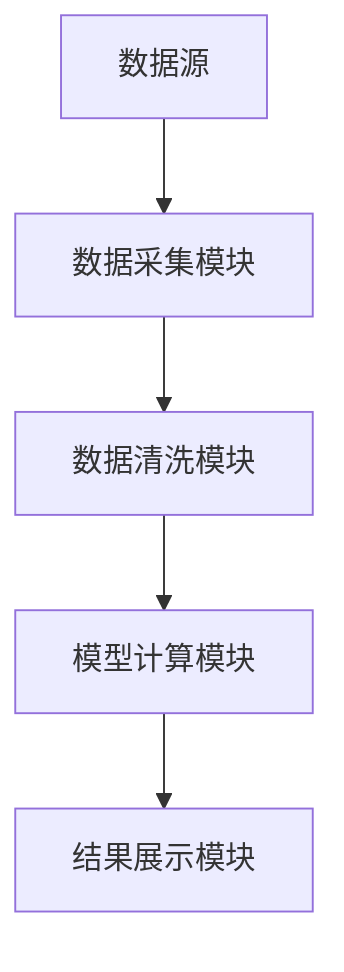
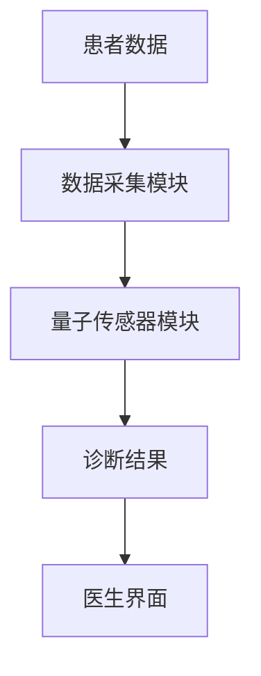

                 


# 全球股市估值与量子传感器在医疗诊断中的应用

## 关键词：股市估值，量子传感器，医疗诊断，股票分析，量子技术

## 摘要：
本文旨在探讨全球股市估值与量子传感器在医疗诊断中的应用。通过对股市估值方法的深入分析和量子传感器技术的详细介绍，结合实际案例，展示这两种看似不相关的领域的独特应用和潜在结合点。文章从背景介绍、核心概念、算法原理、系统架构设计到项目实战，全面解析这两个领域的核心内容，并通过对比分析，总结最佳实践和未来发展趋势。

---

## 第一部分：全球股市估值

### 第1章：全球股市估值概述

#### 1.1 股市估值的基本概念
- 1.1.1 股市估值的定义与重要性
  - 股市估值是通过对公司财务数据和市场因素的分析，确定股票的合理价格。
  - 股票价格反映了企业的价值，是投资者决策的重要依据。
- 1.1.2 股市估值的核心要素
  - 财务数据：收入、利润、现金流等。
  - 市场因素：宏观经济、行业趋势、投资者情绪等。
- 1.1.3 全球股市估值的发展趋势
  - 数据驱动的量化估值方法逐渐取代传统经验判断。
  - 技术进步推动估值模型的创新。

#### 1.2 股市估值的主要方法
- 1.2.1 市盈率（P/E）法
  - 市盈率=股价/每股收益。
  - 适用于盈利稳定的公司。
- 1.2.2 市净率（P/B）法
  - 市净率=股价/每股净资产。
  - 适用于净资产驱动的公司。
- 1.2.3 现金流折现法（DCF）
  - 将未来现金流折现，计算内在价值。
  - 常用于高成长性公司。

### 第2章：股市估值的核心模型

#### 2.1 股票估值的数学模型
- 2.1.1 常用股票估值公式
  - 市盈率公式：$$ P/E = \frac{P}{E} $$
  - 现金流折现公式：$$ DCF = \sum_{t=1}^{n} \frac{CF_t}{(1+r)^t} + \frac{TV}{(1+r)^n} $$
- 2.1.2 模型的优缺点对比
  - 市盈率法简单易懂，但受行业和市场环境影响较大。
  - DCF法精确但计算复杂，需假设未来现金流。

#### 2.2 股票估值的系统架构
- 2.2.1 系统功能模块
  - 数据采集模块：收集公司财务数据和市场数据。
  - 模型计算模块：应用估值模型计算股票价值。
  - 结果展示模块：可视化估值结果。
- 2.2.2 系统架构图（Mermaid）


### 第3章：股市估值的实战应用

#### 3.1 实战环境搭建
- 3.1.1 数据源选择
  - 使用Yahoo Finance API获取股票数据。
- 3.1.2 工具安装与配置
  - 安装Python和相关库（pandas、numpy、yfinance）。

#### 3.2 核心代码实现
- 3.2.1 数据清洗与预处理
  ```python
  import pandas as pd
  import yfinance as yf

  # 下载数据
  data = yf.download('AAPL', start='2020-01-01', end='2023-12-31')
  # 数据清洗
  data.dropna(inplace=True)
  print(data.head())
  ```
- 3.2.2 模型实现与优化
  ```python
  def calculate_dcf(cash_flows, discount_rate, terminal_value):
      dcf = 0
      for t in range(len(cash_flows)):
          dcf += cash_flows[t] / (1 + discount_rate) ** t
      dcf += terminal_value / (1 + discount_rate) ** len(cash_flows)
      return dcf

  # 示例计算
  cash_flows = [100, 120, 150]
  discount_rate = 0.1
  terminal_value = 200
  print(calculate_dcf(cash_flows, discount_rate, terminal_value))
  ```
- 3.2.3 结果可视化与分析
  ```python
  import matplotlib.pyplot as plt

  plt.plot(data.index, data['Close'])
  plt.title('AAPL Stock Price')
  plt.xlabel('Date')
  plt.ylabel('Price')
  plt.show()
  ```

---

## 第二部分：量子传感器在医疗诊断中的应用

### 第4章：量子传感器的基本原理

#### 4.1 量子传感器的定义与分类
- 4.1.1 量子传感器的定义
  - 利用量子效应进行测量的传感器。
- 4.1.2 常见量子传感器类型
  - 量子干涉传感器。
  - 量子磁场传感器。
- 4.1.3 量子传感器的核心技术
  - 量子纠缠。
  - 量子叠加。

#### 4.2 量子传感器的数学模型
- 4.2.1 量子态的表示
  - $$ |\psi\rangle = a|0\rangle + b|1\rangle $$
- 4.2.2 量子测量的数学表达
  - $$ M = \{M_0, M_1\} $$

### 第5章：量子传感器在医疗诊断中的应用

#### 5.1 量子传感器在疾病诊断中的应用
- 5.1.1 癌症早期检测
  - 利用量子传感器检测生物标志物。
- 5.1.2 神经退行性疾病诊断
  - 检测脑部磁场变化。

#### 5.2 量子传感器在医疗影像中的应用
- 5.2.1 影像数据的量子处理
  - 提高图像分辨率。
- 5.2.2 量子传感器在影像诊断中的优势
  - 快速、精准的诊断结果。

### 第6章：量子传感器在医疗诊断中的系统设计与实战

#### 6.1 系统功能设计
- 6.1.1 数据采集模块
  - 采集患者生理数据。
- 6.1.2 量子传感器模块
  - 处理数据并生成诊断结果。
- 6.1.3 结果展示模块
  - 可视化诊断结果。

#### 6.2 系统架构设计


#### 6.3 实战应用
- 6.3.1 环境搭建
  - 安装量子传感器相关硬件和软件。
- 6.3.2 核心代码实现
  ```python
  def quantum_measurement():
      # 量子态初始化
      state = [1, 0]
      # 量子测量
      prob = state[0]**2 + state[1]**2
      result = '0' if random.random() < prob else '1'
      return result

  # 示例测量
  print(quantum_measurement())
  ```

---

## 总结

本文系统地探讨了全球股市估值与量子传感器在医疗诊断中的应用。通过详细分析股市估值的核心方法和量子传感器的基本原理，结合实际案例，展示了这两种技术的独特价值和潜在结合点。未来，随着技术的进步，量子传感器在医疗领域的应用将更加广泛，股市估值模型也将更加智能化。

