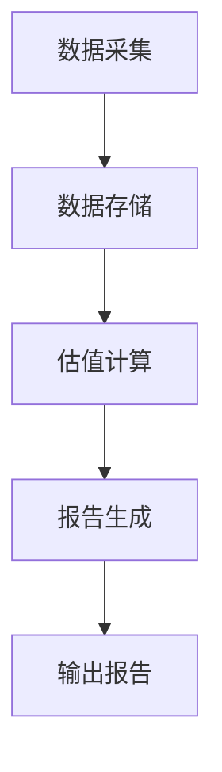
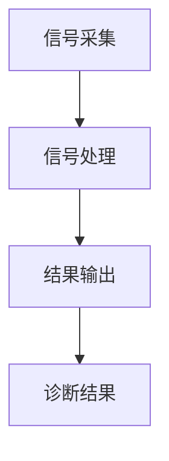

                 


# 全球股市估值与量子传感器在医疗诊断中的应用

> 关键词：全球股市估值，量子传感器，医疗诊断，投资策略，量子技术

> 摘要：本文将探讨全球股市估值的核心原理与投资策略，并深入分析量子传感器在医疗诊断中的创新应用。通过结合金融与量子技术的双重视角，我们揭示如何利用先进技术优化投资决策，并推动医疗诊断的精准化与智能化。

---

## 第一部分: 全球股市估值与投资策略

### 第1章: 全球股市估值概述

#### 1.1 股市估值的基本概念

##### 1.1.1 股市估值的定义与作用

股市估值是通过对公司财务数据的分析，评估其股票的内在价值。它帮助投资者确定股票是否被高估或低估，从而做出明智的投资决策。股市估值不仅是金融领域的核心工具，也是经济学研究的重要组成部分。

##### 1.1.2 股市估值的核心指标

以下是股市估值中常用的几个关键指标：

- **市盈率（P/E Ratio）**：计算公式为股价除以每股净利润。它反映了投资者对公司的未来盈利能力的预期。
- **市净率（P/B Ratio）**：计算公式为股价除以每股净资产。它适用于评估资产密集型行业（如银行、房地产）的公司。
- **股息率（Dividend Yield）**：计算公式为每股股息除以股价。它反映了股票的分红能力。

##### 1.1.3 股市估值的边界与外延

股市估值不仅关注公司的财务状况，还涉及宏观经济环境、行业趋势和市场情绪等外部因素。它的外延包括对公司治理、竞争优势和创新能力的评估。

#### 1.2 股市估值的核心模型

##### 1.2.1 市盈率模型

市盈率模型通过比较公司的市盈率与行业平均水平或目标公司的目标市盈率，评估其股票的合理价值。例如，假设行业平均市盈率为15倍，目标公司净利润为10亿元，则其合理估值为150亿元。

##### 1.2.2 市净率模型

市净率模型适用于评估资产密集型行业的公司。例如，假设一家银行的净资产为500亿元，行业平均市净率为1.5倍，则其合理估值为750亿元。

##### 1.2.3 现金流折现模型

现金流折现模型通过将公司未来现金流折现至当前，计算其企业价值。例如，假设一家公司未来5年的现金流分别为10亿、12亿、14亿、16亿和18亿元，折现率设定为8%，则其企业价值约为60亿元。

#### 1.3 股市估值的算法原理

##### 1.3.1 市盈率计算公式

市盈率计算公式如下：

$$ P/E = \frac{\text{股价}}{\text{每股净利润}} $$

##### 1.3.2 市净率计算公式

市净率计算公式如下：

$$ P/B = \frac{\text{股价}}{\text{每股净资产}} $$

##### 1.3.3 现金流折现模型的数学公式

现金流折现模型的数学公式如下：

$$ V = \sum_{t=1}^{n} \frac{CF_t}{(1 + r)^t} + \frac{TV}{(1 + r)^n} $$

其中，\( CF_t \) 为第 t 年的现金流，\( r \) 为折现率，\( TV \) 为终值。

#### 1.4 股市估值的系统架构

##### 1.4.1 股市估值系统功能设计

- 数据采集模块：收集公司财务数据和市场数据。
- 估值计算模块：应用市盈率、市净率和现金流折现模型计算股票价值。
- 报告生成模块：生成估值报告，提供投资建议。

##### 1.4.2 股市估值系统架构图



##### 1.4.3 股市估值系统接口设计

- 输入接口：接收公司财务数据和市场数据。
- 输出接口：提供股票估值结果和投资建议。

#### 1.5 股市估值的项目实战

##### 1.5.1 股市估值环境安装

- 安装Python和Pandas库。

##### 1.5.2 股市估值核心代码实现

```python
import pandas as pd

# 假设df包含公司财务数据和市场数据
def calculate_pe(df):
    pe = df['股价'] / df['每股净利润']
    return pe

def calculate_pb(df):
    pb = df['股价'] / df['每股净资产']
    return pb
```

##### 1.5.3 股市估值案例分析

以某公司为例，计算其市盈率和市净率，分析其股票是否被低估或高估。

#### 1.6 股市估值的最佳实践

##### 1.6.1 股市估值的注意事项

- 考虑宏观经济环境和行业趋势。
- 结合公司治理和竞争优势进行综合评估。

##### 1.6.2 股市估值的优化技巧

- 使用多种估值模型进行交叉验证。
- 定期更新财务数据和市场数据。

##### 1.6.3 股市估值的拓展阅读

推荐阅读《投资学》和《价值投资经典案例》。

---

## 第二部分: 量子传感器在医疗诊断中的应用

### 第2章: 量子传感器的基本原理与应用

#### 2.1 量子传感器的基本概念

##### 2.1.1 量子传感器的定义与作用

量子传感器是一种基于量子力学原理的传感器，能够以更高的精度和灵敏度检测物理量。它在医疗诊断中的应用前景广阔，尤其是在疾病的早期检测和精准治疗方面。

##### 2.1.2 量子传感器的核心原理

量子传感器利用量子叠加态和纠缠态的特性，实现对微弱信号的检测。例如，通过测量量子比特的叠加态，可以检测生物分子的相互作用。

##### 2.1.3 量子传感器的边界与外延

量子传感器不仅用于医疗诊断，还广泛应用于环境监测、国防等领域。其外延包括量子通信和量子计算。

#### 2.2 量子传感器的核心技术

##### 2.2.1 量子力学基础

量子力学是量子传感器的理论基础。它研究微观粒子的行为，如量子叠加态和量子纠缠态。

##### 2.2.2 量子传感器的测量原理

量子传感器通过测量量子系统的状态变化，实现对外部信号的检测。例如，通过测量量子比特的状态，可以检测生物分子的相互作用。

##### 2.2.3 量子传感器的关键技术

- 量子纠缠态的制备与操控。
- 量子系统的稳定性与可靠性。

#### 2.3 量子传感器的算法原理

##### 2.3.1 量子叠加态的数学模型

量子叠加态的数学模型如下：

$$ |\psi\rangle = \alpha|0\rangle + \beta|1\rangle $$

其中，\( \alpha \) 和 \( \beta \) 是复数，满足 \( |\alpha|^2 + |\beta|^2 = 1 \)。

##### 2.3.2 量子纠缠态的数学表达

量子纠缠态的数学表达如下：

$$ |\psi\rangle = \frac{1}{\sqrt{2}}(|0\rangle|1\rangle + |1\rangle|0\rangle) $$

##### 2.3.3 量子传感器的信号处理算法

通过量子傅里叶变换对信号进行处理，提取有用信息。例如，通过量子傅里叶变换处理生物分子的光谱数据，实现疾病的早期诊断。

#### 2.4 量子传感器的系统架构

##### 2.4.1 量子传感器系统功能设计

- 信号采集模块：采集生物分子的光谱数据。
- 信号处理模块：应用量子算法处理信号。
- 结果输出模块：输出诊断结果。

##### 2.4.2 量子传感器系统架构图



##### 2.4.3 量子传感器系统接口设计

- 输入接口：接收生物分子的光谱数据。
- 输出接口：提供诊断结果。

#### 2.5 量子传感器的项目实战

##### 2.5.1 量子传感器环境安装

- 安装量子计算开发框架，如Qiskit。

##### 2.5.2 量子传感器核心代码实现

```python
from qiskit import QuantumCircuit, Aer, execute

# 创建量子电路
qc = QuantumCircuit(2, 1)
qc.h(0)
qc.cnot(0, 1)
qc.measure(0, 0)

# 执行量子模拟
simulator = Aer.get_backend('statevector_simulator')
result = execute(qc, simulator).result()
state = result.get_statevector(qc)
print(state)
```

##### 2.5.3 量子传感器案例分析

以某种疾病为例，通过量子传感器检测生物分子的光谱数据，实现疾病的早期诊断。

#### 2.6 量子传感器的应用案例

##### 2.6.1 量子传感器在癌症早期诊断中的应用

通过量子传感器检测癌细胞的光谱特征，实现癌症的早期诊断。

##### 2.6.2 量子传感器在心血管疾病诊断中的应用

通过量子传感器检测血液中的特定生物标志物，实现心血管疾病的早期诊断。

##### 2.6.3 量子传感器在中枢神经系统疾病诊断中的应用

通过量子传感器检测脑部的磁信号，实现中枢神经系统疾病的诊断。

---

## 第三部分: 全球股市估值与量子传感器的对比分析

### 第3章: 股市估值与量子传感器的对比分析

#### 3.1 股市估值与量子传感器的异同点

##### 3.1.1 核心目标的对比

股市估值的核心目标是评估股票的内在价值，而量子传感器的核心目标是检测微弱信号。

##### 3.1.2 技术特点的对比

股市估值依赖于财务数据和市场数据，而量子传感器依赖于量子力学原理。

#### 3.2 股市估值与量子传感器的相互影响

##### 3.2.1 股市估值对量子传感器的影响

股市估值为量子传感器的商业化提供资金支持。

##### 3.2.2 量子传感器对股市估值的影响

量子传感器的出现可能改变股市估值的传统方法。

#### 3.3 股市估值与量子传感器的未来展望

##### 3.3.1 技术融合的可能性

未来，股市估值可能与量子传感器技术相结合，实现更精准的投资决策。

##### 3.3.2 应用领域的拓展

股市估值和量子传感器的应用领域将不断拓展，推动金融与医疗技术的深度融合。

---

## 第四部分: 结论与展望

### 第4章: 结论与展望

#### 4.1 全球股市估值与量子传感器的应用总结

通过本文的探讨，我们总结了全球股市估值和量子传感器在医疗诊断中的应用，并展示了它们的异同点和相互影响。

#### 4.2 未来研究方向

未来，我们需要进一步研究股市估值与量子传感器的结合，探索它们在其他领域的应用。

---

## 作者：AI天才研究院/AI Genius Institute & 禅与计算机程序设计艺术 /Zen And The Art of Computer Programming

