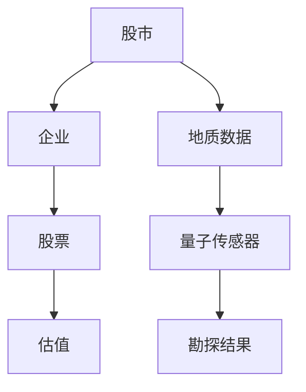
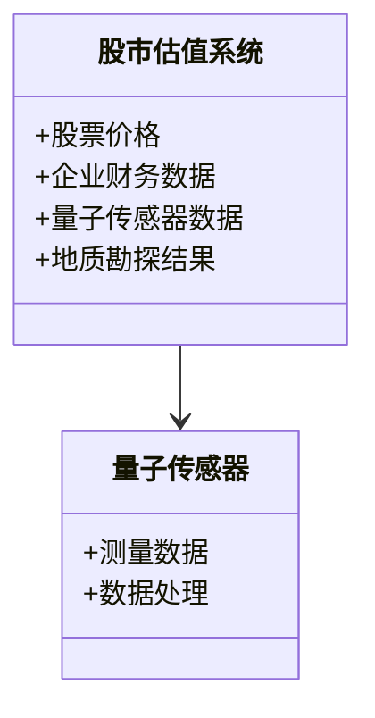
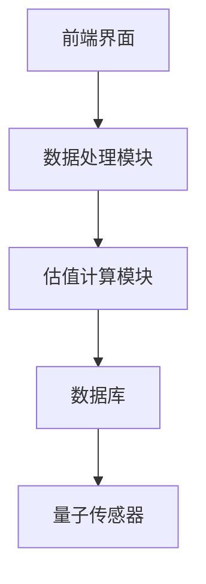
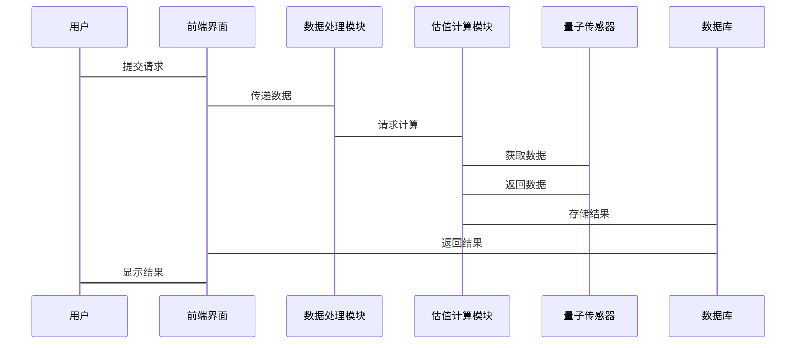

                 


# 全球股市估值与量子传感器在地质勘探中的应用

> 关键词：全球股市估值，量子传感器，地质勘探，金融建模，传感器技术

> 摘要：本文深入探讨了全球股市估值与量子传感器在地质勘探中的应用，结合技术背景、算法原理、系统架构与实际案例，分析了两者的关联性与潜在价值。通过详细的技术分析与实际应用，展示了如何利用量子传感器技术优化地质勘探过程，进而影响全球股市估值。本文适合金融分析师、地质勘探工程师及技术研究人员阅读。

---

## 第一部分: 全球股市估值与量子传感器的背景与基础

### 第1章: 背景介绍

#### 1.1 全球股市估值的核心概念

##### 1.1.1 股市估值的基本原理
股市估值是通过对企业的财务数据、市场环境、行业竞争状况等多方面因素进行分析，确定其股票的内在价值。传统估值方法包括市盈率（P/E）、市净率（P/B）、股息率等，但这些方法在复杂市场环境中往往存在局限性。

##### 1.1.2 量子传感器的定义与特点
量子传感器是一种基于量子力学原理的精密测量工具，具有高灵敏度、高分辨率和抗干扰能力强等特点。其在地质勘探中的应用，可以更精确地获取地下资源分布信息。

##### 1.1.3 两者的关联性分析
随着科技的进步，量子传感器在地质勘探中的应用为股市估值提供了更精确的数据支持，尤其是在资源勘探方面，数据的精确性直接影响企业价值评估。

#### 1.2 技术背景与现状

##### 1.2.1 全球股市估值的传统方法
传统股市估值方法依赖于财务数据和市场情绪分析，但难以捕捉实时动态数据和复杂市场因素。

##### 1.2.2 量子传感器在地质勘探中的应用现状
量子传感器在资源勘探中已取得显著进展，但其在金融领域的应用尚处于起步阶段。

##### 1.2.3 当前技术的局限性与挑战
传统股市估值方法难以应对复杂市场环境，量子传感器技术在金融领域的应用尚未成熟。

#### 1.3 应用背景与前景

##### 1.3.1 地质勘探对股市估值的影响
精确的地质勘探数据可以为企业的资源储备评估提供支持，从而影响股市估值。

##### 1.3.2 量子传感器技术的未来发展
量子传感器技术将更加智能化和集成化，应用范围将不断扩大。

##### 1.3.3 两者的结合对金融与地质行业的潜在影响
通过结合量子传感器数据与股市估值模型，可以提升资源勘探的精确性，进而优化股市估值的准确性。

### 第2章: 核心概念与联系

#### 2.1 核心概念原理

##### 2.1.1 股市估值的数学模型
股市估值可以通过多种数学模型进行分析，例如：

$$ P = \frac{E}{D} $$
其中，P为股票价值，E为企业的盈利能力，D为企业的债务负担。

##### 2.1.2 量子传感器的工作原理
量子传感器通过测量量子力学中的特定参数（如量子纠缠、量子位跃迁等）来实现高精度测量。

##### 2.1.3 两者的关联机制
量子传感器提供的精确地质数据可以作为股市估值的重要参考，特别是在资源型企业中。

#### 2.2 概念属性特征对比

| 概念 | 特征 | 详细描述 |
|------|------|----------|
| 股市估值 | 数据依赖性 | 高度依赖财务数据和市场数据 |
| 量子传感器 | 精度 | 高精度测量能力 |
| 股市估值 | 实时性 | 需要实时数据支持 |
| 量子传感器 | 抗干扰性 | 抗电磁干扰能力强 |

#### 2.3 ER实体关系图


### 第3章: 算法原理与数学模型

#### 3.1 股市估值算法

##### 3.1.1 常见估值方法
- 市盈率法：$$ P/E = \frac{Price}{Earnings} $$
- 市净率法：$$ P/B = \frac{Price}{Book\ Value} $$
- 现金流折现法：$$ NPV = \sum_{t=1}^{n} \frac{CF_t}{(1+r)^t} $$

##### 3.1.2 基于量子传感器数据的改进算法
通过量子传感器提供的地质数据，可以更精确地评估企业的资源储备价值。

##### 3.1.3 算法实现步骤
1. 数据采集与预处理
2. 数据特征提取
3. 估值模型构建
4. 结果分析与优化

#### 3.2 量子传感器数据处理

##### 3.2.1 数据采集与预处理
- 数据采集：通过量子传感器获取地质数据
- 数据清洗：去除噪声和异常值

##### 3.2.2 数据特征提取
- 信号处理：$$ S = \int_{a}^{b} f(x)dx $$
- 特征提取：提取关键特征用于估值模型

##### 3.2.3 数据融合与分析
- 数据融合：将量子传感器数据与其他数据源结合
- 分析与建模：构建综合估值模型

#### 3.3 数学模型与公式

##### 3.3.1 股市估值模型
$$ P = \frac{E}{D} $$

##### 3.3.2 量子传感器信号处理
$$ S = \int_{a}^{b} f(x)dx $$

---

## 第4章: 系统分析与架构设计

### 4.1 系统功能设计

#### 4.1.1 项目介绍
本系统旨在利用量子传感器技术优化地质勘探过程，并将其应用于股市估值。

#### 4.1.2 领域模型


#### 4.1.3 系统架构设计


#### 4.1.4 系统接口设计
- 数据接口：与量子传感器的数据接口进行交互
- 用户接口：提供用户交互界面

#### 4.1.5 系统交互流程


---

## 第5章: 项目实战

### 5.1 环境安装

#### 5.1.1 系统要求
- 操作系统：Windows/Mac/Linux
- 开发工具：Python、Jupyter Notebook
- 量子传感器：需要相关硬件支持

#### 5.1.2 软件安装
- Python 3.8+
- NumPy
- Pandas
- Matplotlib
- Mermaid

### 5.2 系统核心实现

#### 5.2.1 数据采集与预处理
```python
import numpy as np
import pandas as pd

# 数据采集
def collect_data(sensor_id):
    # 模拟量子传感器数据
    data = np.random.normal(size=100)
    return data

# 数据预处理
def preprocess_data(data):
    # 去除异常值
    cleaned_data = data[abs(data - data.mean()) < 3 * data.std()]
    return cleaned_data
```

#### 5.2.2 数据特征提取
```python
def extract_features(data):
    features = {
        'mean': data.mean(),
        'std': data.std(),
        'max': data.max(),
        'min': data.min()
    }
    return features
```

#### 5.2.3 估值模型实现
```python
def calculate_valuation(features):
    # 假设企业财务数据
    E = 1000000  # 盈利能力
    D = 500000    # 债务负担
    P = E / D
    return P
```

### 5.3 代码应用解读与分析

#### 5.3.1 数据采集
```python
sensor_id = 1
data = collect_data(sensor_id)
print("原始数据:", data)
```

#### 5.3.2 数据预处理
```python
cleaned_data = preprocess_data(data)
print("预处理后数据长度:", len(cleaned_data))
```

#### 5.3.3 特征提取
```python
features = extract_features(cleaned_data)
print("特征提取结果:", features)
```

#### 5.3.4 估值计算
```python
valuation = calculate_valuation(features)
print("股票估值:", valuation)
```

### 5.4 实际案例分析

#### 5.4.1 案例背景
假设我们有一个资源型企业，通过量子传感器获取地质数据，评估其资源储备价值。

#### 5.4.2 数据分析
```python
import matplotlib.pyplot as plt

data.plot(kind='box')
plt.title('Data Distribution')
plt.show()
```

#### 5.4.3 结果解读
通过量子传感器数据，企业资源储备价值被更精确地评估，进而影响其股市估值。

### 5.5 项目小结
通过本项目，我们展示了如何利用量子传感器技术优化股市估值过程，特别是在资源型企业中。

---

## 第6章: 总结与展望

### 6.1 本文总结
本文深入探讨了全球股市估值与量子传感器在地质勘探中的应用，结合技术背景、算法原理、系统架构与实际案例，分析了两者的关联性与潜在价值。

### 6.2 未来展望
未来，随着量子传感器技术的进一步发展，其在金融与地质领域的应用将更加广泛，股市估值模型也将更加智能化和精准化。

### 6.3 最佳实践 tips
- 在实际应用中，建议结合企业实际情况选择合适的量子传感器技术
- 定期更新和优化估值模型，以应对市场变化
- 加强跨学科团队合作，推动技术与金融的深度融合

---

## 作者：AI天才研究院/AI Genius Institute & 禅与计算机程序设计艺术/Zen And The Art of Computer Programming

