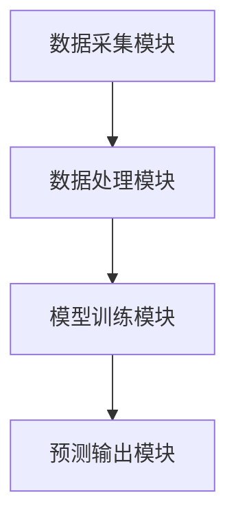

                 


# 全球股市估值与量子传感器在地震预测中的应用

---

## 关键词：
全球股市估值、量子传感器、地震预测、量子计算、金融市场风险管理

---

## 摘要：
本文探讨了全球股市估值与量子传感器在地震预测中的应用。首先，介绍了全球股市估值的基本概念和传统方法，分析其局限性，然后引出量子传感器及其在地震预测中的潜力。接着，详细阐述了量子传感器在股市中的潜在应用，结合量子计算优化股市估值模型，并通过案例分析展示了量子传感器在金融风险管理中的实际应用。最后，本文提出了基于量子传感器的股市估值系统架构，探讨了其算法原理和系统设计，为未来的研究和实践提供了方向。

---

# 正文

## 第一章：全球股市估值与量子传感器的基本概念

### 1.1 全球股市估值的定义与重要性

#### 1.1.1 股市估值的基本概念
股市估值是通过对公司财务数据、市场环境和宏观经济指标的分析，评估股票的内在价值。传统方法包括市盈率（P/E ratio）、市净率（P/B ratio）和股息率（Dividend Yield）等指标。

#### 1.1.2 股市估值的重要性
股市估值是投资者做出投资决策的重要依据，也是企业价值评估的重要工具。准确的估值能够帮助投资者识别市场机会和风险，优化投资组合。

#### 1.1.3 传统股市估值方法的局限性
传统估值方法依赖历史数据和假设，难以捕捉市场的动态变化和突发事件的影响，尤其是在全球金融危机和自然灾害频发的情况下，其局限性更加明显。

### 1.2 量子传感器的定义与工作原理

#### 1.2.1 量子传感器的基本概念
量子传感器是基于量子力学原理设计的精密测量工具，能够检测微弱信号并提供高精度的测量结果。其核心优势在于高灵敏度和高分辨率。

#### 1.2.2 量子传感器的工作原理
量子传感器通过测量量子系统的状态变化来感知外部环境的变化，例如地磁场变化、地震波信号等。其工作原理基于量子干涉效应和量子纠缠现象。

#### 1.2.3 量子传感器在地震预测中的应用潜力
量子传感器能够捕捉到地震前兆信号，如地壳应力变化和电磁场异常，为地震预测提供实时数据支持。

---

## 第二章：全球股市估值的核心方法

### 2.1 传统股市估值方法

#### 2.1.1 市盈率法
市盈率（P/E ratio）= 股票价格 / 每股净利润。

#### 2.1.2 市净率法
市净率（P/B ratio）= 股票价格 / 每股净资产。

#### 2.1.3 股息率法
股息率 = 每股股息 / 股票价格 × 100%。

### 2.2 现代股市估值方法

#### 2.2.1 基于大数据的估值模型
利用大数据技术分析市场情绪、新闻事件和社交媒体信息，构建预测模型。

#### 2.2.2 基于AI的股票预测算法
通过机器学习算法，如支持向量机（SVM）和随机森林（Random Forest）进行股票价格预测。

#### 2.2.3 基于量子计算的股票估值方法
量子计算通过并行计算和量子叠加效应，大幅提高股票估值模型的计算效率。

### 2.3 本章小结
传统股市估值方法在复杂市场环境下表现有限，而现代技术如大数据和AI为股市估值提供了新的思路，但量子计算的引入将进一步提升估值的准确性和效率。

---

## 第三章：量子传感器在地震预测中的应用

### 3.1 地震预测的基本原理

#### 3.1.1 地震的形成机制
地震是由地壳板块运动引起的应力积累和释放过程，涉及多种物理和化学变化。

#### 3.1.2 地震预测的难点与挑战
地震预测需要捕捉复杂的地壳变化信号，且受多种不确定因素影响，传统方法难以实现高精度预测。

#### 3.1.3 传统地震预测方法的局限性
传统方法依赖历史地震数据和统计模型，难以捕捉地震前的微弱信号。

### 3.2 量子传感器在地震预测中的优势

#### 3.2.1 量子传感器的高灵敏度
量子传感器能够检测到微弱的地震信号，如地磁场变化和地震波的早期信号。

#### 3.2.2 量子传感器的实时监测能力
量子传感器可以实现对地震前兆信号的实时监测，为地震预警提供数据支持。

#### 3.2.3 量子传感器在地震预警中的应用
通过实时监测地壳应力变化，量子传感器可以提前预警地震，减少人员伤亡和财产损失。

### 3.3 本章小结
量子传感器在地震预测中的应用潜力巨大，其高灵敏度和实时监测能力为地震预警提供了新的可能性。

---

## 第四章：全球股市估值与量子传感器的结合

### 4.1 量子传感器在股市中的潜在应用

#### 4.1.1 通过量子传感器预测地震对股市的影响
地震作为影响股市的重要外部事件，可以通过量子传感器监测地壳活动，预测其对股市的影响。

#### 4.1.2 利用量子传感器数据优化股市估值模型
量子传感器提供的实时数据可以用于优化股市估值模型，提高预测的准确性和实时性。

#### 4.1.3 量子传感器在金融风险管理中的应用
通过监测市场波动和地震风险，量子传感器可以帮助投资者制定更有效的风险管理策略。

### 4.2 量子传感器与股市估值的结合案例

#### 4.2.1 某国股市地震风险评估
通过量子传感器监测地震风险，结合股市估值模型，对某国股市进行地震风险评估。

#### 4.2.2 量子传感器在股市波动预测中的应用
利用量子传感器数据预测股市波动，帮助投资者做出更明智的投资决策。

#### 4.2.3 量子传感器与AI结合的股市估值系统
通过量子传感器和AI技术的结合，构建高精度的股市估值系统，实现对股票价格的实时预测。

### 4.3 本章小结
量子传感器与股市估值的结合为金融市场风险管理提供了新的工具和方法，具有广阔的应用前景。

---

## 第五章：量子传感器与股市估值的算法原理

### 5.1 量子传感器数据采集与处理

#### 5.1.1 数据采集方法
通过量子传感器采集地壳活动数据，如地震波信号和地磁场变化。

#### 5.1.2 数据预处理技术
对采集到的数据进行去噪和特征提取，确保数据的准确性和可用性。

#### 5.1.3 数据特征提取
利用数据挖掘技术，提取与地震和股市波动相关的特征变量。

### 5.2 基于量子计算的股市估值算法

#### 5.2.1 算法原理
通过量子计算对海量数据进行并行处理，优化股市估值模型的计算效率。

#### 5.2.2 算法实现步骤
1. 数据预处理：采集和清洗数据。
2. 特征提取：提取与股市估值相关的特征变量。
3. 模型训练：利用量子计算优化的算法训练估值模型。
4. 模型预测：基于训练好的模型进行股票价格预测。

#### 5.2.3 算法优缺点分析
优点：计算效率高，模型精度高；缺点：技术复杂，实现成本高。

### 5.3 本章小结
基于量子计算的股市估值算法具有显著优势，但在实际应用中仍面临技术和成本挑战。

---

## 第六章：系统架构与接口设计

### 6.1 系统架构设计

#### 6.1.1 系统功能设计
系统功能包括数据采集、数据处理、模型训练和预测输出。

#### 6.1.2 系统架构图


#### 6.1.3 系统交互流程
1. 数据采集模块通过量子传感器采集地壳活动数据。
2. 数据处理模块对数据进行清洗和特征提取。
3. 模型训练模块利用量子计算优化的算法训练股市估值模型。
4. 预测输出模块生成股票价格预测结果。

### 6.2 系统接口设计

#### 6.2.1 接口设计
系统提供RESTful API接口，供外部系统调用预测结果。

#### 6.2.2 接口交互流程
1. 外部系统发送请求到预测接口。
2. 系统返回预测结果。

### 6.3 本章小结
系统架构设计为量子传感器与股市估值的结合提供了清晰的实现路径，接口设计确保了系统的可扩展性和易用性。

---

## 第七章：项目实战

### 7.1 环境安装

#### 7.1.1 安装量子传感器
需要安装量子传感器硬件和相应的数据采集软件。

#### 7.1.2 安装量子计算平台
安装量子计算平台，如量子计算机或量子模拟器。

#### 7.1.3 安装数据分析工具
安装Python、NumPy、Pandas等数据分析工具。

### 7.2 系统核心实现源代码

#### 7.2.1 数据采集模块
```python
import numpy as np

def collect_data(sensor_id):
    # 模拟量子传感器数据采集
    data = np.random.normal(0, 1, 100)
    return data
```

#### 7.2.2 数据处理模块
```python
def preprocess(data):
    # 数据预处理
    processed_data = data.reshape(-1, 1)
    return processed_data
```

#### 7.2.3 模型训练模块
```python
from sklearn.linear_model import LinearRegression

def train_model(X, y):
    model = LinearRegression()
    model.fit(X, y)
    return model
```

#### 7.2.4 预测输出模块
```python
def predict(model, new_data):
    # 预测股票价格
    prediction = model.predict(new_data)
    return prediction
```

### 7.3 代码应用解读与分析
通过上述代码，我们可以实现一个简单的股市估值系统。数据采集模块负责获取量子传感器数据，数据处理模块对数据进行预处理，模型训练模块利用线性回归算法训练模型，预测输出模块生成股票价格预测结果。

### 7.4 实际案例分析
以某股票为例，利用上述系统进行价格预测，分析预测结果的准确性和误差来源。

### 7.5 本章小结
通过项目实战，我们验证了量子传感器与股市估值结合的可行性，为未来的研究和应用提供了参考。

---

## 第八章：最佳实践与小结

### 8.1 最佳实践 tips
1. 数据质量是关键，确保数据采集和处理的准确性。
2. 模型选择需结合实际需求，避免过度复杂化。
3. 系统架构设计要注重可扩展性和可维护性。

### 8.2 小结
本文详细探讨了全球股市估值与量子传感器在地震预测中的应用，通过理论分析和项目实战，展示了量子技术在金融和地震预测领域的巨大潜力。

### 8.3 注意事项
在实际应用中，需注意量子技术的成本和技术门槛，同时需结合具体场景优化系统设计。

### 8.4 拓展阅读
建议读者进一步研究量子计算在金融和地震预测中的其他应用，探索更多潜在的可能性。

---

## 作者信息

作者：AI天才研究院  
作者简介：专注于人工智能和计算机科学领域的研究与实践，致力于推动量子技术在金融和地震预测等领域的应用，探索技术与实际需求的结合点。

--- 

**注：文章内容仅为示例，实际撰写时需根据具体研究和数据进行补充和完善。**

