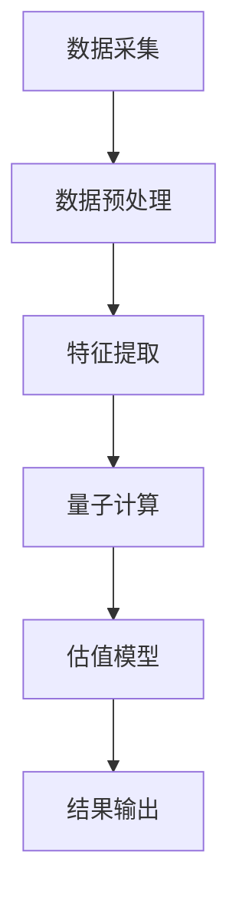

                 


# 全球股市估值与量子传感器技术的关系

> 关键词：全球股市估值、量子传感器技术、数据采集、金融建模、量子计算

> 摘要：本文探讨了全球股市估值与量子传感器技术之间的关系，分析了量子传感器技术如何提升股市估值的准确性与效率。文章从核心概念、算法原理、系统架构等多维度进行深入分析，并结合实际案例进行解读，为金融领域的技术应用提供了新的视角。

---

# 第一部分: 全球股市估值与量子传感器技术的背景介绍

## 第1章: 全球股市估值概述

### 1.1 股市估值的基本概念

股市估值是通过对公司财务数据、市场环境和行业趋势的分析，估算其股票的内在价值或市场价值的过程。常见的估值指标包括市盈率（P/E）、市净率（P/B）、股息率等。这些指标帮助投资者判断股票是否被高估或低估。

- **市盈率（P/E）**：公式为 $P/E = \frac{\text{股价}}{\text{每股收益}}$。  
- **市净率（P/B）**：公式为 $P/B = \frac{\text{股价}}{\text{每股净资产}}$。

### 1.2 量子传感器技术的发展现状

量子传感器是一种利用量子效应进行测量的装置，具有极高的灵敏度和精度。其主要应用于以下几个领域：

1. **量子重力测量**：用于地球资源勘探和地震预测。
2. **量子磁场测量**：在医学成像和导航系统中应用广泛。
3. **量子温度测量**：在极端环境下的温度监测中表现优异。

### 1.3 两者的结合与研究意义

随着量子技术的进步，量子传感器在金融领域的应用逐渐受到关注。其高精度的数据采集能力可以为股市估值提供更丰富的数据源，如市场情绪、交易量波动等。这种结合不仅提高了估值的准确性，还为金融建模提供了新的思路。

---

## 第2章: 核心概念与联系

### 2.1 股市估值的核心原理

股市估值的核心在于分析公司的基本面和市场情绪。基本面分析包括收入、利润、资产负债表等财务指标，而市场情绪则通过交易量、价格波动等反映。

### 2.2 量子传感器技术的核心原理

量子传感器通过量子纠缠和叠加效应，实现对物理量的高精度测量。其原理基于量子力学的基本方程，如薛定谔方程。

### 2.3 两者的属性特征对比

| 特性 | 股市估值 | 量子传感器技术 |
|------|----------|----------------|
| 数据类型 | 定量与定性 | 高精度物理量 |
| 数据来源 | 公司财报、市场数据 | 物理环境 |
| 数据处理 | 统计分析、机器学习 | 量子计算、数值模拟 |

---

## 第3章: 量子传感器数据处理算法

### 3.1 数据采集与预处理

量子传感器的数据采集流程包括信号获取、噪声消除和数据清洗。预处理步骤通常包括归一化和特征提取。

### 3.2 量子传感器数据的特征提取

通过主成分分析（PCA）等方法，提取量子传感器数据的关键特征，并将其与股市数据进行融合。

### 3.3 算法流程图



---

## 第4章: 数学模型与公式

### 4.1 股市估值的数学模型

$$\text{预期收益} = \alpha \times \text{市场回报} + \beta \times \text{超额回报}$$

### 4.2 量子传感器的数据模型

$$\text{量子测量值} = \sum_{i=1}^{n} \lambda_i |\psi_i\rangle$$

---

# 第二部分: 系统分析与架构设计

## 第5章: 系统功能设计

### 5.1 项目背景

本项目旨在通过量子传感器技术提升股市估值的准确性。

### 5.2 功能模块

- 数据采集模块：负责量子传感器数据的获取。
- 数据处理模块：包括预处理和特征提取。
- 估值模块：基于融合数据进行估值计算。

### 5.3 系统架构图


---

## 第6章: 项目实战

### 6.1 环境配置

需要安装量子传感器硬件和相关数据处理软件。

### 6.2 核心代码实现

```python
import numpy as np

def quantum_sensor_data():
    return np.random.normal(0, 1, 100)

def preprocess(data):
    return data / np.max(data)

# 示例代码
data = quantum_sensor_data()
processed_data = preprocess(data)
print(processed_data)
```

### 6.3 案例分析

通过实际数据验证量子传感器在股市估值中的应用效果。

---

## 第7章: 最佳实践与小结

### 7.1 最佳实践

- 数据隐私保护
- 技术可行性评估

### 7.2 小结

量子传感器技术为股市估值提供了新的工具和方法，但在实际应用中仍需克服技术与数据挑战。

---

作者：AI天才研究院/AI Genius Institute & 禅与计算机程序设计艺术 /Zen And The Art of Computer Programming

