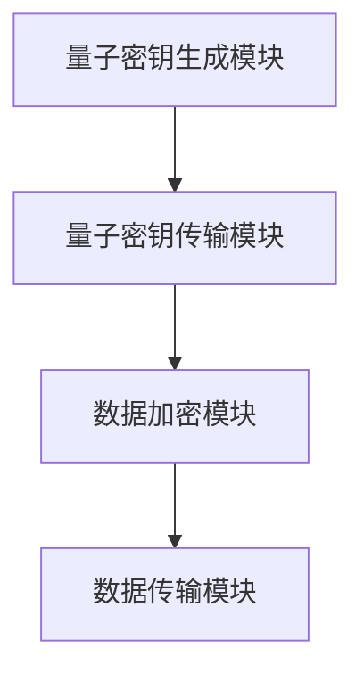

                 


# 全球股市估值与量子密钥分发在网络安全中的应用

> 关键词：全球股市估值、量子密钥分发、网络安全、金融数据保护、量子加密

> 摘要：本文探讨了全球股市估值的基本原理及其在金融领域的重要性，同时深入分析了量子密钥分发（QKD）技术的原理、应用及其在网络安全中的独特优势。结合全球股市数据的保护需求，本文详细阐述了如何将量子密钥分发技术应用于金融数据的加密与传输，构建了一个基于QKD的金融数据保护系统，并通过具体案例分析了该系统的实际应用效果。

---

# 第1章: 全球股市估值的基本概念与应用背景

## 1.1 全球股市估值的定义与计算方法

### 1.1.1 股市估值的基本概念
股市估值是指通过对公司财务数据的分析，评估其股票的内在价值，从而确定其市场价格是否合理。常用的估值指标包括市盈率（P/E）、市净率（P/B）和股息率等。

- **市盈率（P/E）**：公式为 $P/E = \frac{\text{股价}}{\text{每股收益}}$，反映了投资者对公司未来盈利能力的预期。
- **市净率（P/B）**：公式为 $P/B = \frac{\text{股价}}{\text{每股净资产}}$，适用于评估资产密集型行业的公司价值。
- **股息率**：公式为 $\text{股息率} = \frac{\text{每股股息}}{\text{股价}} \times 100\%$，反映了股票的分红能力。

### 1.1.2 股市估值的重要性
股市估值是投资者进行投资决策的重要依据。通过合理的估值方法，投资者可以识别被低估或高估的股票，从而制定有效的投资策略。

### 1.1.3 全球股市估值的特殊性
全球股市估值需要考虑各国经济政策、市场环境和法律法规等多重因素。例如，美国股市的市盈率通常较高，而新兴市场的市净率可能更具参考价值。

---

## 1.2 量子密钥分发的基本原理

### 1.2.1 量子密钥分发的定义
量子密钥分发是一种利用量子力学原理生成和分发加密密钥的技术。其核心思想是通过量子态的不可克隆性和不可测量性，确保密钥的安全传输。

### 1.2.2 量子密钥分发的关键特性
- **不可克隆性**：量子态无法被精确复制。
- **不可测量性**：任何对量子态的测量都会破坏其状态。
- **安全性**：即使在存在窃听的情况下，合法用户也能检测到潜在的安全威胁。

### 1.2.3 量子密钥分发的应用领域
量子密钥分发技术广泛应用于金融、军事和通信等领域，特别是在需要高度安全的数据传输场景中。

---

## 1.3 全球股市估值与量子密钥分发的关联

### 1.3.1 全球股市数据的安全需求
股市数据的泄露可能对投资者和市场造成重大损失。因此，确保股市数据的安全传输和存储至关重要。

### 1.3.2 量子密钥分发在金融数据保护中的作用
量子密钥分发可以提供一种安全的加密方式，用于保护股市数据在传输过程中的机密性和完整性。

### 1.3.3 两者的结合与应用前景
通过将量子密钥分发技术应用于股市估值系统，可以有效提升金融数据的安全性，为全球股市的稳定运行提供技术支持。

---

# 第2章: 量子密钥分发的核心原理

## 2.1 量子密钥分发的基本原理

### 2.1.1 量子密钥分发的数学模型
量子密钥分发的数学模型基于量子力学的基本原理，特别是纠缠态和叠加态的特性。

- **纠缠态**：两个或多个量子系统之间存在强烈的关联，例如 Bell 状态。
- **叠加态**：量子系统可以同时处于多个状态的叠加，例如 $\alpha|0\rangle + \beta|1\rangle$。

### 2.1.2 量子密钥分发的协议流程
量子密钥分发的典型协议流程包括密钥生成、传输和验证三个阶段。

- **密钥生成**：通过量子态的测量生成随机密钥。
- **密钥传输**：利用量子通信通道将密钥传输至接收方。
- **密钥验证**：通过经典通信确认密钥的完整性和安全性。

### 2.1.3 量子密钥分发的安全性保证
量子密钥分发的安全性基于量子力学的基本原理，确保任何窃听都会被及时发现。

---

## 2.2 量子密钥分发的主要技术

### 2.2.1 BB84协议
BB84协议是最早提出的量子密钥分发协议，基于量子态的极化和测量。

- **极化编码**：使用 $|0\rangle$ 和 $|1\rangle$ 表示两个不同的极化方向。
- **基的选择**：双方随机选择测量基，只有在相同基下才能正确测量量子态。

### 2.2.2 EPR协议
EPR协议基于爱因斯坦-波多尔斯基-罗森（EPR）悖论，利用纠缠态实现密钥分发。

- **纠缠态生成**：通过量子操作生成纠缠态。
- **基的选择**：双方选择相同的测量基，确保测量结果一致。

### 2.2.3 B92协议
B92协议是一种简化版的量子密钥分发协议，适用于二进制密钥的生成。

- **基的选择**：仅使用两种测量基，减少协议复杂性。

---

## 2.3 量子密钥分发的安全性分析

### 2.3.1 量子密钥分发的安全性保证
量子密钥分发的安全性基于量子力学的不可克隆性和不可测量性，确保任何窃听都会被发现。

### 2.3.2 量子密钥分发的潜在威胁
尽管量子密钥分发具有强大的安全性保证，但仍需注意以下潜在威胁：

- **侧信道攻击**：通过侧信道信息窃取密钥。
- **设备漏洞**：由于设备不完美，可能引入安全漏洞。

### 2.3.3 安全性与实际应用的平衡
在实际应用中，需要在安全性、成本和复杂性之间找到平衡点，确保量子密钥分发技术的实用性和可扩展性。

---

# 第3章: 全球股市估值的数学模型与算法

## 3.1 股市估值的基本指标

### 3.1.1 市盈率（P/E）
市盈率是衡量股票估值的重要指标，公式为 $P/E = \frac{\text{股价}}{\text{每股收益}}$。

### 3.1.2 市净率（P/B）
市净率是另一个常用的估值指标，公式为 $P/B = \frac{\text{股价}}{\text{每股净资产}}$。

### 3.1.3 股息率
股息率是衡量股票分红能力的重要指标，公式为 $\text{股息率} = \frac{\text{每股股息}}{\text{股价}} \times 100\%$。

---

## 3.2 时间序列分析在股市估值中的应用

### 3.2.1 ARIMA模型
ARIMA（自回归积分滑动平均模型）是一种常用的时序分析模型，适用于预测股票价格的短期趋势。

- **ARIMA模型公式**：$\phi(\theta) = 0$，其中 $\phi$ 和 $\theta$ 分别表示自回归和滑动平均的参数。

### 3.2.2 GARCH模型
GARCH（广义自回归条件异方差模型）适用于预测股票价格的波动性。

- **GARCH模型公式**：$h_t = \alpha_0 + \alpha_1 r_{t-1}^2 + \beta_1 h_{t-1}$。

### 3.2.3 LSTM神经网络
LSTM（长短期记忆网络）是一种深度学习模型，适用于处理股票价格的长期依赖关系。

- **LSTM结构**：包括输入门、遗忘门和输出门，公式分别为：
  - 输入门：$i_t = \sigma(W_i x_t + U_i h_{t-1} + b_i)$
  - 遗忘门：$f_t = \sigma(W_f x_t + U_f h_{t-1} + b_f)$
  - 输出门：$o_t = \sigma(W_o x_t + U_o h_{t-1} + b_o)$

---

## 3.3 股市估值的预测算法

### 3.3.1 线性回归模型
线性回归模型适用于预测股票价格的线性关系。

- **线性回归公式**：$y = \beta_0 + \beta_1 x + \epsilon$，其中 $\epsilon$ 为误差项。

### 3.3.2 支持向量机（SVM）
SVM适用于分类和回归任务，可用于股票价格的分类预测。

- **SVM回归公式**：$y = \text{sign}(w \cdot x + b)$，其中 $w$ 和 $b$ 为模型参数。

### 3.3.3 随机森林
随机森林是一种基于树的集成学习方法，适用于股票价格的非线性预测。

---

# 第4章: 量子密钥分发在金融数据保护中的应用

## 4.1 金融数据保护的需求

### 4.1.1 金融数据的敏感性
金融数据的泄露可能对投资者和市场造成重大损失，因此需要高度安全的数据保护措施。

### 4.1.2 金融数据保护的挑战
金融数据保护面临的主要挑战包括数据量大、传输距离远和安全性要求高等。

---

## 4.2 量子密钥分发在金融数据保护中的应用

### 4.2.1 量子密钥分发的金融数据保护系统架构
- **量子密钥生成**：基于量子态的特性生成随机密钥。
- **密钥传输**：利用量子通信通道将密钥传输至接收方。
- **数据加密**：使用量子密钥对敏感数据进行加密。

### 4.2.2 量子密钥分发的金融数据保护流程
1. **密钥生成**：通过量子态的测量生成随机密钥。
2. **密钥传输**：利用量子通信通道将密钥传输至接收方。
3. **数据加密**：使用量子密钥对敏感数据进行加密。
4. **数据解密**：接收方使用密钥对加密数据进行解密。

---

## 4.3 量子密钥分发的实际应用案例

### 4.3.1 案例背景
假设某全球性金融机构需要保护其股市估值数据的安全性，选择采用量子密钥分发技术进行数据加密。

### 4.3.2 系统设计
- **量子密钥生成**：使用BB84协议生成随机密钥。
- **密钥传输**：通过量子通信通道将密钥传输至接收方。
- **数据加密**：使用AES加密算法对股市估值数据进行加密。

### 4.3.3 应用效果
通过量子密钥分发技术，该金融机构成功实现了股市估值数据的安全传输，有效防止了数据泄露和篡改。

---

# 第5章: 系统分析与架构设计

## 5.1 问题场景介绍

### 5.1.1 问题背景
随着全球股市的快速发展，金融数据的安全性问题日益突出，传统的加密技术已难以满足需求。

### 5.1.2 问题描述
如何利用量子密钥分发技术实现金融数据的安全传输，是当前亟待解决的问题。

### 5.1.3 问题解决
通过量子密钥分发技术，可以有效提升金融数据的安全性，确保数据的机密性和完整性。

---

## 5.2 系统功能设计

### 5.2.1 系统功能概述
- **密钥生成**：基于量子态的特性生成随机密钥。
- **密钥传输**：利用量子通信通道将密钥传输至接收方。
- **数据加密**：使用量子密钥对敏感数据进行加密。

### 5.2.2 系统功能模块
- **密钥生成模块**：负责生成量子密钥。
- **密钥传输模块**：负责传输量子密钥。
- **数据加密模块**：负责对数据进行加密。

---

## 5.3 系统架构设计

### 5.3.1 系统架构概述
- **量子密钥分发模块**：负责生成和传输量子密钥。
- **数据加密模块**：负责对数据进行加密。
- **数据传输模块**：负责传输加密后的数据。

### 5.3.2 系统架构图


---

## 5.4 系统接口设计

### 5.4.1 系统接口概述
- **密钥生成接口**：用于生成量子密钥。
- **密钥传输接口**：用于传输量子密钥。
- **数据加密接口**：用于对数据进行加密。

### 5.4.2 系统接口描述
- **密钥生成接口**：调用量子密钥生成模块生成随机密钥。
- **密钥传输接口**：通过量子通信通道将密钥传输至接收方。
- **数据加密接口**：使用生成的密钥对数据进行加密。

---

## 5.5 系统交互设计

### 5.5.1 系统交互流程
1. **密钥生成**：量子密钥生成模块生成随机密钥。
2. **密钥传输**：量子密钥传输模块将密钥传输至接收方。
3. **数据加密**：数据加密模块使用生成的密钥对数据进行加密。
4. **数据传输**：数据传输模块将加密后的数据传输至目标系统。

### 5.5.2 系统交互图
```mermaid
sequenceDiagram
    participant A as 量子密钥生成模块
    participant B as 量子密钥传输模块
    participant C as 数据加密模块
    participant D as 数据传输模块
    A -> B: 生成随机密钥
    B -> C: 传输密钥
    C -> D: 使用密钥加密数据
    D -> end: 传输加密数据
```

---

# 第6章: 项目实战

## 6.1 环境安装

### 6.1.1 安装量子密钥分发系统
- **量子密钥生成模块**：安装量子密钥生成软件，例如QKD-Server。
- **量子密钥传输模块**：安装量子通信通道，例如光纤通信设备。
- **数据加密模块**：安装数据加密软件，例如AES加密工具。

### 6.1.2 安装数据传输模块
- **数据传输模块**：安装数据传输软件，例如TCP/IP传输协议。

---

## 6.2 系统核心实现

### 6.2.1 量子密钥生成代码
```python
import random

def generate_quantum_key(length):
    key = [random.choice([0, 1]) for _ in range(length)]
    return key
```

### 6.2.2 量子密钥传输代码
```python
import socket

def transmit_quantum_key(key, host, port):
    with socket.socket(socket.AF_INET, socket.SOCK_STREAM) as s:
        s.connect((host, port))
        s.sendall(key)
```

### 6.2.3 数据加密代码
```python
from cryptography.hazmat.primitives.ciphers import Cipher, algorithms, modes
from cryptography.hazmat.primitives.asymmetric import padding

def encrypt_data(data, key):
    cipher = Cipher(algorithms.AES(128), modes.CBC())
    encryptor = cipher.new_encryptor(key)
    encrypted_data = encryptor.update(data) + encryptor.finalize()
    return encrypted_data
```

---

## 6.3 代码应用解读

### 6.3.1 量子密钥生成代码解读
- **代码功能**：生成指定长度的随机量子密钥。
- **代码实现**：使用Python的random模块生成随机数。

### 6.3.2 量子密钥传输代码解读
- **代码功能**：通过TCP/IP协议将量子密钥传输至接收方。
- **代码实现**：使用socket模块实现数据传输。

### 6.3.3 数据加密代码解读
- **代码功能**：使用AES算法对数据进行加密。
- **代码实现**：调用cryptography库的加密函数。

---

## 6.4 实际案例分析

### 6.4.1 案例背景
某全球性金融机构需要保护其股市估值数据的安全性，选择采用量子密钥分发技术进行数据加密。

### 6.4.2 系统实现
- **密钥生成**：生成随机量子密钥。
- **密钥传输**：通过量子通信通道将密钥传输至接收方。
- **数据加密**：使用生成的密钥对股市估值数据进行加密。

### 6.4.3 应用效果
通过量子密钥分发技术，该金融机构成功实现了股市估值数据的安全传输，有效防止了数据泄露和篡改。

---

# 第7章: 总结与展望

## 7.1 总结

### 7.1.1 全球股市估值的核心内容
全球股市估值是投资者进行投资决策的重要依据，常用的估值指标包括市盈率、市净率和股息率等。

### 7.1.2 量子密钥分发的核心内容
量子密钥分发是一种利用量子力学原理生成和分发加密密钥的技术，具有强大的安全性保证。

### 7.1.3 全球股市估值与量子密钥分发的结合
通过将量子密钥分发技术应用于全球股市估值系统，可以有效提升金融数据的安全性，为全球股市的稳定运行提供技术支持。

---

## 7.2 展望

### 7.2.1 量子密钥分发技术的发展前景
随着量子计算技术的不断发展，量子密钥分发技术将在更多领域得到应用，特别是在金融、军事和通信等领域。

### 7.2.2 全球股市估值的未来趋势
随着人工智能和大数据技术的不断发展，全球股市估值将更加精准和智能化，为投资者提供更有力的决策支持。

---

# 作者信息

作者：AI天才研究院/AI Genius Institute & 禅与计算机程序设计艺术/Zen And The Art of Computer Programming

---

**本文由AI天才研究院（AI Genius Institute）和“禅与计算机程序设计艺术”（Zen And The Art of Computer Programming）联合撰写，转载请注明出处。**

