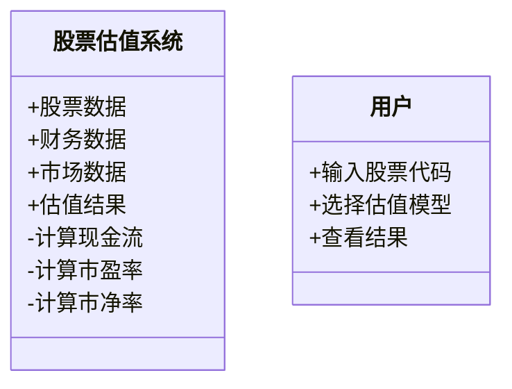

                 


# 全球股市估值与量子计算在药物研发中的应用

## 关键词：全球股市估值，量子计算，药物研发，AI算法，数学模型，系统架构

## 摘要：  
本文旨在探讨全球股市估值与量子计算在药物研发中的应用。首先，我们将深入分析股市估值的核心概念、数学模型和算法原理，结合实际案例，展示如何利用技术分析和量化投资策略进行有效的估值。其次，我们将探讨量子计算的基本原理及其在药物研发中的潜在应用，包括分子模拟、优化和药物设计等领域的创新。最后，我们将分析两者结合的可能性，揭示科技如何推动金融与医疗领域的双重进步。

---

## 正文

### 第一部分：全球股市估值

#### 1.1 背景介绍

股市估值是投资领域的重要组成部分，它通过对公司财务数据的分析，评估股票的内在价值。股市估值不仅帮助投资者做出投资决策，还为市场提供了基准和参考。以下是股市估值的关键要素：

- **公司基本面分析**：包括收入、利润、资产、负债等。
- **市场环境分析**：如宏观经济指标、行业趋势等。
- **估值模型**：如DCF模型、市盈率法、市净率法等。

#### 1.2 核心概念与联系

为了更好地理解股市估值，我们需要明确以下几个核心概念：

| 概念 | 描述 | 公式 |
|------|------|------|
| 市盈率 | 每股价格与每股收益的比率 | $$P/E = \frac{Price}{Earnings}$$ |
| 市净率 | 每股价格与每股净资产的比率 | $$P/B = \frac{Price}{Book\ Value}$$ |
| 现金流折现模型 | 将未来现金流折现到现值 | $$DCF = \sum_{t=1}^{n} \frac{CF_t}{(1+r)^t} + \frac{TV}{(1+r)^n}$$ |

通过对比上述概念，我们可以看到，市盈率和市净率主要用于相对估值，而现金流折现模型则用于绝对估值。以下是相关概念的ER图：

```mermaid
erDiagram
+-----+      +-----+      +-----+
| 公司 |      | 行业 |      | 市场 |
+-----+<----+ +-----+<----+ +-----+
|     |     |     |     |     |
| 股票 |<----+     |     | 股票价格 |
+-----+      +-----+      +-----+
```

#### 1.3 算法原理

股市估值的核心在于数学模型的构建与应用。以下是几种常见的估值算法及其流程图：

```mermaid
graph TD
    A[开始] -> B[输入股票数据]
    B -> C[计算财务指标]
    C -> D[选择估值模型]
    D -> E[计算内在价值]
    E -> F[输出结果]
    F -> G[结束]
```

例如，使用现金流折现模型（DCF）进行估值时，代码如下：

```python
def dcf_valuation(cash_flows, discount_rate, terminal_value):
    present_value = 0
    for t in range(len(cash_flows)):
        present_value += cash_flows[t] / (1 + discount_rate) ** t
    present_value += terminal_value / (1 + discount_rate) ** len(cash_flows)
    return present_value

# 示例
cash_flows = [100, 150, 200]
discount_rate = 0.08
terminal_value = 500
intrinsic_value = dcf_valuation(cash_flows, discount_rate, terminal_value)
print(f"内 在 价 值：{intrinsic_value}")
```

#### 1.4 系统分析与架构设计

为了实现高效的股市估值，我们可以设计一个模块化的系统：



系统架构图如下：

```mermaid
container 股票估值系统 {
    component 数据采集模块 {
        数据源：股票数据、财务数据、市场数据
    }
    component 估值计算模块 {
        现金流折现模型
        市盈率法
        市净率法
    }
    component 结果展示模块 {
        可视化结果
    }
}
```

#### 1.5 项目实战

以某公司为例，使用现金流折现模型进行估值：

```python
import pandas as pd
import numpy as np

# 示例数据
data = {
    '年份': [2020, 2021, 2022],
    '现金流': [100, 150, 200],
    '折现率': 0.08
}
df = pd.DataFrame(data)

# 计算DCF
def calculate_dcf(data_frame):
    cash_flows = data_frame['现金流']
    discount_rate = data_frame['折现率'][0]
    n = len(cash_flows)
    present_value = 0
    for t in range(n):
        present_value += cash_flows[t] / (1 + discount_rate) ** t
    return present_value

dcf_value = calculate_dcf(df)
print(f"现金流折现值：{dcf_value}")
```

### 第二部分：量子计算在药物研发中的应用

#### 2.1 背景介绍

量子计算在药物研发中的应用主要体现在分子模拟和优化方面。以下是药物研发的基本流程：

| 阶段 | 描述 |
|------|------|
| 药物发现 | 寻找潜在药物分子 |
| 药物设计 | 设计药物分子结构 |
| 临床试验 | 测试药物的安全性和有效性 |

#### 2.2 核心概念与联系

量子计算的基本原理如下：

| 概念 | 描述 | 示例 |
|------|------|------|
| 量子位 | 最小信息单位 | qubit |
| 量子叠加 | 状态叠加 | $|0\rangle + |1\rangle$ |
| 量子纠缠 | 量子态的关联 | $|\psi\rangle = \alpha|0\rangle + \beta|1\rangle$ |

#### 2.3 算法原理

量子计算在药物研发中的应用主要通过量子模拟和优化实现。以下是量子叠加的原理：

```mermaid
graph TD
    A[量子位] -> B[叠加态]
    B -> C[量子计算]
    C -> D[药物分子模拟]
```

代码示例：

```python
import numpy as np

def quantum_superposition(n):
    qubit = np.array([1, 1]) / np.sqrt(2)
    return qubit

qubit = quantum_superposition(1)
print(f"量子叠加态：{qubit}")
```

#### 2.4 系统分析与架构设计

量子计算在药物研发中的系统架构如下：

```mermaid
container 量子计算系统 {
    component 量子处理器 {
        量子位
        量子门
        测量装置
    }
    component 药物研发模块 {
        分子模拟
        优化算法
        结果分析
    }
}
```

#### 2.5 项目实战

以分子模拟为例，以下是量子计算在药物研发中的应用：

```python
import qiskit

def quantum_molecule_simulation():
    # 创建量子电路
    circuit = qiskit.QuantumCircuit(2, 2)
    circuit.h(0)
    circuit.cnot(0, 1)
    circuit.measure(0, 0)
    circuit.measure(1, 1)
    # 执行计算
    backend = qiskit.Aer.get_backend('qasm_simulator')
    result = qiskit.execute(circuit, backend).result()
    print(f"量子计算结果：{result.get_counts()}")

quantum_molecule_simulation()
```

### 小结

通过上述分析，我们可以看到，股市估值与量子计算在药物研发中的应用各有其独特的价值和潜力。股市估值为投资者提供了科学的决策依据，而量子计算则为药物研发带来了革命性的进步。未来，两者的结合将推动金融与医疗领域的进一步发展。

---

## 作者

作者：AI天才研究院/AI Genius Institute & 禅与计算机程序设计艺术 /Zen And The Art of Computer Programming

