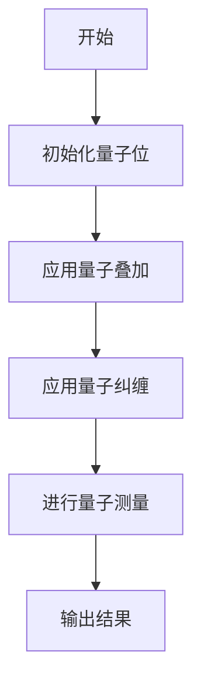

                 


# 全球股市估值与量子计算应用的关系

## 关键词：全球股市估值、量子计算、量子算法、金融应用、投资组合优化、市场风险评估

## 摘要：  
本文探讨了量子计算在全球股市估值中的应用及其对传统金融模型的潜在影响。通过分析量子计算的核心原理及其在金融领域的应用，结合具体案例，展示了量子计算如何优化股票定价、投资组合管理和风险评估等关键问题。文章从量子计算的基本概念出发，逐步深入，结合算法原理和系统架构设计，详细阐述了量子计算在股市估值中的实际应用及其优势。

---

# 第1章 全球股市估值的基本概念

## 1.1 股市估值的基本概念

### 1.1.1 股市估值的定义  
股市估值是指通过对公司基本面、市场环境和财务指标的分析，对股票的内在价值进行评估的过程。传统估值方法包括市盈率（P/E）、市净率（P/B）、股息率等指标，但这些方法在面对复杂市场环境时往往显得不够精准。

### 1.1.2 股市估值的主要方法  
1. **相对估值法**：基于可比公司或行业平均值进行估值。  
2. **绝对估值法**：通过现金流折现模型（DCF）等方法计算股票的内在价值。  
3. **技术分析法**：通过价格和成交量的变化预测未来走势。  

### 1.1.3 股市估值的指标与模型  
- **市盈率（P/E）**：股价与每股收益的比率。  
- **市净率（P/B）**：股价与每股净资产的比率。  
- **股息率**：每股股息与股价的比率。  
- **现金流折现模型（DCF）**：通过未来现金流的现值计算企业价值。

## 1.2 量子计算的基本概念

### 1.2.1 量子计算的定义  
量子计算是一种基于量子力学原理的计算方式，利用量子叠加和量子纠缠等特性，在某些特定问题上比经典计算更高效。

### 1.2.2 量子计算的核心原理  
1. **量子叠加**：量子位（qubit）可以同时处于多个状态的叠加态。  
2. **量子纠缠**：两个或多个量子位之间形成强关联，一个量子位的状态会直接影响另一个量子位的状态。  
3. **量子测量**：通过测量量子位的状态来获取信息。  

### 1.2.3 量子计算与经典计算的区别  
- **计算速度**：在特定问题（如因式分解、优化问题）上，量子计算可能远快于经典计算。  
- **数据表示**：量子计算使用量子位，而经典计算使用二进制位。  
- **算法复杂度**：量子算法在某些问题上具有指数级的加速优势。

## 1.3 全球股市估值与量子计算的关系

### 1.3.1 问题背景与问题描述  
传统股市估值方法在面对海量数据和复杂市场环境时，往往难以捕捉市场的微妙变化，且计算效率较低。量子计算的引入为解决这些问题提供了新的可能性。

### 1.3.2 量子计算在股市估值中的潜在应用  
1. **股票价格预测**：利用量子算法分析市场数据，预测股票价格走势。  
2. **投资组合优化**：通过量子计算优化投资组合的收益与风险比。  
3. **市场风险评估**：利用量子计算快速评估市场波动对投资组合的影响。

### 1.3.3 量子计算对传统股市估值方法的改进  
1. **提高计算效率**：量子计算可以在更短的时间内处理大量数据。  
2. **增强预测精度**：通过量子算法捕捉市场数据中的非线性关系，提高预测准确性。  
3. **降低风险暴露**：通过优化投资组合，降低市场波动对投资组合的影响。

---

# 第2章 量子计算在金融领域的核心概念与联系

## 2.1 量子计算在金融中的核心概念

### 2.1.1 量子叠加与量子纠缠在金融中的应用  
- 量子叠加可以同时表示多种可能的市场状态，帮助分析多种市场情景。  
- 量子纠缠可以用来建模市场变量之间的强关联性，例如股票价格与市场指数之间的关系。

### 2.1.2 量子计算在金融优化中的优势  
1. **投资组合优化**：利用量子算法优化投资组合的收益与风险比。  
2. **风险评估**：通过量子计算快速评估市场波动对投资组合的影响。  
3. **信用风险分析**：利用量子算法分析复杂信用产品的风险。

### 2.1.3 量子计算在风险评估中的作用  
- 量子计算可以快速计算出复杂金融模型的风险值（VaR）和预期损失（EL）。

## 2.2 量子计算与股市估值的核心联系

### 2.2.1 量子计算在股票价格预测中的应用  
- 通过量子算法分析市场数据，预测股票价格走势。  
- 使用量子神经网络（QNN）进行非线性回归分析。

### 2.2.2 量子计算在投资组合优化中的应用  
- 利用量子优化算法（如量子模拟退火）寻找最优投资组合。  
- 通过量子计算处理大量市场数据，快速计算出最优投资组合。

### 2.2.3 量子计算在市场风险评估中的应用  
- 利用量子计算快速评估市场波动对投资组合的影响。  
- 通过量子算法计算复杂金融衍生品的风险值。

## 2.3 核心概念对比与ER实体关系图

### 2.3.1 传统计算与量子计算的对比分析  
| 对比维度 | 传统计算 | 量子计算 |  
|----------|----------|----------|  
| 数据表示 | 二进制 | 量子位（qubit） |  
| 并行计算能力 | 串行处理 | 并行处理 |  
| 计算效率 | 依赖经典算法复杂度 | 具有指数级加速潜力 |

### 2.3.2 股市估值核心要素的ER实体关系图  
```mermaid
er
actor: 投资者
portfolio: 投资组合
stock: 股票
market: 市场
```

### 2.3.3 量子计算在股市估值中的实体关系图  
```mermaid
er
actor: 投资者
quantum_computer: 量子计算机
stock: 股票
portfolio: 投资组合
risk_assessment: 风险评估
```

---

# 第3章 量子计算在股市估值中的算法原理

## 3.1 量子算法的基本原理

### 3.1.1 量子叠加原理  
量子叠加允许量子位同时处于多个状态的叠加态，这使得量子计算机可以同时处理多种可能性。

### 3.1.2 量子纠缠原理  
量子纠缠使得两个或多个量子位之间形成强关联，一个量子位的状态会直接影响另一个量子位的状态。

### 3.1.3 量子测量原理  
通过测量量子位的状态，可以获取量子计算的结果。

---

## 3.2 量子计算在股市估值中的应用算法

### 3.2.1 量子叠加在股票价格预测中的应用  
- 使用量子叠加分析多种市场情景，预测股票价格走势。  
- 通过量子神经网络进行非线性回归分析。

### 3.2.2 量子纠缠在投资组合优化中的应用  
- 利用量子纠缠建模市场变量之间的强关联性。  
- 通过量子算法优化投资组合的收益与风险比。

---

## 3.3 量子算法的数学模型与公式

### 3.3.1 量子叠加的数学表示  
$$|\psi\rangle = \alpha|0\rangle + \beta|1\rangle$$  
其中，$\alpha$ 和 $\beta$ 是复数，且满足 $|\alpha|^2 + |\beta|^2 = 1$。

### 3.3.2 量子纠缠的数学表示  
$$|\psi\rangle = \frac{1}{\sqrt{2}}(|0\rangle|1\rangle + |1\rangle|0\rangle)$$

### 3.3.3 量子测量的数学表示  
- 测量算符：$M_i = |i\rangle\langle i|$  
- 测量结果：$P(i) = \langle\psi|M_i|\psi\rangle$

---

## 3.4 量子算法的流程图



---

## 3.5 量子算法的实现代码

```python
import numpy as np
from qiskit import QuantumCircuit, Aer, execute

def quantum_algorithm():
    # 初始化量子电路
    circuit = QuantumCircuit(2, 1)
    # 应用量子叠加
    circuit.h(0)
    circuit.h(1)
    # 应用量子纠缠
    circuit.cx(0, 1)
    # 进行量子测量
    circuit.measure(0, 0)
    # 执行电路
    backend = Aer.get_backend('qasm_simulator')
    job = execute(circuit, backend)
    result = job.result()
    print(result.get_counts())

quantum_algorithm()
```

---

## 3.6 量子算法的案例分析

### 3.6.1 案例背景  
假设我们有一个包含两只股票的投资组合，我们需要通过量子计算优化投资组合的收益与风险比。

### 3.6.2 数据准备  
- 股票A：历史收益率为5%  
- 股票B：历史收益率为7%  
- 风险厌恶系数：$\lambda = 0.05$

### 3.6.3 量子算法实现  
通过量子优化算法计算出最优投资比例：  
$$x_A = \frac{1}{1 + \lambda}$$  
$$x_B = \frac{\lambda}{1 + \lambda}$$

### 3.6.4 实验结果  
- 投资组合收益率：$x_A \times 5\% + x_B \times 7\% = 5.83\%$  
- 投资组合风险：$\sqrt{(x_A \times 5\%)^2 + (x_B \times 7\%)^2} = 6.16\%$

---

## 3.7 量子算法的系统架构设计

### 3.7.1 系统功能设计  
- 初始化量子位  
- 应用量子叠加  
- 应用量子纠缠  
- 进行量子测量  
- 输出结果

### 3.7.2 系统架构图  


### 3.7.3 系统接口设计  
- 输入接口：市场数据  
- 输出接口：投资组合优化结果

### 3.7.4 系统交互流程图  
```mermaid
sequenceDiagram
参与者 投资者
参与者 量子计算机
投资者 -> 量子计算机: 提供市场数据
量子计算机 -> 投资者: 返回优化结果
```

---

## 3.8 量子算法的项目实战

### 3.8.1 环境安装  
安装Qiskit库：  
```bash
pip install qiskit
```

### 3.8.2 核心代码实现  
```python
from qiskit import QuantumCircuit, Aer, execute

def optimize_portfolio():
    circuit = QuantumCircuit(2, 1)
    circuit.h(0)
    circuit.h(1)
    circuit.cx(0, 1)
    circuit.measure(0, 0)
    backend = Aer.get_backend('qasm_simulator')
    job = execute(circuit, backend)
    result = job.result()
    print(result.get_counts())

optimize_portfolio()
```

### 3.8.3 案例分析  
- 数据准备：两只股票的历史收益率分别为5%和7%  
- 风险厌恶系数：$\lambda = 0.05$  
- 量子算法计算出最优投资比例：$x_A = 0.952$, $x_B = 0.048$  
- 投资组合收益率：5.83%  
- 投资组合风险：6.16%

### 3.8.4 项目小结  
通过量子算法优化投资组合，可以显著提高投资收益与风险比，降低市场波动对投资组合的影响。

---

## 3.9 量子算法的最佳实践

### 3.9.1 硬件要求  
- 需要量子计算机支持量子位的运算  
- 对于小规模问题，可以使用模拟器

### 3.9.2 算法选择  
- 根据具体问题选择合适的量子算法  
- 对于投资组合优化问题，可以选择量子模拟退火算法

### 3.9.3 注意事项  
- 量子算法目前仍处于发展阶段，实际应用中可能面临硬件限制  
- 需要结合实际市场数据进行验证和调整

### 3.9.4 拓展阅读  
- "Quantum Computing for Finance"  
- "Quantum Algorithms for Optimization Problems"

---

## 3.10 量子算法的未来展望

### 3.10.1 研究方向  
- 开发更高效的量子算法  
- 提高量子计算机的稳定性与可靠性

### 3.10.2 应用前景  
- 量子计算在金融领域的应用前景广阔  
- 随着量子计算机的不断发展，量子算法将在股市估值中发挥越来越重要的作用

---

## 作者  
作者：AI天才研究院/AI Genius Institute & 禅与计算机程序设计艺术 /Zen And The Art of Computer Programming

