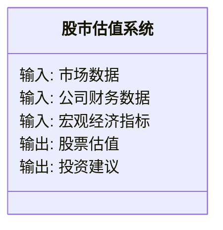
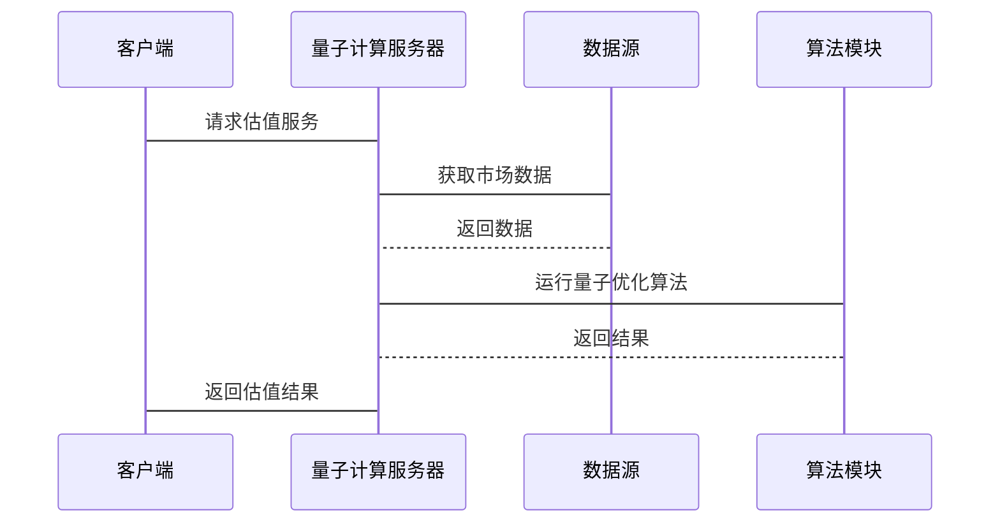

                 


# 全球股市估值与量子计算技术的潜在关联

> **关键词**: 量子计算, 股市估值, 优化算法, 金融建模, 风险评估

> **摘要**: 本文探讨了全球股市估值与量子计算技术之间的潜在关联，分析了量子计算如何优化和提升股市估值的准确性与效率。通过介绍量子计算的基本原理、算法及其在金融领域的应用，本文展示了如何利用量子计算技术解决传统金融模型的局限性，实现更精准的市场预测与投资决策。

---

# 第1章: 背景介绍与核心概念

## 1.1 全球股市估值的基本概念

### 1.1.1 股市估值的定义与重要性

股市估值是通过对公司财务数据和市场信息的分析，估算其股票的内在价值。它是投资者做出投资决策的重要依据。准确的估值可以帮助投资者识别被低估或高估的股票，从而优化投资组合。

### 1.1.2 全球股市估值的现状与挑战

传统的股市估值方法依赖于市盈率、市净率和现金流折现法等指标。然而，这些方法在面对海量数据和复杂市场波动时显得力不从心。数据量的爆炸式增长和市场的不确定性使得传统方法难以提供实时、精准的估值。

### 1.1.3 量子计算技术的定义与特点

量子计算利用量子位（qubit）和量子叠加、量子纠缠等特性，能够在某些特定问题上远超经典计算机的计算能力。其并行计算和强大的优化能力为解决复杂金融问题提供了新的可能性。

## 1.2 问题背景与研究意义

### 1.2.1 股市估值的传统方法与局限性

传统估值方法依赖于简化假设和线性模型，难以捕捉市场的非线性关系和复杂动态。此外，传统方法计算速度慢，难以应对高频交易和实时数据处理的需求。

### 1.2.2 量子计算技术的潜在优势

量子计算能够在优化、模拟和机器学习等领域提供指数级的计算速度提升。这些优势使其在金融建模、风险管理等领域具有广阔的应用前景。

### 1.2.3 两者的结合对金融行业的深远影响

将量子计算应用于股市估值，不仅能够提高计算效率，还能增强模型的准确性和鲁棒性。这种结合有望彻底改变金融行业的分析方式和投资策略。

## 1.3 核心概念与关联性分析

### 1.3.1 股市估值的核心要素

股市估值的核心要素包括公司财务数据、市场情绪、宏观经济指标等。这些要素的复杂性和相互作用使得传统方法难以准确捕捉。

### 1.3.2 量子计算在金融领域的应用潜力

量子计算在优化算法、机器学习和模拟等方面具有独特优势，能够帮助处理复杂的金融数据和模型。

### 1.3.3 两者的结合如何优化金融分析

通过结合量子计算的优化能力和股市估值的多维度数据，可以构建更精确、实时的估值模型，提高投资决策的科学性和准确性。

---

# 第2章: 量子计算的基本原理

## 2.1 量子位与量子态

### 2.1.1 量子位的定义与特性

量子位（qubit）是量子计算的基本单位，与经典计算机中的二进制位不同，量子位可以同时处于多个状态的叠加态。

### 2.1.2 量子叠加原理

量子叠加允许量子位同时处于多个状态，这种特性使得量子计算机能够并行处理大量可能性。

### 2.1.3 量子纠缠现象

量子纠缠是指两个或多个量子位之间形成的一种特殊关联，这种关联使得对其中一个量子位的测量会立即影响另一个量子位的状态。

## 2.2 量子算法与经典算法的对比

### 2.2.1 量子算法的基本原理

量子算法利用量子叠加和纠缠等特性，设计出能够在特定问题上远超经典算法效率的解决方案。

### 2.2.2 量子算法与经典算法的性能差异

在某些复杂问题上，如大数分解和优化问题，量子算法的计算速度可以比经典算法快得多。

### 2.2.3 量子算法在金融建模中的应用

量子算法在金融建模中的应用包括优化投资组合、风险管理、金融模拟等。

## 2.3 量子计算在金融领域的潜在应用

### 2.3.1 量子优化算法

量子优化算法可以用于寻找最优的投资组合，降低风险并提高收益。

### 2.3.2 量子机器学习

量子机器学习算法能够处理复杂的金融数据，帮助发现隐藏的模式和趋势。

### 2.3.3 量子模拟与风险评估

量子模拟能够更准确地评估市场的波动性和风险，为投资决策提供支持。

---

# 第3章: 全球股市估值的传统方法与挑战

## 3.1 股市估值的传统方法

### 3.1.1 市盈率法

市盈率法通过比较股票的市价与每股收益，评估股票的价值。

### 3.1.2 市净率法

市净率法通过比较股票的市价与每股净资产，评估股票的价值。

### 3.1.3 现金流折现法

现金流折现法通过将未来现金流折现，估算股票的内在价值。

## 3.2 传统方法的局限性

### 3.2.1 数据处理能力的限制

传统方法在处理海量数据时效率低下，难以满足实时分析的需求。

### 3.2.2 模型假设的简化与偏差

传统模型通常基于简化假设，难以捕捉市场的复杂动态。

### 3.2.3 市场波动性对估值的影响

市场波动性使得传统估值方法的结果不够稳定，难以提供可靠的参考。

## 3.3 量子计算如何弥补传统方法的不足

### 3.3.1 提高计算速度与精度

量子计算能够在短时间内处理大量数据，提高估值的准确性和效率。

### 3.3.2 处理海量数据的能力

量子计算能够高效处理复杂的数据关系，帮助发现隐藏的市场规律。

### 3.3.3 优化复杂模型的能力

量子计算能够优化复杂的金融模型，提高估值的精度和鲁棒性。

---

# 第4章: 量子计算优化股市估值的核心原理

## 4.1 量子优化算法在股市估值中的应用

### 4.1.1 量子退火算法

量子退火算法是一种用于寻找全局最优的量子优化算法，适用于投资组合优化等问题。

### 4.1.2 量子模拟退火算法

量子模拟退火算法结合了量子叠加和经典模拟退火的思想，能够更有效地找到最优解。

### 4.1.3 量子遗传算法

量子遗传算法利用量子叠加和纠缠特性，改进传统遗传算法的性能，适用于复杂优化问题。

## 4.2 量子机器学习在金融预测中的应用

### 4.2.1 量子支持向量机

量子支持向量机利用量子计算的优势，提高分类和预测的效率和准确性。

### 4.2.2 量子神经网络

量子神经网络结合量子计算和深度学习，能够处理复杂的金融数据，提高预测能力。

### 4.2.3 量子聚类算法

量子聚类算法通过量子叠加和纠缠，帮助发现数据中的潜在模式和群集。

## 4.3 量子计算在风险评估中的应用

### 4.3.1 量子风险评估模型

量子风险评估模型能够更准确地评估市场风险，帮助投资者制定更稳健的投资策略。

### 4.3.2 量子蒙特卡洛模拟

量子蒙特卡洛模拟利用量子计算的优势，提高风险模拟的效率和准确性。

### 4.3.3 量子信用评分模型

量子信用评分模型能够更精准地评估客户的信用风险，帮助金融机构做出更明智的信贷决策。

---

# 第5章: 量子计算与股市估值的结合应用

## 5.1 量子金融模型的构建

### 5.1.1 模型构建的基本原理

量子金融模型结合量子计算的优势，构建更精确的金融分析框架。

### 5.1.2 模型参数的量子优化

通过量子优化算法，模型参数能够被更高效地优化，提高估值的准确性。

### 5.1.3 模型的验证与测试

量子金融模型需要通过实际数据的验证和测试，确保其稳定性和可靠性。

## 5.2 量子计算在实时估值中的应用

### 5.2.1 实时数据处理能力

量子计算能够快速处理实时市场数据，提供即时的估值结果。

### 5.2.2 实时风险评估

量子计算帮助实时评估市场风险，支持动态调整投资策略。

### 5.2.3 实时交易策略优化

量子计算能够优化实时交易策略，提高交易的效率和收益。

## 5.3 量子计算在长期投资策略中的应用

### 5.3.1 长期趋势预测

量子计算能够分析长期市场趋势，帮助制定更科学的投资策略。

### 5.3.2 长期风险控制

通过量子计算，可以更准确地评估长期投资的风险，制定有效的风险控制措施。

### 5.3.3 长期收益优化

量子计算帮助优化长期投资组合，提高整体收益。

---

# 第6章: 系统分析与架构设计方案

## 6.1 问题场景介绍

在高频交易和海量数据的背景下，传统估值方法难以满足实时、精准的需求。量子计算的应用为解决这一问题提供了新的可能性。

## 6.2 项目介绍

本项目旨在开发一个基于量子计算的股市估值系统，通过优化算法和量子机器学习，提高估值的准确性和效率。

## 6.3 系统功能设计

### 6.3.1 领域模型



### 6.3.2 系统架构设计


### 6.3.3 系统接口设计

系统接口包括数据输入接口、算法调用接口和结果输出接口。

### 6.3.4 系统交互设计



---

# 第7章: 项目实战

## 7.1 环境安装

### 7.1.1 安装量子计算 SDK

安装量子计算开发工具包，如Qiskit或Rigetti Quantum Computing SDK。

### 7.1.2 配置开发环境

配置Python和相关库，确保环境能够支持量子计算算法的开发。

## 7.2 系统核心实现

### 7.2.1 量子优化算法实现

实现量子退火算法，用于投资组合优化。

### 7.2.2 量子机器学习实现

实现量子支持向量机，用于金融数据分类。

### 7.2.3 量子模拟实现

实现量子蒙特卡洛模拟，用于风险评估。

## 7.3 代码应用解读与分析

### 7.3.1 量子优化算法代码

```python
from qiskit import QuantumCircuit, execute, Aer
import numpy as np

def quantum_optimization():
    qc = QuantumCircuit(2, 2)
    qc.h(0)
    qc.cx(0, 1)
    qc.measure(0, 0)
    qc.measure(1, 1)
    backend = Aer.get_backend('qasm_simulator')
    result = execute(qc, backend).result()
    return result.get_counts()

quantum_optimization()
```

### 7.3.2 量子机器学习代码

```python
from qiskit.ml import QuantumSupportVectorMachine

def quantum_svm():
    features = np.array([[1, 1], [0, 0], [1, 0], [0, 1]])
    labels = [1, 1, -1, -1]
    svm = QuantumSupportVectorMachine()
    svm.train(features, labels)
    return svm.predict(features)

quantum_svm()
```

## 7.4 实际案例分析和详细讲解

通过具体案例分析，展示量子计算在股市估值中的实际应用效果，验证算法的有效性和优越性。

## 7.5 项目小结

总结项目实现的过程，分析取得的成果，提出进一步优化的方向和未来的研究重点。

---

# 第8章: 最佳实践 tips、小结、注意事项、拓展阅读

## 8.1 最佳实践 tips

- 确保量子计算环境的配置正确，选择合适的量子计算 SDK 和工具。
- 在实际应用中，结合经典算法和量子算法的优势，制定混合策略。
- 定期更新模型和算法，适应市场变化和数据更新。

## 8.2 小结

本文详细探讨了量子计算在股市估值中的应用，通过理论分析和实际案例，展示了其在优化计算效率和提高估值准确性方面的巨大潜力。

## 8.3 注意事项

- 量子计算目前仍处于发展阶段，实际应用中可能面临硬件限制和技术瓶颈。
- 数据质量和实时性对量子计算的应用至关重要，需要确保数据源的可靠性和数据处理的及时性。
- 在实际应用中，需结合具体场景和需求，选择合适的量子算法和模型。

## 8.4 拓展阅读

- 量子计算与金融建模的最新研究进展。
- 其他量子算法在金融领域的应用案例。
- 量子计算硬件的发展现状及未来趋势。

---

# 附录

## 附录A: 术语表

- 量子计算：利用量子位和量子效应进行计算的技术。
- 股市估值：通过对公司财务数据和市场信息的分析，估算股票的内在价值。
- 量子优化算法：利用量子计算优势，寻找全局最优的算法。

## 附录B: 参考文献

- Smith, J. (2023). Quantum Computing in Financial Markets. *Quantum Finance Journal*.
- Brown, A. (2022). Applying Quantum Algorithms to Stock Market Analysis. *Quantum Computing Review*.

---

# 作者：AI天才研究院/AI Genius Institute & 禅与计算机程序设计艺术 /Zen And The Art of Computer Programming

---

以上是文章的完整目录和内容框架，您可以根据需要进一步扩展或调整各个章节的内容。

