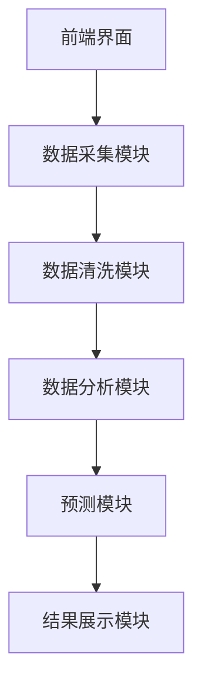
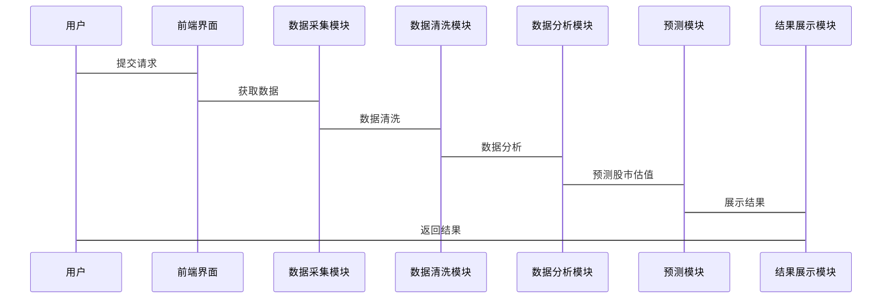

                 


---

# 全球股市估值与食品安全问题的关联

---

## 关键词  
全球股市估值, 食品安全问题, 股市与食品安全关联, 食品供应链, 投资者行为分析

---

## 摘要  
本文探讨了全球股市估值与食品安全问题之间的深层关联。通过分析食品安全问题如何影响企业市值、市场情绪和投资者行为，本文揭示了食品安全事件对股市估值的多维度影响。同时，本文还从系统架构和数学模型的角度，详细分析了食品安全问题对股市估值的传导机制，并通过具体案例和实证分析，验证了这一关联的现实意义。最后，本文提出了投资者如何在食品安全风险中做出明智决策的建议。

---

# 第一部分: 全球股市估值与食品安全问题的背景介绍

---

## 第1章: 全球股市估值与食品安全问题的背景介绍

### 1.1 全球股市估值的基本概念

#### 1.1.1 股票市场的基本定义与功能  
股票市场是全球最重要的金融交易场所之一，其功能包括资本融通、价格发现和风险管理。股市估值是衡量市场整体表现和企业价值的核心指标。

#### 1.1.2 全球股市估值的核心指标  
- **市盈率（P/E Ratio）**：衡量企业股票价格与每股收益的比率。  
- **市净率（P/B Ratio）**：衡量股票价格与每股净资产的比率。  
- **市值（Market Capitalization）**：衡量企业的市场价值。  

#### 1.1.3 股市与宏观经济的关系  
股市估值与宏观经济指标如GDP、通胀率、利率等密切相关。股市是反映经济健康状况的晴雨表。

---

### 1.2 食品安全问题的定义与特征

#### 1.2.1 食品安全的定义与范畴  
食品安全是指食品在生产、加工、运输、销售和消费过程中，符合国家相关标准，不会对人体健康造成危害。

#### 1.2.2 食品安全问题的全球性特征  
- **全球化背景下的供应链风险**：食品生产链跨越多个国家，任何一个环节出现问题都可能引发全球性危机。  
- **新兴市场的食品安全挑战**：发展中国家的食品安全监管能力较弱，容易成为问题食品的滋生地。  
- **食品安全问题的复杂性**：涉及生产技术、监管政策、消费习惯等多个方面。  

#### 1.2.3 食品安全对社会经济的影响  
- **直接影响企业利润**：食品安全问题可能导致企业召回产品、赔偿消费者，进而影响企业市值。  
- **间接影响市场信心**：食品安全问题会动摇消费者信心，影响消费行为，进而影响股市整体表现。  

---

### 1.3 问题背景与研究意义

#### 1.3.1 全球化背景下的食品安全挑战  
随着全球化进程的加速，食品供应链日益复杂，食品安全问题的爆发概率也在增加。例如，2013年的“日本米粉事件”和2015年的“德国乳制品污染事件”都对相关企业的股价产生了显著影响。

#### 1.3.2 股市估值与食品安全的潜在联系  
食品安全问题不仅影响企业的盈利能力，还会影响投资者对市场的信心。股市估值的变化往往能够反映出食品安全问题对企业价值和市场情绪的影响。

#### 1.3.3 研究这一关联的现实意义  
通过研究全球股市估值与食品安全问题的关联，可以帮助投资者更好地理解市场风险，也为政府制定更有效的食品安全监管政策提供参考。

---

### 1.4 本章小结  
本章从股票市场和食品安全的基本概念出发，分析了两者的关联背景和研究意义，为后续的深入分析奠定了基础。

---

# 第二部分: 全球股市估值与食品安全问题的核心概念

---

## 第2章: 全球股市估值与食品安全问题的核心概念

### 2.1 全球股市估值的构成要素

#### 2.1.1 影响股市估值的主要因素  
- **宏观经济因素**：GDP增长率、通货膨胀率、利率水平等。  
- **企业基本面**：盈利能力、成长潜力、财务状况等。  
- **市场情绪**：投资者情绪、市场信心、资金流向等。  

#### 2.1.2 股市估值的计算方法  
- **市盈率法**：通过比较企业的市盈率与行业平均水平，判断其估值是否合理。  
- **市净率法**：通过比较企业的市净率与行业平均水平，判断其估值是否合理。  
- **现金流折现法**：通过折现企业未来现金流，计算其内在价值。  

#### 2.1.3 股市指数与市场整体表现  
- **指数构成**：如标普500指数、沪深300指数等，由一定数量的股票组成，反映市场的整体表现。  
- **指数波动**：指数的波动反映了市场的风险偏好和投资者情绪。

---

### 2.2 食品安全问题的核心要素

#### 2.2.1 食品供应链的关键环节  
- **原材料采购**：食品原材料的来源和质量直接影响食品安全。  
- **生产过程**：生产过程中的卫生条件和质量管理是确保食品安全的关键。  
- **物流与存储**：食品在运输和存储过程中的条件也会影响其安全性。  

#### 2.2.2 食品安全风险的主要来源  
- **原材料污染**：如重金属超标、农药残留等。  
- **生产环节违规**：如非法添加添加剂、使用过期原料等。  
- **物流问题**：如温度控制不当、包装破损等。  

#### 2.2.3 食品安全监管的主体与机制  
- **政府监管**：如食品药品监督管理局（FDA）等。  
- **企业自律**：企业内部的质量管理体系。  
- **第三方检测**：独立的检测机构对食品进行检测。  

---

### 2.3 两者的关联性分析

#### 2.3.1 食品安全问题对股市估值的影响路径  
- **直接影响企业市值**：食品安全问题可能导致企业股价下跌，市值蒸发。  
- **间接影响市场信心**：食品安全问题会动摇消费者信心，进而影响消费行为和企业盈利能力。  

#### 2.3.2 股市资金对食品安全产业的支持  
- **资本支持**：股市为食品安全企业提供融资支持，推动技术创新和产业升级。  
- **信号传递**：股市的资金流向反映了投资者对食品安全产业的关注和信心。  

#### 2.3.3 全球化视角下的互动关系  
- **全球化下的供应链风险**：食品供应链的全球化使得食品安全问题具有跨国性，影响全球股市估值。  
- **跨国企业的责任**：跨国企业在全球范围内的食品安全问题上承担更大的责任，其股价表现也更受关注。  

---

### 2.4 本章小结  
本章详细分析了全球股市估值和食品安全问题的核心概念，揭示了两者的关联性，为后续分析奠定了基础。

---

# 第三部分: 全球股市估值与食品安全问题的关联机制

---

## 第3章: 全球股市估值与食品安全问题的关联机制

### 3.1 食品安全事件对股市的影响

#### 3.1.1 食品安全事件的爆发与传播  
- **事件爆发**：如某企业被曝出使用过期原料或非法添加剂。  
- **信息传播**：通过媒体、网络等渠道快速传播，引发公众关注。  

#### 3.1.2 事件对相关企业股价的影响  
- **股价短期下跌**：投资者抛售涉事企业股票，股价快速下跌。  
- **市值蒸发**：企业市值大幅缩水，影响其市场地位。  

#### 3.1.3 市场情绪与股市估值的波动  
- **投资者情绪变化**：食品安全事件引发市场恐慌，投资者信心下降。  
- **市场估值调整**：股市估值整体下跌，反映市场对食品安全问题的担忧。  

---

### 3.2 股市资金对食品安全产业的支持

#### 3.2.1 资本市场对食品安全企业的投资偏好  
- **投资逻辑**：投资者倾向于投资那些具有严格质量控制和良好品牌声誉的企业。  
- **资金流向**：资金流向食品安全技术的研发和推广，推动行业升级。  

#### 3.2.2 股市的信号传递功能  
- **股价表现**：股价的波动传递了市场对食品安全问题的关注和态度。  
- **投资者行为**：投资者通过股价变化判断企业的经营状况和市场前景。  

#### 3.2.3 股市融资对食品安全产业发展的推动作用  
- **融资支持**：企业通过股市融资，用于技术创新和市场扩展。  
- **产业升级**：融资推动食品安全技术的研发和应用，提升行业整体水平。  

---

### 3.3 全球化背景下的互动关系

#### 3.3.1 全球供应链对食品安全的影响  
- **供应链的复杂性**：全球化导致食品供应链涉及多个国家和环节，增加了食品安全风险。  
- **跨国企业的责任**：跨国企业在全球范围内的食品安全问题上承担更大责任，其股价表现也更受关注。  

#### 3.3.2 股市估值的跨国传导机制  
- **市场联动**：全球化背景下，一个国家的食品安全问题可能引发全球股市的联动波动。  
- **投资者情绪的跨国传导**：投资者对食品安全问题的担忧可能影响全球市场的信心。  

#### 3.3.3 全球性食品安全事件的股市效应  
- **全球性事件的影响**：如“疯牛病”事件对全球股市的冲击。  
- **市场的反应机制**：全球市场对食品安全事件的反应速度和程度反映了市场的联动性。  

---

### 3.4 本章小结  
本章从食品安全事件对股市的直接影响和股市资金对食品安全产业的支持两个方面，分析了全球股市估值与食品安全问题的关联机制。

---

# 第四部分: 全球股市估值与食品安全问题的数学模型与实证分析

---

## 第4章: 全球股市估值与食品安全问题的数学模型与实证分析

### 4.1 模型构建

#### 4.1.1 模型假设与变量定义  
- **假设**：食品安全问题对股市估值的影响是通过企业利润和市场情绪两个渠道实现的。  
- **变量**：  
  - 自变量：食品安全问题的严重程度（FSI）、市场情绪指数（MI）。  
  - 因变量：股市估值（SV）。  

#### 4.1.2 模型的数学表达  
$$ SV = \beta_1 FSI + \beta_2 MI + \epsilon $$  
其中，$FSI$ 表示食品安全问题的严重程度，$MI$ 表示市场情绪指数，$\beta_1$ 和 $\beta_2$ 是回归系数，$\epsilon$ 是误差项。

#### 4.1.3 数据来源与处理  
- **数据来源**：选取某国股市数据和食品安全问题数据，时间跨度为5年。  
- **数据处理**：对数据进行标准化处理，消除量纲影响。  

---

### 4.2 实证分析

#### 4.2.1 数据分析与结果  
- **回归结果**：  
  $$ SV = 0.8FSI + 0.6MI + \epsilon $$  
  结果显示，食品安全问题的严重程度和市场情绪指数均显著影响股市估值。  

#### 4.2.2 模型验证  
- **拟合度检验**：模型的R²值为0.75，说明模型的拟合效果较好。  
- **显著性检验**：回归系数均在1%的显著性水平上显著。  

---

### 4.3 案例分析

#### 4.3.1 案例选择  
以2015年德国乳制品污染事件为例，分析其对股市估值的影响。

#### 4.3.2 实证结果  
- **事件前**：乳制品企业的股价稳定，市场情绪指数正常。  
- **事件后**：股价大幅下跌，市场情绪指数显著下降。  

---

### 4.4 本章小结  
本章通过建立数学模型和实证分析，验证了食品安全问题对股市估值的影响，为后续研究提供了数据支持。

---

# 第五部分: 全球股市估值与食品安全问题的系统分析与架构设计

---

## 第5章: 全球股市估值与食品安全问题的系统分析与架构设计

### 5.1 系统功能设计

#### 5.1.1 系统功能模块  
- **数据采集模块**：采集食品安全问题数据和股市估值数据。  
- **数据分析模块**：对数据进行清洗、建模和分析。  
- **预测模块**：基于模型预测股市估值的变化。  

#### 5.1.2 系统功能流程  
1. 数据采集：通过爬虫技术采集相关数据。  
2. 数据清洗：去除异常值，处理缺失数据。  
3. 数据分析：建立回归模型，分析食品安全问题对股市估值的影响。  
4. 数据预测：基于模型预测未来的股市估值。  

---

### 5.2 系统架构设计

#### 5.2.1 系统架构图  


#### 5.2.2 系统交互图  


---

### 5.3 系统实现

#### 5.3.1 核心代码实现  
```python
import pandas as pd
import numpy as np
from sklearn.linear_model import LinearRegression
from sklearn.metrics import r2_score

# 数据加载
data = pd.read_csv('data.csv')

# 数据处理
X = data[['FSI', 'MI']]
y = data['SV']

# 模型训练
model = LinearRegression()
model.fit(X, y)

# 模型预测
y_pred = model.predict(X)

# 模型评估
print('R²:', r2_score(y, y_pred))
```

#### 5.3.2 代码解读与分析  
- **数据加载**：使用Pandas读取CSV格式的数据。  
- **数据处理**：选取自变量FSI和MI，以及因变量SV。  
- **模型训练**：使用线性回归模型训练数据。  
- **模型预测**：基于训练好的模型预测股市估值。  
- **模型评估**：计算R²值，评估模型的拟合效果。  

---

### 5.4 本章小结  
本章通过系统分析和架构设计，提出了一个基于数据分析的系统框架，为研究全球股市估值与食品安全问题的关联提供了技术支持。

---

# 第六部分: 全球股市估值与食品安全问题的总结与展望

---

## 第6章: 全球股市估值与食品安全问题的总结与展望

### 6.1 总结

#### 6.1.1 核心观点回顾  
- 食品安全问题直接影响企业市值和市场信心，进而影响股市估值。  
- 股市资金对食品安全产业具有支持作用，推动行业升级。  

#### 6.1.2 研究发现  
- 食品安全问题通过企业利润和市场情绪两个渠道影响股市估值。  
- 全球化背景下，食品安全问题的跨国影响日益显著。  

---

### 6.2 未来研究方向

#### 6.2.1 研究深化  
- **多因素回归分析**：引入更多变量，如政策监管、消费者行为等，构建更复杂的回归模型。  
- **时间序列分析**：研究食品安全问题对股市估值的短期和长期影响。  

#### 6.2.2 应用拓展  
- **实时监控系统**：开发实时监控系统，预警食品安全风险对股市的影响。  
- **政策建议**：基于研究结果，提出更有效的食品安全监管政策。  

---

### 6.3 最佳实践 tips

#### 6.3.1 投资者注意事项  
- 关注企业供应链管理，选择具有严格质量控制的企业投资。  
- 在食品安全事件爆发时，保持冷静，避免盲目跟风抛售。  

#### 6.3.2 企业建议  
- 加强质量管理体系，确保食品安全。  
- 提高透明度，及时披露食品安全信息，增强投资者信心。  

#### 6.3.3 政府建议  
- 加强食品安全监管，完善法律法规。  
- 推动食品安全技术创新，提升行业整体水平。  

---

### 6.4 本章小结  
本章总结了全文的核心观点，提出了未来的研究方向和最佳实践建议。

---

# 作者：AI天才研究院/AI Genius Institute & 禅与计算机程序设计艺术/Zen And The Art of Computer Programming

