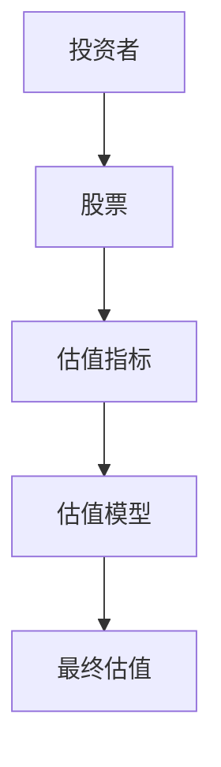
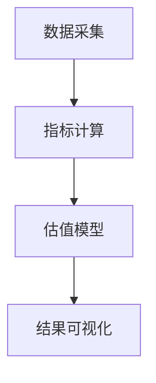

                 


# 全球股市估值和未来回报率预测概述

> 关键词：全球股市，股市估值，股票投资，未来回报率预测，人工智能算法

> 摘要：本文从全球股市估值的基本概念出发，结合传统估值方法与现代算法，详细分析了影响股市估值的主要因素，探讨了未来回报率预测的核心算法与应用场景。通过案例分析和代码实现，深入解读了如何利用技术手段提升股市估值与预测的准确性。

---

# 第一部分: 全球股市估值基础

## 第1章: 全球股市估值概述

### 1.1 股市估值的重要性

#### 1.1.1 全球股市的现状与趋势
全球股市作为世界经济的重要组成部分，其表现直接影响着国家经济的健康发展。近年来，随着经济全球化和科技的进步，股市估值的方法和工具也在不断进化。投资者通过准确的估值，可以更好地把握投资机会，降低风险。

#### 1.1.2 股市估值的基本概念
股市估值是指通过一定的方法和模型，对股票的内在价值进行评估的过程。其目的是为了确定股票的合理价格区间，帮助投资者做出明智的投资决策。

#### 1.1.3 估值在投资决策中的作用
准确的估值可以帮助投资者识别被低估或高估的股票，制定合理的买卖策略，降低投资风险。

### 1.2 股市估值的核心指标

#### 1.2.1 市盈率（P/E Ratio）
市盈率是股票价格与每股收益的比率，反映了投资者对股票未来盈利的预期。公式为：
$$ P/E = \frac{股票价格}{每股收益} $$

#### 1.2.2 市净率（P/B Ratio）
市净率是股票价格与每股净资产的比率，常用于评估重资产行业的股票价值。公式为：
$$ P/B = \frac{股票价格}{每股净资产} $$

#### 1.2.3 股息率（Dividend Yield）
股息率是每股股息与股票价格的比率，反映了股票的分红能力。公式为：
$$ 股息率 = \frac{每股股息}{股票价格} $$

### 1.3 传统估值方法与现代估值方法对比

#### 1.3.1 传统估值方法的优缺点
传统估值方法主要包括基本面分析和简单指标分析。优点是易于理解和计算，缺点是忽视了市场的复杂性和动态变化。

#### 1.3.2 现代估值方法的创新点
现代估值方法结合了大数据分析、机器学习等技术，能够更全面地考虑市场波动和宏观经济因素。

#### 1.3.3 两种方法的适用场景
传统方法适用于初步筛选，而现代方法则更适合精准预测和复杂场景。

---

## 第2章: 股市估值的核心概念与联系

### 2.1 股市估值的核心概念

#### 2.1.1 股票的内在价值
内在价值是股票本身具有的价值，与市场波动无关。它是通过DCF模型等方法计算得出的。

#### 2.1.2 市场价值与内在价值的关系
市场价值是股票在市场上的交易价格，内在价值是其理论上的合理价格。两者的差异反映了市场的有效性和投资者的理性。

#### 2.1.3 影响股票估值的主要因素
包括宏观经济环境、行业竞争状况、公司基本面等。

### 2.2 核心概念的联系与对比

#### 2.2.1 股票估值指标对比表
| 指标名称 | 定义 | 适用场景 | 优缺点 |
|----------|------|----------|--------|
| 市盈率   | 当前股价/每股收益 | 评估盈利能力 | 受行业和周期影响 |
| 市净率   | 当前股价/每股净资产 | 评估资产价值 | 适合重资产行业 |
| 股息率   | 每股股息/股价 | 评估分红能力 | 受公司股息政策影响 |

#### 2.2.2 股票估值流程的ER图


---

## 第3章: 股票估值的数学模型与算法原理

### 3.1 常用估值模型概述

#### 3.1.1 现金流折现模型（DCF）
DCF模型通过将未来现金流折现到现值，计算股票的内在价值。公式为：
$$ DCF = \frac{CF_1}{(1+r)^1} + \frac{CF_2}{(1+r)^2} + ... + \frac{CF_n}{(1+r)^n} + \frac{TV}{(1+r)^n} $$
其中，$CF$为自由现金流，$r$为折现率，$TV$为终值。

#### 3.1.2 市盈率模型
市盈率模型通过比较股票的P/E比行业平均水平，判断其估值是否合理。

#### 3.1.3 市净率模型
市净率模型适用于重资产行业，通过比较P/B比行业平均水平判断估值。

### 3.2 DCF模型的数学公式与实现

#### 3.2.1 DCF模型的公式
$$ DCF = \frac{CF_1}{(1+r)^1} + \frac{CF_2}{(1+r)^2} + ... + \frac{CF_n}{(1+r)^n} + \frac{TV}{(1+r)^n} $$

#### 3.2.2 DCF模型的Python实现
```python
def dcf_valuation(cash_flows, discount_rate, terminal_value):
    dcf = 0
    for i in range(len(cash_flows)):
        dcf += cash_flows[i] / (1 + discount_rate) ** i
    dcf += terminal_value / (1 + discount_rate) ** len(cash_flows)
    return dcf

# 示例
cash_flows = [100, 150, 200]
discount_rate = 0.1
terminal_value = 500
valuation = dcf_valuation(cash_flows, discount_rate, terminal_value)
print("DCF Valuation:", valuation)
```

### 3.3 CAPM模型与股票估值

#### 3.3.1 CAPM模型的公式
$$ R_i = R_f + \beta (R_m - R_f) $$
其中，$R_i$为股票的预期收益率，$R_f$为无风险利率，$\beta$为股票的贝塔系数，$R_m$为市场预期收益率。

#### 3.3.2 CAPM模型的Python实现
```python
def capm_risk_premium(risk_free_rate, beta, market_return):
    return risk_free_rate + beta * (market_return - risk_free_rate)

# 示例
risk_free_rate = 0.05
beta = 1.2
market_return = 0.1
risk_premium = capm_risk_premium(risk_free_rate, beta, market_return)
print("Risk Premium:", risk_premium)
```

---

## 第4章: 股票估值系统设计与实现

### 4.1 系统功能设计

#### 4.1.1 功能模块
- 数据采集模块：获取股票的历史数据和财务数据。
- 指标计算模块：计算市盈率、市净率等指标。
- 估值模型模块：应用DCF和CAPM模型进行估值。
- 可视化模块：展示估值结果和对比分析。

#### 4.1.2 系统架构图


### 4.2 系统接口设计

#### 4.2.1 数据接口
- 数据来源：Yahoo Finance API
- 数据格式：JSON
- 接口示例：
  ```python
  import yfinance as yf
  data = yf.download('AAPL', start='2020-01-01', end='2023-12-31')
  ```

#### 4.2.2 模型接口
- 输入：股票代码、时间范围
- 输出：估值结果和可视化图表

---

## 第5章: 项目实战与案例分析

### 5.1 项目实战

#### 5.1.1 环境安装
```bash
pip install pandas numpy yfinance matplotlib
```

#### 5.1.2 核心代码实现
```python
import yfinance as yf
import numpy as np
import matplotlib.pyplot as plt

# 数据获取
data = yf.download('AAPL', start='2020-01-01', end='2023-12-31')
close_price = data['Close']

# 计算市盈率
eps = 4.05  # 假设每股收益为4.05
pe_ratio = close_price / eps

# DCF估值
cf = [100, 150, 200]
discount_rate = 0.1
terminal_value = 500
dcf = 0
for i in range(len(cf)):
    dcf += cf[i] / (1 + discount_rate) ** i
dcf += terminal_value / (1 + discount_rate) ** len(cf)
valuation = dcf

print("DCF Valuation:", valuation)
print("PE Ratio:", pe_ratio.mean())
```

#### 5.1.3 结果分析
通过代码实现，我们可以得到股票的DCF估值和市盈率，从而判断其是否被高估或低估。

---

## 第6章: 最佳实践与注意事项

### 6.1 小结
本文详细介绍了全球股市估值的核心概念、数学模型和算法实现，并通过案例分析展示了如何利用技术手段提升估值的准确性。

### 6.2 注意事项
- 数据来源的准确性
- 模型的适用性
- 市场的不可预测性

### 6.3 拓展阅读
- 《投资学》
- 《量化投资实战》

---

# 作者信息

作者：AI天才研究院/AI Genius Institute & 禅与计算机程序设计艺术/Zen And The Art of Computer Programming

---

版权声明：本文版权归作者所有，未经授权不得转载。

