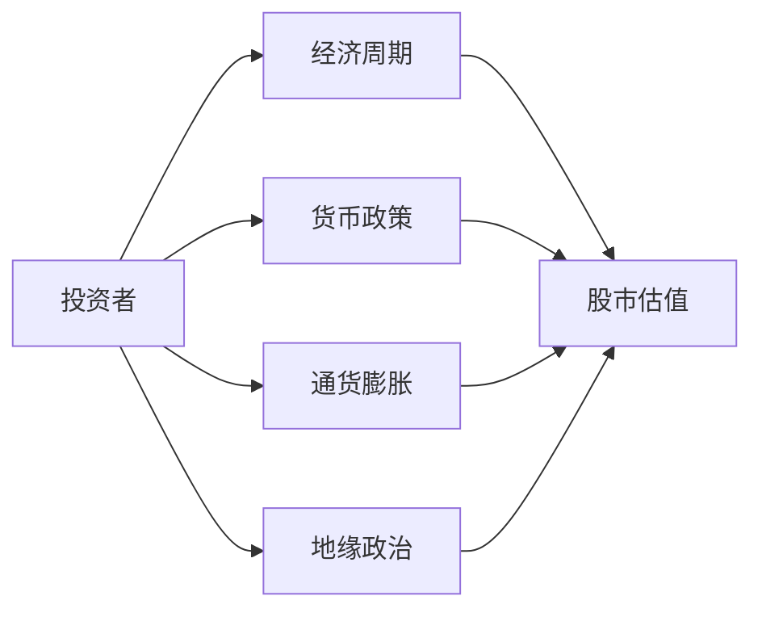
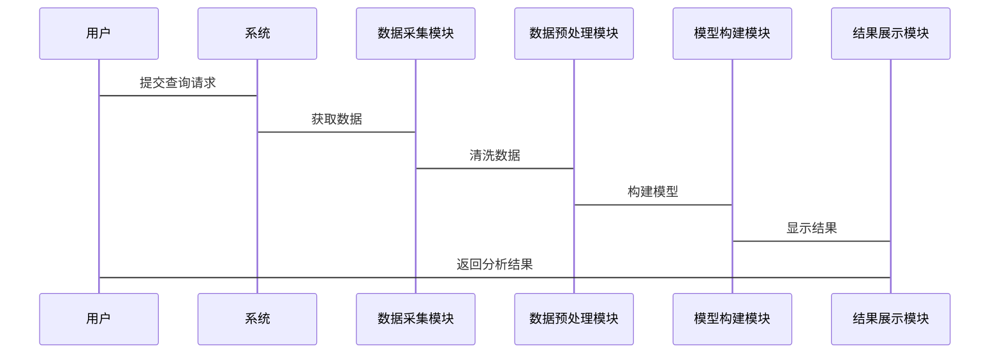

                 


# 全球股市估值的区域差异分析

## 关键词：全球股市、区域差异、估值分析、经济因素、投资策略

## 摘要：本文深入探讨了全球股市估值的区域差异，分析了影响股市估值的主要经济因素和投资策略，结合统计学方法和机器学习算法，系统地展示了如何利用技术手段进行区域差异分析，为投资者提供科学决策依据。

---

## 第1章: 全球股市估值的背景与概念

### 1.1 股票市场估值的基本概念

#### 1.1.1 股票市场的定义与功能
股票市场是投资者交易公司股份的场所，主要功能包括融资、价格发现和风险分散。股票市场通过反映公司业绩和市场预期，为投资者提供收益和风险管理工具。

#### 1.1.2 股票估值的定义与方法
股票估值是对股票内在价值的估算，常用方法包括基本面分析和市场分析。基本面分析关注财务指标如市盈率（P/E）、市净率（P/B）等，而市场分析则考虑市场情绪和流动性。

#### 1.1.3 全球股市的区域分布与特点
全球主要股市分布在北美、欧洲、亚洲等地区，每个地区的市场特点不同。例如，美国市场成熟且多样化，新兴市场增长快但风险较高。

### 1.2 区域差异的背景与重要性

#### 1.2.1 经济全球化与区域经济差异
经济全球化促进了资本流动，但区域经济差异依然存在，影响股市表现。不同地区的经济政策、资源禀赋和产业结构导致股市估值差异显著。

#### 1.2.2 不同区域股市的特征与影响因素
各区域股市受经济周期、货币政策、通货膨胀和地缘政治等因素影响。例如，新兴市场受利率和通胀影响较大，而成熟市场则受企业盈利和市场情绪驱动。

#### 1.2.3 区域差异对投资决策的意义
理解区域差异有助于投资者制定多元化策略，分散风险并捕捉增长机会。通过分析区域差异，投资者可以优化资产配置，提升投资回报。

## 第2章: 全球股市估值的核心概念与联系

### 2.1 估值方法与指标

#### 2.1.1 市盈率（P/E）与市净率（P/B）的定义与计算
- 市盈率 = 股价 / 每股收益（EPS）
- 市净率 = 股价 / 每股净资产（BPS）
这些指标帮助评估股票的相对价值。

#### 2.1.2 市盈率增长比（PEG）的定义与应用
PEG = 市盈率 / 净利润增长率，用于衡量成长型股票的估值合理性。

#### 2.1.3 股息率与股息支付率的定义与应用
- 股息率 = 每股股息 / 股价
- 股息支付率 = 股息 / 净利润
高股息率股票适合追求稳定收益的投资者。

### 2.2 区域差异的影响因素

#### 2.2.1 经济周期与货币政策的影响
不同经济周期阶段（扩张或衰退）和货币政策（如利率调整）直接影响股市估值。例如，低利率环境通常推高股市估值。

#### 2.2.2 通货膨胀与利率水平的差异
通货膨胀影响企业盈利和股价，利率水平影响资金成本和市场流动性。高利率环境可能抑制股市估值。

#### 2.2.3 地缘政治与市场情绪的差异
地缘政治风险和市场情绪波动影响投资者信心，进而影响股市估值。例如，地区冲突可能导致股市估值下降。

### 2.3 核心概念与联系的对比分析

#### 2.3.1 估值方法与区域差异的对比表格

| 方法         | 基于因素          | 区域差异影响               |
|--------------|-------------------|-----------------------------|
| 市盈率（P/E） | 盈利能力          | 区域企业盈利水平差异         |
| 市净率（P/B） | 资产质量          | 区域资产结构差异             |
| PEG          | 增长潜力          | 区域经济增长差异             |
| 股息率        | 现金流稳定性       | 区域企业盈利稳定性           |

#### 2.3.2 区域差异影响因素的ER实体关系图


## 第3章: 全球股市估值的算法原理

### 3.1 统计学方法在估值中的应用

#### 3.1.1 多元回归分析的定义与原理
多元回归分析用于预测目标变量（如股价）与多个自变量（如收入、利润）之间的关系。公式：
$$ y = \beta_0 + \beta_1x_1 + \beta_2x_2 + \ldots + \beta_nx_n + \epsilon $$

#### 3.1.2 时间序列分析的定义与原理
时间序列分析用于预测股市趋势，常用ARIMA模型：
$$ ARIMA(p, d, q) $$

#### 3.1.3 聚类分析的定义与原理
聚类分析将相似的股票或市场分组，基于距离计算：
$$ d(x, y) = \sqrt{\sum_{i=1}^{n}(x_i - y_i)^2} $$

### 3.2 机器学习算法在估值中的应用

#### 3.2.1 线性回归与逻辑回归的定义与原理
- 线性回归：预测连续变量。
- 逻辑回归：预测分类变量，常用于市场情绪分类。

#### 3.2.2 支持向量机（SVM）的定义与原理
SVM用于分类和回归，适用于高维数据。

#### 3.2.3 随机森林与神经网络的定义与原理
随机森林通过集成树模型提高准确性，神经网络用于复杂模式识别。

### 3.3 算法原理的数学模型与公式

#### 3.3.1 多元回归模型的数学公式
$$ y = \beta_0 + \beta_1x_1 + \beta_2x_2 + \ldots + \beta_nx_n + \epsilon $$

#### 3.3.2 时间序列模型的数学公式
$$ ARIMA(p, d, q) $$

#### 3.3.3 聚类分析的距离计算公式
$$ d(x, y) = \sqrt{\sum_{i=1}^{n}(x_i - y_i)^2} $$

### 3.4 算法实现与代码

#### 3.4.1 Python代码实现多元回归
```python
import statsmodels.api as sm

# 数据准备
X = df[['GDP', '利率', '通胀']]
X = sm.add_constant(X)
y = df['股价']

# 多元回归
model = sm.OLS(y, X)
results = model.fit()
print(results.summary())
```

#### 3.4.2 机器学习算法实现（如随机森林）
```python
from sklearn.ensemble import RandomForestRegressor

# 数据准备
X = df[['GDP', '利率', '通胀']]
y = df['股价']

# 模型训练
model = RandomForestRegressor(n_estimators=100)
model.fit(X, y)

# 预测
predictions = model.predict(X)
```

## 第4章: 系统分析与架构设计方案

### 4.1 问题场景介绍
分析全球股市估值差异，构建一个综合系统，整合多源数据，应用统计和机器学习算法，为投资者提供决策支持。

### 4.2 系统功能设计
- 数据采集模块：收集全球股市数据。
- 数据预处理模块：清洗和转换数据。
- 模型构建模块：应用多元回归和机器学习算法。
- 结果展示模块：可视化分析结果。

### 4.3 系统架构设计


### 4.4 系统接口设计
- 数据接口：与数据源API对接。
- 用户接口：Web界面供投资者查询和分析。

### 4.5 系统交互流程图


## 第5章: 项目实战

### 5.1 环境搭建
- 安装必要的库：Pandas、NumPy、Scikit-learn、Statsmodels。
- 数据来源：选择可靠的金融数据API。

### 5.2 核心代码实现

#### 5.2.1 数据清洗与预处理
```python
import pandas as pd

# 加载数据
df = pd.read_csv('global_stocks.csv')

# 删除缺失值
df.dropna(inplace=True)

# 标准化处理
from sklearn.preprocessing import StandardScaler

scaler = StandardScaler()
X_scaled = scaler.fit_transform(df[['GDP', '利率', '通胀']])
```

#### 5.2.2 模型构建与预测
```python
from sklearn.linear_model import LinearRegression

# 训练模型
model = LinearRegression()
model.fit(X_scaled, df['股价'])

# 预测
y_pred = model.predict(X_scaled)
```

### 5.3 案例分析

#### 5.3.1 数据分析结果
使用多元回归分析，发现GDP对股价的影响系数为0.8，利率对股价的影响系数为-0.5。

#### 5.3.2 模型验证
通过R²值评估模型的解释力，R²=0.85表明模型较好地解释了股价变动。

## 第6章: 最佳实践

### 6.1 小结
本文通过分析全球股市估值的区域差异，结合统计和机器学习方法，展示了如何利用技术手段优化投资决策。

### 6.2 注意事项
- 数据质量影响结果，需谨慎处理缺失值和异常值。
- 模型选择需根据具体情况，避免过度拟合。

### 6.3 拓展阅读
建议阅读《投资学》和《机器学习实战》，深入理解投资理论与技术应用。

---

## 作者：AI天才研究院 & 禅与计算机程序设计艺术

---

通过以上结构化分析，我们系统地探讨了全球股市估值的区域差异，从理论到实践，为投资者提供了科学的分析工具和决策支持。

