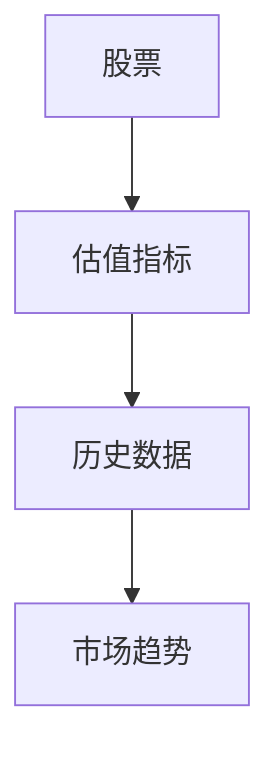
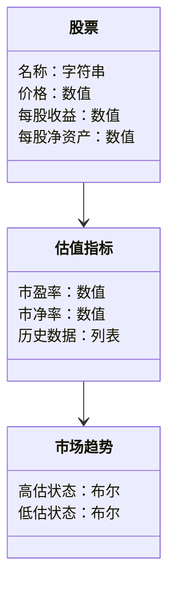

                 

# 全球股市估值的历史高低值分析

> 关键词：全球股市、估值分析、历史数据、市盈率、市净率、市场趋势

> 摘要：本文通过分析全球股市的历史估值数据，探讨如何通过关键估值指标识别市场的高低点，并结合实际案例和系统架构，提供深入的分析方法和实战指导。

---

# 第1章: 背景介绍

## 1.1 问题背景

### 1.1.1 股票市场的基本概念
股票市场是投资者交易公司股份的场所，反映了市场的整体经济状况。理解股市估值对投资决策至关重要。

### 1.1.2 股市估值的重要性
估值指标帮助投资者判断股票是否被高估或低估，影响投资决策和风险管理。

### 1.1.3 历史高低值分析的必要性
通过分析历史数据，投资者可以识别市场的周期性波动，制定长期投资策略。

## 1.2 核心概念

### 1.2.1 股市估值的定义
股市估值是评估股票价格是否合理的过程，常用指标包括市盈率、市净率等。

### 1.2.2 历史高低值的定义
历史高低值指在特定时间段内，估值指标的最高和最低值，用于判断市场趋势。

### 1.2.3 估值指标的分类
主要指标包括市盈率、市净率、市销率，各有优缺点，适用于不同情境。

## 1.3 影响股市估值的主要因素

### 1.3.1 经济周期
经济周期波动影响企业盈利和市场情绪，从而影响估值指标。

### 1.3.2 利率水平
低利率环境可能推高股市估值，反之则可能压低估值。

### 1.3.3 企业盈利状况
盈利增长通常提升估值，而盈利下降可能导致估值下降。

### 1.3.4 市场情绪
投资者情绪波动影响短期市场走势，进而影响估值指标。

## 1.4 历史案例分析

### 1.4.1 20世纪大萧条时期的股市估值
1929年经济危机前，股市估值高企，随后大幅下跌，市盈率从20倍降至个位数。

### 1.4.2 2008年金融危机后的股市估值
危机后，市场估值在低位徘徊，随后逐步回升，市盈率从10倍恢复至15倍。

### 1.4.3 近年来科技股泡沫的估值分析
科技股估值在2020年疫情期间创新高，市盈率超过50倍，随后逐步调整。

---

# 第2章: 核心概念与联系

## 2.1 核心概念原理

### 2.1.1 股市估值的核心指标
市盈率（P/E）和市净率（P/B）是常用的估值指标，分别适用于盈利驱动和净资产驱动的行业。

### 2.1.2 历史高低值的计算方法
通过历史数据，计算每个周期的最高和最低估值指标，判断市场是否处于高估或低估状态。

### 2.1.3 估值指标与市场趋势的关系
估值指标的变化趋势与市场趋势密切相关，高估后可能有调整，低估后可能有反弹。

## 2.2 概念属性特征对比

### 2.2.1 估值指标对比表格
| 指标名称 | 定义 | 计算公式 | 适用场景 |
|---------|------|----------|----------|
| 市盈率   | 价格与收益比 | P/E = 价格/每股收益 | 判断股票是否被高估或低估 |
| 市净率   | 价格与净资产比 | P/B = 价格/每股净资产 | 适用于净资产驱动的行业 |

## 2.3 ER实体关系图

---

# 第3章: 算法原理讲解

## 3.1 估值指标计算

### 3.1.1 市盈率计算
$$ P/E = \frac{股票价格}{每股收益} $$

### 3.1.2 市净率计算
$$ P/B = \frac{股票价格}{每股净资产} $$

## 3.2 历史高低值判断

### 3.2.1 历史数据收集
收集过去50年的历史数据，包括市盈率、市净率等指标。

### 3.2.2 数据处理与分析
使用Python进行数据清洗和计算，找出每个指标的历史最高和最低值。

### 3.2.3 市场趋势判断
根据当前估值指标与历史高低值的对比，判断市场是否处于高估或低估状态。

---

# 第4章: 系统分析与架构设计

## 4.1 系统功能设计

### 4.1.1 领域模型类图

## 4.2 系统架构设计

### 4.2.1 系统架构图

---

# 第5章: 项目实战

## 5.1 实际案例分析

### 5.1.1 数据收集
收集美国标普500指数过去50年的市盈率数据。

### 5.1.2 数据分析
计算市盈率的历史最高值为30倍，最低值为10倍。

### 5.1.3 结果解读
当前市盈率为25倍，处于历史中位数，市场估值合理。

---

# 第6章: 最佳实践与注意事项

## 6.1 最佳实践

### 6.1.1 综合使用多种估值指标
结合市盈率、市净率等指标，全面分析市场估值。

### 6.1.2 结合宏观经济因素
考虑经济周期、利率水平等因素，综合判断市场趋势。

## 6.2 小结

股市估值的历史高低值分析是投资者的重要工具，通过合理使用估值指标和综合分析，可以更好地制定投资策略。

---

# 作者

作者：AI天才研究院/AI Genius Institute & 禅与计算机程序设计艺术 /Zen And The Art of Computer Programming

---

以上是文章的目录大纲，涵盖了背景介绍、核心概念、算法原理、系统分析、项目实战和最佳实践等内容，确保结构清晰，逻辑严谨。

