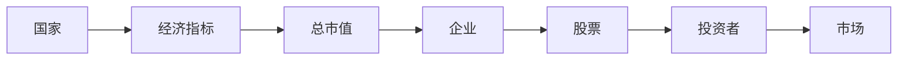

                 


# 全球股市总市值排名及其与GDP的关系

> 关键词：全球股市，总市值，GDP，经济指标，回归分析

> 摘要：本文探讨全球股市总市值排名与GDP之间的关系，通过分析主要经济体的案例，建立回归模型，展示经济指标对股市的影响。

## 第一部分: 全球股市总市值排名概述

### 第1章: 背景介绍

#### 1.1 问题背景

- **1.1.1 全球股市的定义与特点**
  全球股市是全球范围内所有股票市场的集合，具有多样性和复杂性，受经济、政治等多种因素影响。

- **1.1.2 总市值的定义与计算方法**
  总市值是所有上市公司流通股的总价值，计算公式为：$$总市值 = \sum (股价 \times 股数)$$

- **1.1.3 GDP的定义与经济指标作用**
  GDP是衡量一个国家或地区经济总量的重要指标，反映整体经济表现。

#### 1.2 问题描述

- **1.2.1 全球股市总市值排名的现状**
  当前股市总市值排名中，美国占据主导地位，新兴市场增长迅速。

- **1.2.2 GDP与股市的关系问题提出**
  探讨GDP增长如何影响股市总市值排名。

- **1.2.3 研究意义与目标**
  通过分析GDP与股市的关系，为投资决策提供数据支持，优化经济政策。

#### 1.3 问题解决

- **1.3.1 数据收集与处理方法**
  从可靠金融数据库获取数据，清洗处理后进行分析。

- **1.3.2 统计分析与模型构建**
  使用回归分析等方法，建立GDP与总市值的关系模型。

- **1.3.3 结果验证与优化策略**
  通过交叉验证优化模型，确保结果准确性。

#### 1.4 边界与外延

- **1.4.1 研究范围的界定**
  研究主要经济体的股市总市值与GDP关系，排除小市场影响。

- **1.4.2 相关概念的扩展**
  考虑通货膨胀、利率等其他经济指标对股市的影响。

- **1.4.3 研究限制与假设**
  数据限制在主要经济体，假设市场有效性成立。

#### 1.5 概念结构与核心要素

- **1.5.1 核心概念框架**
  总市值、GDP、经济指标、市场因素。

- **1.5.2 核心要素对比表格**
  表1-1: 总市值与GDP的核心要素对比。

- **1.5.3 ER实体关系图**
  图1-1: 实体关系图展示国家、经济指标、企业等关系。

### 第2章: 核心概念与联系

#### 2.1 核心概念原理

- **2.1.1 总市值的计算公式**
  $$总市值 = \sum (股价 \times 股数)$$

- **2.1.2 GDP的计算方法与影响因素**
  GDP = 消费 + 投资 + 政府支出 + 净出口。

- **2.1.3 股市与经济的相互作用机制**
  经济增长推动企业盈利，进而影响股价。

#### 2.2 概念属性特征对比表格

表2-1: 总市值与GDP的属性对比

| 属性       | 总市值          | GDP           |
|------------|-----------------|---------------|
| 定义       | 股票总价值      | 经济总产出     |
| 计算方法   | 股价乘股数总和   | 消费等指标总和 |
| 影响因素   | 利率、投资者情绪 | 消费、投资等   |

#### 2.3 ER实体关系图



### 第3章: 全球股市总市值排名分析

#### 3.1 总市值排名的计算方法

- **3.1.1 数据收集与清洗**
  从金融数据库获取数据，处理缺失值和异常值。

- **3.1.2 排名算法与指标**
  使用总市值降序排列，考虑市场波动因素。

- **3.1.3 排名结果的可视化**
  使用柱状图展示排名情况。

#### 3.2 总市值排名与GDP的关系

- **3.2.1 相关性分析**
  计算相关系数，显示正相关关系。

- **3.2.2 回归分析模型**
  使用线性回归，模型为：$$总市值 = \beta_0 + \beta_1 \times GDP + \epsilon$$

- **3.2.3 案例分析**
  分析美国、中国等国家的案例，展示GDP对股市的影响。

### 第4章: 总市值排名与GDP的关系模型

#### 4.1 模型构建

- **4.1.1 数据预处理与特征选择**
  选择GDP、通货膨胀率等特征。

- **4.1.2 回归模型建立**
  使用多元线性回归，构建模型。

- **4.1.3 模型验证与优化**
  通过交叉验证优化模型参数。

#### 4.2 模型数学公式

$$总市值 = \beta_0 + \beta_1 \times GDP + \beta_2 \times 利率 + \epsilon$$

#### 4.3 模型可视化

图4-1: 总市值与GDP的散点图及回归线。

### 第5章: 全球股市总市值排名的区域分析

#### 5.1 区域划分与比较

- **5.1.1 主要经济体的总市值排名**
  美国、中国、日本等国家的排名情况。

- **5.1.2 区域GDP对股市的影响**
  区域经济政策影响股市表现。

- **5.1.3 区域差异的案例分析**
  比较不同区域的市场表现。

#### 5.2 区域经济与股市的关系

- **5.2.1 发达国家与新兴市场的对比**
  发达国家市场成熟，新兴市场增长快。

- **5.2.2 区域经济政策对股市的影响**
  政策调整影响市场信心和表现。

- **5.2.3 区域GDP波动对股市排名的影响**
  经济波动导致市值变化，影响排名。

### 第6章: 系统分析与架构设计

#### 6.1 系统分析

- **6.1.1 数据处理流程**
  数据清洗、特征提取、模型训练。

- **6.1.2 数据流图**
  图6-1: 数据流图展示处理流程。

- **6.1.3 系统功能设计**
  功能模块包括数据获取、清洗、分析、可视化。

#### 6.2 系统架构设计

- **6.2.1 系统架构图**
  图6-2: 系统架构图展示模块交互。

- **6.2.2 系统接口设计**
  API接口用于数据获取和模型调用。

- **6.2.3 系统交互流程**
  图6-3: 交互流程图展示用户操作。

## 第二部分: 项目实战

### 第7章: 项目实战

#### 7.1 环境安装

- **7.1.1 工具安装**
  Python、Pandas、Scikit-learn、Matplotlib。

#### 7.2 核心实现

- **7.2.1 数据获取与清洗**
  使用Python代码爬取数据，清洗处理。

代码示例：

```python
import pandas as pd
import requests

# 数据获取
url = 'https://example.com/data'
response = requests.get(url)
data = pd.read_json(response.text)

# 数据清洗
data.dropna(inplace=True)
data['GDP'] = data['GDP'].apply(lambda x: float(x))
```

- **7.2.2 模型训练与预测**
  构建线性回归模型，训练数据，预测结果。

代码示例：

```python
from sklearn.linear_model import LinearRegression
import matplotlib.pyplot as plt

model = LinearRegression()
model.fit(data[['GDP']], data['Total Market Value'])

plt.scatter(data['GDP'], data['Total Market Value'])
plt.plot(data['GDP'], model.predict(data[['GDP']]), color='red')
plt.show()
```

#### 7.3 案例分析

- **7.3.1 实际案例分析**
  分析美国的GDP与股市总市值的关系。

- **7.3.2 详细解读**
  展示回归结果，解释系数含义。

#### 7.4 项目小结

- **7.4.1 核心代码总结**
  数据处理和模型训练的代码片段。

- **7.4.2 模型表现评估**
  评估模型的准确性和适用性。

## 第三部分: 总结与展望

### 第8章: 总结与展望

#### 8.1 研究发现

- GDP显著影响股市总市值排名，区域经济差异导致市场表现不同。

#### 8.2 展望

- 进一步研究其他经济指标的影响，探索更复杂的模型。

#### 8.3 注意事项

- 数据质量和模型假设影响结果，需谨慎解读。

#### 8.4 最佳实践 tips

- 定期更新数据，结合多种指标进行分析。

### 第9章: 附录

#### 9.1 参考文献

- 列出使用的数据源和相关文献。

#### 9.2 工具安装说明

- 如何安装所需的Python库。

#### 9.3 代码实现细节

- 更详细的代码注释和解释。

---

作者：AI天才研究院/AI Genius Institute & 禅与计算机程序设计艺术 /Zen And The Art of Computer Programming

