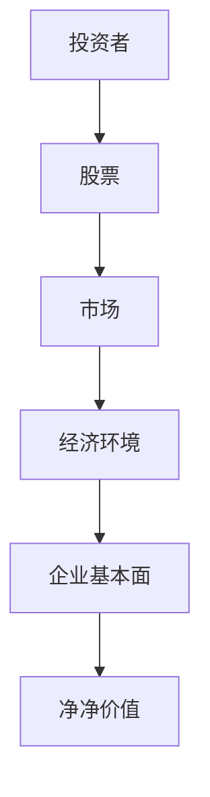
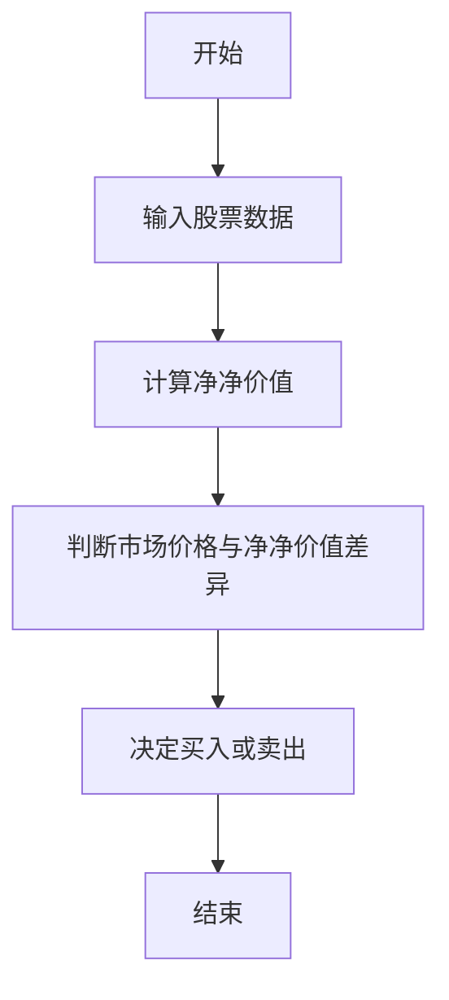
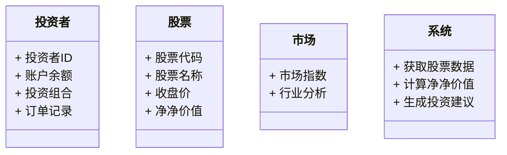
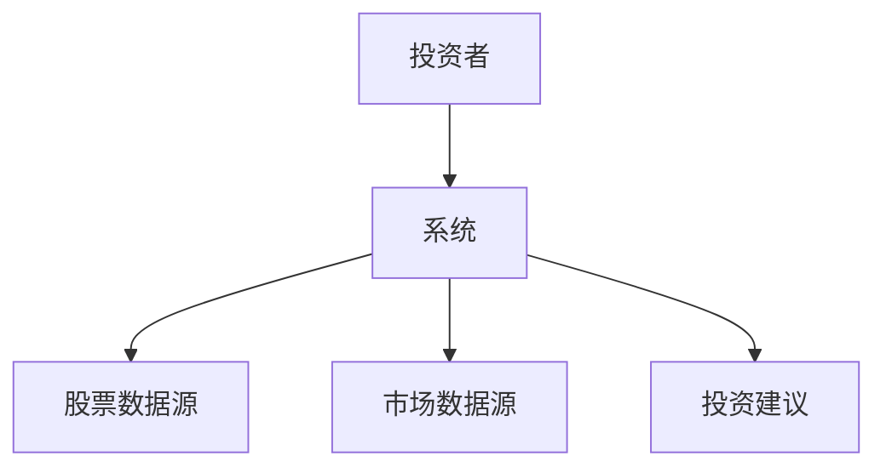
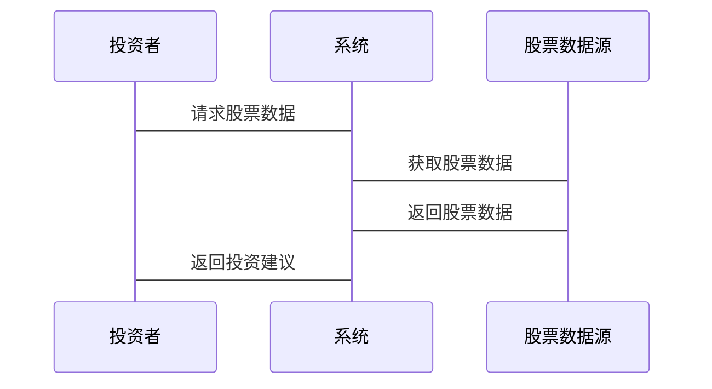

                 


# 净净股票策略：格雷厄姆理论的现代演绎

> 关键词：净净股票策略、格雷厄姆理论、价值投资、安全边际、股票投资、现代演绎

> 摘要：本文详细探讨了净净股票策略的理论基础、核心概念、算法原理及其在现代股票投资中的应用。通过结合格雷厄姆的安全边际理论，本文提出了一个基于净净价值的股票投资策略，并通过数学模型和算法实现，展示了其在实际投资中的优势和效果。

---

## 第一部分: 净净股票策略的背景与核心概念

### 第1章: 净净股票策略的定义与背景

#### 1.1 净净股票策略的定义
- 净净股票策略是一种基于股票内在价值的投资策略，旨在通过计算股票的净净价值（Net Net Value）来判断其是否被市场低估。
- 净净价值是指股票的账面价值减去流动负债后的剩余资产，反映了企业的实际资产价值。

#### 1.2 格雷厄姆理论的现代应用
- 格雷厄姆的安全边际理论是价值投资的核心思想，强调以低于内在价值的价格买入股票。
- 净净股票策略是对格雷厄姆理论的现代演绎，结合了现代金融市场的特点和投资者行为。

#### 1.3 净净股票策略的适用场景
- 适合于寻找低估股票的投资者。
- 适用于市场波动较大、企业基本面稳定的环境。

---

### 第2章: 净净股票策略的核心概念与联系

#### 2.1 核心概念原理
- 净净股票策略的核心在于计算股票的净净价值，即 $NNV = \text{股东权益} - \text{流动负债}$。
- 格雷厄姆的安全边际理论强调以低于净净价值的价格买入股票，以确保投资的安全性。

#### 2.2 核心概念属性特征对比
| 概念             | 净净股票策略 | 传统价值投资 | 其他投资策略 |
|------------------|---------------|--------------|--------------|
| 核心指标         | 净净价值      | 市盈率、市净率 | 技术指标     |
| 投资期限         | 长期          | 长期          | 短期          |
| 风险控制         | 侧重安全边际  | 侧重安全边际  | 侧重技术分析  |

#### 2.3 ER实体关系图


---

## 第二部分: 净净股票策略的算法原理

### 第3章: 净净股票策略的算法原理

#### 3.1 算法流程


#### 3.2 算法实现
```python
def calculate_net_nnet_value(ticker):
    # 获取股票数据
    data = get_stock_data(ticker)
    # 计算净净价值
    nnet = data['股东权益'] - data['流动负债']
    return nnet

def strategy_decision(ticker):
    nnet = calculate_net_nnet_value(ticker)
    market_price = data['收盘价']
    if market_price < nnet * 0.9:
        return "买入"
    elif market_price > nnet * 1.1:
        return "卖出"
    else:
        return "持有"

# 示例使用
print(strategy_decision("AAPL"))
```

#### 3.3 数学模型与公式
- 净净价值公式：
  $$NNV = \text{股东权益} - \text{流动负债}$$
- 安全边际公式：
  $$\text{买入价格} \leq NNV \times 0.9$$
  $$\text{卖出价格} \geq NNV \times 1.1$$

---

## 第三部分: 净净股票策略的系统分析与架构设计

### 第4章: 系统分析与架构设计

#### 4.1 问题场景介绍
- 投资者需要实时获取股票数据，计算净净价值，并根据市场情况做出投资决策。

#### 4.2 项目介绍
- 开发一个基于净净价值的股票投资系统，帮助投资者自动筛选低估股票。

#### 4.3 系统功能设计


#### 4.4 系统架构设计


#### 4.5 接口设计与交互


---

## 第四部分: 净净股票策略的项目实战

### 第5章: 项目实战

#### 5.1 环境安装
- 安装Python和相关库：
  ```bash
  pip install pandas numpy yfinance
  ```

#### 5.2 核心代码实现
```python
import pandas as pd
import yfinance as yf

def get_stock_data(ticker):
    data = yf.download(ticker, start='2020-01-01', end='2023-12-31')
    return data

def calculate_net_nnet_value(data):
    # 假设股东权益和流动负债的数据列分别为 'Equity' 和 'Current Liabilities'
    nnet = data['Equity'] - data['Current Liabilities']
    return nnet

def strategy_decision(data):
    nnet = calculate_net_nnet_value(data)
    market_price = data['Adj Close']
    # 买入条件：市场价格 < 净净价值的90%
    if market_price < nnet * 0.9:
        return "买入"
    # 卖出条件：市场价格 > 净净价值的110%
    elif market_price > nnet * 1.1:
        return "卖出"
    else:
        return "持有"

# 示例运行
data = get_stock_data("AAPL")
print(strategy_decision(data))
```

#### 5.3 案例分析与解读
- 以苹果公司（AAPL）为例，计算其净净价值，并根据市场价格判断投资决策。

#### 5.4 项目小结
- 净净股票策略通过量化方法筛选低估股票，结合格雷厄姆的安全边际理论，为投资者提供了可靠的决策依据。

---

## 第五部分: 净净股票策略的最佳实践

### 第6章: 最佳实践

#### 6.1 小结
- 净净股票策略是一种有效的价值投资方法，通过计算净净价值和市场价格的差异，帮助投资者找到低估股票。

#### 6.2 注意事项
- 需要定期更新股票数据和市场信息。
- 结合其他因素（如行业前景、管理团队）进行综合分析。

#### 6.3 拓展阅读
- 《The Intelligent Investor》——本杰明·格雷厄姆
- 《价值投资实战手册》—— fooo.co

---

作者：AI天才研究院/AI Genius Institute & 禅与计算机程序设计艺术 /Zen And The Art of Computer Programming

