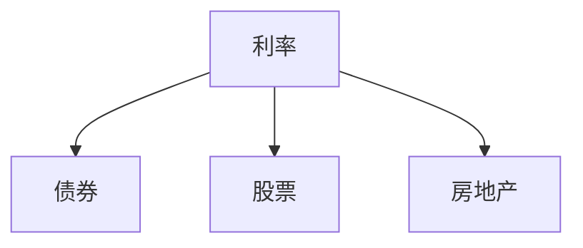

                 


# 利率环境变化对各类资产的影响

> 关键词：利率环境，资产影响，股票，债券，房地产，经济分析，投资策略

> 摘要：本文系统分析了利率环境变化对各类资产的影响，包括股票、债券和房地产市场的具体表现，结合数学模型和实际案例，探讨了投资者在不同利率环境下的应对策略。通过构建分析框架和提供实战案例，为读者提供了全面的理解和指导。

---

## 第一部分: 利率环境变化的背景与重要性

### 第1章: 利率环境变化的背景与重要性

#### 1.1 利率环境变化的背景

##### 1.1.1 利率的定义与分类

利率是资金的时间价值的表现，是衡量资金使用成本的重要指标。根据期限和市场类型，利率可以分为短期利率、长期利率、名义利率和实际利率。短期利率通常指一年以内的利率，如隔夜拆借利率；长期利率则涉及十年以上的债券收益率。名义利率是未扣除通货膨胀影响的利率，而实际利率则是名义利率扣除通货膨胀后的结果。

##### 1.1.2 利率变化的驱动因素

利率的变化受到多种因素的影响，包括中央银行的货币政策、市场供需关系、通货膨胀预期和经济周期等。中央银行通过调整基准利率直接影响市场利率，而市场供需则根据投资者的偏好和风险 appetite 进行调整。通货膨胀预期和经济周期的变化也会影响利率的走势。

##### 1.1.3 利率环境变化对经济的影响

利率的变化对整体经济有深远影响。低利率环境通常刺激投资和消费，促进经济增长；而高利率环境则可能抑制投资，导致经济增长放缓。此外，利率变化还会影响汇率、国际贸易和企业盈利能力。

#### 1.2 利率与资产定价的关系

##### 1.2.1 利率在资产定价中的核心作用

利率是资产定价的核心因素之一。在债券市场，利率直接影响债券的价格和收益率；在股票市场，利率通过影响资金成本和企业盈利间接影响股票价格。房地产市场也受到利率的影响，尤其是按揭利率的变化会直接影响房地产需求。

##### 1.2.2 利率变化对资产价格的直接影响

利率变化对不同类型资产的影响机制不同。债券价格与利率呈负相关关系，即利率上升，债券价格下跌；股票价格则可能因利率上升而面临估值压力，但高分红股票可能受益于相对较高的收益稳定性。房地产市场则受到按揭利率的直接影响，利率上升会降低购房需求。

##### 1.2.3 利率环境对投资决策的影响

投资者在不同利率环境下会调整其资产配置策略。低利率环境下，投资者可能倾向于投资风险较高的资产，如股票和房地产；而在高利率环境下，债券和货币市场基金可能更具吸引力。

#### 1.3 本书的核心问题与研究目标

##### 1.3.1 问题背景与问题描述

本文旨在探讨利率环境变化对各类资产的影响，帮助投资者在不同经济周期中做出明智的投资决策。随着全球经济的不确定性增加，理解利率变化对资产价格的影响变得尤为重要。

##### 1.3.2 问题解决的思路与方法

通过分析不同资产类别的利率敏感性，结合历史数据和数学模型，本文将探讨利率变化对各类资产的具体影响机制。同时，将提供实际案例分析，帮助读者更好地理解理论。

##### 1.3.3 研究的边界与外延

本文将重点分析股票、债券和房地产市场，不涉及外汇和大宗商品市场的详细分析。同时，研究将主要基于宏观经济模型和历史数据，不考虑极端情况下的利率变化。

##### 1.3.4 核心概念与组成要素

本文的核心概念包括利率、资产定价和经济周期。组成要素包括利率类型、资产类别和市场参与者行为。

#### 1.4 本章小结

本章介绍了利率环境变化的背景、核心概念及其对经济和资产定价的影响。通过理解这些基本概念，读者可以更好地把握后续分析的基础。

---

## 第二部分: 利率环境变化的核心概念与联系

### 第2章: 利率环境变化的核心概念

#### 2.1 利率类型与影响机制

##### 2.1.1 名义利率与实际利率

$$ 实际利率 = 名义利率 - 通货膨胀率 $$

实际利率反映了扣除通货膨胀后的资金成本，是评估投资回报的重要指标。

##### 2.1.2 短期利率与长期利率

短期利率如隔夜拆借利率直接影响市场流动性，而长期利率如十年期国债收益率则反映市场对长期经济前景的预期。

##### 2.1.3 基准利率与市场利率

基准利率是中央银行设定的利率，如美联储的联邦基金利率；市场利率则根据市场供需关系确定，如伦敦银行同业拆借利率（Libor）。

#### 2.2 利率变化对资产收益的影响

##### 2.2.1 利率变化对债券收益的影响

债券价格与利率呈负相关关系，利率上升导致债券价格下跌。债券的久期（duration）是衡量债券价格对利率变化敏感性的指标。

$$ 久期 = \frac{1}{(1 + y)} $$
其中，\( y \) 是债券的年收益率。

##### 2.2.2 利率变化对股票收益的影响

股票价格受到利率变化的间接影响，主要通过影响企业盈利能力和资金成本来实现。高利率环境可能抑制企业投资，进而影响股票估值。

##### 2.2.3 利率变化对房地产收益的影响

房地产市场的敏感性主要体现在按揭利率的变化上，高利率会增加购房成本，抑制需求，从而影响房地产价格。

#### 2.3 利率环境变化的模型与工具

##### 2.3.1 利率风险的度量模型

久期模型和凸性（convexity）模型用于度量债券组合的利率风险。久期衡量价格对利率变化的一阶敏感性，而凸性衡量二阶敏感性。

##### 2.3.2 利率敏感性分析工具

通过构建利率敏感性矩阵，投资者可以评估不同资产在不同利率环境下的表现。

##### 2.3.3 利率环境变化的预测方法

基于宏观经济模型和时间序列分析，投资者可以构建利率预测模型，如ARIMA模型。

#### 2.4 核心概念的对比分析

##### 2.4.1 利率类型对比表格

| 利率类型 | 特点 | 影响因素 | 应用场景 |
|----------|------|----------|----------|
| 短期利率 | 短期波动大 | 市场流动性 | 短期借贷 |
| 长期利率 | 长期趋势明显 | 经济预期 | 长期投资 |

##### 2.4.2 利率影响机制的ER实体关系图



---

## 第三部分: 利率环境变化对各类资产的影响分析

### 第3章: 利率环境变化对股票市场的影响

#### 3.1 股票市场的基本特征

##### 3.1.1 股票市场的定义与组成

股票市场是投资者交易公司股份的场所，包括主板、创业板等市场。

##### 3.1.2 股票市场的波动性与风险

股票市场受多种因素影响，具有较高的波动性，风险包括系统性风险和非系统性风险。

#### 3.2 利率变化对股票价格的影响

##### 3.2.1 利率变化对股票估值的影响

$$ 股票估值 = \frac{股息}{贴现率} $$

贴现率上升会导致股票估值下降。

##### 3.2.2 利率变化对股票市场流动性的影响

高利率环境会降低市场流动性，影响股票价格。

##### 3.2.3 利率变化对投资者行为的影响

投资者在高利率环境下可能转向低风险资产，如债券。

#### 3.3 股票市场的案例分析

##### 3.3.1 历史案例：某次利率变化对股票市场的影响

例如，2015年美联储加息对全球股票市场的影响。

##### 3.3.2 案例分析与启示

高利率环境可能导致股票市场调整，但长期来看，稳健的企业仍能获得投资。

### 第4章: 利率环境变化对债券市场的影响

#### 4.1 债券市场的基本特征

##### 4.1.1 债券市场的定义与组成

债券市场包括政府债券、企业债券等，是重要的固定收益市场。

##### 4.1.2 债券市场的流动性与风险

债券市场流动性较好，但存在利率风险和信用风险。

#### 4.2 利率变化对债券价格的影响

##### 4.2.1 利率变化对债券收益率的影响

债券收益率与价格负相关，利率上升导致债券收益率下降。

##### 4.2.2 利率变化对债券市场供需关系的影响

高利率可能导致债券需求下降，价格下跌。

##### 4.2.3 利率变化对债券市场波动性的影响

利率波动性增加可能导致债券市场价格波动加剧。

#### 4.3 债券市场的案例分析

##### 4.3.1 历史案例：某次利率变化对债券市场的影响

例如，2008年金融危机后美联储的零利率政策对债券市场的影响。

##### 4.3.2 案例分析与启示

低利率环境可能推高债券价格，但需警惕通胀上升带来的风险。

### 第5章: 利率环境变化对房地产市场的影响

#### 5.1 房地产市场的基本特征

##### 5.1.1 房地产市场的定义与组成

房地产市场包括住宅、商业和工业地产等。

##### 5.1.2 房地产市场的波动性与风险

房地产市场受政策和经济周期影响，具有较高的波动性。

#### 5.2 利率变化对房地产价格的影响

##### 5.2.1 利率变化对房地产需求的影响

按揭利率上升会增加购房成本，抑制需求。

##### 5.2.2 利率变化对房地产市场流动性的影响

高利率环境可能导致房地产市场交易量下降。

##### 5.2.3 利率变化对房地产市场风险的影响

利率上升会增加房地产市场的违约风险。

#### 5.3 房地产市场的案例分析

##### 5.3.1 历史案例：某次利率变化对房地产市场的影响

例如，2007年美国次贷危机前的低利率环境对房地产泡沫的形成。

##### 5.3.2 案例分析与启示

高利率环境可能抑制房地产市场泡沫，但需关注流动性风险。

---

## 第四部分: 利率环境变化的系统分析与架构设计

### 第6章: 利率环境变化的系统分析与架构设计

#### 6.1 问题场景介绍

投资者需要在不同利率环境下优化资产配置，降低风险，提高收益。

#### 6.2 系统功能设计

##### 6.2.1 领域模型设计


##### 6.2.2 系统架构设计


##### 6.2.3 系统接口设计

- 利率数据接口：获取实时利率数据
- 资产价格接口：获取各类资产的价格数据

##### 6.2.4 系统交互设计

```mermaid
sequenceDiagram
    用户 -> 前端: 查询资产配置建议
    前端 -> 中间件: 获取利率数据
    中间件 -> 数据库: 查询历史数据
    中间件 -> 第三方API: 获取实时数据
    中间件 -> 前端: 返回建议
    用户 <- 前端: 显示建议
```

---

## 第五部分: 利率环境变化的项目实战

### 第7章: 项目实战

#### 7.1 环境安装

- 安装Python和必要的库（如Pandas、Matplotlib）
- 获取历史利率和资产价格数据

#### 7.2 系统核心实现源代码

```python
import pandas as pd
import matplotlib.pyplot as plt

# 示例代码：计算利率变化对股票收益的影响
data = pd.read_csv('stock_data.csv')
data['收益'] = data['收盘价'].pct_change()

plt.plot(data['日期'], data['收益'])
plt.title('股票收益变化')
plt.xlabel('日期')
plt.ylabel('收益')
plt.show()
```

#### 7.3 代码应用解读与分析

通过代码获取股票收益变化，分析其与利率变化的关系。例如，使用回归分析确定利率变化对股票收益的具体影响程度。

#### 7.4 实际案例分析

分析某次利率变化对股票、债券和房地产市场的影响，验证理论模型的有效性。

#### 7.5 项目小结

通过实战项目，读者可以更好地理解利率变化对资产价格的影响，并掌握数据分析工具的应用。

---

## 第六部分: 总结与展望

### 第8章: 总结与展望

#### 8.1 本书总结

本文系统分析了利率环境变化对各类资产的影响，结合理论模型和实际案例，为投资者提供了深入的分析和指导。

#### 8.2 未来研究方向

未来可以进一步研究复杂市场环境下的资产配置策略，以及人工智能在利率预测中的应用。

#### 8.3 投资建议与注意事项

投资者应根据自身风险承受能力和投资目标，合理配置资产，在不同利率环境下灵活调整投资策略。

#### 8.4 最佳实践 tips

- 定期评估投资组合的利率风险
- 多关注宏观经济指标和政策变化
- 分散投资，降低风险

#### 8.5 作者寄语

利率环境的变化是投资决策中的重要因素，通过深入理解和科学分析，投资者可以在复杂多变的市场中找到适合自己的投资策略。

---

## 作者信息

作者：AI天才研究院/AI Genius Institute & 禅与计算机程序设计艺术 /Zen And The Art of Computer Programming

---

以上是文章的完整目录结构和部分核心内容的详细展开。文章通过理论分析、案例研究和实战项目，全面探讨了利率环境变化对各类资产的影响，为投资者提供了深入的指导和建议。

