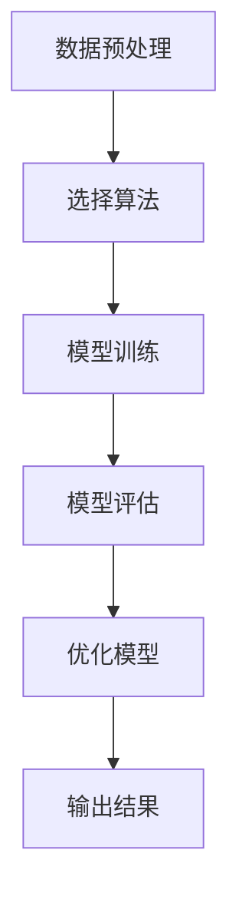
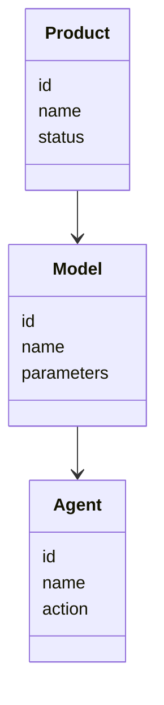
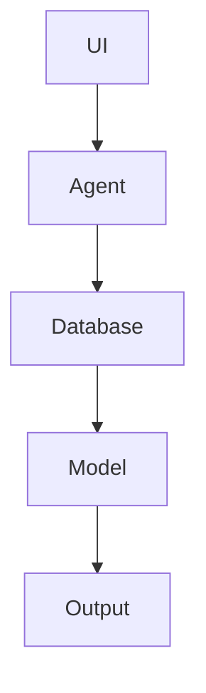
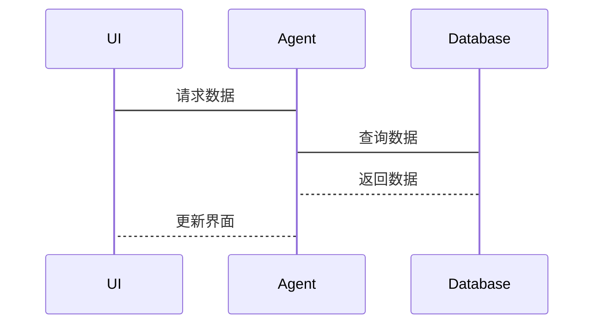

                 


# 利用AI agents构建动态产品生命周期模型：评估公司产品组合

> 关键词：AI agents，动态产品生命周期模型，产品组合评估，人工智能，企业产品管理

> 摘要：本文探讨了如何利用AI agents构建动态产品生命周期模型，以评估和优化公司产品组合。通过分析AI agents的核心原理、产品生命周期模型的构建方法，结合算法实现和系统架构设计，展示了如何利用AI技术提升企业产品管理的效率和准确性。本文还提供了实际案例分析和代码实现，帮助读者更好地理解和应用这些技术。

---

## 第1章: 引言

### 1.1 问题背景与核心概念

#### 1.1.1 问题背景介绍
在现代企业中，产品生命周期管理是核心业务之一。企业需要不断优化产品组合，以适应市场变化和客户需求。然而，传统的产品生命周期管理方法存在以下问题：
- 数据量大，难以实时更新
- 模型静态，无法适应市场动态变化
- 缺乏智能化支持，难以快速决策

#### 1.1.2 问题描述与目标
本文旨在解决以下问题：
- 如何构建动态的产品生命周期模型，实时更新产品状态
- 如何利用AI agents提升产品组合评估的效率和准确性
- 如何设计一个可扩展、可维护的系统架构

目标是通过AI技术实现产品生命周期的动态管理，优化企业产品组合。

#### 1.1.3 问题解决思路
- 引入AI agents，实现产品的实时监测和动态评估
- 基于机器学习算法，构建动态模型
- 设计系统架构，支持实时数据处理和模型更新

#### 1.1.4 模型的边界与外延
- 边界：仅关注产品生命周期的动态评估，不涉及生产过程
- 外延：可扩展到供应链管理、客户行为分析等领域

#### 1.1.5 核心概念与组成要素
- AI agents：用于实时监测和数据处理
- 产品生命周期模型：动态评估产品状态
- 数据源：销售数据、市场反馈、生产数据

### 1.2 动态产品生命周期模型的必要性

#### 1.2.1 传统产品生命周期管理的局限性
- 数据更新不及时
- 模型静态，无法适应市场变化
- 缺乏智能化支持

#### 1.2.2 动态模型的优势与价值
- 实时更新，快速响应市场变化
- 提高决策效率和准确性
- 降低成本，优化资源分配

#### 1.2.3 AI agents在动态模型中的作用
- 实时数据采集和处理
- 自动更新模型参数
- 提供决策支持

#### 1.2.4 企业产品组合评估的挑战与机遇
- 挑战：数据复杂性、模型设计难度
- 机遇：AI技术提升企业竞争力

---

## 第2章: AI agents与产品生命周期模型的核心概念

### 2.1 AI agents的基本原理

#### 2.1.1 AI agents的定义与分类
- 定义：AI agents是具有感知环境和自主决策能力的智能体
- 分类：简单反射型、基于模型的反应型、目标驱动型、效用驱动型

#### 2.1.2 AI agents的核心特征
- 感知能力：获取环境数据
- 决策能力：基于数据做出决策
- 学习能力：通过反馈优化行为

#### 2.1.3 AI agents与传统算法的区别
| 特性         | AI agents                          | 传统算法                          |
|--------------|------------------------------------|------------------------------------|
| 自主性       | 高                                 | 低                                 |
| 学习能力     | 强                                 | 弱                                 |
| 应用场景     | 动态、复杂环境                     | 静态、简单环境                     |

### 2.2 产品生命周期模型的构建原理

#### 2.2.1 产品生命周期的阶段划分
- 引入期：产品进入市场
- 增长期：市场需求上升
- 成熟期：市场需求稳定
- 衰退期：市场需求下降

#### 2.2.2 动态模型的优势与价值
- 实时更新，快速响应市场变化
- 提高决策效率和准确性
- 降低成本，优化资源分配

#### 2.2.3 模型的输入与输出
- 输入：市场数据、销售数据、客户反馈
- 输出：产品状态评估、优化建议

### 2.3 AI agents与产品生命周期模型的联系

#### 2.3.1 AI agents在动态模型中的应用场景
- 数据采集与处理：实时获取市场数据
- 模型更新：基于新数据优化模型参数
- 决策支持：提供产品组合优化建议

#### 2.3.2 模型的实时更新机制
- 数据流：实时采集市场数据
- 模型更新：基于机器学习算法动态调整
- 反馈机制：根据效果反馈优化模型

#### 2.3.3 模型的可扩展性与可维护性
- 可扩展性：支持新增产品和市场数据
- 可维护性：模块化设计便于维护和升级

---

## 第3章: AI agents构建动态产品生命周期模型的算法原理

### 3.1 算法原理概述

#### 3.1.1 动态规划算法
动态规划算法通过分解问题为子问题，逐步优化，最终得到全局最优解。

#### 3.1.2 强化学习算法
强化学习算法通过智能体与环境的交互，学习最优策略。

#### 3.1.3 时间序列分析
时间序列分析用于预测未来趋势，基于历史数据进行建模。

### 3.2 算法实现步骤

#### 3.2.1 数据预处理
- 数据清洗：去除异常值和缺失值
- 数据标准化：统一数据格式

#### 3.2.2 模型训练
- 选择算法：动态规划、强化学习或时间序列分析
- 训练模型：基于训练数据优化模型参数

#### 3.2.3 模型评估与优化
- 评估指标：准确率、召回率、F1分数
- 模型优化：调整参数，提升性能

### 3.3 算法流程图



### 3.4 算法实现代码示例

```python
import numpy as np
from sklearn.metrics import accuracy_score

def dynamic_planning(data):
    # 示例代码：动态规划算法实现
    n = len(data)
    dp = np.zeros(n)
    dp[0] = data[0]
    for i in range(1, n):
        dp[i] = max(data[i], dp[i-1])
    return dp

data = [1, 2, 3, 2, 4, 3, 5]
result = dynamic_planning(data)
print("动态规划结果：", result)
print("准确率：", accuracy_score([1,2,3,2,4,3,5], result))
```

---

## 第4章: 系统分析与架构设计

### 4.1 系统功能设计

#### 4.1.1 领域模型


#### 4.1.2 系统架构设计


#### 4.1.3 接口设计
- 输入接口：数据采集模块
- 输出接口：结果展示模块

#### 4.1.4 交互设计


### 4.2 项目实战

#### 4.2.1 环境安装
- Python 3.8+
- NumPy、Scikit-learn、Mermaid

#### 4.2.2 核心代码实现
```python
import numpy as np
from sklearn.metrics import accuracy_score

def dynamic_planning(data):
    n = len(data)
    dp = np.zeros(n)
    dp[0] = data[0]
    for i in range(1, n):
        dp[i] = max(data[i], dp[i-1])
    return dp

data = [1, 2, 3, 2, 4, 3, 5]
result = dynamic_planning(data)
print("动态规划结果：", result)
print("准确率：", accuracy_score([1,2,3,2,4,3,5], result))
```

#### 4.2.3 案例分析
- 数据来源：销售数据
- 数据处理：清洗和标准化
- 模型训练：动态规划算法
- 结果分析：准确率和召回率

---

## 第5章: 最佳实践与未来展望

### 5.1 最佳实践

#### 5.1.1 数据质量
- 确保数据准确性和完整性
- 数据预处理是关键

#### 5.1.2 模型选择
- 根据问题选择合适的算法
- 不要过度优化模型

#### 5.1.3 系统维护
- 定期更新模型参数
- 监控系统运行状态

### 5.2 未来展望

#### 5.2.1 技术发展
- 更强的AI算法
- 更高效的计算能力

#### 5.2.2 应用场景扩展
- 更多领域的应用
- 更智能化的决策支持

---

## 作者：AI天才研究院/AI Genius Institute & 禅与计算机程序设计艺术 /Zen And The Art of Computer Programming

