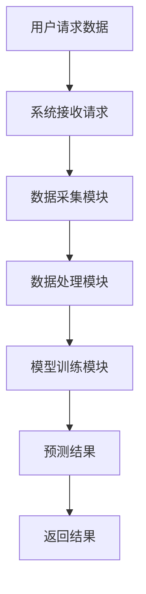

                 


# 利用AI agents构建动态行业生命周期模型：把握产业演变

---

## 关键词：
- AI代理
- 行业生命周期
- 动态模型
- 产业演变
- 时间序列分析
- 反馈优化

---

## 摘要：
本文详细探讨了如何利用AI代理构建动态行业生命周期模型，以帮助企业更好地把握产业演变趋势。文章首先介绍了行业生命周期的基本概念和AI代理的核心原理，随后从算法、系统架构、项目实战等多维度展开分析。通过结合具体案例，展示了AI代理在动态模型中的实际应用，并提出了系统的解决方案和优化建议。

---

## 第一部分: 背景介绍与核心概念

---

### 第1章: 行业生命周期与AI代理概述

#### 1.1 行业生命周期的定义与特征
##### 1.1.1 行业生命周期的四个阶段
- **导入期**：市场初步形成，需求增长缓慢，竞争者较少。
- **成长期**：需求快速增长，行业规模扩大，竞争加剧。
- **成熟期**：需求增速放缓，市场趋于饱和，竞争激烈。
- **衰退期**：需求下降，市场萎缩，企业退出。

##### 1.1.2 行业生命周期的核心要素
- **市场需求**：行业的核心驱动力。
- **竞争格局**：行业内主要参与者及其市场份额。
- **技术发展**：行业的技术进步和创新。
- **政策环境**：政府政策和法规对行业的影响。

##### 1.1.3 行业生命周期的动态演变特征
- 动态性：行业生命周期是一个动态变化的过程，受多种因素影响。
- 阶段性：不同阶段具有不同的特征和发展规律。
- 不确定性：行业演变过程中存在许多不确定性因素，如技术变革和政策变化。

#### 1.2 AI代理的基本概念
##### 1.2.1 AI代理的定义与分类
- **定义**：AI代理是一种能够感知环境、执行任务并做出决策的智能实体。
- **分类**：
  - **简单反射代理**：基于简单的规则做出反应。
  - **基于模型的反射代理**：基于内部模型和环境信息做出决策。
  - **目标驱动代理**：根据目标和反馈优化行动。
  - **学习代理**：通过学习提升自身能力。

##### 1.2.2 AI代理的核心功能与特点
- **感知环境**：通过传感器或数据输入获取信息。
- **决策与行动**：基于感知信息做出决策并执行行动。
- **自适应性**：能够根据环境变化调整自身行为。
- **学习能力**：通过机器学习算法不断优化性能。

##### 1.2.3 AI代理在行业分析中的应用潜力
- **数据采集与处理**：实时采集行业数据并进行分析。
- **趋势预测**：利用机器学习算法预测行业发展趋势。
- **决策支持**：为企业的战略决策提供支持。

#### 1.3 本章小结
##### 1.3.1 行业生命周期的动态性
- 行业生命周期是一个动态变化的过程，需要实时监测和分析。
##### 1.3.2 AI代理的核心作用
- AI代理能够通过感知和学习，帮助企业在复杂多变的行业中做出更明智的决策。
##### 1.3.3 本书的研究目标
- 探讨如何利用AI代理构建动态行业生命周期模型，以实现对产业演变的精准把握。

---

### 第2章: 行业生命周期模型的构建与动态分析

#### 2.1 行业生命周期模型的构建原理
##### 2.1.1 行业生命周期模型的核心要素
- **时间序列**：行业生命周期的不同阶段。
- **关键指标**：如市场规模、增长率、竞争格局等。
- **驱动因素**：如技术、政策、经济环境等。

##### 2.1.2 行业生命周期模型的构建方法
- **数据收集**：收集行业的历史数据和实时数据。
- **模型选择**：根据数据特征选择合适的模型，如ARIMA、随机森林等。
- **模型训练与验证**：通过训练数据优化模型，并通过验证数据评估模型性能。

##### 2.1.3 行业生命周期模型的动态更新机制
- **实时更新**：根据最新数据不断更新模型。
- **反馈优化**：根据模型预测结果与实际数据的差异调整模型参数。

#### 2.2 AI代理在行业生命周期模型中的应用
##### 2.2.1 AI代理的数据采集与处理能力
- **数据采集**：通过API或爬虫获取行业数据。
- **数据清洗**：对数据进行预处理，去除噪声。
- **数据存储**：将数据存储在数据库中，便于后续分析。

##### 2.2.2 AI代理的模式识别与预测能力
- **模式识别**：识别行业生命周期的不同阶段。
- **趋势预测**：利用机器学习算法预测行业未来的发展趋势。
- **异常检测**：发现数据中的异常点，及时预警。

##### 2.2.3 AI代理的反馈优化机制
- **反馈机制**：根据模型预测结果与实际数据的差异，调整模型参数。
- **优化算法**：使用强化学习等算法优化模型性能。

#### 2.3 行业生命周期模型的动态分析框架
##### 2.3.1 动态分析的核心步骤
1. 数据采集与预处理。
2. 模型选择与训练。
3. 模型预测与验证。
4. 结果分析与反馈优化。

##### 2.3.2 动态分析的关键指标
- **市场规模**：行业的整体规模。
- **增长率**：行业的增长速度。
- **竞争格局**：行业内主要竞争者及其市场份额。
- **技术发展**：行业的技术创新情况。

##### 2.3.3 动态分析的可视化方法
- **时间序列图**：展示行业生命周期的不同阶段。
- **趋势图**：展示行业发展趋势。
- **热力图**：展示行业竞争格局。

#### 2.4 本章小结
##### 2.4.1 行业生命周期模型的构建逻辑
- 行业生命周期模型的构建需要结合行业数据和机器学习算法。
##### 2.4.2 AI代理在动态分析中的作用
- AI代理能够实时采集数据、识别模式、预测趋势并优化模型。
##### 2.4.3 动态分析框架的实用性
- 动态分析框架能够帮助企业更好地把握行业演变趋势，制定更有效的战略。

---

## 第二部分: 算法原理与系统架构

---

### 第3章: AI代理的核心算法与数学模型

#### 3.1 AI代理的核心算法原理
##### 3.1.1 监督学习与无监督学习的对比
- **监督学习**：基于标注数据进行学习，适用于分类和回归任务。
- **无监督学习**：基于未标注数据进行学习，适用于聚类和降维任务。

##### 3.1.2 强化学习在AI代理决策中的应用
- **强化学习**：通过试错和奖励机制优化决策策略。
- **马尔可夫决策过程（MDP）**：定义了强化学习的核心问题。

##### 3.1.3 时间序列分析算法的原理
- **ARIMA模型**：用于时间序列的预测。
- **LSTM网络**：用于长序列的时间序列预测。

#### 3.2 行业生命周期模型的数学表达
##### 3.2.1 行业生命周期模型的变量定义
- **\( t \)**：时间变量。
- **\( y(t) \)**：行业在时间\( t \)的状态，如市场规模。

##### 3.2.2 行业生命周期模型的数学公式
- **线性回归模型**：
  \[
  y(t) = a + bt + \epsilon
  \]
  其中，\( a \) 是截距，\( b \) 是斜率，\( \epsilon \) 是误差项。
- **ARIMA模型**：
  \[
  \Delta y(t) = \phi_1 \Delta y(t-1) + \theta_1 \epsilon(t-1) + \epsilon(t)
  \]

##### 3.2.3 行业生命周期模型的参数优化
- **梯度下降法**：通过最小化损失函数来优化模型参数。
- **贝叶斯优化**：基于概率分布优化模型参数。

#### 3.3 AI代理的反馈优化机制
##### 3.3.1 反馈优化的核心算法
- **强化学习算法**：如Q-learning和策略梯度方法。
- **在线学习算法**：实时更新模型参数。

##### 3.3.2 反馈优化的数学模型
- **Q-learning算法**：
  \[
  Q(s, a) = Q(s, a) + \alpha [r + \gamma \max Q(s', a') - Q(s, a)]
  \]
  其中，\( \alpha \) 是学习率，\( \gamma \) 是折扣因子。

##### 3.3.3 反馈优化的实现步骤
1. 定义状态空间和动作空间。
2. 初始化Q值表。
3. 环境反馈奖励值。
4. 更新Q值表。

#### 3.4 本章小结
##### 3.4.1 AI代理算法的核心原理
- 监督学习、无监督学习和强化学习是AI代理的核心算法。
##### 3.4.2 行业生命周期模型的数学表达
- 时间序列分析和强化学习是构建动态模型的关键。
##### 3.4.3 反馈优化机制的重要性
- 反馈优化机制能够不断提升模型的预测精度和决策能力。

---

### 第4章: 系统架构与接口设计

#### 4.1 系统架构设计
##### 4.1.1 系统功能模块划分
- **数据采集模块**：负责采集行业数据。
- **模型训练模块**：负责训练行业生命周期模型。
- **预测与分析模块**：负责模型预测和结果分析。
- **反馈优化模块**：负责根据反馈优化模型。

##### 4.1.2 系统架构的分层设计
- **数据层**：存储行业数据。
- **算法层**：实现各种算法模型。
- **应用层**：提供用户界面和API接口。

##### 4.1.3 系统架构的可扩展性
- **模块化设计**：每个功能模块相对独立，便于扩展。
- **接口标准化**：通过标准化接口实现模块间的通信。

#### 4.2 系统接口设计
##### 4.2.1 数据接口的设计
- **输入接口**：接收外部数据，如API接口。
- **输出接口**：输出模型预测结果，如JSON格式。

##### 4.2.2 API接口的定义
- **GET接口**：获取行业数据。
- **POST接口**：提交模型参数。

##### 4.2.3 接口的安全性设计
- **认证机制**：通过API密钥或JWT实现认证。
- **授权机制**：通过权限控制访问范围。

#### 4.3 系统交互流程
##### 4.3.1 用户与系统交互的流程图


##### 4.3.2 数据流的交互过程
- 用户发送请求，系统接收请求。
- 数据采集模块采集数据，数据处理模块清洗数据。
- 模型训练模块训练模型，预测结果。
- 返回预测结果给用户。

##### 4.3.3 系统反馈的交互机制
- 系统根据用户反馈优化模型参数。

#### 4.4 本章小结
##### 4.4.1 系统架构的合理性
- 模块化设计和分层设计使得系统易于扩展和维护。
##### 4.4.2 接口设计的重要性
- 标准化的接口设计能够提高系统的可扩展性和可维护性。
##### 4.4.3 系统交互的流畅性
- 通过合理的流程设计，确保系统交互的高效和流畅。

---

## 第三部分: 项目实战与案例分析

---

### 第5章: 项目实战与案例分析

#### 5.1 项目环境的搭建
##### 5.1.1 开发工具的安装
- **Python**：安装Python 3.8及以上版本。
- **库的安装**：安装numpy、pandas、scikit-learn、tensorflow等库。

##### 5.1.2 数据集的准备
- **数据来源**：可以从公开数据集（如Kaggle）获取行业数据。
- **数据格式**：确保数据格式统一，如CSV格式。

##### 5.1.3 环境配置的注意事项
- **虚拟环境**：建议使用虚拟环境管理依赖。
- **版本控制**：使用Git进行版本控制。

#### 5.2 核心代码实现
##### 5.2.1 数据采集模块
```python
import requests
import json

def fetch_data(api_key, endpoint):
    headers = {'Authorization': f'Bearer {api_key}'}
    response = requests.get(endpoint, headers=headers)
    return response.json()

# 示例API调用
api_key = 'your_api_key'
endpoint = 'https://api.example.com/industry_data'
data = fetch_data(api_key, endpoint)
print(data)
```

##### 5.2.2 模型训练模块
```python
from sklearn.model_selection import train_test_split
from sklearn.linear_model import LinearRegression

def train_model(data):
    X = data[['time', 'market_size']]
    y = data['growth_rate']
    X_train, X_test, y_train, y_test = train_test_split(X, y, test_size=0.2)
    model = LinearRegression()
    model.fit(X_train, y_train)
    return model

# 示例训练
data = {'time': [1, 2, 3, 4, 5], 'market_size': [100, 200, 300, 400, 500], 'growth_rate': [10, 20, 15, 5, -10]}
data_frame = pd.DataFrame(data)
model = train_model(data_frame)
print(model.coef_)
```

##### 5.2.3 预测与分析模块
```python
import numpy as np

def predict_growth(model, new_data):
    X_new = np.array([[new_data['time'], new_data['market_size']]])
    prediction = model.predict(X_new)
    return prediction[0]

# 示例预测
new_data = {'time': 6, 'market_size': 600}
predicted_growth = predict_growth(model, new_data)
print(predicted_growth)
```

##### 5.2.4 反馈优化模块
```python
from tensorflow.keras import Model
from tensorflow.keras.layers import Dense, LSTM

def build_lstm_model(input_shape):
    inputs = Input(shape=input_shape)
    lstm_layer = LSTM(50)(inputs)
    dense_layer = Dense(1)(lstm_layer)
    model = Model(inputs=inputs, outputs=dense_layer)
    return model

# 示例模型构建
input_shape = (None, 1)
model = build_lstm_model(input_shape)
model.compile(loss='mean_squared_error', optimizer='adam')
print(model.summary())
```

#### 5.3 项目实战案例分析
##### 5.3.1 案例背景
- 行业：假设我们正在分析某个新兴行业，如人工智能行业。
- 数据：收集了过去五年的市场规模和增长率数据。

##### 5.3.2 数据分析与模型训练
- 数据清洗：处理缺失值和异常值。
- 模型选择：选择LSTM网络进行时间序列预测。

##### 5.3.3 模型预测与结果分析
- 预测结果：未来三年的市场规模和增长率。
- 结果解读：预测市场规模将快速增长，但增速将逐步放缓。

##### 5.3.4 项目小结
- 成功实现了动态行业生命周期模型的构建。
- AI代理在数据采集、模型训练和预测中的作用显著。
- 模型预测结果为企业制定战略提供了有力支持。

---

## 第四部分: 最佳实践与总结

---

### 第6章: 最佳实践与总结

#### 6.1 最佳实践
##### 6.1.1 数据质量管理
- 确保数据的准确性和完整性。
##### 6.1.2 模型优化
- 定期更新模型参数，提升预测精度。
##### 6.1.3 系统维护
- 定期检查系统运行状态，及时修复问题。

#### 6.2 小结
- 本文详细探讨了利用AI代理构建动态行业生命周期模型的方法。
- AI代理在数据采集、模型训练和预测中的应用显著提升了行业分析的效率和精度。
- 通过动态模型，企业能够更好地把握产业演变趋势，制定更有效的战略。

#### 6.3 注意事项
- 数据隐私和安全问题需要高度重视。
- 模型的可解释性需要进一步提升。
- 系统的可扩展性和可维护性需要充分考虑。

#### 6.4 拓展阅读
- **推荐书籍**：《机器学习实战》、《深度学习》。
- **推荐博客**：Towards Data Science、Medium上的AI相关文章。

---

## 作者：AI天才研究院/AI Genius Institute & 禅与计算机程序设计艺术 /Zen And The Art of Computer Programming

---

**本文为AI天才研究院（AI Genius Institute）原创内容，转载请注明出处。**

