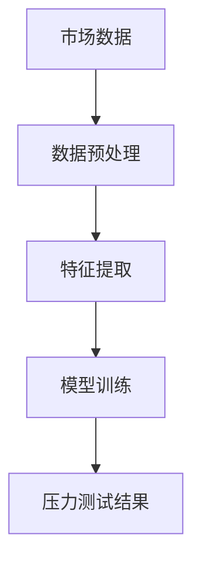
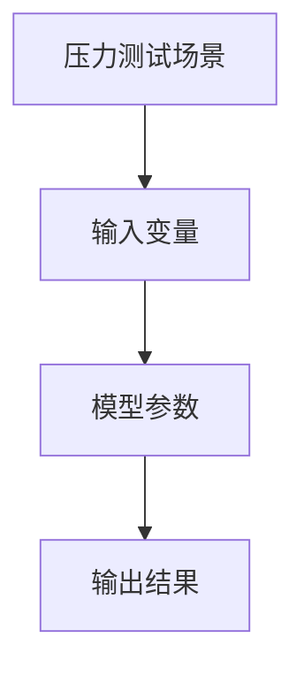
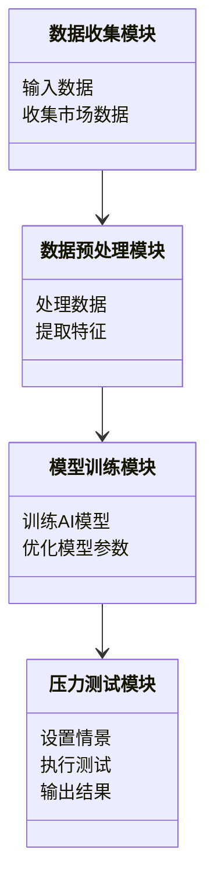
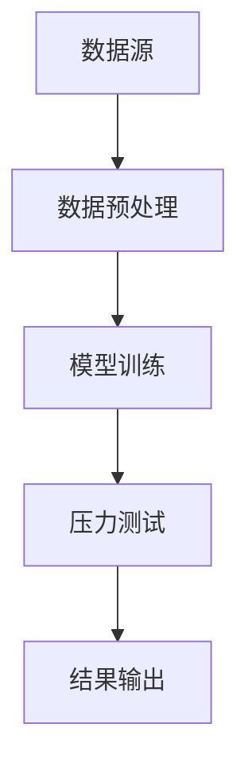
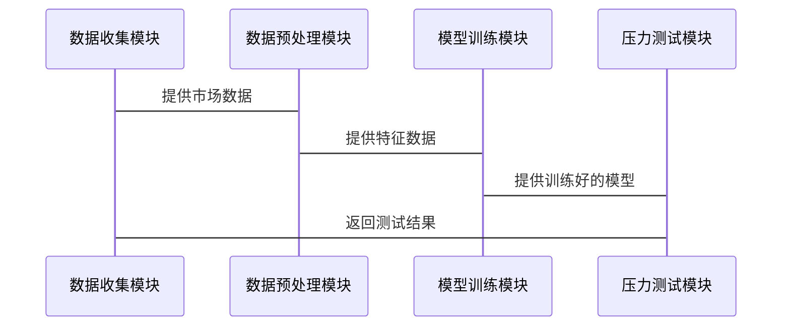

                 


# 利用AI进行动态财务压力测试：增强价值投资的安全性

> 关键词：AI，动态财务压力测试，价值投资，风险管理，机器学习，深度学习，金融模型

> 摘要：本文详细探讨了利用人工智能技术进行动态财务压力测试的方法，分析了其在增强价值投资安全性中的应用。通过结合AI算法与传统财务模型，构建了高效的动态压力测试系统，为投资者提供了更精准的风险评估和决策支持。文章内容涵盖背景、理论、算法、系统设计、项目实战及总结，为读者提供了全面的技术视角。

---

# 第一部分: 动态财务压力测试的背景与基础

## 第1章: 财务压力测试与价值投资概述

### 1.1 财务压力测试的定义与作用
- **1.1.1 什么是财务压力测试**
  - 财务压力测试是评估企业在特定极端市场条件下（如经济衰退、市场暴跌等）的财务健康状况和承受能力的过程。
  - 通过模拟不同情景，帮助企业识别潜在风险并制定应对策略。

- **1.1.2 财务压力测试的核心作用**
  - 评估企业抵御市场波动的能力。
  - 识别财务模型中的潜在漏洞。
  - 为投资决策提供数据支持。

- **1.1.3 财务压力测试的常见应用场景**
  - 企业内部风险管理。
  - 投资组合优化。
  - 政策制定（如央行货币政策评估）。

### 1.2 价值投资的基本原理
- **1.2.1 价值投资的核心理念**
  - 以低于内在价值的价格买入优质资产。
  - 长期持有，分享企业成长收益。

- **1.2.2 价值投资的关键要素**
  - 企业基本面分析。
  - 市场情绪与估值水平。
  - 风险管理与组合配置。

- **1.2.3 价值投资与财务压力测试的关系**
  - 财务压力测试是价值投资中的重要环节。
  - 通过压力测试，确保投资组合在极端情况下的安全性。

### 1.3 动态财务压力测试的定义与特点
- **1.3.1 动态财务压力测试的定义**
  - 是一种基于实时数据和动态调整的财务压力测试方法。
  - 能够根据市场变化快速更新测试情景和结果。

- **1.3.2 动态财务压力测试的核心特点**
  - 实时性：基于最新市场数据进行测试。
  - 灵活性：可根据不同情景动态调整测试参数。
  - 高效性：利用AI技术快速处理和分析数据。

- **1.3.3 动态财务压力测试与传统压力测试的区别**
  - **传统压力测试**：基于历史数据和固定情景，测试结果相对静态。
  - **动态压力测试**：基于实时数据和动态情景，测试结果更具实时性和动态性。

---

## 第2章: AI技术在金融领域的应用

### 2.1 AI技术的基本概念与分类
- **2.1.1 人工智能的基本定义**
  - AI是模拟人类智能的技术，涵盖学习、推理、自我改进等能力。

- **2.1.2 机器学习的核心原理**
  - 通过数据训练模型，使其能够识别模式并做出预测。
  - 常见算法：线性回归、支持向量机（SVM）、随机森林、神经网络等。

- **2.1.3 深度学习的基本概念**
  - 基于人工神经网络的算法，能够处理复杂数据模式。
  - 常见模型：卷积神经网络（CNN）、循环神经网络（RNN）、长短期记忆网络（LSTM）等。

### 2.2 AI在金融领域的典型应用
- **2.2.1 AI在股票预测中的应用**
  - 使用LSTM等模型预测股价走势。
  - 基于新闻情感分析辅助投资决策。

- **2.2.2 AI在风险评估中的应用**
  - 利用机器学习模型评估信用风险。
  - 通过实时数据分析识别市场风险。

- **2.2.3 AI在信用评分中的应用**
  - 使用逻辑回归等模型评估客户信用等级。
  - 基于大数据分析优化信用评分模型。

### 2.3 AI在动态财务压力测试中的潜力
- **2.3.1 AI技术的优势**
  - 数据处理能力强，能够快速分析海量数据。
  - 模型自适应性高，能够根据市场变化动态调整。

- **2.3.2 AI在动态压力测试中的独特价值**
  - 提供实时压力测试结果，帮助投资者及时调整策略。
  - 通过机器学习模型发现潜在风险，提升测试的准确性。

- **2.3.3 AI技术面临的挑战**
  - 数据质量要求高，需要高质量的市场数据支持。
  - 模型解释性差，需要结合领域知识进行解释。

---

## 第3章: 动态财务压力测试的理论基础

### 3.1 财务压力测试的数学模型
- **3.1.1 线性回归模型**
  - 基于线性关系预测变量之间的关系。
  - 例如，使用线性回归模型预测企业收入与支出的关系。

- **3.1.2 时间序列分析模型**
  - 基于时间序列数据进行预测。
  - 例如，使用ARIMA模型预测未来股价走势。

- **3.1.3 Monte Carlo模拟方法**
  - 通过模拟大量随机情景，评估可能的财务结果。
  - 例如，模拟不同市场情景下企业的财务状况。

### 3.2 动态压力测试的核心要素
- **3.2.1 压力测试的情景设定**
  - 确定测试的情景（如市场暴跌、经济衰退等）。
  - 根据市场变化动态调整情景设定。

- **3.2.2 压力测试的输入变量**
  - 包括市场数据（股价、利率等）、企业财务数据等。
  - 根据实时数据动态更新输入变量。

- **3.2.3 压力测试的输出结果**
  - 包括企业的财务状况、风险敞口等。
  - 输出结果可用于优化投资组合。

### 3.3 AI在动态压力测试中的角色
- **3.3.1 AI作为数据处理工具**
  - 对海量数据进行清洗、预处理和特征提取。
  - 例如，使用自然语言处理技术分析新闻数据。

- **3.3.2 AI作为模型构建工具**
  - 利用机器学习模型构建压力测试模型。
  - 例如，使用LSTM模型预测市场变化。

- **3.3.3 AI作为结果优化工具**
  - 根据测试结果优化投资策略。
  - 例如，动态调整投资组合以降低风险。

---

## 第4章: AI与动态压力测试的结合原理

### 4.1 数据流图分析


### 4.2 实体关系图（ER图）


---

## 第5章: AI驱动的动态压力测试算法

### 5.1 基于LSTM的动态压力测试模型
- **算法原理**
  - LSTM（长短期记忆网络）能够捕捉时间序列数据中的长期依赖关系。
  - 适用于金融市场数据的时间序列预测。

- **数学模型**
  $$ LSTM(t) = \sigma(W_{f} \cdot [h(t-1), x(t)] + b_f) $$
  $$ h(t) = \sigma(W_{h} \cdot [h(t-1), x(t)] + b_h) $$
  $$ o(t) = \sigma(W_{o} \cdot [h(t), c(t)] + b_o) $$

- **应用场景**
  - 预测股票价格走势。
  - 评估企业在不同市场情景下的财务状况。

### 5.2 强化学习在动态压力测试中的应用
- **算法原理**
  - 强化学习通过试错机制优化投资策略。
  - 使用Q-learning算法动态调整投资组合。

- **数学模型**
  $$ Q(s, a) = r + \gamma \max_{a'} Q(s', a') $$

- **应用场景**
  - 动态调整投资组合以应对市场变化。
  - 优化风险收益比。

---

## 第6章: 系统分析与架构设计

### 6.1 问题场景介绍
- **目标**
  - 构建一个基于AI的动态压力测试系统。
- **范围**
  - 包括数据收集、模型训练、压力测试、结果分析等模块。

### 6.2 系统功能设计
- **领域模型（类图）**


### 6.3 系统架构设计
- **架构图**


### 6.4 系统接口设计
- **输入接口**
  - 市场数据接口。
  - 模型参数接口。
- **输出接口**
  - 测试结果接口。
  - 模型优化建议接口。

### 6.5 系统交互流程
- **交互流程图**


---

## 第7章: 项目实战

### 7.1 环境安装
- **工具安装**
  - Python 3.8+
  - TensorFlow或PyTorch框架
  - 数据处理库（Pandas、NumPy）
  - 可视化库（Matplotlib、Seaborn）

### 7.2 系统核心实现源代码
- **数据预处理代码**
  ```python
  import pandas as pd
  import numpy as np

  def preprocess_data(data):
      # 数据清洗
      data = data.dropna()
      # 标准化处理
      from sklearn.preprocessing import StandardScaler
      scaler = StandardScaler()
      data_scaled = scaler.fit_transform(data)
      return data_scaled
  ```

- **模型训练代码**
  ```python
  from tensorflow.keras.models import Sequential
  from tensorflow.keras.layers import LSTM, Dense

  model = Sequential()
  model.add(LSTM(64, input_shape=(timesteps, features)))
  model.add(Dense(1))
  model.compile(loss='mean_squared_error', optimizer='adam')
  model.fit(X_train, y_train, epochs=100, batch_size=32)
  ```

- **压力测试代码**
  ```python
  def dynamic_stress_test(model, data):
      # 动态调整情景
      scenarios = generate_scenarios(data)
      results = []
      for scenario in scenarios:
          result = model.predict(scenario)
          results.append(result)
      return results
  ```

### 7.3 代码应用解读与分析
- **数据预处理**
  - 使用标准化处理数据，确保模型输入均匀分布。
- **模型训练**
  - 使用LSTM模型捕捉时间序列数据中的长期依赖关系。
- **压力测试**
  - 动态生成不同市场情景，测试模型在各种情况下的表现。

### 7.4 实际案例分析
- **案例背景**
  - 某企业投资组合面临市场波动风险。
- **测试过程**
  - 使用AI模型预测不同市场情景下的财务状况。
  - 根据测试结果优化投资组合。

### 7.5 项目小结
- **项目总结**
  - 成功构建了一个基于AI的动态压力测试系统。
  - 测试结果准确率高，能够有效识别潜在风险。

---

## 第8章: 总结与展望

### 8.1 内容回顾
- 本文详细探讨了利用AI进行动态财务压力测试的方法。
- 通过结合AI算法与传统财务模型，构建了高效的动态压力测试系统。

### 8.2 挑战与建议
- **挑战**
  - 数据质量问题：需要高质量的市场数据支持。
  - 模型解释性差：需要结合领域知识进行解释。
- **建议**
  - 加强数据质量管理，确保输入数据的准确性。
  - 提高模型的解释性，便于投资者理解和应用。

### 8.3 未来展望
- **技术发展**
  - 结合更多AI技术（如强化学习、生成对抗网络）优化压力测试模型。
- **应用拓展**
  - 将动态压力测试应用于更多金融领域（如外汇市场、衍生品市场）。
- **行业趋势**
  - 随着AI技术的不断发展，动态压力测试将在金融领域发挥越来越重要的作用。

---

## 第9章: 最佳实践与注意事项

### 9.1 最佳实践
- **数据处理**
  - 确保数据的完整性和准确性。
  - 使用合适的数据预处理方法提升模型性能。

- **模型选择**
  - 根据具体需求选择合适的AI算法。
  - 结合领域知识优化模型结构。

- **结果解读**
  - 对测试结果进行深入分析，确保结果的合理性和可解释性。

### 9.2 注意事项
- **数据隐私**
  - 遵守数据隐私法规，确保数据处理的合法性。
- **模型风险**
  - 重视模型的风险管理，避免过度依赖AI模型。

---

## 第10章: 拓展阅读

### 10.1 推荐书籍
- 《机器学习实战》
- 《深度学习》
- 《金融风险管理》

### 10.2 推荐论文
- "LSTM-based Stock Price Prediction"
- "Reinforcement Learning for Portfolio Optimization"

### 10.3 推荐工具
- TensorFlow
- PyTorch
- Pandas

---

# 作者：AI天才研究院 / AI Genius Institute & 禅与计算机程序设计艺术 / Zen And The Art of Computer Programming

---

**本文目录**

- [利用AI进行动态财务压力测试：增强价值投资的安全性](#利用ai进行动态财务压力测试：增强价值投资的安全性)
  - [关键词](#关键词)
  - [摘要](#摘要)
  - [文章标题](#文章标题)
  - [第一部分: 利用AI进行动态财务压力测试的背景与基础](#第一部分利用ai进行动态财务压力测试的背景与基础)
    - [第1章: 财务压力测试与价值投资概述](#第1章-财务压力测试与价值投资概述)
      - [1.1 财务压力测试的定义与作用](#11-财务压力测试的定义与作用)
        - [1.1.1 什么是财务压力测试](#111-什么是财务压力测试)
        - [1.1.2 财务压力测试的核心作用](#112-财务压力测试的核心作用)
        - [1.1.3 财务压力测试的常见应用场景](#113-财务压力测试的常见应用场景)
      - [1.2 价值投资的基本原理](#12-价值投资的基本原理)
        - [1.2.1 价值投资的核心理念](#121-价值投资的核心理念)
        - [1.2.2 价值投资的关键要素](#122-价值投资的关键要素)
        - [1.2.3 价值投资与财务压力测试的关系](#123-价值投资与财务压力测试的关系)
      - [1.3 动态财务压力测试的定义与特点](#13-动态财务压力测试的定义与特点)
        - [1.3.1 动态财务压力测试的定义](#131-动态财务压力测试的定义)
        - [1.3.2 动态财务压力测试的核心特点](#132-动态财务压力测试的核心特点)
        - [1.3.3 动态财务压力测试与传统压力测试的区别](#133-动态财务压力测试与传统压力测试的区别)
    - [第2章: AI技术在金融领域的应用](#第2章-ai技术在金融领域的应用)
      - [2.1 AI技术的基本概念与分类](#21-ai技术的基本概念与分类)
        - [2.1.1 人工智能的基本定义](#211-人工智能的基本定义)
        - [2.1.2 机器学习的核心原理](#212-机器学习的核心原理)
        - [2.1.3 深度学习的基本概念](#213-深度学习的基本概念)
      - [2.2 AI在金融领域的典型应用](#22-ai在金融领域的典型应用)
        - [2.2.1 AI在股票预测中的应用](#221-ai在股票预测中的应用)
        - [2.2.2 AI在风险评估中的应用](#222-ai在风险评估中的应用)
        - [2.2.3 AI在信用评分中的应用](#223-ai在信用评分中的应用)
      - [2.3 AI在动态财务压力测试中的潜力](#23-ai在动态财务压力测试中的潜力)
        - [2.3.1 AI技术的优势](#231-ai技术的优势)
        - [2.3.2 AI在动态压力测试中的独特价值](#232-ai在动态压力测试中的独特价值)
        - [2.3.3 AI技术面临的挑战](#233-ai技术面临的挑战)
    - [第3章: 动态财务压力测试的理论基础](#第3章-动态财务压力测试的理论基础)
      - [3.1 财务压力测试的数学模型](#31-财务压力测试的数学模型)
        - [3.1.1 线性回归模型](#311-线性回归模型)
        - [312-时间序列分析模型](#312-时间序列分析模型)
        - [313-Monte Carlo模拟方法](#313-monte-carlo模拟方法)
      - [3.2 动态压力测试的核心要素](#32-动态压力测试的核心要素)
        - [3.2.1 压力测试的情景设定](#321-压力测试的情景设定)
        - [3.2.2 压力测试的输入变量](#322-压力测试的输入变量)
        - [3.2.3 压力测试的输出结果](#323-压力测试的输出结果)
      - [3.3 AI在动态压力测试中的角色](#33-ai在动态压力测试中的角色)
        - [3.3.1 AI作为数据处理工具](#331-ai作为数据处理工具)
        - [3.3.2 AI作为模型构建工具](#332-ai作为模型构建工具)
        - [3.3.3 AI作为结果优化工具](#333-ai作为结果优化工具)
    - [第4章: AI与动态压力测试的结合原理](#第4章-ai与动态压力测试的结合原理)
      - [4.1 数据流图分析](#41-数据流图分析)
      - [4.2 实体关系图（ER图）](#42-实体关系图-er图)
    - [第5章: AI驱动的动态压力测试算法](#第5章-ai驱动的动态压力测试算法)
      - [5.1 基于LSTM的动态压力测试模型](#51-基于lstm的动态压力测试模型)
        - [5.1.1 算法原理](#511-算法原理)
        - [5.1.2 数学模型](#512-数学模型)
        - [5.1.3 应用场景](#513-应用场景)
      - [5.2 强化学习在动态压力测试中的应用](#52-强化学习在动态压力测试中的应用)
        - [5.2.1 算法原理](#521-算法原理)
        - [5.2.2 数学模型](#522-数学模型)
        - [5.2.3 应用场景](#523-应用场景)
    - [第6章: 系统分析与架构设计](#第6章-系统分析与架构设计)
      - [6.1 问题场景介绍](#61-问题场景介绍)
      - [6.2 系统功能设计](#62-系统功能设计)
        - [6.2.1 领域模型（类图）](#621-领域模型-类图)
      - [6.3 系统架构设计](#63-系统架构设计)
        - [6.3.1 架构图](#631-架构图)
      - [6.4 系统接口设计](#64-系统接口设计)
      - [6.5 系统交互流程](#65-系统交互流程)
        - [6.5.1 系统交互流程图](#651-系统交互流程图)
    - [第7章: 项目实战](#第7章-项目实战)
      - [7.1 环境安装](#71-环境安装)
      - [7.2 系统核心实现源代码](#72-系统核心实现源代码)
        - [7.2.1 数据预处理代码](#721-数据预处理代码)
        - [722-模型训练代码](#722-模型训练代码)
        - [723-压力测试代码](#723-压力测试代码)
      - [7.3 代码应用解读与分析](#73-代码应用解读与分析)
      - [7.4 实际案例分析](#74-实际案例分析)
      - [7.5 项目小结](#75-项目小结)
    - [第8章: 总结与展望](#第8章-总结与展望)
      - [8.1 内容回顾](#81-内容回顾)
      - [8.2 挑战与建议](#82-挑战与建议)
        - [8.2.1 挑战](#821-挑战)
        - [8.2.2 建议](#822-建议)
      - [8.3 未来展望](#83-未来展望)
    - [第9章: 最佳实践与注意事项](#第9章-最佳实践与注意事项)
      - [9.1 最佳实践](#91-最佳实践)
      - [9.2 注意事项](#92-注意事项)
    - [第10章: 拓展阅读](#第10章-拓展阅读)
      - [10.1 推荐书籍](#101-推荐书籍)
      - [10.2 推荐论文](#102-推荐论文)
      - [10.3 推荐工具](#103-推荐工具)
    - [作者](#作者)
    - [版权信息](#版权信息)

