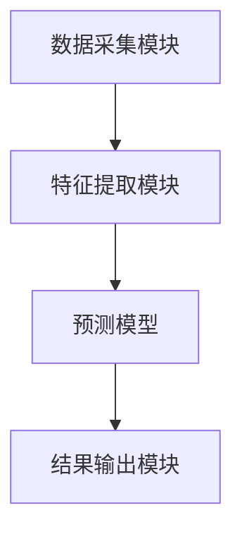

                 


# 利用多智能体AI增强价值投资的长期回报预测

> 关键词：多智能体AI，价值投资，长期回报预测，强化学习，协作学习，金融数据分析

> 摘要：本文探讨了如何利用多智能体AI技术增强价值投资的长期回报预测能力。通过分析多智能体系统的特性、价值投资的核心要素以及多智能体AI在金融领域的潜力，本文详细阐述了多智能体AI在价值投资中的应用前景。结合算法原理、系统设计和项目实战，本文为读者提供了一套基于多智能体AI的价值投资预测解决方案，并展望了未来的研究方向。

---

# 第1章: 多智能体AI与价值投资概述

## 1.1 多智能体AI的定义与特点

### 1.1.1 多智能体系统的定义
多智能体系统（Multi-Agent System, MAS）是由多个独立但协作的智能体组成的系统。每个智能体都有自己的目标、知识和行为方式，能够通过通信和协作完成复杂的任务。

### 1.1.2 多智能体系统的特性
- **自主性**：每个智能体能够自主决策。
- **反应性**：智能体能够根据环境反馈调整行为。
- **协作性**：多个智能体通过协作完成共同目标。
- **分布式性**：智能体之间的决策和计算是分布式的。

### 1.1.3 多智能体系统与传统AI的区别
- **单一智能体 vs. 多智能体**：传统AI通常基于单一智能体，而多智能体系统通过协作提高整体性能。
- **集中计算 vs. 分布式计算**：多智能体系统依赖分布式计算，而传统AI通常基于集中式计算。
- **任务复杂性**：多智能体系统适用于复杂任务，而传统AI更适合简单任务。

## 1.2 价值投资的核心概念

### 1.2.1 价值投资的定义
价值投资是一种投资策略，旨在通过分析企业的内在价值，寻找市场价格低于内在价值的投资机会。

### 1.2.2 价值投资的关键要素
- **财务指标**：如市盈率、市净率、ROE等。
- **市场情绪**：投资者情绪对市场价格的影响。
- **行业趋势**：行业的发展趋势对企业的价值影响。

### 1.2.3 价值投资与技术分析的区别
- **价值投资**：基于企业的内在价值进行投资决策。
- **技术分析**：基于市场价格的历史数据和趋势进行预测。

## 1.3 多智能体AI在价值投资中的应用前景

### 1.3.1 多智能体AI在金融领域的潜力
- **复杂决策支持**：多智能体系统能够处理复杂的金融决策问题。
- **分布式计算能力**：多智能体系统能够高效处理海量金融数据。

### 1.3.2 多智能体AI在价值投资中的优势
- **协作学习能力**：多个智能体可以通过协作提高预测准确性。
- **分布式决策**：能够模拟不同投资者的决策行为，提供更贴近实际的分析。

### 1.3.3 多智能体AI应用的挑战与机遇
- **技术挑战**：多智能体系统的复杂性增加了开发难度。
- **数据挑战**：需要大量高质量的金融数据支持。

## 1.4 本章小结
本章介绍了多智能体AI的基本概念、特点以及在价值投资中的应用前景。通过对比传统AI和多智能体系统，分析了多智能体AI在金融领域的潜力和优势。

---

# 第2章: 多智能体AI与价值投资的核心概念

## 2.1 多智能体系统的核心原理

### 2.1.1 多智能体系统的组成
- **智能体**：具有自主性、反应性和目标性的个体。
- **环境**：智能体与之交互的外部世界。
- **通信机制**：智能体之间交换信息的方式。

### 2.1.2 多智能体系统中的通信与协作
- **通信**：智能体之间通过消息传递信息。
- **协作**：智能体通过协作完成共同目标。

### 2.1.3 多智能体系统中的决策机制
- **分布式决策**：每个智能体独立决策。
- **协作决策**：智能体通过协作制定共同决策。

## 2.2 价值投资中的关键因素

### 2.2.1 财务指标分析
- **市盈率（P/E）**：股价与每股收益的比率。
- **市净率（P/B）**：股价与每股净资产的比率。

### 2.2.2 市场情绪分析
- **投资者情绪**：市场情绪对股价的影响。
- **市场波动性**：市场波动对投资决策的影响。

### 2.2.3 行业趋势分析
- **行业周期**：行业的兴衰周期对企业的价值影响。
- **技术创新**：技术进步对行业的影响。

## 2.3 多智能体AI与价值投资的结合

### 2.3.1 多智能体AI在价值投资中的角色
- **数据采集**：智能体收集相关金融数据。
- **数据分析**：智能体对数据进行分析和预测。
- **决策支持**：智能体为投资者提供决策支持。

### 2.3.2 多智能体AI如何增强价值投资的预测能力
- **协作学习**：多个智能体通过协作提高预测准确性。
- **分布式计算**：多智能体系统能够高效处理海量数据。

### 2.3.3 多智能体AI与传统价值投资方法的对比
- **传统方法**：依赖人工分析和经验判断。
- **多智能体AI方法**：通过协作和分布式计算提高预测能力。

## 2.4 本章小结
本章详细讲解了多智能体AI的核心原理以及在价值投资中的应用。通过分析多智能体系统的组成和协作机制，探讨了多智能体AI如何增强价值投资的预测能力。

---

# 第3章: 多智能体AI的算法原理

## 3.1 多智能体系统的核心算法

### 3.1.1 强化学习的基本原理
- **定义**：强化学习是一种通过试错学习优化决策策略的方法。
- **数学公式**：
  $$ V(s) = \max_{a} [ r(s,a) + \gamma V(s') ] $$
  其中，$V(s)$ 是状态 $s$ 的价值函数，$r(s,a)$ 是状态 $s$ 下动作 $a$ 的奖励，$\gamma$ 是折扣因子，$s'$ 是下一个状态。

### 3.1.2 多智能体强化学习的挑战
- **策略同步**：多个智能体之间策略同步的难度。
- **通信开销**：智能体之间通信的开销问题。

### 3.1.3 基于多智能体强化学习的算法框架
- **独立学习**：每个智能体独立学习策略。
- **协作学习**：智能体通过协作学习共同策略。
- **分布式学习**：智能体在分布式环境中学习。

## 3.2 多智能体协作机制

### 3.2.1 基于通信的协作机制
- **直接通信**：智能体之间通过消息传递信息。
- **间接通信**：智能体通过共享知识库间接协作。

### 3.2.2 基于共享知识库的协作机制
- **知识共享**：智能体通过共享知识库协作。
- **知识更新**：知识库的内容根据智能体的反馈动态更新。

### 3.2.3 基于分布式计算的协作机制
- **分布式计算**：智能体在分布式环境中协作。
- **并行计算**：多个智能体同时进行计算。

## 3.3 多智能体AI在价值投资中的应用算法

### 3.3.1 基于强化学习的价值预测算法
- **定义**：通过强化学习算法预测股票价格。
- **实现步骤**：
  1. 定义状态空间。
  2. 定义动作空间。
  3. 定义奖励函数。
  4. 使用强化学习算法训练智能体。

### 3.3.2 基于协作学习的多智能体预测模型
- **定义**：多个智能体通过协作学习共同预测股票价格。
- **实现步骤**：
  1. 初始化多个智能体。
  2. 设置协作机制。
  3. 训练智能体协作预测。

### 3.3.3 基于分布式计算的预测优化算法
- **定义**：利用分布式计算优化预测模型。
- **实现步骤**：
  1. 分布式数据处理。
  2. 分布式模型训练。
  3. 模型优化与调优。

## 3.4 本章小结
本章详细讲解了多智能体AI的算法原理，包括强化学习、协作学习和分布式计算等核心算法。通过分析这些算法在价值投资中的应用，探讨了如何利用多智能体AI技术提高预测能力。

---

# 第4章: 价值投资中的特征分析

## 4.1 价值投资的核心特征

### 4.1.1 财务指标分析
- **市盈率（P/E）**：衡量股票价格是否合理。
- **市净率（P/B）**：衡量股票价格与资产净值的比例。
- **ROE（净资产收益率）**：衡量企业的盈利能力。

### 4.1.2 市场情绪分析
- **投资者情绪**：市场情绪对股票价格的影响。
- **市场波动性**：市场波动对投资决策的影响。

### 4.1.3 行业趋势分析
- **行业周期**：行业的兴衰周期对企业的价值影响。
- **技术创新**：技术进步对行业的影响。

## 4.2 价值投资中的特征提取

### 4.2.1 财务指标的特征提取
- **数据清洗**：处理缺失值和异常值。
- **特征选择**：选择对预测有重要影响的特征。

### 4.2.2 市场情绪的特征提取
- **情感分析**：通过自然语言处理技术分析市场情绪。
- **情绪指标**：如恐慌指数（VIX）等。

### 4.2.3 行业趋势的特征提取
- **行业数据**：如行业指数、行业政策等。
- **技术指标**：如行业技术创新指数。

## 4.3 多智能体AI在特征提取中的应用

### 4.3.1 多智能体协作提取特征
- **定义**：多个智能体协作提取特征。
- **实现步骤**：
  1. 初始化多个智能体。
  2. 设置协作机制。
  3. 训练智能体提取特征。

### 4.3.2 多智能体AI的特征提取优势
- **分布式计算**：能够高效处理海量数据。
- **协作学习**：能够提高特征提取的准确性。

## 4.4 本章小结
本章详细分析了价值投资中的特征提取问题，探讨了如何利用多智能体AI技术提高特征提取的效率和准确性。

---

# 第5章: 系统设计与实现

## 5.1 系统设计概述

### 5.1.1 系统架构设计
- **分层架构**：包括数据层、算法层和应用层。
- **模块划分**：如数据采集模块、特征提取模块、预测模块等。

### 5.1.2 系统功能设计
- **数据采集**：从金融数据库中获取数据。
- **特征提取**：对数据进行特征提取和处理。
- **预测模型**：基于多智能体AI算法进行预测。
- **结果输出**：输出预测结果和投资建议。

## 5.2 系统架构设计

### 5.2.1 系统架构图


### 5.2.2 系统接口设计
- **输入接口**：接收金融数据。
- **输出接口**：输出预测结果和投资建议。

## 5.3 系统实现

### 5.3.1 数据采集模块
- **数据源**：如Yahoo Finance、Bloomberg等。
- **数据格式**：如CSV、JSON等。

### 5.3.2 特征提取模块
- **实现步骤**：
  1. 数据清洗。
  2. 特征选择。
  3. 特征提取。

### 5.3.3 预测模型
- **算法选择**：基于多智能体AI的强化学习算法。
- **实现步骤**：
  1. 初始化智能体。
  2. 训练智能体。
  3. 预测股票价格。

## 5.4 系统测试

### 5.4.1 测试数据集
- **训练数据**：用于训练模型。
- **测试数据**：用于验证模型性能。

### 5.4.2 性能指标
- **预测准确率**：预测结果与实际值的接近程度。
- **回撤率**：预测结果的波动程度。

## 5.5 本章小结
本章详细讲解了基于多智能体AI的价值投资预测系统的系统设计与实现。通过分层架构设计和模块划分，展示了如何高效地构建一个完整的预测系统。

---

# 第6章: 项目实战

## 6.1 项目背景

### 6.1.1 项目目标
- **目标**：构建一个基于多智能体AI的价值投资预测系统。
- **范围**：选取某行业股票进行预测。

## 6.2 项目实施

### 6.2.1 环境配置
- **操作系统**：Linux或Windows。
- **编程语言**：Python。
- **库依赖**：如NumPy、Pandas、TensorFlow等。

### 6.2.2 核心代码实现
```python
class MultiAgentSystem:
    def __init__(self, num_agents):
        self.agents = [Agent() for _ in range(num_agents)]
    
    def communicate(self):
        for i in range(len(self.agents)):
            for j in range(i+1, len(self.agents)):
                self.agents[i].communicate_with(self.agents[j])
    
    def decide(self, state):
        actions = []
        for agent in self.agents:
            actions.append(agent.decide(state))
        return actions

class Agent:
    def __init__(self):
        self.knowledge = {}
    
    def communicate_with(self, other):
        self.knowledge.update(other.knowledge)
        other.knowledge.update(self.knowledge)
    
    def decide(self, state):
        # 基于知识和状态进行决策
        return self.predict(state)
```

### 6.2.3 代码解读与分析
- **MultiAgentSystem类**：管理多个智能体，实现通信和决策。
- **Agent类**：每个智能体具有知识库和决策能力。

## 6.3 实际案例分析

### 6.3.1 数据准备
- **数据来源**：某行业股票的历史数据。
- **数据预处理**：清洗和特征提取。

### 6.3.2 模型训练
- **训练数据**：用于训练多智能体系统。
- **测试数据**：用于验证模型性能。

### 6.3.3 结果分析
- **预测结果**：模型预测的股票价格。
- **实际结果**：实际的股票价格。
- **对比分析**：预测结果与实际结果的对比。

## 6.4 项目小结
本章通过一个实际项目展示了如何利用多智能体AI技术构建价值投资预测系统。通过环境配置、核心代码实现和案例分析，详细讲解了如何将理论应用于实践。

---

# 第7章: 总结与展望

## 7.1 总结

### 7.1.1 多智能体AI的优势
- **协作学习**：能够提高预测准确性。
- **分布式计算**：能够高效处理海量数据。

### 7.1.2 价值投资的预测能力
- **准确性**：多智能体AI能够提高预测的准确性。
- **鲁棒性**：多智能体AI能够提高预测的鲁棒性。

## 7.2 未来展望

### 7.2.1 技术进步
- **算法优化**：进一步优化多智能体AI算法。
- **数据处理**：提高数据处理能力。

### 7.2.2 应用扩展
- **跨市场投资**：多智能体AI在多个市场的应用。
- **个性化投资**：基于多智能体AI的个性化投资策略。

## 7.3 最佳实践 Tips

### 7.3.1 数据质量
- **数据来源**：确保数据来源可靠。
- **数据清洗**：认真清洗数据，避免噪声。

### 7.3.2 模型选择
- **算法选择**：根据实际需求选择合适的算法。
- **模型调优**：不断优化模型参数。

### 7.3.3 系统设计
- **架构设计**：合理设计系统架构。
- **模块划分**：合理划分功能模块。

## 7.4 本章小结
本章总结了全文的主要内容，并展望了未来的研究方向。通过最佳实践 Tips，为读者提供了实用的建议。

---

# 作者：AI天才研究院/AI Genius Institute & 禅与计算机程序设计艺术 /Zen And The Art of Computer Programming

