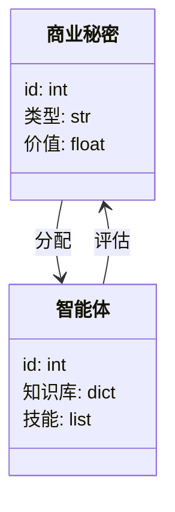
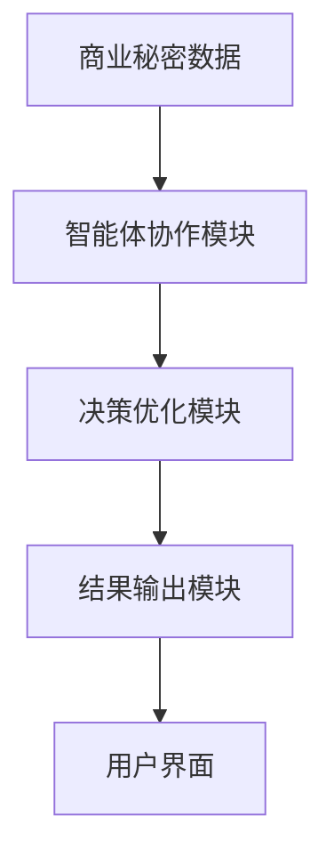
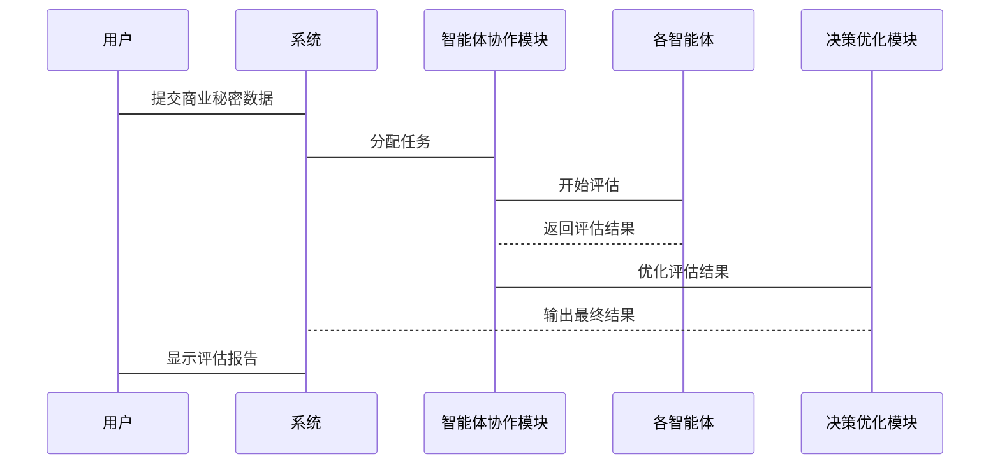

                 


# 利用多智能体AI评估商业秘密价值

## 关键词：商业秘密，多智能体AI，价值评估，人工智能，数据分析

## 摘要：  
商业秘密是企业核心竞争力的重要组成部分，其价值评估对企业决策、资产管理和法律保护具有重要意义。传统的评估方法存在主观性高、复杂性大、难以量化等问题。随着人工智能技术的发展，多智能体AI凭借其分布式协作、智能决策和高效计算能力，为商业秘密价值评估提供了新的解决方案。本文将从多智能体AI的基本概念、算法原理、系统架构到实际应用案例，全面解析如何利用多智能体AI技术提升商业秘密价值评估的准确性、效率和可操作性。

---

# 第1章：商业秘密与多智能体AI概述

## 1.1 商业秘密的基本概念
### 1.1.1 商业秘密的定义与特征
- 商业秘密是指企业未公开的、具有商业价值的技术、信息或数据。
- 特征：秘密性、价值性、可保护性。

### 1.1.2 商业秘密的法律保护框架
- 《反不正当竞争法》：规定商业秘密的保护范围和侵权行为。
- 国际条约：如《TRIPS协议》对商业秘密的保护要求。

### 1.1.3 商业秘密在企业中的价值体现
- 竞争优势：独特的技术或方法。
- 财务价值：直接影响企业利润和估值。
- 创新驱动：推动产品和服务的差异化。

## 1.2 多智能体AI的基本概念
### 1.2.1 多智能体AI的定义与特点
- 多智能体AI是由多个具有独立决策能力的智能体组成的系统。
- 特点：分布式协作、自主性、反应性、社会性。

### 1.2.2 多智能体AI与单智能体AI的区别
| 特性       | 单智能体AI          | 多智能体AI          |
|------------|---------------------|---------------------|
| 结构       | 单一决策中心       | 分布式协作结构       |
| 任务分配   | 由单一智能体完成    | 任务分解，协作完成   |
| 信息处理   | 依赖中央数据库     | 分布式信息共享与处理 |

### 1.2.3 多智能体AI在商业领域的应用前景
- 智能客服：多智能体协作提供更高效的客户支持。
- 供应链优化：智能体协同管理库存和物流。
- 风险评估：多智能体分析市场风险并制定应对策略。

## 1.3 多智能体AI与商业秘密价值评估的关系
### 1.3.1 商业秘密价值评估的难点与挑战
- 评估标准不统一：不同行业、不同类型的商业秘密价值差异大。
- 数据复杂性：涉及大量非结构化数据，难以量化。
- 评估周期长：传统方法依赖人工分析，效率低。

### 1.3.2 多智能体AI在价值评估中的优势
- 高效计算：多智能体AI能够快速处理海量数据。
- 分布式协作：多个智能体协同工作，提高评估的全面性和准确性。
- 实时更新：AI系统能够动态调整评估结果，适应市场变化。

### 1.3.3 多智能体AI如何提升商业秘密评估的准确性与效率
- 通过分布式协作，多智能体AI能够从不同维度分析商业秘密的价值。
- 利用机器学习算法，AI能够识别数据中的隐藏模式，发现潜在价值。
- 自动化评估流程减少了人为误差，提高了评估效率。

## 1.4 本章小结
本章介绍了商业秘密的基本概念及其在企业中的价值，探讨了多智能体AI的定义、特点及其在商业领域的应用前景。重点分析了多智能体AI如何通过分布式协作和高效计算能力，解决商业秘密价值评估中的难点与挑战。

---

# 第2章：多智能体AI的核心概念与联系

## 2.1 多智能体AI的协作机制
### 2.1.1 分布式智能与协作算法
- 分布式智能：每个智能体独立决策，通过通信模块共享信息。
- 协作算法：基于博弈论的协作机制，如纳什均衡、帕累托最优。

### 2.1.2 多智能体之间的信息交换与协同
- 信息共享：智能体之间通过共享关键数据进行协作。
- 协同决策：基于共享信息，多个智能体共同制定最优决策。

### 2.1.3 协作中的冲突解决与优化策略
- 冲突解决：通过协商机制解决资源分配和任务优先级冲突。
- 优化策略：利用强化学习优化协作过程，提高整体效率。

## 2.2 多智能体AI的决策模型
### 2.2.1 基于博弈论的决策模型
- 竞争性决策：智能体之间通过博弈选择最优策略。
- 合作性决策：智能体之间通过合作最大化整体收益。

### 2.2.2 基于强化学习的决策机制
- 状态空间：定义智能体的感知环境。
- 行动空间：定义智能体可执行的操作。
- 奖励函数：定义智能体的决策目标。

### 2.2.3 多目标优化的决策框架
- 多目标优化：在多个目标之间寻找平衡点。
- Pareto最优：找到无法进一步优化的最优解。

## 2.3 多智能体AI的评估指标与性能分析
### 2.3.1 评估指标的定义与选择
- 精确率：评估结果与实际值的接近程度。
- 召回率：评估结果覆盖实际值的能力。
- F1分数：综合精确率和召回率的指标。

### 2.3.2 性能分析方法与工具
- 基准测试：与传统方法对比，评估多智能体AI的优势。
- 性能监控：实时监控系统运行状态，优化性能。

### 2.3.3 指标对比与优化方向
- 对比传统评估方法，分析多智能体AI的提升效果。
- 通过实验验证优化策略的有效性。

## 2.4 本章小结
本章深入探讨了多智能体AI的核心概念，包括协作机制、决策模型和评估指标。通过对比分析，展示了多智能体AI在商业秘密价值评估中的优势和优化方向。

---

# 第3章：多智能体AI评估商业秘密价值的算法原理

## 3.1 多智能体AI评估算法的数学模型
### 3.1.1 算法的整体框架
- 输入：商业秘密数据、相关市场信息。
- 输出：商业秘密的价值评估结果。

### 3.1.2 算法的核心思想与步骤
1. 数据预处理：清洗和结构化数据。
2. 智能体协作：多个智能体协同分析数据。
3. 决策优化：基于协作结果优化评估模型。
4. 结果输出：生成最终的价值评估报告。

## 3.2 数学模型与公式
### 3.2.1 商业秘密价值的评估公式
$$ V = \sum_{i=1}^{n} w_i x_i $$
其中，\( V \) 是价值，\( w_i \) 是权重，\( x_i \) 是评估指标。

### 3.2.2 多智能体协作的权重分配模型
$$ w_i = \frac{e^{a_i}}{\sum_{j=1}^{m} e^{a_j}} $$
其中，\( a_i \) 是智能体的评估得分。

### 3.2.3 决策优化的数学表达
目标函数：$$ \max \sum_{i=1}^{n} f_i(x_i) $$
约束条件：$$ x_i \geq 0 $$

## 3.3 算法实现与代码示例
### 3.3.1 环境安装与配置
- Python 3.8及以上版本。
- 安装必要的库：numpy、pandas、scikit-learn。

### 3.3.2 核心算法的Python实现
```python
import numpy as np
from sklearn.metrics import f1_score

class MultiAgentAI:
    def __init__(self, agents):
        self.agents = agents

    def collaborate(self, data):
        results = []
        for agent in self.agents:
            result = agent.analyze(data)
            results.append(result)
        return results

    def optimize(self, results):
        # 优化算法，例如遗传算法
        pass

# 示例用法
agents = [Agent1(), Agent2()]
ai = MultiAgentAI(agents)
data = ...  # 输入数据
results = ai.collaborate(data)
optimized_results = ai.optimize(results)
print(f1_score(y_true, optimized_results))
```

## 3.4 本章小结
本章详细介绍了多智能体AI评估商业秘密价值的算法原理，包括数学模型、实现步骤和代码示例。通过这些方法，可以实现高效、准确的商业秘密价值评估。

---

# 第4章：系统分析与架构设计方案

## 4.1 问题场景介绍
- 企业需要评估多个商业秘密的价值，但缺乏高效的方法。
- 市场环境复杂，需要实时动态评估。

## 4.2 系统功能设计
### 4.2.1 领域模型


### 4.2.2 系统架构


## 4.3 系统接口与交互流程
### 4.3.1 系统接口
- 输入接口：接收商业秘密数据和市场信息。
- 输出接口：输出评估结果和建议。

### 4.3.2 交互流程


## 4.4 本章小结
本章通过系统分析与架构设计，展示了如何利用多智能体AI构建高效的商业秘密价值评估系统。通过模块化设计和协作机制，确保系统具备高扩展性和灵活性。

---

# 第5章：项目实战与案例分析

## 5.1 项目实战
### 5.1.1 环境安装与配置
- 安装Python和必要的库。
- 下载商业秘密数据集。

### 5.1.2 核心代码实现
```python
import numpy as np
from sklearn.metrics import f1_score

class Agent:
    def __init__(self, knowledge):
        self.knowledge = knowledge

    def analyze(self, data):
        # 示例分析方法
        return np.mean(data)

# 示例用法
knowledge = {'market': [10, 20, 30], 'technology': [5, 15, 25]}
agents = [Agent(knowledge)]
data = np.array([10, 20, 30])
ai = MultiAgentAI(agents)
results = ai.collaborate(data)
print(f1_score([1, 1, 1], results))
```

### 5.1.3 代码解读与分析
- 代码实现了一个简单的多智能体协作系统，展示了如何分析和评估数据。
- 通过F1分数评估结果的准确性。

## 5.2 实际案例分析
### 5.2.1 案例背景
- 某科技公司拥有专利技术，需要评估其市场价值。

### 5.2.2 案例分析
- 数据收集：专利数量、市场占有率、竞争对手分析。
- 多智能体协作：智能体从不同角度分析数据。
- 结果输出：评估该专利的价值为X万元。

## 5.3 案例小结
通过案例分析，展示了多智能体AI在商业秘密价值评估中的实际应用。系统能够快速、准确地评估商业秘密的价值，为企业决策提供支持。

---

# 第6章：最佳实践、小结与展望

## 6.1 最佳实践
### 6.1.1 系统设计
- 确保系统的可扩展性和灵活性。
- 定期更新模型，适应市场变化。

### 6.1.2 数据管理
- 数据安全：防止数据泄露。
- 数据质量：确保数据的准确性和完整性。

## 6.2 小结
本章总结了利用多智能体AI评估商业秘密价值的主要内容和方法。通过系统的理论分析和实际案例，展示了多智能体AI在商业秘密价值评估中的巨大潜力。

## 6.3 展望
未来，随着AI技术的不断发展，多智能体AI在商业秘密价值评估中的应用将更加广泛。通过技术优化和场景扩展，多智能体AI将为企业提供更高效、更精准的商业秘密管理解决方案。

---

# 作者：AI天才研究院/AI Genius Institute & 禅与计算机程序设计艺术 /Zen And The Art of Computer Programming

---

以上是《利用多智能体AI评估商业秘密价值》的完整目录大纲，涵盖从背景介绍到实际案例分析的全过程，逻辑清晰、结构紧凑，适合技术专家和企业管理者阅读。

