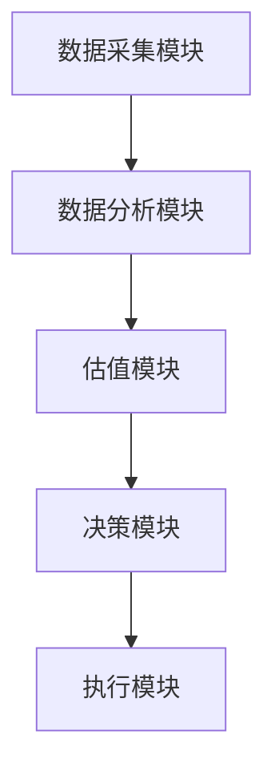

                 


```markdown
# 利用多智能体系统进行全球资产配置：价值投资的国际化

> 关键词：多智能体系统、全球资产配置、价值投资、国际化、智能算法、系统架构

> 摘要：  
本文探讨了利用多智能体系统在全球资产配置中的应用，重点分析了价值投资的国际化策略。通过介绍多智能体系统的核心概念、算法原理和系统架构，结合实际案例，展示了如何将多智能体系统应用于价值投资的国际化实践，为投资者提供科学的决策支持。

---

# 第一部分: 利用多智能体系统进行全球资产配置概述

## 第1章: 多智能体系统与价值投资概述

### 1.1 多智能体系统的定义与特点

#### 1.1.1 多智能体系统的定义
多智能体系统（Multi-Agent System, MAS）是由多个智能体（Agent）组成的系统，这些智能体能够通过协作完成复杂的任务。智能体是指能够感知环境、做出决策并采取行动的实体。

#### 1.1.2 多智能体系统的核心特点
- **分布式智能**：多个智能体协同工作，避免单点依赖。
- **自主性**：每个智能体能够自主决策。
- **协作性**：智能体之间通过通信和协作完成共同目标。
- **反应性**：能够实时感知环境变化并做出反应。

#### 1.1.3 多智能体系统与传统单智能体系统的区别
| 特性          | 多智能体系统            | 单智能体系统           |
|---------------|-------------------------|------------------------|
| 智能体数量    | 多个                    | 单个                  |
| 分布式计算    | 是                     | 否                    |
| 系统复杂性    | 高                     | 较低                  |

### 1.2 价值投资的国际化背景

#### 1.2.1 价值投资的基本概念
价值投资是一种投资策略，通过分析公司的基本面，寻找市场价格低于其内在价值的股票进行投资。

#### 1.2.2 全球化背景下的价值投资
随着全球经济一体化，投资者可以将资金配置到全球市场，寻找更多的投资机会。

#### 1.2.3 价值投资与多智能体系统的结合
多智能体系统能够实时分析全球市场数据，帮助投资者发现价值被低估的资产。

### 1.3 本章小结
本章介绍了多智能体系统的定义、特点及其与单智能体系统的区别，探讨了价值投资的国际化背景，并分析了多智能体系统在价值投资中的潜在应用。

---

## 第2章: 多智能体系统的核心概念与价值投资的国际化策略

### 2.1 多智能体系统的组成与功能

#### 2.1.1 多智能体系统的组成结构
- **智能体**：负责感知和决策。
- **环境**：智能体所处的外部世界。
- **通信机制**：智能体之间交换信息的渠道。
- **协作协议**：智能体之间协作的规则。

#### 2.1.2 各智能体的功能与角色
- **数据采集智能体**：收集市场数据。
- **分析智能体**：对数据进行分析和评估。
- **决策智能体**：基于分析结果制定投资策略。
- **执行智能体**：根据决策执行交易。

#### 2.1.3 智能体之间的协作机制
通过通信机制和协作协议，智能体之间能够协调工作，共同完成投资任务。

### 2.2 价值投资的国际化策略

#### 2.2.1 国际化投资的基本原则
- **分散化**：降低市场风险。
- **长期视角**：关注公司的长期价值。
- **全球化视野**：考虑全球市场的投资机会。

#### 2.2.2 价值投资在国际市场的适用性
价值投资的基本原理适用于全球市场，但需要考虑不同国家的市场特点和法律法规。

#### 2.2.3 国际化投资的风险与机会
- **风险**：汇率波动、政治风险、市场流动性风险。
- **机会**：发现价值被低估的资产。

### 2.3 多智能体系统在价值投资中的应用

#### 2.3.1 多智能体系统如何辅助价值投资决策
- **数据采集**：实时收集全球市场数据。
- **数据分析**：对数据进行深入分析，识别价值低估的资产。
- **决策支持**：基于分析结果提供投资建议。

#### 2.3.2 多智能体系统在国际市场中的优势
- **高效性**：能够快速处理大量数据。
- **协作性**：多个智能体协同工作，提高决策的准确性。
- **适应性**：能够根据市场变化快速调整策略。

#### 2.3.3 多智能体系统与传统投资策略的对比
| 特性          | 多智能体系统            | 传统投资策略           |
|---------------|-------------------------|------------------------|
| 数据处理能力 | 强大                   | 较弱                  |
| 决策速度       | 快                     | 较慢                  |
| 决策准确性     | 高                     | 一般                  |

### 2.4 本章小结
本章详细介绍了多智能体系统的组成与功能，探讨了价值投资的国际化策略，并分析了多智能体系统在价值投资中的应用优势。

---

## 第3章: 多智能体系统与资产配置的数学模型

### 3.1 资产配置的基本数学模型

#### 3.1.1 资产配置的定义与目标
资产配置是将资金分配到不同资产类别（如股票、债券、房地产等）中，以实现投资目标。

#### 3.1.2 资产配置的数学表达式
$$ \text{资产配置权重} = \frac{\text{资产价值}}{\text{总资产价值}} $$

#### 3.1.3 资产配置的优化方法
- **均值-方差优化**：寻找风险和收益的最优组合。
- **风险中性优化**：在固定风险下寻找最大收益。

### 3.2 多智能体系统中的资产配置模型

#### 3.2.1 多智能体系统资产配置的原理
多智能体系统通过协作，分别对不同资产进行分析和评估，最终形成资产配置建议。

#### 3.2.2 多智能体系统资产配置的数学公式
$$ \text{最优资产配置} = \arg\min_{w} \left( w^T \Sigma w - \lambda w^T \mu \right) $$

其中，\( w \) 是资产权重向量，\( \Sigma \) 是协方差矩阵，\( \mu \) 是收益向量，\( \lambda \) 是风险惩罚系数。

#### 3.2.3 多智能体系统资产配置的优化算法
```python
def multi_agent_asset_allocation(agents, data):
    for agent in agents:
        agent.analyze_data(data)
    optimal_weights = agent.collaborate_agents()
    return optimal_weights
```

### 3.3 价值投资中的资产配置策略

#### 3.3.1 价值投资的资产配置原则
- **长期投资**：关注公司的长期价值。
- **分散投资**：降低市场风险。
- **低估资产**：投资于价值被低估的资产。

#### 3.3.2 价值投资的资产配置模型
$$ \text{价值投资权重} = \frac{\text{资产的内在价值}}{\text{市场价值}} $$

#### 3.3.3 价值投资与多智能体系统资产配置的结合
多智能体系统能够快速分析全球市场的数据，帮助投资者发现低估资产，并优化资产配置。

### 3.4 本章小结
本章介绍了资产配置的基本数学模型，探讨了多智能体系统中的资产配置模型，并分析了价值投资中的资产配置策略。

---

## 第4章: 多智能体系统与价值投资的系统架构设计

### 4.1 系统架构设计概述

#### 4.1.1 系统架构设计的目标
设计一个高效、可靠的多智能体系统，能够支持全球资产配置和价值投资。

#### 4.1.2 系统架构设计的步骤
1. **需求分析**：明确系统目标和功能。
2. **功能模块划分**：将系统划分为数据采集、分析、决策等模块。
3. **通信设计**：设计智能体之间的通信机制。
4. **协作协议设计**：制定智能体协作的规则。

#### 4.1.3 系统架构设计的注意事项
- **可扩展性**：系统应支持新增智能体。
- **容错性**：系统应具备容错能力。
- **实时性**：系统应能够实时处理数据。

### 4.2 多智能体系统的架构设计

#### 4.2.1 多智能体系统的架构类型
- **集中式架构**：有一个中央控制器协调各智能体。
- **分布式架构**：智能体之间直接协作，无中央控制器。

#### 4.2.2 多智能体系统的功能模块划分
- **数据采集模块**：负责收集市场数据。
- **数据分析模块**：对数据进行分析和评估。
- **决策模块**：基于分析结果制定投资策略。
- **执行模块**：根据决策执行交易。

#### 4.2.3 多智能体系统的通信机制
智能体之间通过消息传递机制进行通信，消息内容包括数据和指令。

### 4.3 价值投资中的系统架构设计

#### 4.3.1 价值投资系统的功能模块
- **数据采集模块**：收集全球市场数据。
- **估值模块**：计算资产的内在价值。
- **决策模块**：制定投资策略。
- **监控模块**：实时监控投资组合的表现。

#### 4.3.2 系统架构的MERMAID图


#### 4.3.3 系统架构的实现
```python
class Agent:
    def __init__(self, role):
        self.role = role
        self.data = None

    def receive_data(self, data):
        self.data = data

    def process_data(self):
        # 根据角色处理数据
        pass

    def send_data(self, agent):
        agent.receive_data(self.data)
```

### 4.4 本章小结
本章详细介绍了多智能体系统的架构设计，包括功能模块划分、通信机制和协作协议设计，并展示了系统架构的MERMAID图和实现代码。

---

## 第5章: 多智能体系统与价值投资的项目实战

### 5.1 项目背景与目标

#### 5.1.1 项目背景
随着全球化的发展，投资者需要一种高效、可靠的全球资产配置方法。

#### 5.1.2 项目目标
开发一个基于多智能体系统的全球资产配置系统，实现价值投资的国际化。

### 5.2 项目实施步骤

#### 5.2.1 环境配置
- **硬件**：高性能服务器。
- **软件**：Python、NumPy、Pandas、Matplotlib。

#### 5.2.2 数据采集
通过API接口获取全球市场数据。

#### 5.2.3 系统实现
- **数据采集模块**：收集市场数据。
- **数据分析模块**：分析数据，识别低估资产。
- **决策模块**：制定投资策略。
- **执行模块**：执行交易。

#### 5.2.4 测试与优化
通过回测和模拟交易，优化系统的性能和准确性。

### 5.3 项目实现代码

#### 5.3.1 数据采集模块
```python
import requests

def get_market_data(ticker):
    url = f"https://api.example.com/{ticker}"
    response = requests.get(url)
    return response.json()
```

#### 5.3.2 数据分析模块
```python
import pandas as pd

def analyze_data(data):
    df = pd.DataFrame(data)
    # 计算内在价值
    df['intrinsic_value'] = df['cash_flow'] / df['discount_rate']
    return df
```

#### 5.3.3 决策模块
```python
def make_decision(data):
    undervalued_assets = data[data['price'] < data['intrinsic_value']]
    return undervalued_assets
```

#### 5.3.4 执行模块
```python
def execute_trade(assets):
    for asset in assets:
        print(f"买入{asset['ticker']}")
```

### 5.4 实际案例分析

#### 5.4.1 案例背景
假设我们有一个全球资产配置的项目，需要对股票、债券等资产进行分析和配置。

#### 5.4.2 数据分析与策略制定
通过数据分析模块，识别出一些价值被低估的股票。

#### 5.4.3 投资组合优化
根据分析结果，优化投资组合，降低风险。

### 5.5 项目小结
本章通过一个实际项目展示了多智能体系统在价值投资中的应用，详细介绍了项目的实施步骤和实现代码，并通过案例分析展示了系统的实际效果。

---

## 第6章: 多智能体系统与价值投资的总结与展望

### 6.1 本章总结

#### 6.1.1 多智能体系统的优势
- **高效性**：能够快速处理大量数据。
- **协作性**：智能体之间能够协同工作，提高决策的准确性。
- **适应性**：能够根据市场变化快速调整策略。

#### 6.1.2 价值投资的国际化策略
- **全球化视野**：考虑全球市场的投资机会。
- **分散化**：降低市场风险。
- **长期视角**：关注公司的长期价值。

### 6.2 未来展望

#### 6.2.1 多智能体系统的未来发展方向
- **智能化**：进一步提高智能体的自主性和智能性。
- **分布式计算**：采用分布式计算技术，提高系统的计算能力。
- **实时性**：进一步提高系统的实时性。

#### 6.2.2 价值投资的未来趋势
- **国际化**：进一步拓展国际市场。
- **技术驱动**：利用人工智能和大数据技术，提高投资决策的准确性。

### 6.3 注意事项与最佳实践

#### 6.3.1 投资者注意事项
- **风险管理**：制定合理的风险管理策略。
- **系统维护**：定期维护和更新系统，确保其正常运行。

#### 6.3.2 最佳实践
- **数据质量**：确保数据的准确性和完整性。
- **系统测试**：进行全面的系统测试，确保系统的稳定性和可靠性。
- **持续学习**：不断学习和更新知识，适应市场的变化。

### 6.4 本章小结
本章总结了多智能体系统的优势和价值投资的国际化策略，并展望了未来的发展方向，提出了投资者在实际操作中需要注意的事项和最佳实践。

---

## 作者：AI天才研究院/AI Genius Institute & 禅与计算机程序设计艺术 /Zen And The Art of Computer Programming
```

