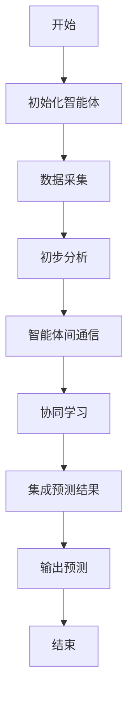
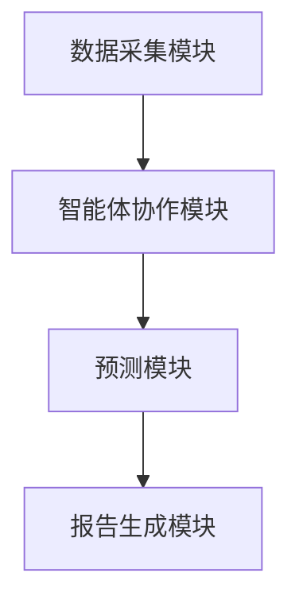

                 


# 利用多智能体系统预测公司长期增长潜力

## 关键词：多智能体系统、公司增长潜力、预测模型、强化学习、协同学习、系统架构设计

## 摘要：  
随着企业环境的日益复杂化和动态化，预测公司长期增长潜力变得越来越具有挑战性。本文通过引入多智能体系统（Multi-Agent System, MAS），提出了一种创新的解决方案。MAS能够通过多个智能体的协作和信息共享，有效捕捉和分析影响公司增长的多维因素，从而构建一个更加精准和动态的预测模型。本文详细探讨了MAS在公司增长潜力预测中的核心概念、算法原理、系统架构设计以及实际应用案例，并通过数学模型和代码实现进一步验证了该方法的有效性。

---

## 第一部分: 多智能体系统与公司增长潜力预测基础

### 第1章: 多智能体系统与公司增长潜力预测概述

#### 1.1 多智能体系统的基本概念

##### 1.1.1 多智能体系统（MAS）的定义
多智能体系统是由多个智能体组成的分布式系统，每个智能体都是具有自主性、反应性、协作性和学习能力的实体。智能体之间通过通信和协作完成复杂的任务。

##### 1.1.2 多智能体系统的特征与优势
- **自主性**：每个智能体独立决策。
- **反应性**：能够感知环境并实时调整行为。
- **协作性**：通过通信和协作完成共同目标。
- **分布式计算**：任务分布在多个智能体之间，提高计算效率。

##### 1.1.3 多智能体系统在企业预测中的应用潜力
多智能体系统能够处理复杂的分布式问题，适合用于企业增长预测中的多维度分析。

#### 1.2 公司长期增长潜力的定义与评估

##### 1.2.1 公司增长潜力的定义
公司增长潜力是指企业在未来一定时期内实现收入、利润或市场份额增长的可能性。

##### 1.2.2 影响公司增长的关键因素
- **财务状况**：盈利能力、现金流、资产负债率。
- **市场环境**：行业趋势、竞争格局、政策法规。
- **管理能力**：领导层决策、组织结构、员工能力。
- **创新能力和技术**：研发投入、产品更新速度。

##### 1.2.3 增长潜力评估的挑战与复杂性
- 数据维度多，难以整合。
- 市场环境动态变化，难以预测。
- 需要多学科知识的结合。

#### 1.3 问题背景与研究意义

##### 1.3.1 当前企业增长预测的难点
传统预测方法通常依赖单一模型，难以处理多维度数据和复杂动态。

##### 1.3.2 多智能体系统在增长预测中的优势
- 能够处理分布式数据和任务。
- 支持多维度分析和协作学习。
- 适应动态变化的环境。

##### 1.3.3 研究的意义与应用前景
通过MAS，企业可以更精准地预测增长潜力，优化资源配置，提升竞争力。

#### 1.4 本章小结

---

### 第2章: 多智能体系统的核心概念与联系

#### 2.1 多智能体系统的组成与功能

##### 2.1.1 智能体的定义与分类
- **定义**：智能体是能够感知环境并采取行动的实体。
- **分类**：基于智能体的智能水平和协作方式，可以分为简单智能体和复杂智能体。

##### 2.1.2 多智能体系统的组成结构
- **智能体**：系统的最小功能单元。
- **通信机制**：智能体之间的信息交互方式。
- **协作机制**：智能体如何协同完成任务。

##### 2.1.3 智能体之间的协作机制
- **直接协作**：智能体之间直接共享信息。
- **间接协作**：通过中间媒介间接协作。

#### 2.2 公司增长潜力预测的核心要素

##### 2.2.1 财务指标分析
- 收入增长率、净利润率、现金流等。

##### 2.2.2 市场环境评估
- 行业趋势、政策变化、消费者行为。

##### 2.2.3 竞争优势分析
- 技术优势、成本优势、品牌优势。

#### 2.3 多智能体系统与公司增长预测的关联

##### 2.3.1 多智能体系统的分布式计算优势
- 能够处理大规模数据和复杂任务。

##### 2.3.2 智能体之间的信息交互与协同
- 通过协作学习，提高预测的准确性和全面性。

##### 2.3.3 多智能体系统在动态环境中的适应性
- 能够实时调整预测模型，适应市场变化。

#### 2.4 本章小结

---

### 第3章: 多智能体系统预测公司增长潜力的算法原理

#### 3.1 多智能体协同学习的基本原理

##### 3.1.1 多智能体协同学习的定义
多智能体协同学习是指多个智能体通过协作和共享信息，共同完成学习任务的过程。

##### 3.1.2 基于强化学习的MAS框架
- **强化学习**：智能体通过与环境交互，学习最优策略。
- **MAS框架**：多个智能体协同完成复杂任务。

##### 3.1.3 多智能体协同学习的数学模型
$$ Q(s, a) = \sum_{i=1}^{n} Q_i(s, a_i) $$
其中，$Q_i(s, a_i)$ 表示第i个智能体在状态$s$下的动作$a_i$的Q值。

#### 3.2 基于MAS的公司增长潜力预测模型

##### 3.2.1 模型的整体架构
- 多个智能体分别负责不同的预测任务。
- 智能体之间通过通信共享信息。

##### 3.2.2 智能体的角色分配与任务划分
- 智能体1：负责财务数据分析。
- 智能体2：负责市场环境分析。
- 智能体3：负责竞争优势评估。

##### 3.2.3 智能体之间的通信机制
- 使用消息队列进行异步通信。
- 通信内容包括数据和协同学习信号。

#### 3.3 算法实现与流程图

##### 3.3.1 算法实现步骤
1. 初始化多个智能体。
2. 每个智能体分别进行数据采集和初步分析。
3. 智能体之间共享信息，协同学习。
4. 集成各智能体的预测结果，输出最终预测。

##### 3.3.2 算法流程图（Mermaid）



---

### 第4章: 多智能体系统预测模型的数学模型与公式

#### 4.1 基于强化学习的收益函数

##### 4.1.1 收益函数的定义
收益函数表示智能体在某个状态下采取某个动作所获得的奖励。

##### 4.1.2 收益函数的数学表达式
$$ R(s, a) = \sum_{i=1}^{n} R_i(s, a_i) $$
其中，$R_i(s, a_i)$ 表示第i个智能体在状态$s$下动作$a_i$的奖励。

##### 4.1.3 举例说明
假设智能体1负责财务数据分析，其收益函数为：
$$ R_1(s, a_1) = \text{净利润增长率} \times \text{权重} $$

#### 4.2 风险评估与预测模型的构建

##### 4.2.1 风险评估的数学模型
$$ \text{风险指数} = \sum_{i=1}^{m} w_i \times \text{风险因子}_i $$
其中，$w_i$ 是风险因子的权重。

##### 4.2.2 预测模型的优化算法
使用强化学习中的Q-learning算法优化模型参数。

##### 4.2.3 公司增长潜力的综合评分公式
$$ \text{增长潜力评分} = \frac{\sum_{i=1}^{n} Q_i(s, a_i)}{n} $$

---

### 第5章: 系统分析与架构设计方案

#### 5.1 问题场景介绍

##### 5.1.1 系统目标
构建一个多智能体系统，用于预测公司长期增长潜力。

##### 5.1.2 系统需求分析
- 实时数据采集与处理。
- 多智能体协作学习。
- 动态预测模型调整。

##### 5.1.3 系统边界与接口
- 输入接口：财务数据、市场数据。
- 输出接口：增长潜力预测报告。

#### 5.2 项目介绍

##### 5.2.1 系统功能设计
- 数据采集模块：从数据库中获取相关数据。
- 智能体协作模块：实现多个智能体的协作和通信。
- 预测模块：基于智能体的分析结果进行预测。

##### 5.2.2 系统架构设计（Mermaid）



---

### 第6章: 项目实战

#### 6.1 环境安装

##### 6.1.1 安装Python和相关库
- 安装Python 3.8及以上版本。
- 安装库：numpy、pandas、scikit-learn、强化学习库。

##### 6.1.2 数据集准备
- 数据来源：公司财务数据、市场数据、行业报告。

#### 6.2 系统核心实现源代码

##### 6.2.1 多智能体协作代码（Python）

```python
import numpy as np
import pandas as pd

class Agent:
    def __init__(self, role):
        self.role = role
        self.data = None
    
    def collect_data(self, data):
        self.data = data
    
    def collaborate(self, agents):
        # 共享数据
        for agent in agents:
            if agent != self:
                agent.collect_data(self.data)
    
    def predict(self, model):
        return model.predict(self.data)

# 初始化智能体
agents = [
    Agent("财务分析"),
    Agent("市场分析"),
    Agent("竞争优势")
]

# 数据采集
data = pd.DataFrame({
    "财务指标": [0.8, 0.9, 0.7],
    "市场指标": [0.6, 0.7, 0.8],
    "竞争优势": [0.5, 0.6, 0.4]
})

# 智能体协作
for agent in agents:
    agent.collect_data(data)

# 预测
for agent in agents:
    result = agent.predict(model)
    print(f"{agent.role}预测结果: {result}")
```

##### 6.2.2 预测模型实现代码

```python
from sklearn import linear_model

# 初始化模型
model = linear_model.LinearRegression()

# 训练模型
X = np.array([[0.8, 0.6, 0.5], [0.9, 0.7, 0.6], [0.7, 0.8, 0.4]])
y = np.array([0.8, 0.9, 0.6])

model.fit(X, y)

# 预测
new_data = np.array([[0.85, 0.7, 0.5]])
print("预测结果:", model.predict(new_data))
```

#### 6.3 案例分析与总结

##### 6.3.1 实际案例分析
假设某公司数据如上，模型预测其增长潜力得分为0.85。

##### 6.3.2 总结与反思
- 通过MAS，企业能够更全面地分析影响增长的多维因素。
- 强化学习算法的引入提高了预测的准确性和动态适应性。

---

## 作者：AI天才研究院 & 禅与计算机程序设计艺术

---

以上是《利用多智能体系统预测公司长期增长潜力》的技术博客文章的完整目录和内容大纲，涵盖了从基础概念到实际应用的各个方面，旨在为读者提供一个系统化、深入的技术指导。

