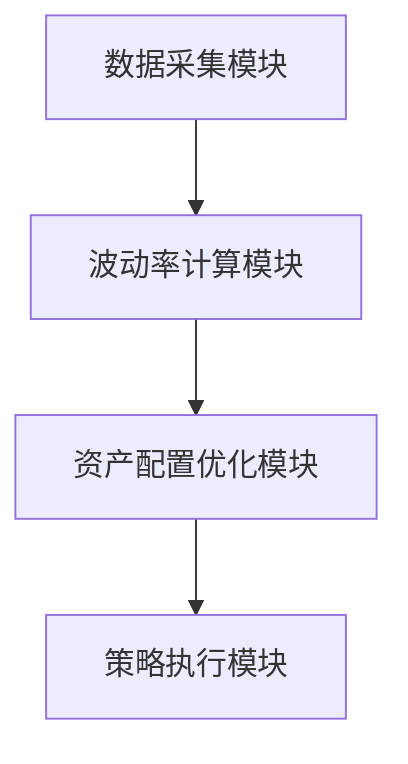

                 

# 利用市场波动重新平衡资产配置的策略

> 关键词：资产配置、市场波动、动态调整、风险管理、投资策略

> 摘要：本文详细探讨了如何利用市场波动重新平衡资产配置的策略，从市场波动的定义与来源、资产配置的基本原理，到动态调整的必要性、具体方法和实施步骤，结合数学模型和实际案例，提供了一套系统化的解决方案。

---

## 第一部分: 利用市场波动重新平衡资产配置的背景与基础

### 第1章: 市场波动与资产配置概述

#### 1.1 市场波动的定义与特征

##### 1.1.1 市场波动的定义
市场波动是指资产价格在短时间内频繁变化的现象，通常由市场参与者的情绪、宏观经济因素或突发事件引发。波动率是衡量市场风险的重要指标，反映了资产价格的波动程度。

##### 1.1.2 市场波动的主要特征
- **短期性**：波动通常在短时间内发生，但可能对资产价格产生显著影响。
- **不可预测性**：市场波动往往难以准确预测，尤其是突发事件引发的波动。
- **传染性**：波动可能从一个市场传导到另一个市场，甚至影响整个金融体系。

##### 1.1.3 市场波动的来源与影响
市场波动的来源可以分为三类：
1. **宏观经济因素**：如经济增长、通货膨胀、利率变化等。
2. **市场情绪**：投资者情绪的变化会影响市场波动，尤其是在市场波动加剧时。
3. **突发事件**：如地缘政治冲突、企业并购等。

市场波动对资产配置的影响主要体现在以下几个方面：
- **风险增加**：波动率高时，资产价格的不确定性增加，投资风险上升。
- **收益变化**：波动率高时，某些资产可能出现短期大幅波动，带来超额收益的机会。
- **资产相关性变化**：市场波动可能导致不同资产之间的相关性发生变化，影响投资组合的风险和收益。

#### 1.2 资产配置的基本原理

##### 1.2.1 资产配置的核心概念
资产配置是指将资金分配到不同的资产类别（如股票、债券、现金等）中，以实现投资目标和风险偏好。资产配置的核心在于在不同资产之间分散风险，优化投资组合的收益和风险比。

##### 1.2.2 不同资产类别的特性
- **股票**：高风险、高收益，波动率较高，适合长期投资。
- **债券**：相对稳定，波动率较低，收益主要来自利息收入。
- **现金**：流动性高，风险最低，但在低利率环境下收益较低。

##### 1.2.3 资产配置与投资目标的关系
资产配置应根据投资者的投资目标（如风险承受能力、收益目标、投资期限等）进行调整。例如，风险厌恶型投资者可能更倾向于配置债券和现金，而风险偏好型投资者可能更倾向于配置股票和高风险资产。

#### 1.3 动态资产配置的必要性

##### 1.3.1 静态资产配置的局限性
静态资产配置是在一定时间内固定资产配置比例，无法根据市场环境的变化进行调整。在市场波动加剧时，静态资产配置可能导致投资组合的风险超出投资者的承受能力。

##### 1.3.2 动态调整的逻辑与优势
动态资产配置是指根据市场环境的变化，定期或不定期调整资产配置比例，以适应市场波动，优化投资组合的收益和风险比。其优势在于：
- **降低风险**：通过动态调整，可以在市场波动加剧时减少高风险资产的配置比例，降低投资组合的风险。
- **捕捉机会**：在市场波动中，某些资产可能出现短期上涨机会，动态调整可以捕捉这些机会，提高收益。
- **适应市场变化**：动态调整能够更好地适应市场环境的变化，保持投资组合的长期稳健增长。

##### 1.3.3 市场波动与资产再平衡的关系
市场波动可能导致资产配置比例偏离初始设定，因此需要通过再平衡来恢复资产配置的初始比例。再平衡可以通过卖出表现不佳的资产，买入表现良好的资产来实现。

---

### 第2章: 市场波动的分析与预测

#### 2.1 市场波动的来源分析

##### 2.1.1 宏观经济因素
宏观经济因素对市场波动的影响是多方面的。例如，经济增长放缓可能导致企业盈利下降，进而导致股价下跌。通货膨胀上升可能导致利率上升，进而影响债券价格。

##### 2.1.2 市场情绪与投资者行为
市场情绪是投资者对市场的看法和预期，通常会影响市场波动。例如，投资者情绪乐观时，市场波动可能较小；投资者情绪悲观时，市场波动可能加剧。

##### 2.1.3 突发事件与黑天鹅事件
突发事件（如地缘政治冲突、企业并购等）可能引发市场波动。黑天鹅事件是指小概率但影响巨大的事件，通常会导致市场剧烈波动。

#### 2.2 市场波动的量化指标

##### 2.2.1 布林格带（Bollinger Bands）
布林格带是一种技术指标，用于衡量资产价格的波动范围。布林格带由三条线组成：中间线（通常是20日移动平均线）、上带（中间线加标准差的倍数）和下带（中间线减标准差的倍数）。当资产价格接近上下带时，市场波动较大。

##### 2.2.2 波动率指数（VIX）
波动率指数（VIX）是衡量市场波动的指标，反映了投资者对市场的预期波动程度。VIX越高，市场波动越大。

##### 2.2.3 均值回归与动量效应
均值回归是指资产价格在偏离长期均值后，会回归长期均值的现象。动量效应是指资产价格在短时间内呈现动量效应，即近期价格上涨的资产可能会继续上涨，近期价格下跌的资产可能会继续下跌。

#### 2.3 市场波动的预测模型

##### 2.3.1 时间序列分析
时间序列分析是一种统计方法，用于分析和预测资产价格的时间序列数据。常用的时间序列模型包括ARIMA（自回归积分滑动平均模型）和GARCH（广义自回归条件异方差模型）。

##### 2.3.2 机器学习在波动预测中的应用
机器学习算法（如支持向量机、随机森林、神经网络等）可以用于市场波动的预测。这些算法可以通过分析历史数据，识别市场波动的模式，并进行预测。

##### 2.3.3 基于技术指标的波动预测
技术指标（如RSI、MACD、相对强弱指数等）是常见的市场波动预测工具。这些指标可以通过分析资产价格和成交量的变化，预测市场的短期波动。

---

### 第3章: 资产配置策略与市场波动的关系

#### 3.1 市场波动对资产配置的影响

##### 3.1.1 不同市场环境下的资产表现
在不同市场环境下，资产表现可能差异较大。例如，在牛市中，股票表现通常优于债券；在熊市中，债券表现可能优于股票。

##### 3.1.2 市场波动对风险承受能力的影响
市场波动可能影响投资者的风险承受能力。在市场波动加剧时，投资者可能更倾向于降低风险，从而调整资产配置比例。

##### 3.1.3 市场波动对资产相关性的影响
市场波动可能导致不同资产之间的相关性发生变化。例如，在市场波动加剧时，股票和债券的相关性可能上升，从而影响投资组合的风险分散效果。

#### 3.2 动态资产配置策略

##### 3.2.1 灵活调整资产配置比例
动态资产配置策略的核心是根据市场波动，灵活调整资产配置比例。例如，在市场波动加剧时，减少高风险资产的配置比例，增加低风险资产的配置比例。

##### 3.2.2 量化指标驱动的调整策略
可以通过量化指标（如VIX指数、波动率等）来驱动资产配置的调整。例如，当VIX指数上升时，减少股票配置比例，增加债券配置比例。

##### 3.2.3 风险平价策略
风险平价策略是一种动态资产配置策略，通过调整资产配置比例，使得不同资产对投资组合的风险贡献相等。这种方法可以有效分散风险，适应市场波动的变化。

#### 3.3 实证分析与案例研究

##### 3.3.1 案例一：2008年金融危机
在2008年金融危机期间，市场波动剧烈，许多投资者通过动态调整资产配置比例，减少了投资组合的损失。

##### 3.3.2 案例二：2020年新冠疫情冲击
在2020年新冠疫情冲击期间，市场波动剧烈，许多投资者通过增加现金配置比例，降低了投资组合的风险。

---

## 第二部分: 动态资产配置的数学模型与算法

### 第4章: 数学模型与算法原理

#### 4.1 现代投资组合理论（MPT）

##### 4.1.1 MPT的核心思想
现代投资组合理论（MPT）由Harry Markowitz提出，认为通过分散投资可以降低投资组合的风险。MPT的目标是在给定风险水平下，最大化预期收益，或者在给定收益水平下，最小化风险。

##### 4.1.2 均值-方差优化
均值-方差优化是一种优化方法，用于确定最优资产配置比例。通过最小化投资组合的方差（即风险），在给定的预期收益下，确定最优资产配置比例。

##### 4.1.3 有效前沿
有效前沿是指在给定风险水平下，预期收益最高的投资组合的集合。通过优化算法，可以确定有效前沿上的最优资产配置比例。

#### 4.2 资产配置的动态调整算法

##### 4.2.1 基于波动率的调整算法
基于波动率的调整算法通过分析市场波动率的变化，动态调整资产配置比例。例如，当波动率上升时，减少高风险资产的配置比例，增加低风险资产的配置比例。

##### 4.2.2 基于风险平价的调整算法
风险平价算法通过调整资产配置比例，使得不同资产对投资组合的风险贡献相等。这种方法可以有效分散风险，适应市场波动的变化。

##### 4.2.3 基于机器学习的调整算法
基于机器学习的调整算法通过分析历史数据，识别市场波动的模式，并预测未来的市场波动。根据预测结果，动态调整资产配置比例。

---

### 第5章: 系统架构与实现

#### 5.1 系统架构设计

##### 5.1.1 系统功能模块
- 数据采集模块：采集市场数据（如资产价格、成交量等）。
- 波动率计算模块：计算资产的波动率。
- 资产配置优化模块：根据波动率变化，优化资产配置比例。
- 策略执行模块：根据优化结果，动态调整资产配置比例。

##### 5.1.2 系统架构图

#### 5.2 系统实现步骤

##### 5.2.1 环境安装
- 安装Python编程环境。
- 安装相关库（如Pandas、NumPy、Scipy等）。

##### 5.2.2 数据采集与预处理
- 从数据源（如Yahoo Finance、Quandl等）获取市场数据。
- 数据清洗与预处理（如处理缺失值、异常值等）。

##### 5.2.3 波动率计算
- 使用Pandas库计算资产的波动率。
- 使用移动平均法计算历史波动率。

##### 5.2.4 资产配置优化
- 使用均值-方差优化算法，确定最优资产配置比例。
- 实现风险平价策略，调整资产配置比例。

##### 5.2.5 策略执行
- 根据优化结果，动态调整资产配置比例。
- 执行交易指令，实现资产配置的动态调整。

---

### 第6章: 项目实战与分析

#### 6.1 实战案例

##### 6.1.1 环境安装与数据获取
- 安装Python环境。
- 使用Pandas库获取市场数据。

##### 6.1.2 波动率计算与分析
- 使用Pandas库计算资产的波动率。
- 可视化波动率的变化趋势。

##### 6.1.3 资产配置优化与调整
- 使用均值-方差优化算法，确定最优资产配置比例。
- 实现风险平价策略，动态调整资产配置比例。

##### 6.1.4 策略回测与分析
- 对策略进行回测，分析策略的收益和风险。
- 对比不同策略的绩效，选择最优策略。

#### 6.2 结果分析

##### 6.2.1 收益与风险分析
- 计算投资组合的收益和风险（如夏普比率、最大回撤等）。
- 对比不同策略的收益和风险，选择最优策略。

##### 6.2.2 策略稳定性分析
- 分析策略在不同市场环境下的表现。
- 评估策略的稳定性和鲁棒性。

---

## 第三部分: 总结与展望

### 第7章: 总结与展望

#### 7.1 总结
本文详细探讨了如何利用市场波动重新平衡资产配置的策略，从市场波动的定义与来源、资产配置的基本原理，到动态调整的必要性、具体方法和实施步骤，结合数学模型和实际案例，提供了一套系统化的解决方案。

#### 7.2 展望
未来，随着人工智能和大数据技术的发展，市场波动预测和资产配置优化将更加精准和高效。投资者可以通过实时数据分析和算法优化，更好地应对市场波动，实现投资目标。

---

作者：AI天才研究院 & 禅与计算机程序设计艺术

