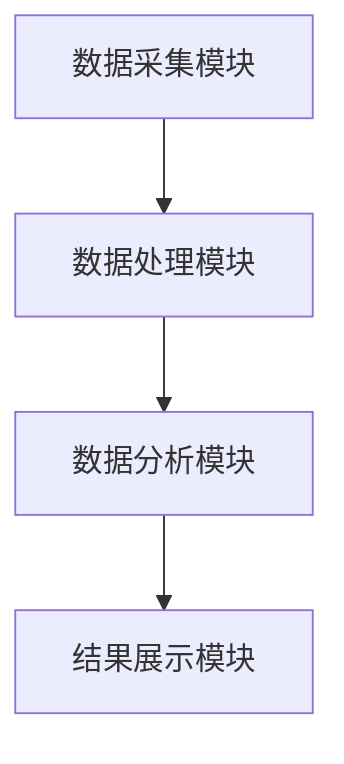

                 


# 利用智能体协作进行全面的公司声誉风险量化

> **关键词**：公司声誉风险、智能体协作、声誉量化、风险管理、多智能体系统、协作算法、量化模型

> **摘要**：本文探讨如何通过智能体协作技术实现对公司声誉风险的全面量化。通过分析声誉风险的定义、来源及其对企业的潜在影响，结合多智能体协作的理论基础和实际应用场景，提出了一种基于智能体协作的声誉量化模型。该模型通过数据收集、分析、评估和反馈的多阶段协作流程，实现对企业声誉风险的实时监测和有效管理。文章详细介绍了模型的核心算法、系统架构设计及实际应用案例，为企业的声誉风险管理提供了新的思路和解决方案。

---

## 第一部分: 公司声誉风险量化背景介绍

### 第1章: 声誉风险的基本概念

#### 1.1 问题背景与描述
##### 1.1.1 公司声誉的定义与重要性
公司声誉是企业在市场中获得的信任和认可程度，是企业价值的重要组成部分。良好的声誉能够帮助企业吸引客户、合作伙伴和优秀人才，而声誉受损则可能导致收入下降、品牌价值降低甚至市场退出。

##### 1.1.2 声誉风险的来源与影响
声誉风险来源于企业内外部的各种负面事件，如产品质量问题、管理不当、法律纠纷等。声誉受损会直接影响企业的市场形象和盈利能力，甚至引发连锁反应，影响企业的生存。

##### 1.1.3 声誉风险管理的必要性
在当今竞争激烈的市场环境中，声誉风险管理已成为企业战略管理的重要组成部分。通过有效的声誉风险管理，企业可以及时发现并解决潜在问题，最大限度地减少声誉损失。

---

#### 1.2 智能体协作的背景与重要性
##### 1.2.1 智能体协作的基本概念
智能体（Agent）是一种具有自主性、反应性、目标导向和协作能力的实体，能够独立执行任务并与其他智能体协作完成复杂目标。

##### 1.2.2 智能体协作在声誉风险管理中的作用
通过多智能体协作，企业可以整合内外部资源，实时监测和分析声誉相关信息，实现对声誉风险的全面量化和有效管理。

##### 1.2.3 智能体协作的优势
智能体协作能够提高信息处理效率，增强系统的适应性和灵活性，为企业声誉风险管理提供更强大的技术支持。

---

## 第二部分: 智能体协作与声誉风险量化的核心概念

### 第2章: 智能体协作的核心原理

#### 2.1 智能体协作的理论基础
##### 2.1.1 协作智能体的通信机制
协作智能体之间通过消息传递和数据共享实现信息交流，确保各智能体之间的协调一致。

##### 2.1.2 协作智能体的决策过程
基于共享信息和个体目标，协作智能体通过协商和决策过程确定最优行动方案。

##### 2.1.3 协作智能体的协调与冲突解决
在协作过程中，智能体需要解决资源分配、目标冲突等问题，确保协作过程的顺利进行。

---

#### 2.2 智能体协作在声誉风险管理中的应用
##### 2.2.1 数据收集与整合
协作智能体通过多种渠道（如社交媒体、新闻媒体、客户反馈等）实时收集与企业声誉相关的数据。

##### 2.2.2 数据分析与评估
通过智能体协作，对企业声誉数据进行多维度分析，识别潜在风险点并评估其影响程度。

##### 2.2.3 风险应对与反馈
智能体协作系统根据分析结果制定应对策略，并实时反馈执行效果，实现动态调整和优化。

---

## 第三部分: 基于智能体协作的声誉风险量化模型

### 第3章: 模型构建与算法设计

#### 3.1 模型构建的核心思想
声誉风险量化模型基于多智能体协作思想，通过整合内外部数据，构建企业声誉的多维度评估体系。

#### 3.2 智能体协作算法的设计与实现
##### 3.2.1 算法概述
声誉风险量化模型采用分布式协作算法，各智能体负责特定数据的收集与分析，通过协作完成整体评估。

##### 3.2.2 算法流程
1. 数据收集：智能体通过多种渠道获取与企业声誉相关的数据。
2. 数据预处理：对收集的数据进行清洗、转换和标准化处理。
3. 数据分析：基于机器学习算法，对数据进行特征提取和风险评估。
4. 结果整合：各智能体将分析结果汇总，形成最终的声誉风险量化报告。

#### 3.3 算法实现的数学模型
##### 3.3.1 线性回归模型
声誉风险评分可以通过线性回归模型进行预测：
$$
R = \beta_0 + \beta_1 x_1 + \beta_2 x_2 + \ldots + \beta_n x_n + \epsilon
$$
其中，$R$ 表示声誉风险评分，$x_i$ 表示各个影响因素，$\beta_i$ 为回归系数，$\epsilon$ 为误差项。

##### 3.3.2 聚类分析模型
通过聚类分析，将企业声誉数据分为不同类别，识别主要风险来源。

##### 3.3.3 人工神经网络模型
采用深度学习模型，对复杂声誉数据进行非线性分析，提高风险评估的准确性。

---

## 第四部分: 系统架构设计与实现

### 第4章: 系统架构设计

#### 4.1 系统功能模块设计
##### 4.1.1 数据采集模块
负责从社交媒体、新闻媒体等渠道获取企业声誉相关数据。

##### 4.1.2 数据处理模块
对采集的数据进行清洗、转换和标准化处理，确保数据质量。

##### 4.1.3 数据分析模块
基于机器学习算法，对数据进行特征提取和风险评估。

##### 4.1.4 结果展示模块
将分析结果以可视化形式呈现，帮助企业管理人员快速了解声誉风险状况。

#### 4.2 系统架构设计图
以下是系统的架构设计图，展示了各模块之间的关系和协作流程：



---

## 第五部分: 项目实战与应用案例

### 第5章: 项目实战

#### 5.1 环境安装与配置
##### 5.1.1 Python环境安装
安装Python 3.x 版本，确保环境满足项目需求。

##### 5.1.2 第三方库安装
安装必要的第三方库，如 `pandas`、`numpy`、`scikit-learn` 等。

#### 5.2 核心代码实现
##### 5.2.1 数据采集模块代码
```python
import requests
from bs4 import BeautifulSoup

def collect_data(url):
    response = requests.get(url)
    soup = BeautifulSoup(response.text, 'html.parser')
    # 提取数据并返回
    return data
```

##### 5.2.2 数据处理模块代码
```python
import pandas as pd

def preprocess_data(data):
    df = pd.DataFrame(data)
    # 数据清洗与处理
    return df
```

##### 5.2.3 数据分析模块代码
```python
from sklearn.linear_model import LinearRegression

def analyze_data(df):
    model = LinearRegression()
    model.fit(df[['x1', 'x2']], df['y'])
    return model.coef_
```

#### 5.3 案例分析与结果解读
通过实际案例分析，展示声誉风险量化模型的应用效果，解读分析结果并提出改进建议。

---

## 第六部分: 总结与展望

### 第6章: 总结与展望

#### 6.1 最佳实践
总结声誉风险量化模型的实现过程，提出在实际应用中的注意事项和优化建议。

#### 6.2 小结
通过智能体协作技术实现公司声誉风险的全面量化，为企业声誉风险管理提供了新的思路和解决方案。

#### 6.3 注意事项
在实际应用中，需要注意数据隐私、模型可解释性等问题，确保系统的安全性和可靠性。

#### 6.4 未来展望
展望未来，随着人工智能技术的不断发展，声誉风险管理将更加智能化和自动化，为企业创造更大的价值。

---

## 作者信息

**作者：AI天才研究院/AI Genius Institute & 禅与计算机程序设计艺术 /Zen And The Art of Computer Programming**

---

通过以上结构化的内容，您可以撰写一篇详细且具有深度的技术博客文章，涵盖公司声誉风险量化的核心概念、算法实现、系统设计和实际应用案例，帮助读者全面理解和应用智能体协作技术。

