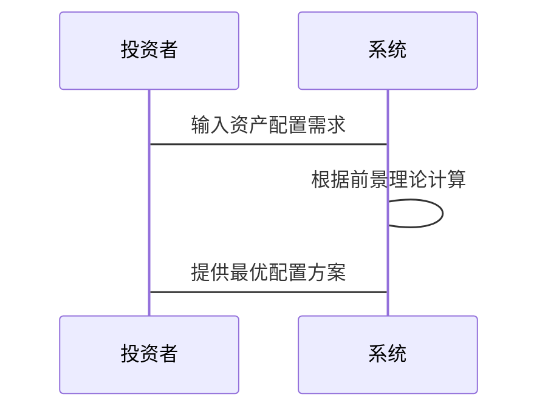

                 


# 前景理论：损失厌恶如何影响投资决策

## 关键词：前景理论，损失厌恶，投资决策，行为经济学，心理学

## 摘要： 
前景理论是一种行为经济学理论，由Kahneman和Tversky提出，揭示了人类在面对收益和损失时的决策偏见。本文详细探讨了前景理论的核心概念，特别是损失厌恶对投资决策的影响。通过数学模型、系统分析和实际案例，本文展示了如何理解和应用前景理论来优化投资策略。文章内容包括前景理论的背景、数学模型、损失厌恶对投资决策的影响、系统架构设计以及项目实战案例，最后给出最佳实践建议。

---

# 第一部分：前景理论基础与背景介绍

## 第1章：前景理论的起源与发展

### 1.1 前景理论的提出背景

#### 1.1.1 传统决策理论的局限性
传统期望效用理论假设人类是理性的，追求效用的最大化。然而，现实中投资者的行为经常偏离这一假设，例如对损失的过度厌恶和对小概率事件的过度重视。

#### 1.1.2 人类行为中的非理性现象
人类在决策过程中常常表现出非理性行为，如损失厌恶、概率加权、锚定效应等。这些行为在传统决策理论中无法得到合理解释。

#### 1.1.3 前景理论的诞生与核心思想
1979年，Kahneman和Tversky提出了前景理论，强调决策中的非线性价值函数和概率加权函数。前景理论认为，人类在决策时更关注变化的相对性，而非绝对值。

### 1.2 损失厌恶的核心概念

#### 1.2.1 什么是损失厌恶
损失厌恶是指人们对损失的敏感度高于收益的敏感度。即使收益和损失的预期值相同，人们也会更倾向于避免损失。

#### 1.2.2 损失与收益的不对等性
与收益相比，人们在面对损失时表现出更高的敏感性和风险厌恶。这种不对等性导致投资者在决策时更倾向于避免损失，而非追求收益。

#### 1.2.3 损失厌恶的度量与量化
通过数学模型，损失厌恶可以用价值函数中的曲率参数来量化。曲率越大，表示损失厌恶程度越高。

### 1.3 前景理论与传统决策理论的对比

#### 1.3.1 期望效用理论的局限性
期望效用理论假设效用是线性的，但现实中人们在决策时表现出非线性行为。

#### 1.3.2 前景理论的改进与创新
前景理论通过引入价值函数和概率加权函数，更好地解释了人类的非理性决策行为。

#### 1.3.3 两者的异同点分析
两者的主要区别在于对风险和不确定性的处理方式。前景理论更贴近现实中的投资者行为，而期望效用理论是基于理性的假设。

### 1.4 本章小结
本章介绍了前景理论的起源和核心思想，重点阐述了损失厌恶的概念及其对决策行为的影响。

---

## 第2章：前景理论在投资决策中的应用背景

### 2.1 投资决策中的非理性行为

#### 2.1.1 投资者的行为偏差
投资者在决策中常常表现出过度自信、从众心理、锚定效应等行为偏差。

#### 2.1.2 市场波动与投资者情绪
市场波动往往引发投资者情绪波动，导致非理性决策。例如，股市下跌时投资者更倾向于抛售，而上涨时更倾向于持有。

#### 2.1.3 传统投资理论的不足
传统投资理论假设投资者是理性的，但现实中投资者的行为经常偏离这一假设。

### 2.2 损失厌恶对投资决策的影响

#### 2.2.1 损失厌恶如何影响投资行为
损失厌恶导致投资者在面对潜在损失时更倾向于采取保守策略，例如避免卖出亏损的股票。

#### 2.2.2 投资者对损失的过度反应
投资者对损失的过度反应可能导致市场过度波动，例如在股市下跌时出现抛售潮。

#### 2.2.3 损失厌恶与市场泡沫的关系
损失厌恶可能导致投资者在面对潜在收益时过于乐观，从而推高资产价格，形成市场泡沫。

### 2.3 前景理论在金融领域的研究现状

#### 2.3.1 前景理论的实证研究
大量实证研究表明，前景理论能够较好地解释投资者在实际中的决策行为。

#### 2.3.2 前景理论在资产管理中的应用
前景理论已被广泛应用于资产配置、风险管理等领域，帮助投资者更好地应对非理性决策。

#### 2.3.3 当前研究的不足与未来方向
当前研究主要集中在理论层面，未来可以进一步探索前景理论在实际投资中的具体应用。

### 2.4 本章小结
本章分析了前景理论在投资决策中的应用背景，重点探讨了损失厌恶对投资行为的影响。

---

## 第3章：前景理论的数学模型与公式推导

### 3.1 前景理论的价值函数

#### 3.1.1 价值函数的定义与公式
价值函数定义为：
$$ V(x) = \begin{cases} 
x^{a} & \text{如果 } x \geq 0 \\
-(-x)^{b} & \text{如果 } x < 0 
\end{cases} $$
其中，a和b是曲率参数，通常a < 1，b > 1，表示对收益和损失的非线性反应。

#### 3.1.2 价值函数的形状与特点
价值函数呈S型曲线，对收益和损失的反应不对称。损失部分的曲率更大，反映了损失厌恶。

#### 3.1.3 价值函数的参数解释
a和b分别控制收益和损失的曲率。a < 1表示收益的递减性，b > 1表示损失的递增性。

### 3.2 前景理论的概率加权函数

#### 3.2.1 概率加权函数的定义
概率加权函数定义为：
$$ w(p) = p^{\alpha} (1 - p)^{\beta} $$
其中，α和β是概率加权参数。

#### 3.2.2 概率加权函数的公式
概率加权函数对概率进行非线性变换，使得小概率事件的影响被放大，大概率事件的影响被缩小。

#### 3.2.3 概率加权函数的参数解释
α和β控制概率加权的曲率。α > 1表示对小概率事件的过度重视，β < 1表示对大概率事件的过度忽视。

### 3.3 前景理论的整体数学模型

#### 3.3.1 综合数学模型的构建
前景理论的综合数学模型结合了价值函数和概率加权函数，表示为：
$$ U = \sum_{i=1}^n w(p_i) V(x_i) $$
其中，U是效用，x_i是可能的收益或损失，p_i是对应的概率。

#### 3.3.2 模型的适用条件与限制
模型适用于分析非理性决策，但在完全理性假设下可能不适用。

#### 3.3.3 模型的验证与应用
通过实证研究验证模型的适用性，并应用于实际投资决策分析。

### 3.4 本章小结
本章详细推导了前景理论的数学模型，解释了价值函数和概率加权函数的作用。

---

## 第4章：前景理论与损失厌恶的数学分析

### 4.1 损失厌恶的数学表达

#### 4.1.1 损失厌恶的度量公式
损失厌恶可以用损失曲率系数γ表示，γ > 1表示损失厌恶。

#### 4.1.2 损失厌恶的敏感性分析
通过调整损失曲率系数γ，分析损失厌恶对投资决策的影响。

#### 4.1.3 损失厌恶的个体差异
不同投资者的损失厌恶程度不同，可以用不同的γ值来表示。

### 4.2 损失厌恶对投资决策的影响模型

#### 4.2.1 损失厌恶对风险偏好的影响
损失厌恶导致投资者的风险厌恶程度增加。

#### 4.2.2 损失厌恶对资产配置的影响
损失厌恶可能导致投资者更倾向于配置低风险资产。

#### 4.2.3 损失厌恶对交易行为的影响
损失厌恶可能导致投资者在面对亏损时更倾向于卖出，以避免进一步损失。

### 4.3 本章小结
本章从数学角度分析了损失厌恶对投资决策的影响，强调了前景理论的适用性。

---

## 第5章：前景理论在投资决策中的系统分析与架构设计

### 5.1 投资决策系统的功能设计

#### 5.1.1 领域模型
使用Mermaid绘制领域模型类图，展示投资者、资产、风险等核心概念及其关系。


### 5.2 系统架构设计

#### 5.2.1 架构图
使用Mermaid绘制系统架构图，展示系统的各个模块及其交互。


### 5.3 系统接口设计

#### 5.3.1 投资者接口
投资者可以通过界面输入资产配置需求和风险偏好。

#### 5.3.2 资产管理接口
系统根据前景理论模型计算出最优资产配置方案。

### 5.4 系统交互流程

#### 5.4.1 交互流程
使用Mermaid绘制交互流程图，展示系统如何根据前景理论模型为投资者提供决策支持。



### 5.5 本章小结
本章从系统架构的角度分析了前景理论在投资决策中的应用，展示了系统的功能模块和交互流程。

---

## 第6章：前景理论在投资决策中的项目实战

### 6.1 项目背景与目标

#### 6.1.1 项目背景
选择一个具体的股票投资场景，应用前景理论进行分析。

### 6.2 项目环境与工具

#### 6.2.1 环境安装
安装Python和必要的库，如numpy和pandas。

### 6.3 核心实现

#### 6.3.1 前景理论模型的实现
编写Python代码实现前景理论的价值函数和概率加权函数。

```python
def value_function(x, a=0.5, b=1.5):
    if x >= 0:
        return x ** a
    else:
        return -(-x) ** b

def probability_weighting(p, alpha=1.5, beta=0.5):
    return p ** alpha * (1 - p) ** beta
```

#### 6.3.2 损失厌恶的度量与分析
通过调整损失曲率系数γ，分析不同损失厌恶程度下的投资决策。

### 6.4 代码实现与解读

#### 6.4.1 模型实现
实现价值函数和概率加权函数，展示如何将前景理论应用于实际投资分析。

### 6.5 案例分析与结果解读

#### 6.5.1 实际案例分析
以股票投资为例，分析前景理论如何影响投资者的决策。

#### 6.5.2 结果解读
展示不同损失厌恶程度下的投资决策结果，解释前景理论的应用效果。

### 6.6 本章小结
本章通过实际案例展示了前景理论在投资决策中的应用，验证了其有效性和实用性。

---

## 第7章：前景理论在投资决策中的最佳实践

### 7.1 关键点总结

#### 7.1.1 前景理论的核心要点
强调损失厌恶对投资决策的影响，以及前景理论的数学模型和系统架构设计。

### 7.2 小结与注意事项

#### 7.2.1 小结
总结前景理论在投资决策中的应用，强调其重要性和实际价值。

#### 7.2.2 注意事项
提醒投资者在实际应用中注意个体差异和市场环境的影响，避免过度依赖模型。

### 7.3 拓展阅读与进一步学习

#### 7.3.1 拓展阅读
推荐相关书籍和论文，鼓励读者深入学习前景理论及其应用。

#### 7.3.2 进一步学习建议
建议学习其他行为经济学理论，如 prospect theory 和 behavioral economics，以全面理解投资决策中的非理性行为。

### 7.4 本章小结
本章总结了前景理论在投资决策中的应用，并提出了进一步学习和实践的建议。

---

# 第四部分：结论与展望

## 第8章：结论与未来研究方向

### 8.1 研究结论

#### 8.1.1 前景理论的核心结论
前景理论成功解释了投资者的非理性行为，特别是损失厌恶对投资决策的影响。

#### 8.1.2 损失厌恶对投资决策的影响
损失厌恶导致投资者在决策中更倾向于避免损失，而非追求收益。

### 8.2 未来研究方向

#### 8.2.1 前景理论的进一步发展
探索前景理论在其他领域的应用，如行为经济学和认知科学。

#### 8.2.2 投资决策中的其他行为偏差
研究其他行为偏差对投资决策的影响，如过度自信和从众心理。

### 8.3 本章小结
本章总结了研究的主要结论，并展望了前景理论的未来发展方向。

---

# 作者：AI天才研究院/AI Genius Institute & 禅与计算机程序设计艺术 /Zen And The Art of Computer Programming

---

以上是根据《前景理论：损失厌恶如何影响投资决策》一书的部分内容和结构进行的详细说明。如需进一步扩展或补充，请随时告知。

