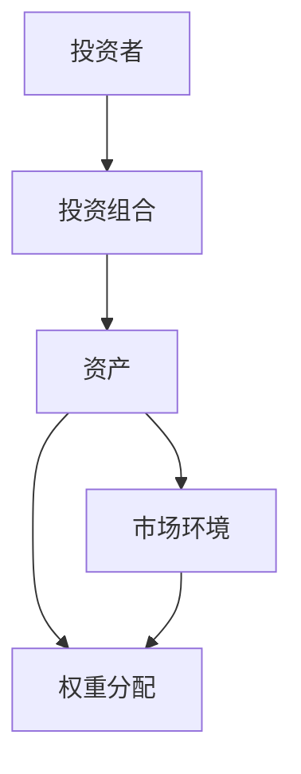
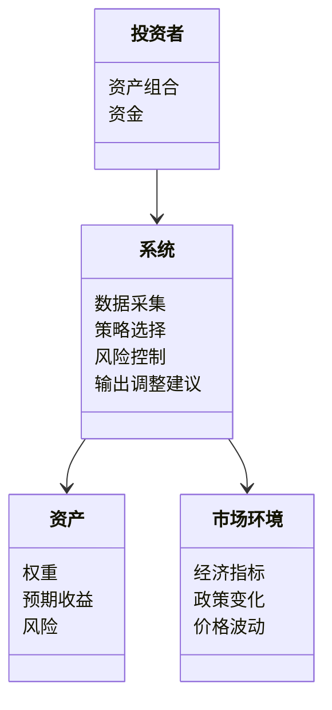
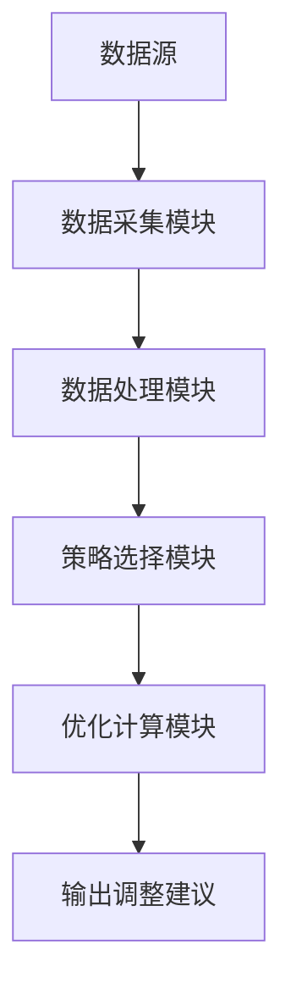

                 


# 动态资产配置：根据市场环境调整投资策略

> 关键词：动态资产配置、投资策略、市场环境、资产分配、风险管理、投资组合优化

> 摘要：本文深入探讨了动态资产配置的核心概念、算法原理、系统架构及实际应用，通过详细的数学模型、流程图和代码示例，帮助读者全面理解和掌握如何根据市场环境调整投资策略，优化投资组合的收益与风险。

---

# 第一部分: 动态资产配置的背景与概念

## 第1章: 动态资产配置的背景与概念

### 1.1 动态资产配置的定义

动态资产配置是一种投资策略，指根据市场环境的变化，定期调整投资组合中各资产的权重，以优化风险与收益。与静态资产配置不同，它强调灵活性和适应性。

#### 1.1.1 资产配置的基本概念

资产配置是将资金分配到不同资产类别（如股票、债券、现金等）以实现投资目标的过程。静态配置是固定比例，而动态配置则根据市场变化进行调整。

#### 1.1.2 动态资产配置的核心定义

动态资产配置通过实时监控市场变化，调整各资产的比例，以最大化收益或降低风险。这种方法适用于波动性较高的市场环境。

#### 1.1.3 动态资产配置与静态资产配置的区别

| 特性       | 动态资产配置                     | 静态资产配置                     |
|------------|----------------------------------|----------------------------------|
| 灵活性      | 高                              | 低                              |
| 市场适应性   | 强                              | 弱                              |
| 调整频率    | 高频                            | 低频                            |
| 风险控制    | 强化                            | 一般                            |

### 1.2 动态资产配置的背景与重要性

#### 1.2.1 金融市场波动的必然性

金融市场受多种因素影响，如经济指标、政策变化等，导致资产价格波动。动态配置帮助投资者应对这种不确定性。

#### 1.2.2 投资者风险偏好变化的影响

投资者的风险承受能力会随市场环境和个人财务状况变化而调整。动态配置允许投资者根据自身需求及时调整投资组合。

#### 1.2.3 动态资产配置在投资组合管理中的作用

动态配置通过及时调整资产比例，优化投资组合的风险-收益比，帮助投资者实现长期投资目标。

---

## 第2章: 动态资产配置的理论基础

### 2.1 现代投资组合理论（MPT）

#### 2.1.1 MPT的核心思想

MPT由哈里·马科维茨提出，认为最优投资组合是使风险最小化（在给定收益下）或收益最大化（在给定风险下）的组合。

#### 2.1.2 有效前沿的概念

有效前沿是所有可能的投资组合中风险最低或收益最高的组合构成的曲线。动态配置通过调整资产比例，使投资组合位于有效前沿上。

#### 2.1.3 风险与收益的平衡

投资组合的收益与风险呈正相关，动态配置通过调整资产权重，在两者之间找到平衡点。

### 2.2 均值-方差优化

#### 2.2.1 数学模型与公式

均值-方差优化的目标是找到使投资组合的方差最小化（或收益最大化）的权重分配。

$$\text{目标函数：} \min_w \sum_{i=1}^n \sum_{j=1}^n w_i w_j \sigma_{ij}$$
$$\text{约束条件：} \sum_{i=1}^n w_i = 1, \quad w_i \geq 0$$

其中，\(w_i\) 是资产 \(i\) 的权重，\(\sigma_{ij}\) 是资产 \(i\) 和 \(j\) 的协方差。

#### 2.2.2 优化过程的步骤

1. 计算各资产的预期收益和协方差矩阵。
2. 建立优化模型，求解最优权重。
3. 根据市场变化更新预期收益和协方差，重新优化。

#### 2.2.3 实际应用中的挑战

- 数据的准确性和及时性。
- 市场波动的不可预测性。
- 优化模型的计算复杂性。

---

## 第3章: 动态资产配置的核心概念与联系

### 3.1 核心概念原理

动态资产配置的核心在于根据市场变化调整资产权重，优化投资组合的风险-收益比。以下是关键概念的总结：

- **资产类别**：股票、债券、现金等。
- **权重分配**：各资产在组合中的比例。
- **市场环境**：影响资产价格的因素，如经济指标、政策变化等。
- **风险控制**：通过调整权重降低风险。

### 3.2 核心概念属性对比表格

| 概念       | 定义                               | 示例                       |
|------------|----------------------------------|---------------------------|
| 资产类别    | 不同金融资产的种类               | 股票、债券、现金           |
| 权重分配    | 各资产在组合中的比例             | 股票40%，债券30%，现金30% |
| 市场环境    | 影响资产价格的因素               | 经济增长、政策变化          |
| 风险控制    | 降低投资组合风险的策略           | 资产多样化、调整权重       |

### 3.3 ER实体关系图架构

图3.1: 动态资产配置的实体关系图（mermaid）



---

## 第4章: 动态资产配置的算法原理

### 4.1 算法原理讲解

动态资产配置算法的核心是根据市场变化调整各资产的权重。以下是常见算法的简要介绍：

#### 4.1.1 恒定混合资产配置

保持各资产的权重恒定，定期再平衡。

#### 4.1.2 趋势跟踪策略

根据市场趋势调整权重，如动量策略。

#### 4.1.3 风险平价策略

使各资产的风险贡献相等。

#### 4.1.4 均值-方差优化

根据市场变化优化各资产的权重。

### 4.2 算法实现代码

以下是均值-方差优化的Python实现示例：

```python
import numpy as np
from scipy.optimize import minimize

def optimize_weights(expected_returns, covariance_matrix):
    n = len(expected_returns)
    # 目标函数：最小化方差
    def objective(weights):
        return np.dot(weights.T, np.dot(covariance_matrix, weights))
    # 约束条件：权重和为1，且非负
    constraints = [{'type': 'eq', 'fun': lambda w: sum(w) - 1},
                   {'type': 'ineq', 'fun': lambda w: w[i] for i in range(n)}]
    # 初始化权重向量
    init_weights = np.array([1.0/n]*n)
    # 优化
    result = minimize(objective, init_weights, constraints=constraints)
    return result.x

# 示例数据
n = 3
expected_returns = np.array([0.1, 0.15, 0.08])
covariance_matrix = np.array([
    [0.04, 0.01, 0.005],
    [0.01, 0.06, 0.01],
    [0.005, 0.01, 0.03]
])
weights = optimize_weights(expected_returns, covariance_matrix)
print("Optimal weights:", weights)
```

---

## 第5章: 系统分析与架构设计方案

### 5.1 问题场景介绍

动态资产配置系统需要实时监控市场数据，分析市场环境，调整投资组合。系统需要处理大量数据，具备高效的数据处理和计算能力。

### 5.2 系统功能设计

#### 图5.1: 动态资产配置系统的领域模型（mermaid类图）



### 5.3 系统架构设计

#### 图5.2: 动态资产配置系统的架构图（mermaid）



---

## 第6章: 项目实战

### 6.1 环境配置

需要安装Python、numpy、pandas等库。

### 6.2 核心实现代码

以下是基于机器学习的动态配置系统实现：

```python
import pandas as pd
from sklearn.linear_model import LinearRegression

def dynamic_asset_allocation(data, window=30):
    # 计算动量策略
    returns = data.pct_change().dropna()
    model = LinearRegression()
    predictions = model.fit(returns.shift(1), returns).predict(returns)
    # 调整权重
    weights = pd.Series([0.4, 0.3, 0.3], index=['股票', '债券', '现金'])
    weights = weights / (1 + abs(predictions.sum()))
    return weights

# 示例数据
data = pd.DataFrame({
    '股票': [100, 105, 110, 115],
    '债券': [90, 92, 94, 96],
    '现金': [5000, 4900, 4800, 4700]
})
weights = dynamic_asset_allocation(data)
print("调整后的权重:", weights)
```

### 6.3 应用解读与分析

通过动量策略预测资产收益，调整权重以捕捉市场趋势。定期（如每月）重新计算权重，适应市场变化。

### 6.4 案例分析

假设市场上涨，股票权重增加；市场下跌，债券权重增加。动态配置根据预测调整，优化收益。

### 6.5 项目小结

动态资产配置通过实时调整，提升投资组合的收益和风险控制能力。实际应用中需考虑数据质量和模型的准确性。

---

## 第7章: 最佳实践与小结

### 7.1 最佳实践 tips

- 定期监控市场数据，及时调整权重。
- 选择合适的算法和模型，根据市场环境变化优化。
- 注意风险管理，避免过度集中在某一资产类别。

### 7.2 小结

动态资产配置通过灵活调整资产权重，优化投资组合的风险-收益比。本文详细介绍了其核心概念、算法、系统架构及实际应用，帮助读者掌握如何根据市场环境调整投资策略。

---

# 作者：AI天才研究院/AI Genius Institute & 禅与计算机程序设计艺术 /Zen And The Art of Computer Programming

