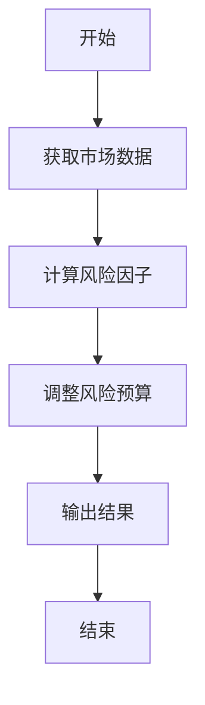
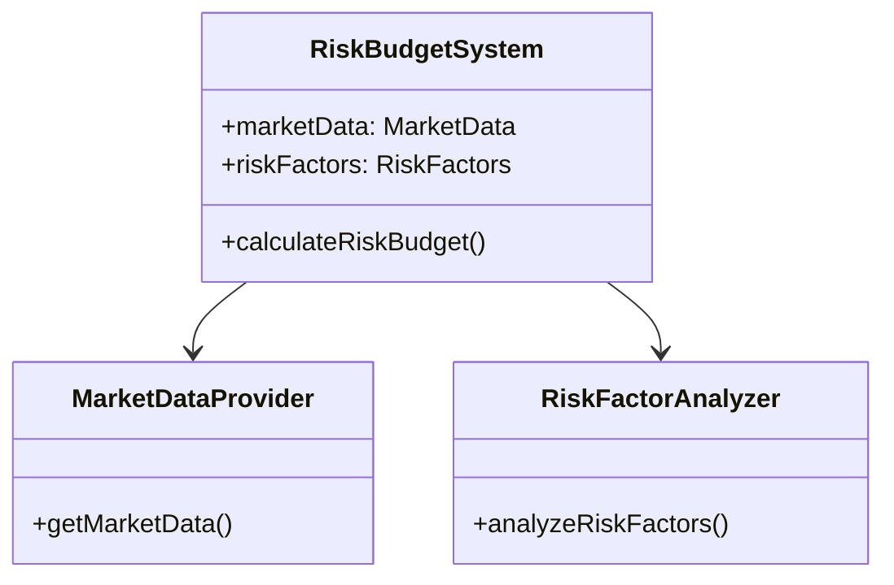
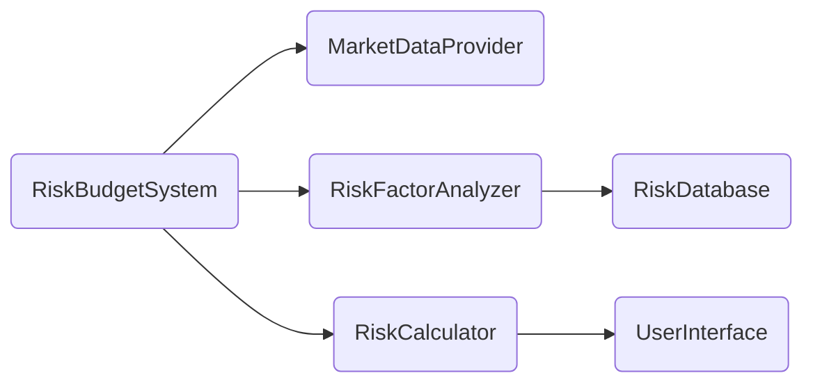

                 


# 动态风险预算：根据市场环境调整风险承受能力

> **关键词**：动态风险预算、风险承受能力、市场环境、风险管理、投资策略

> **摘要**：本文深入探讨了动态风险预算的概念，分析了其在不同市场环境下的应用方法，通过数学模型和算法原理详细阐述了如何根据市场变化调整风险承受能力。文章结合实际案例和系统架构设计，提供了从理论到实践的全面指导。

---

## 第一部分: 动态风险预算概述

### 第1章: 动态风险预算的基本概念

#### 1.1 什么是动态风险预算

- **风险预算**是指在一定时间内，组织或个人愿意承担的财务风险的总金额。
- **动态风险预算**强调根据市场环境的变化，实时调整可承受的风险水平，以适应外部条件的变化。

#### 1.2 动态风险预算的核心理念

- 风险承受能力不是静态的，而是动态变化的。
- 通过实时监控市场环境，调整风险预算，以优化投资决策。

#### 1.3 动态风险预算与静态风险预算的区别

| 方面       | 静态风险预算                | 动态风险预算                |
|------------|-----------------------------|-----------------------------|
| 时间维度   | 固定时间段                  | 实时调整                    |
| 调整机制   | 定期调整                    | 持续监控并实时调整          |
| 适用场景   | 稳定市场环境                | 多变或极端市场环境          |

---

### 第2章: 风险承受能力的动态调整机制

#### 2.1 风险承受能力的定义

- **风险承受能力**是组织或个人在面对风险时愿意承担的金额或承受的损失程度。

#### 2.2 风险承受能力的影响因素

- **市场环境**：市场波动、经济周期等。
- **组织目标**：投资目标、收益预期。
- **个体行为**：投资者的风险偏好。

#### 2.3 风险承受能力的动态调整方法

- **基于市场周期的调整**：牛市增加风险承受，熊市降低风险承受。
- **基于目标导向的调整**：根据投资目标动态调整风险预算。

---

## 第二部分: 市场环境分析与风险预算调整

### 第3章: 市场环境对风险承受能力的影响

#### 3.1 宏观经济指标分析

- **GDP增长率**：高增长市场环境通常风险承受能力较高。
- **通货膨胀率**：高通胀环境下风险承受能力需适当降低。

#### 3.2 市场情绪分析

- **投资者情绪指数**：反映市场参与者的风险偏好。
- **市场波动性指数**：衡量市场波动程度。

#### 3.3 风险因子分析

- **Beta系数**：衡量资产或组合的系统性风险。
- **VaR（在险价值）**：评估潜在损失。

---

## 第三部分: 动态风险预算的数学模型与算法

### 第4章: 数学模型与算法原理

#### 4.1 动态风险预算的数学模型

$$
\text{Risk Budget} = \alpha \cdot \text{Market Environment} + \beta \cdot \text{Internal Factors}
$$

其中：
- $\alpha$ 和 $\beta$ 是调整系数。
- $\text{Market Environment}$ 包括市场波动率、经济指标等。
- $\text{Internal Factors}$ 包括组织目标、资本充足率等。

#### 4.2 算法流程



---

## 第四部分: 系统架构与实现

### 第5章: 系统架构设计

#### 5.1 系统功能设计



#### 5.2 系统架构图



---

## 第五部分: 项目实战与案例分析

### 第6章: 项目实战

#### 6.1 环境安装

- 安装Python和相关库（Pandas、NumPy、Scipy）。

#### 6.2 核心实现代码

```python
import numpy as np
import pandas as pd

def calculate_risk_budget(market_data, internal_factors):
    alpha = 0.7
    beta = 0.3
    risk_budget = alpha * market_data + beta * internal_factors
    return risk_budget

market_data = pd.DataFrame({
    'volatility': [0.15, 0.20, 0.18],
    'inflation': [2.5, 3.0, 2.8]
})

internal_factors = pd.DataFrame({
    'target_return': [0.1, 0.12, 0.15],
    'capital': [100, 200, 150]
})

risk_budget = calculate_risk_budget(market_data, internal_factors)
print(risk_budget)
```

---

## 第六部分: 总结与展望

### 第7章: 总结

- 动态风险预算是根据市场环境调整风险承受能力的重要工具。
- 通过实时数据分析和模型调整，可以优化投资决策。

### 7.1 未来展望

- 更智能化的算法：结合AI技术进行预测和调整。
- 更多应用场景：扩展到更多金融领域和非金融领域。

---

**作者：AI天才研究院 & 禅与计算机程序设计艺术**

