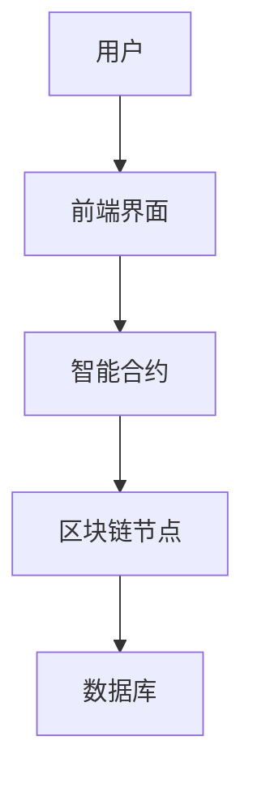
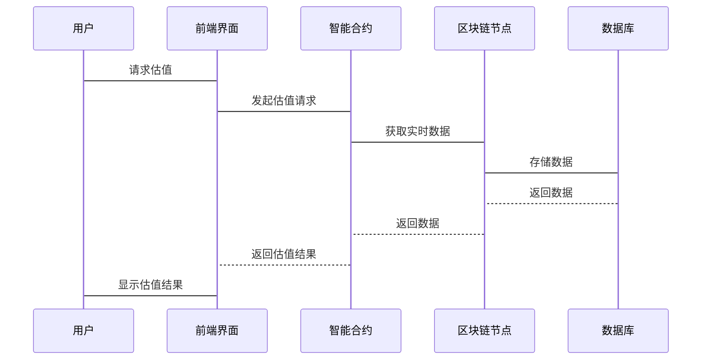

                 


# 区块链技术对股市估值方法的潜在影响

---

## 关键词：区块链技术、股市估值、分布式账本、智能合约、数据透明度、金融创新

---

## 摘要：区块链技术通过其分布式账本和智能合约等特性，正在改变传统的股市估值方法。本文将详细探讨区块链如何提升数据透明度、优化估值模型以及提高估值效率，分析其对金融市场的深远影响。

---

## 第1章：区块链技术基础

### 1.1 区块链的基本概念

#### 1.1.1 区块链的定义与特点

区块链是一种去中心化的分布式账本技术，通过加密算法和共识机制确保数据的安全性和不可篡改性。其特点包括去中心化、不可篡改、透明性和去信任化。

#### 1.1.2 区块链的核心技术原理

- **分布式账本**：数据分散存储在多个节点，确保数据的高可用性和安全性。
- **共识机制**：通过算法（如比特币的PoW、以太坊的PoS）达成一致，确保数据的有效性。
- **智能合约**：自动执行预定义的规则，减少人为干预。

#### 1.1.3 区块链的分类与应用场景

- **公有链、私有链、联盟链**：分别适用于不同的场景。
- **金融、供应链、医疗**：区块链在多个领域的应用案例。

---

### 1.2 区块链在金融领域的应用

#### 1.2.1 区块链在支付与结算中的应用

- **实时性**：区块链可以实现实时结算，减少中间环节。
- **降低成本**：通过去中心化减少中介费用。

#### 1.2.2 区块链在资产证券化中的应用

- **Token化**：将资产转化为数字资产，提升流动性。
- **透明性**：投资者可以实时追踪资产状态。

#### 1.2.3 区块链在风险管理中的应用

- **数据透明**：通过区块链技术实时监控风险点。
- **预测分析**：利用链上数据进行风险评估。

---

### 1.3 区块链技术对金融市场的潜在影响

#### 1.3.1 区块链对传统金融体系的挑战

- **去中介化**：减少传统金融机构的中间角色。
- **信任问题**：区块链通过技术手段建立信任机制。

#### 1.3.2 区块链对金融效率的提升

- **自动化交易**：智能合约自动执行交易指令。
- **实时结算**：减少结算时间和成本。

#### 1.3.3 区块链对金融创新的推动

- **新型金融工具**：如DeFi（去中心化金融）的兴起。
- **创新业务模式**：如供应链金融、智能合约保险。

---

## 第2章：传统股市估值方法概述

### 2.1 传统股市估值的核心概念

#### 2.1.1 市盈率与市净率的定义

- **市盈率（P/E）**：股价与每股收益的比率，反映市场对公司的未来盈利预期。
- **市净率（P/B）**：股价与每股净资产的比率，衡量资产的估值水平。

#### 2.1.2 股权自由现金流模型

- **定义**：公司产生的现金流，在满足再投资需求后可用于分配给股东的部分。
- **公式**：FCFF = EBIT(1 - tax rate) + Depreciation - Capital Expenditure

#### 2.1.3 企业价值评估的常用方法

- **DCF模型**：通过现金流折现估算企业价值。
- **相对估值法**：基于可比公司的市盈率、市净率等指标进行估值。

---

### 2.2 传统估值方法的局限性

#### 2.2.1 数据不透明的问题

- **信息不对称**：公司财务数据可能存在虚假或不透明的情况。
- **数据延迟**：传统报表的发布存在时间滞后。

#### 2.2.2 估值模型的假设偏差

- **假设不准确**：如假设自由现金流增长率不变，可能与实际情况不符。
- **模型简化**：复杂的企业情况被简化为几个参数，可能导致估值偏差。

#### 2.2.3 传统估值方法的效率低下

- **人工依赖**：需要大量人工分析，效率较低。
- **数据获取成本高**：获取高质量数据成本高，且存在不及时的问题。

---

### 2.3 传统估值方法的改进方向

#### 2.3.1 数据透明化的必要性

- **提升数据真实性和准确性**：通过区块链技术确保数据不可篡改。
- **实时数据获取**：区块链的实时更新特性可以实现数据的实时获取。

#### 2.3.2 技术驱动的估值创新

- **引入大数据分析**：利用机器学习等技术提升估值的准确性。
- **自动化估值模型**：通过算法自动调整模型参数，减少人为干预。

#### 2.3.3 估值模型的智能化发展

- **AI辅助估值**：利用人工智能技术优化估值模型。
- **动态调整模型**：根据市场变化实时调整估值参数。

---

## 第3章：区块链技术对股市估值方法的潜在影响

### 3.1 区块链技术对数据透明度的提升

#### 3.1.1 区块链的分布式账本技术

- **数据不可篡改**：区块链上的数据一旦写入，无法被修改。
- **可追溯性**：可以通过区块链追溯数据来源，确保数据的真实性。

#### 3.1.2 智能合约在估值中的应用

- **自动化执行**：智能合约可以自动执行预设的估值规则。
- **透明性**：智能合约的执行过程完全透明，可以被所有参与者监控。

#### 3.1.3 数据不可篡改性对估值的影响

- **减少信息不对称**：数据透明化后，投资者可以基于真实数据进行估值。
- **提升估值准确性**：真实数据为估值提供了更可靠的基础。

---

### 3.2 区块链技术对估值模型的优化

#### 3.2.1 基于区块链的实时数据处理

- **实时更新**：区块链上的数据可以实时更新，提升估值的时效性。
- **自动化处理**：通过智能合约自动处理数据，减少人工干预。

#### 3.2.2 分布式估值网络的构建

- **去中心化估值**：通过分布式的节点进行估值计算，避免单一中心的依赖。
- **节点协作**：各节点协同工作，共同完成估值任务。

#### 3.2.3 智能合约驱动的自动化估值

- **自动化估值流程**：从数据获取到估值计算，整个过程由智能合约自动完成。
- **动态调整模型**：智能合约可以根据市场变化自动调整估值模型的参数。

---

### 3.3 区块链技术对估值效率的提升

#### 3.3.1 区块链技术对数据获取速度的提升

- **实时数据**：区块链技术可以实现数据的实时更新，提升估值的速度。
- **分布式数据源**：多个节点同时提供数据，提高数据获取的效率。

#### 3.3.2 分布式计算对估值模型的加速

- **并行计算**：区块链网络中的多个节点可以同时进行计算，提高估值速度。
- **分布式存储**：数据分散存储在多个节点，减少数据获取的时间。

#### 3.3.3 智能合约对估值流程的自动化

- **自动化处理**：智能合约可以自动执行估值流程中的各个步骤，减少人工干预。
- **减少中间环节**：通过智能合约直接执行交易，减少中间环节，提高效率。

---

## 第4章：区块链技术对股市估值的核心影响

### 4.1 区块链技术对估值数据源的革新

#### 4.1.1 区块链技术如何确保数据的真实性

- **不可篡改性**：区块链技术确保数据无法被修改，保证数据的真实性。
- **可追溯性**：通过区块链可以追溯数据的来源，确保数据的可靠性。

#### 4.1.2 区块链技术如何提高数据的实时性

- **实时更新**：区块链上的数据可以实时更新，确保数据的时效性。
- **分布式同步**：多个节点同时更新数据，减少数据延迟。

#### 4.1.3 区块链技术如何增强数据的透明度

- **公开可查**：区块链上的数据对所有参与者公开，提高透明度。
- **可验证性**：数据可以通过区块链技术进行验证，确保数据的准确性。

---

### 4.2 区块链技术对估值模型的重构

#### 4.2.1 基于区块链的分布式估值模型

- **去中心化估值**：通过分布式的节点进行估值计算，避免单一中心的依赖。
- **节点协作**：各节点协同工作，共同完成估值任务。

#### 4.2.2 智能合约在估值模型中的应用

- **自动化执行**：智能合约可以自动执行预设的估值规则。
- **透明性**：智能合约的执行过程完全透明，可以被所有参与者监控。

#### 4.2.3 区块链技术对传统估值模型的优化

- **数据实时性**：区块链技术确保数据的实时性，提升估值的准确性。
- **模型动态调整**：智能合约可以根据市场变化自动调整估值模型的参数，提高模型的适应性。

---

### 4.3 区块链技术对估值流程的优化

#### 4.3.1 区块链技术如何实现估值流程的自动化

- **自动化数据获取**：通过区块链技术实现数据的自动获取和更新。
- **自动化估值计算**：通过智能合约自动完成估值计算，减少人工干预。

#### 4.3.2 区块链技术如何提高估值流程的效率

- **并行计算**：区块链网络中的多个节点可以同时进行计算，提高估值速度。
- **分布式存储**：数据分散存储在多个节点，减少数据获取的时间。

#### 4.3.3 区块链技术如何降低估值流程的成本

- **减少人工干预**：通过自动化流程减少人工成本。
- **降低数据获取成本**：通过区块链技术实现数据的实时获取和共享，降低数据获取成本。

---

## 第5章：区块链技术对股市估值的系统性影响

### 5.1 区块链技术对估值系统的整体架构

#### 5.1.1 区块链估值系统的总体架构

- **分布式节点**：多个节点协同工作，共同完成估值任务。
- **智能合约**：用于自动化执行估值规则和流程。
- **数据存储**：分布式存储确保数据的安全性和可用性。

#### 5.1.2 区块链估值系统的功能模块

- **数据获取模块**：从区块链网络中获取实时数据。
- **估值计算模块**：基于获取的数据进行估值计算。
- **智能合约模块**：执行预设的估值规则和流程。
- **结果输出模块**：将估值结果输出给用户。

#### 5.1.3 区块链估值系统的数据流分析

- **数据输入**：各节点实时更新数据。
- **数据处理**：智能合约自动处理数据，完成估值计算。
- **结果输出**：将估值结果传递给用户或系统。

---

### 5.2 区块链技术对估值系统安全性的提升

#### 5.2.1 区块链技术如何保护数据安全

- **加密算法**：通过加密技术保护数据的安全性。
- **权限控制**：通过智能合约实现细粒度的权限管理，确保数据的安全性。

#### 5.2.2 区块链技术如何防止数据篡改

- **不可篡改性**：区块链技术确保数据无法被修改，防止数据篡改。
- **可追溯性**：通过区块链可以追溯数据的来源和修改历史，确保数据的完整性。

#### 5.2.3 区块链技术如何提高系统的抗攻击能力

- **去中心化**：通过分布式的节点减少单一攻击点，提高系统的抗攻击能力。
- **共识机制**：通过共识机制确保系统的数据一致性，防止恶意攻击。

---

### 5.3 区块链技术对估值系统效率的提升

#### 5.3.1 区块链技术如何实现估值流程的自动化

- **智能合约**：通过智能合约自动执行估值规则和流程，减少人工干预。
- **自动化数据处理**：区块链技术实现数据的自动获取和处理，提高估值效率。

#### 5.3.2 区块链技术如何提高估值系统的扩展性

- **分布式架构**：通过分布式节点实现系统的扩展，提高处理能力。
- **模块化设计**：系统模块化设计，便于扩展和升级。

#### 5.3.3 区块链技术如何优化估值系统的资源利用

- **资源共享**：通过区块链技术实现资源的共享和优化利用。
- **动态调整**：根据系统负载自动调整资源分配，提高资源利用效率。

---

## 第6章：项目实战——基于区块链的股市估值系统

### 6.1 项目背景

- **目标**：构建一个基于区块链的股市估值系统，实现数据的实时获取和自动化估值。
- **技术选型**：选择以太坊作为区块链平台，Solidity语言开发智能合约。

---

### 6.2 系统设计

#### 6.2.1 功能设计

- **数据获取模块**：从区块链获取实时的股票数据。
- **估值计算模块**：基于获取的数据进行估值计算，生成估值结果。
- **智能合约模块**：自动化执行估值规则和流程，确保系统高效运行。

#### 6.2.2 系统架构设计



#### 6.2.3 接口设计

- **数据获取接口**：`GET /api/blockchain/data`
- **估值计算接口**：`POST /api/valuation/calculate`

#### 6.2.4 交互设计



---

### 6.3 系统实现

#### 6.3.1 环境安装

- **安装以太坊钱包**：如MetaMask。
- **安装Solidity编译器**：用于编写智能合约。
- **安装以太坊节点**：如Geth。

#### 6.3.2 核心实现代码

```python
from web3 import Web3, HTTPProvider

# 初始化以太坊节点
web3 = Web3(HTTPProvider('http://localhost:8545'))

# 智能合约地址和ABI
contract_address = '0xYourContractAddress'
contract_abi = [
    # 智能合约ABI定义
]

# 定义智能合约接口
contract = web3.eth.contract(contract_address, abi=contract_abi)

# 获取实时数据
def get_realtime_data():
    data = contract.functions.getData().call()
    return data

# 估值计算
def calculate_valuation(data):
    # 实现估值算法，如市盈率、市净率等
    pass

# 自动化估值流程
def automate_valuation():
    data = get_realtime_data()
    valuation = calculate_valuation(data)
    return valuation
```

---

### 6.4 案例分析

#### 6.4.1 项目小结

通过基于区块链的股市估值系统的构建，我们可以看到区块链技术在提升数据透明度、优化估值模型以及提高估值效率方面具有显著优势。

---

## 总结

区块链技术通过其分布式账本和智能合约等特性，正在深刻影响股市估值方法。本文详细探讨了区块链如何提升数据透明度、优化估值模型以及提高估值效率，并通过实际案例展示了区块链技术在股市估值中的应用。未来，随着区块链技术的不断发展，其对股市估值的影响将更加深远。

---

## 作者：AI天才研究院/AI Genius Institute & 禅与计算机程序设计艺术/Zen And The Art of Computer Programming

