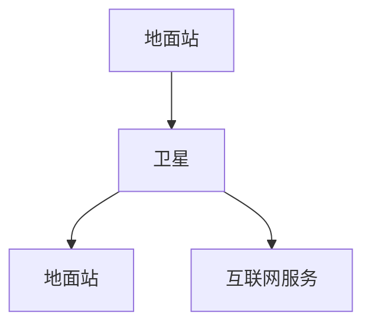
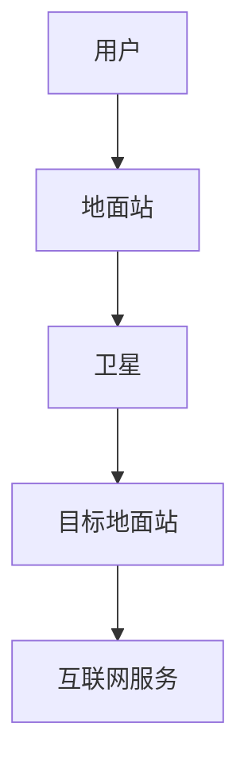
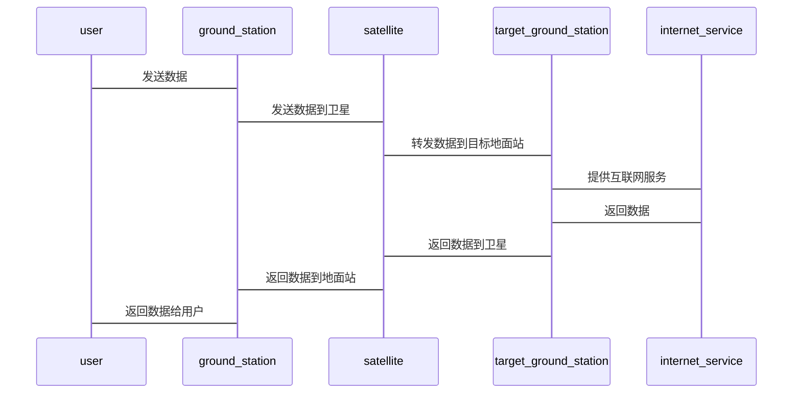

                 


# 卫星互联网技术的发展与投资前景

> 关键词：卫星互联网，通信技术，全球互联网，投资前景，技术发展

> 摘要：卫星互联网技术是连接全球互联网的重要组成部分，通过卫星通信技术实现全球范围内的互联网服务。本文将从卫星互联网技术的核心概念、算法原理、系统架构、项目实战以及投资分析等方面，深入探讨卫星互联网技术的发展现状、技术挑战和投资前景，为读者提供全面的分析和见解。

---

## 第一部分：卫星互联网技术的发展背景与核心概念

### 第1章：卫星互联网技术的背景与问题背景

#### 1.1 卫星互联网技术的定义与核心概念

##### 1.1.1 卫星互联网技术的定义
卫星互联网技术是一种通过卫星通信网络实现全球范围内互联网服务的技术。它利用卫星作为通信节点，将地面互联网与卫星网络相结合，为偏远地区、海洋、航空等领域提供互联网服务。

##### 1.1.2 卫星互联网技术的核心要素
- **卫星通信**：通过卫星作为中继站，实现地面站之间的通信。
- **互联网服务**：利用卫星网络提供HTTP、TCP/IP等互联网服务。
- **全球覆盖**：卫星互联网能够覆盖全球，弥补地面互联网的不足。

##### 1.1.3 卫星互联网技术的边界与外延
- 边界：专注于卫星通信技术在互联网领域的应用。
- 外延：涉及卫星制造、发射、通信协议等多个领域。

#### 1.2 卫星互联网技术的问题背景

##### 1.2.1 传统互联网的局限性
- 地理限制：地面互联网难以覆盖偏远地区和海洋。
- 高昂成本：铺设光纤网络成本高昂。
- 覆盖不足：无法满足全球范围内互联网服务的需求。

##### 1.2.2 卫星互联网技术的解决方案
- 利用卫星通信技术实现全球覆盖。
- 提供低延迟、高带宽的互联网服务。
- 支持移动设备的互联网接入。

##### 1.2.3 卫星互联网技术的应用场景
- 遥感监测：卫星互联网可以支持卫星遥感数据的传输。
- 航空航海：为飞机和船舶提供互联网服务。
- 偏远地区：为无网络覆盖的地区提供互联网接入。

---

### 第2章：卫星互联网技术的核心概念与联系

#### 2.1 卫星互联网技术的核心原理

##### 2.1.1 卫星通信的基本原理
卫星通信通过发射和接收无线电波实现通信。卫星作为中继站，接收地面站的信号并转发至其他地面站或卫星。

##### 2.1.2 卫星组网技术
- **低轨卫星**：低地球轨道卫星（LEO）距离地球约500-2000公里，通信延迟低。
- **中轨卫星**：中地球轨道卫星（MEO）距离地球约2000-35786公里，通信延迟较高。
- **高轨卫星**：地球同步轨道卫星（GEO）距离地球约35786公里，通信延迟最高。

##### 2.1.3 频率资源分配与管理
- 频率分配：卫星通信需要分配固定的频率资源，避免干扰。
- 频率复用：利用不同频率实现多个通信链路。

#### 2.2 卫星互联网技术的核心概念对比

##### 2.2.1 卫星通信与传统互联网的对比
| 对比维度       | 卫星互联网技术 | 传统互联网 |
|----------------|----------------|------------|
| 覆盖范围       | 全球覆盖       | 地域限制   |
| 建设成本       | 较高           | 较低       |
| 通信延迟       | 较高           | 较低       |

##### 2.2.2 卫星互联网技术的优劣势分析
- 优势：
  - 全球覆盖，解决偏远地区的互联网接入问题。
  - 支持移动设备的互联网服务。
- 劣势：
  - 通信延迟较高，影响实时性。
  - 建设成本高昂。

##### 2.2.3 卫星互联网技术的系统架构图



---

### 第3章：卫星互联网技术的算法原理

#### 3.1 卫星通信中的关键算法

##### 3.1.1 卫星信号传输算法
- **信号调制**：利用QAM（正交频分复用）技术实现信号传输。
- **信号解调**：接收端通过解调技术恢复原始信号。

##### 3.1.2 卫星网络路由算法
- **路由选择**：基于距离向量算法（D-V）或链路状态算法（LS）实现路由选择。
- **路由优化**：通过路径优化算法减少通信延迟。

##### 3.1.3 卫星数据压缩与编码算法
- **数据压缩**：利用哈夫曼编码或LZ77算法实现数据压缩。
- **数据编码**：通过纠错编码（如汉明码）提高数据传输的可靠性。

#### 3.2 算法原理的数学模型与公式

##### 3.2.1 卫星信号传输的数学模型
$$\text{信号强度} = k \cdot \text{发射功率} \cdot \text{增益} \cdot \text{距离}^{-n}$$
其中，$k$ 是常数，$n$ 是路径损耗指数。

##### 3.2.2 卫星网络路由算法的数学表达
$$\text{路由选择} = \argmin_{i} (d_i + c_i)$$
其中，$d_i$ 表示距离，$c_i$ 表示成本。

#### 3.3 算法实现的代码示例

##### 3.3.1 卫星信号传输的Python实现
```python
import numpy as np

def satellite_signal(transmit_power, gain, distance, n=2):
    signal_strength = k * transmit_power * gain * (distance ** (-n))
    return signal_strength

# 示例：计算信号强度
transmit_power = 100  # 瓦特
gain = 5  # �增益
distance = 1000  # 公里
k = 0.1  # 常数
n = 2  # 路径损耗指数

signal = satellite_signal(transmit_power, gain, distance, n)
print(f"信号强度为：{signal} dB")
```

---

## 第二部分：卫星互联网技术的系统架构与项目实战

### 第4章：卫星互联网技术的系统架构设计

#### 4.1 问题场景介绍
卫星互联网需要实现全球范围内的互联网服务，包括数据传输、网络路由、用户接入等功能。

#### 4.2 项目介绍
本项目旨在设计一个卫星互联网系统，实现卫星与地面站之间的通信，并提供互联网服务。

#### 4.3 系统功能设计
- **用户接入**：用户通过地面站接入卫星互联网。
- **数据传输**：卫星接收地面站的数据并转发至目标地面站。
- **网络路由**：通过路由算法实现数据的高效传输。

#### 4.4 系统架构设计


#### 4.5 系统接口设计
- **地面站接口**：接收用户数据并发送至卫星。
- **卫星接口**：接收地面站数据并转发至目标地面站。
- **互联网服务接口**：提供HTTP、TCP/IP等互联网服务。

#### 4.6 系统交互设计


---

## 第三部分：卫星互联网技术的投资前景分析

### 第5章：卫星互联网技术的投资分析与商业模式

#### 5.1 卫星互联网技术的投资现状
- **市场需求**：全球互联网覆盖的需求日益增长。
- **技术成熟度**：低轨卫星技术逐渐成熟，成本降低。
- **投资主体**：政府、企业、风险投资。

#### 5.2 卫星互联网技术的商业模式
- **B2B模式**：为政府、企业提供卫星互联网服务。
- **B2C模式**：为个人用户提供互联网接入服务。
- **广告模式**：通过用户数据进行广告投放。

#### 5.3 卫星互联网技术的投资机会
- **技术创新**：低轨卫星技术、高频段通信技术。
- **市场扩展**：拓展新兴市场，如非洲、东南亚。
- **生态系统建设**：构建卫星互联网生态系统。

#### 5.4 卫星互联网技术的投资风险
- **技术风险**：卫星通信技术的复杂性和高成本。
- **市场风险**：市场竞争激烈，可能导致收益下降。
- **政策风险**：政策变化可能影响行业发展。

---

## 结语

卫星互联网技术作为连接全球互联网的重要技术，具有广阔的发展前景和投资潜力。通过技术创新和商业模式的优化，卫星互联网技术将为全球用户提供更高质量的互联网服务。投资者应关注行业动态，抓住技术发展和市场扩展的机会，同时注意技术风险和市场风险。

---

## 作者

作者：AI天才研究院/AI Genius Institute & 禅与计算机程序设计艺术 /Zen And The Art of Computer Programming

