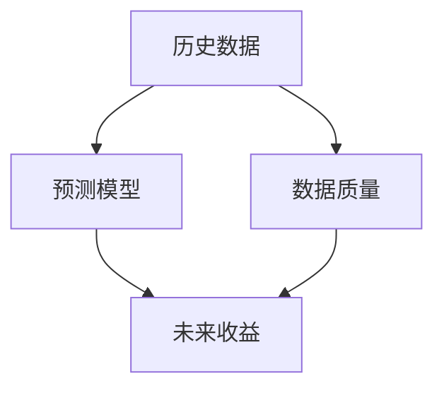
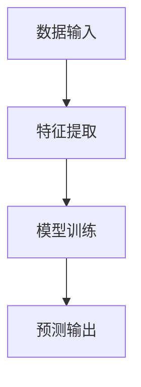
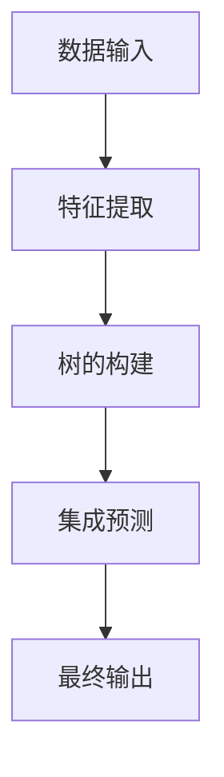
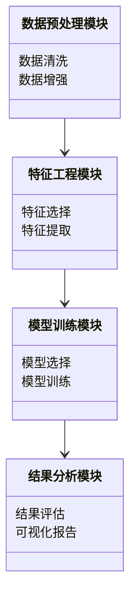
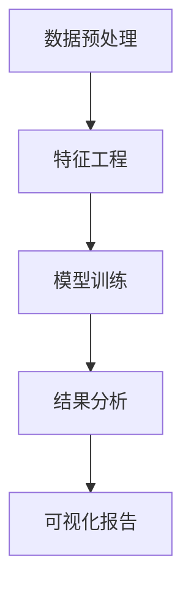
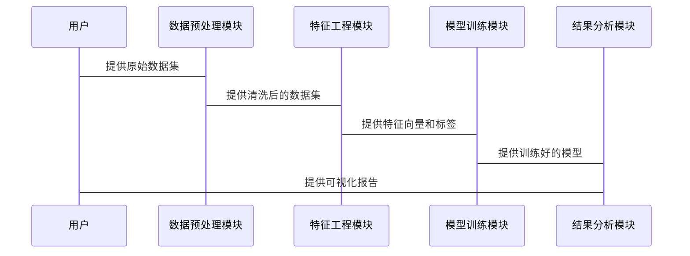

                 


# 历史数据不足对预测未来收益的影响

---

## 关键词：历史数据不足，预测未来收益，数据驱动决策，机器学习，数据质量

---

## 摘要：  
在当今数据驱动的决策时代，历史数据是预测未来收益的核心基础。然而，当历史数据不足时，预测模型的准确性和可靠性会受到严重影响。本文从背景、核心概念、算法原理、系统架构、项目实战和最佳实践等多角度，深入分析历史数据不足对预测未来收益的影响，并提供解决方案和实践建议。

---

# 第一部分：背景与核心概念

## 第1章：问题背景与描述

### 1.1 数据驱动决策的现状

在现代商业和科学研究中，数据驱动决策已成为不可或缺的工具。企业通过分析历史数据来预测市场需求、优化资源配置和制定战略决策。然而，很多时候，由于数据采集成本、时间限制或数据隐私等原因，历史数据往往不足以支持高精度的预测。

### 1.2 历史数据不足的定义与特征

历史数据不足可以定义为：在预测任务中，可用的历史数据量不足以满足模型训练和验证的需求，导致模型性能受限。其主要特征包括：

- 数据量小：训练数据样本数量有限。
- 数据稀疏性：某些特征或类别在数据中出现频率极低。
- 数据质量差：数据中存在噪声、缺失值或偏差。

### 1.3 预测未来收益的核心挑战

预测未来收益的关键在于模型能否准确捕捉数据中的模式和趋势。然而，历史数据不足会导致以下挑战：

- **模型过拟合**：数据量小，模型容易过拟合训练数据，缺乏泛化能力。
- **特征重要性难以识别**：数据稀疏时，难以准确识别对收益影响的关键特征。
- **预测误差放大**：数据不足会导致预测误差增大，影响决策的准确性。

---

## 第2章：核心概念与联系

### 2.1 核心概念与原理

- **数据量与模型性能**：数据量直接影响模型的训练效果。数据量越大，模型通常表现越好，但数据量不足时，模型性能会下降。
- **数据质量与预测准确性**：数据质量越高，预测结果越可靠。数据质量差会导致模型错误地学习噪声或偏差。
- **数据稀疏性与预测偏差**：数据稀疏性会导致模型在某些区域的预测偏差较大，尤其是在缺乏历史数据的区域。

### 2.2 核心概念对比分析

#### 数据量与数据质量对比表格

| 属性 | 数据量 | 数据质量 |
|------|--------|----------|
| 定义 | 数据的多少 | 数据的准确性、完整性 |
| 影响 | 模型训练的基础 | 预测结果的可靠性 |
| 解决方案 | 增加数据采集 | 数据清洗、特征工程 |

#### 实体关系图（ER图）



---

# 第二部分：算法原理与数学模型

## 第3章：基于历史数据不足的预测算法

### 3.1 线性回归模型

#### 算法流程图



#### 数学模型

线性回归的损失函数为：

$$ L = \sum_{i=1}^{n}(y_i - (\beta_0 + \beta_1x_i))^2 $$

通过最小化损失函数，我们可以找到最优的回归系数 $\beta_0$ 和 $\beta_1$。

#### 示例

假设我们有以下数据：

| 广告支出（x） | 销售收入（y） |
|--------------|---------------|
| 100          | 200           |
| 200          | 300           |
| 300          | 400           |

线性回归模型可以预测广告支出为 400 时的销售收入为：

$$ y = 100 + 1x $$

预测结果为 $y = 500$。

### 3.2 随机森林模型

#### 算法流程图



#### 数学模型

随机森林通过集成多个决策树的预测结果来提高模型的鲁棒性。预测结果为各树预测结果的平均值或多数投票结果。

#### 示例

数据：

| 广告支出（x） | 销售收入（y） |
|--------------|---------------|
| 100          | 200           |
| 200          | 300           |
| 300          | 400           |

随机森林模型构建三棵树，每棵树预测的销售收入分别为 210、290 和 310。最终预测结果为：

$$ y = \frac{210 + 290 + 310}{3} = 260 $$

---

# 第三部分：系统分析与架构设计

## 第4章：系统架构与实现方案

### 4.1 问题场景介绍

假设我们有一个销售数据集，其中包含广告支出、产品价格和销售收入等特征，但历史数据量较小。

### 4.2 系统功能设计

#### 领域模型（类图）



### 4.3 系统架构设计



### 4.4 系统接口设计

- 数据预处理模块接口：
  - 输入：原始数据集
  - 输出：清洗后的数据集
- 模型训练模块接口：
  - 输入：特征向量和标签
  - 输出：训练好的模型

### 4.5 系统交互流程



---

# 第四部分：项目实战

## 第5章：项目实战与代码实现

### 5.1 环境安装

需要安装以下库：

- Python 3.8+
- scikit-learn
- pandas
- numpy
- matplotlib
- seaborn

### 5.2 核心代码实现

#### 数据预处理

```python
import pandas as pd
import numpy as np

# 读取数据
data = pd.read_csv('销售数据.csv')

# 处理缺失值
data = data.dropna()

# 数据增强
from sklearn.utils import resample
data_upsampled = resample(data, replace=True, n_samples=100, random_state=42)
```

#### 特征工程

```python
from sklearn.feature_selection import SelectKBest
from sklearn.feature_selection import chi2

# 选择k个最佳特征
selector = SelectKBest(score_func=chi2, k=2)
selected_features = selector.fit_transform(data_upsampled, data_upsampled['销售收入'])
```

#### 模型训练

```python
from sklearn.ensemble import RandomForestRegressor

# 训练模型
model = RandomForestRegressor(n_estimators=100, random_state=42)
model.fit(selected_features, data_upsampled['销售收入'])
```

#### 结果分析

```python
from sklearn.metrics import mean_absolute_error

# 预测结果
y_pred = model.predict(selected_features)

# 评估结果
mae = mean_absolute_error(data_upsampled['销售收入'], y_pred)
print(f'Mean Absolute Error: {mae}')
```

### 5.3 案例分析

以广告支出为 400 的情况为例：

```python
# 创建输入特征
new_data = pd.DataFrame({'广告支出': 400, '产品价格': 500}, index=[0])
selected_features_new = selector.transform(new_data)

# 预测销售收入
y_pred_new = model.predict(selected_features_new)
print(f'预测的销售收入为: {y_pred_new[0]}')
```

---

# 第五部分：最佳实践与总结

## 第6章：总结与建议

### 6.1 本章小结

- 历史数据不足对预测未来收益的影响是多方面的，包括模型过拟合、特征识别困难和预测误差放大。
- 通过数据增强、特征工程和集成学习等方法可以有效缓解数据不足的问题。

### 6.2 最佳实践 tips

- **数据增强**：在数据量小的情况下，可以通过数据增强技术（如合成数据）来增加数据量。
- **模型选择**：在数据不足的情况下，选择对数据量敏感性较低的模型，如随机森林。
- **特征工程**：通过特征选择和提取，提高模型的特征利用率。
- **交叉验证**：使用交叉验证评估模型的性能。

### 6.3 未来展望

- **自监督学习**：探索自监督学习方法，减少对标签数据的依赖。
- **小样本学习**：研究小样本学习技术，提高模型在数据不足情况下的性能。

---

# 附录

## 附录 A：术语解释

- **数据稀疏性**：数据中某些特征或类别出现频率极低的现象。
- **过拟合**：模型在训练数据上表现良好，但在测试数据上表现较差的现象。
- **集成学习**：通过组合多个模型的预测结果来提高模型性能的技术。

## 附录 B：代码扩展

```python
# 数据增强示例
from imblearn.over_sampling import SMOTE

data_upsampled = SMOTE(random_state=42, sampling_strategy='minority').fit_resample(data, data['销售收入'])
```

---

# 结语

历史数据不足是预测未来收益中的常见挑战，但通过合理的数据处理、特征工程和模型选择，可以有效缓解这一问题。希望本文的分析和实践对读者在实际应用中有所帮助。

---

## 作者：AI天才研究院 & 禅与计算机程序设计艺术

