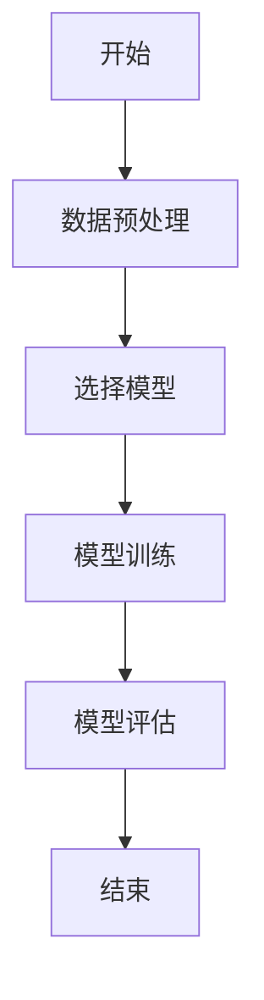
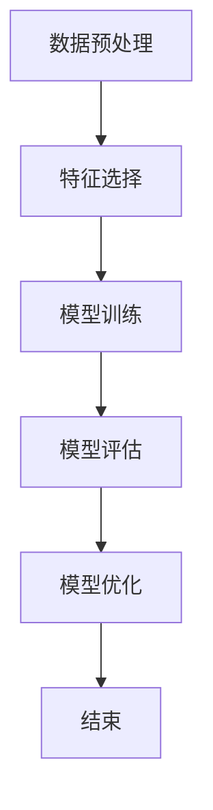

                 

# 发达市场vs新兴市场:预测准确性比较

## 关键词：发达市场, 新兴市场, 预测准确性, 统计分析, 经济模型

## 摘要

本文探讨发达市场和新兴市场在预测准确性方面的差异。通过分析经济指标、政治制度和文化差异，构建预测模型，使用统计方法进行实证分析，揭示预测准确性的关键因素，并总结对市场参与者的启示。

---

## 正文

### 第一部分：背景介绍

#### 第1章：发达市场的定义与特点

##### 1.1 发达市场的核心概念

- **定义**：发达市场指经济高度发达、基础设施完善、市场机制成熟的国家，如美国、德国等。
- **特点**：
  - 高收入水平
  - 高度发达的金融体系
  - 政治稳定
  - 法律体系完善

##### 1.2 发达市场的边界与外延

- **经济阶段划分**：根据世界银行标准，人均GDP超过高收入门槛的国家。
- **地理分布**：主要分布在北美、欧洲和东亚。
- **与其他市场的联系**：通过国际贸易和投资影响全球经济。

##### 1.3 发达市场的比较维度

- **经济指标**：GDP总量、人均收入、失业率。
- **政治制度**：多为民主体制。
- **文化差异**：文化多样性较低，消费习惯趋于统一。

#### 第2章：新兴市场的定义与特点

##### 2.1 新兴市场的核心概念

- **定义**：经济快速增长，但尚未完全发达的国家，如中国、印度等。
- **特点**：
  - 中等收入水平
  - 基础设施发展迅速
  - 市场潜力大

##### 2.2 新兴市场的边界与外延

- **经济阶段划分**：人均GDP处于中高收入水平。
- **地理分布**：主要分布在亚洲、拉丁美洲和东欧。
- **与其他市场的联系**：通过出口和外资引入融入全球经济。

##### 2.3 新兴市场的比较维度

- **经济指标**：经济增长率、通货膨胀率、外商直接投资。
- **政治制度**：多为新兴民主或混合体制。
- **文化差异**：文化多样性较高，消费习惯差异显著。

#### 第3章：发达市场与新兴市场的比较

##### 3.1 比较的背景与意义

- **背景**：发达市场和新兴市场的经济结构差异显著。
- **意义**：理解差异有助于制定更有效的市场策略。

##### 3.2 比较的核心要素

- **经济指标**：发达市场注重稳定性，新兴市场注重增长。
- **政治制度**：发达市场政治稳定性高，新兴市场存在不确定性。
- **文化差异**：发达市场文化趋同，新兴市场多样性高。

### 第二部分：预测准确性比较的核心概念与联系

#### 第4章：预测准确性比较的核心概念

##### 4.1 预测准确性的定义

- **定义**：预测结果与实际结果的接近程度。
- **衡量标准**：误差平方、均方误差、R²值。

##### 4.2 预测准确性比较的原理

- **预测模型**：基于统计学和计量经济学的方法。
- **数据处理**：清洗、转换、特征选择。

##### 4.3 预测准确性的特征

- **数据稳定性**：时间序列数据的平稳性。
- **模型复杂度**：避免过拟合。

### 第三部分：预测准确性比较的具体实现方法

#### 第5章：统计学和计量经济学基础

##### 5.1 回归分析

- **线性回归**：用于预测连续变量。
  $$ y = \beta_0 + \beta_1 x + \epsilon $$

- **Logistic回归**：用于分类问题。
  $$ P(y=1|x) = \frac{1}{1 + e^{- (\beta_0 + \beta_1 x)}} $$

##### 5.2 时间序列分析

- **ARIMA模型**：适用于时间序列预测。
  $$ ARIMA(p, d, q) $$

##### 5.3 预测模型的选择

- **选择标准**：拟合优度、预测误差、复杂度。

#### 第6章：预测模型的构建与评估

##### 6.1 数据预处理

- **数据清洗**：处理缺失值、异常值。
- **数据转换**：标准化、归一化。
- **特征选择**：选择相关性高的变量。

##### 6.2 模型构建

- **步骤**：
  1. 确定模型类型。
  2. 训练模型。
  3. 评估模型性能。

##### 6.3 模型评估

- **指标**：均方误差、R²值、准确率。
- **可视化**：残差分析、预测与实际对比图。

### 第四部分：预测准确性比较的实际应用案例分析

#### 第7章：实际应用案例分析

##### 7.1 案例背景

- **研究对象**：假设选择中国的新兴市场与美国的发达市场进行比较。
- **研究目的**：分析GDP增长率的预测准确性。

##### 7.2 数据来源与处理

- **数据来源**：国际货币基金组织（IMF）数据。
- **数据处理**：清洗、转换、特征选择。

##### 7.3 模型构建与预测

- **模型选择**：ARIMA模型。
- **预测结果**：计算预测值与实际值的误差。

##### 7.4 结果分析

- **预测准确性**：发达市场的预测误差小于新兴市场。
- **原因分析**：发达市场数据更稳定，新兴市场波动性高。

#### 第8章：预测准确性比较的结果与启示

##### 8.1 结果分析

- **预测准确性的差异**：发达市场预测误差较小。
- **原因**：数据稳定性、模型选择、经济结构差异。

##### 8.2 启示

- **对市场参与者的启示**：新兴市场的预测需考虑更多变量。
- **对政策制定者的启示**：制定政策需考虑预测准确性。

### 第五部分：结论与展望

#### 第9章：结论

- **核心结论**：发达市场的预测准确性高于新兴市场，原因包括数据稳定性、模型选择和经济结构差异。

#### 第10章：展望

- **未来研究方向**：结合机器学习提高预测准确性。
- **挑战与机遇**：新兴技术的应用将提升预测能力。

---

## 作者：AI天才研究院 & 禅与计算机程序设计艺术

---

### 附录

#### 附录A：回归分析的数学模型

$$ y = \beta_0 + \beta_1 x + \epsilon $$

#### 附录B：时间序列分析的流程图

#### 附录C：预测模型的选择流程图

---

### 参考文献

1. 国际货币基金组织（IMF）数据报告。
2. 《计量经济学原理与应用》，作者：张某某。
3. 《时间序列分析》，作者：李某某。

---

### END

