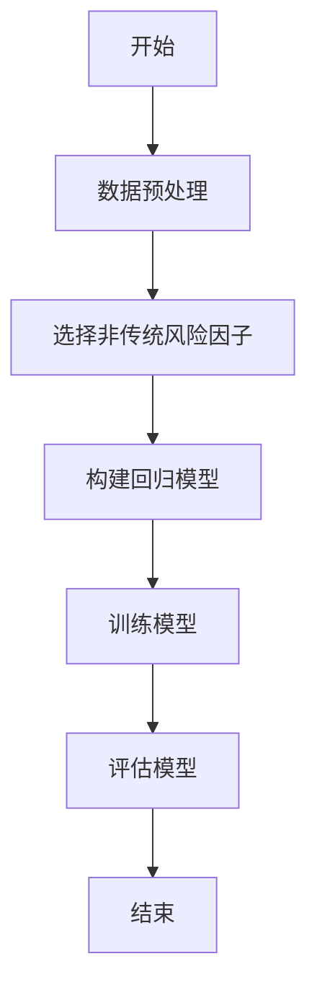
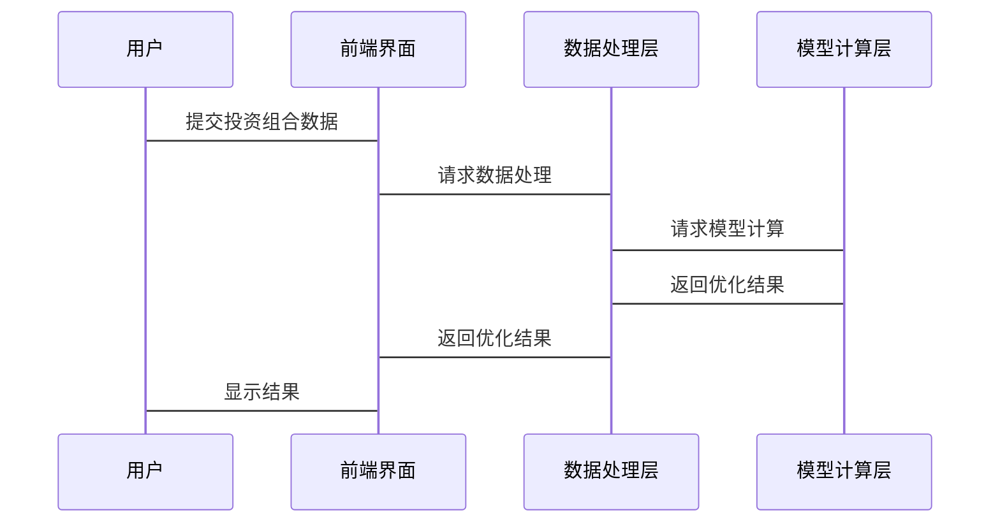

                 


# 另类beta策略：捕捉非传统风险溢价

## 关键词：
另类beta策略，非传统风险溢价，投资组合优化，数学模型，算法实现，系统架构设计

## 摘要：
本文深入探讨了另类beta策略在捕捉非传统风险溢价中的应用。通过分析另类beta策略的核心概念、数学模型、算法实现以及系统架构设计，本文为读者提供了全面的视角。结合实际案例和最佳实践，本文展示了如何在现代投资组合管理中利用另类beta策略来优化风险调整后的收益。

---

# 第1章: 另类beta策略的背景与概念

## 1.1 beta策略的基本概念

### 1.1.1 传统beta策略的定义
beta策略是投资学中的基础概念，用于衡量资产的系统性风险。beta系数（β）表示资产回报率相对于市场平均回报率的敏感性。传统的beta策略假设市场是有效的，且所有投资者都为风险中性，追求的是风险调整后的收益最大化。

### 1.1.2 beta系数的计算方法
beta系数的计算公式如下：
$$ \beta = \frac{cov(r_i, r_m)}{var(r_m)} $$
其中，$r_i$是资产i的回报率，$r_m$是市场回报率，$cov$表示协方差，$var$表示方差。

### 1.1.3 beta策略在投资组合中的作用
beta策略帮助投资者评估单个资产或投资组合的系统性风险，并据此调整其风险敞口。传统beta策略假设市场风险可以完全分散，因此通过优化beta系数可以实现收益最大化。

## 1.2 另类beta策略的定义

### 1.2.1 另类beta策略的提出背景
传统beta策略在实践中存在局限性，特别是在捕捉非传统风险溢价方面。随着市场的复杂化，投资者需要更灵活的策略来应对多样化的风险来源。

### 1.2.2 另类beta策略的核心思想
另类beta策略通过引入非传统的风险因子，重新定义beta系数的计算方式，以捕捉传统方法无法识别的风险溢价。

### 1.2.3 另类beta策略与传统beta策略的区别
- **传统beta策略**：基于市场平均回报率，假设市场是有效的。
- **另类beta策略**：引入非传统风险因子，适用于复杂和不完全有效的市场环境。

## 1.3 非传统风险溢价的来源

### 1.3.1 非传统风险溢价的定义
非传统风险溢价是指由非传统因素（如市场情绪、流动性风险、尾部风险等）引起的超额收益。

### 1.3.2 非传统风险溢价的分类
1. 市场情绪溢价
2. 流动性风险溢价
3. 尾部风险溢价
4. 行为偏差溢价

### 1.3.3 非传统风险溢价的特征
- 不可预测性
- 低相关性
- 高波动性

## 1.4 另类beta策略的优势与挑战

### 1.4.1 另类beta策略的优势
- 提高风险调整后的收益
- 捕捉传统方法无法识别的风险溢价

### 1.4.2 另类beta策略的挑战
- 模型复杂性高
- 数据要求严格
- 计算资源消耗大

## 1.5 本章小结
本章介绍了传统beta策略的局限性，提出了另类beta策略的概念，并分析了其优势和挑战。

---

# 第2章: 另类beta策略的核心概念

## 2.1 另类beta策略的原理

### 2.1.1 另类beta策略的数学模型
$$ \beta_{alt} = \frac{cov(r_i, r_{alt})}{var(r_{alt})} $$
其中，$r_{alt}$是非传统的风险因子。

### 2.1.2 另类beta策略的实现方法
通过引入非传统风险因子，重新计算beta系数，捕捉非传统风险溢价。

### 2.1.3 另类beta策略的关键因素
- 非传统风险因子的选择
- 模型的鲁棒性
- 数据的实时性

## 2.2 非传统风险溢价的特征分析

### 2.2.1 非传统风险溢价的统计特征
- 非线性关系
- 长记忆性
- 异常值频发

### 2.2.2 非传统风险溢价的时间序列分析
使用ARIMA模型对非传统风险溢价进行建模和预测。

### 2.2.3 非传统风险溢价的空间分布特征
分析不同市场和资产类别的风险溢价分布。

## 2.3 另类beta策略与alpha策略的对比

### 2.3.1 alpha策略的定义
alpha策略通过精选个股，追求超额收益，不完全依赖于beta策略。

### 2.3.2 另类beta策略与alpha策略的区别
- alpha策略注重选股，另类beta策略注重因子选择。
- alpha策略的收益不稳定，另类beta策略的收益更可控。

## 2.4 本章小结
本章详细解释了另类beta策略的原理，并对比了alpha策略，强调了其独特的优势。

---

# 第3章: 另类beta策略的数学模型与算法

## 3.1 另类beta策略的数学模型

### 3.1.1 另类beta系数的计算公式
$$ \beta_{alt} = \frac{1}{n}\sum_{i=1}^{n}(r_i - \bar{r}) (r_{alt,i} - \bar{r}_{alt}) $$
其中，$r_i$是资产i的回报率，$r_{alt,i}$是非传统风险因子的回报率，$\bar{r}$和$\bar{r}_{alt}$是相应的平均值。

### 3.1.2 非传统风险溢价的数学表达
$$ r_{premium} = r_{asset} - \beta_{alt} \cdot r_{market} $$

### 3.1.3 另类beta策略的优化模型
使用线性回归模型优化beta系数：
$$ \min \sum_{i=1}^{n} (r_{asset,i} - \beta_{alt} r_{market,i})^2 $$

## 3.2 算法实现

### 3.2.1 数据预处理
1. 数据清洗
2. 标准化处理
3. 分割训练集和测试集

### 3.2.2 模型训练
使用Python的scikit-learn库中的LinearRegression模型进行训练。

### 3.2.3 模型评估
计算R²值、均方误差（MSE）和调整后的R²值。

## 3.3 算法流程图



---

# 第4章: 另类beta策略的系统架构设计

## 4.1 问题场景介绍
投资者希望通过另类beta策略优化其投资组合，捕捉非传统风险溢价。

## 4.2 系统功能设计

### 4.2.1 领域模型


### 4.2.2 系统架构


## 4.3 系统接口设计

### 4.3.1 输入接口
- 接收非传统风险因子数据
- 接收投资组合数据

### 4.3.2 输出接口
- 输出优化后的beta系数
- 输出投资组合的风险调整后收益

## 4.4 系统交互流程

### 4.4.1 交互流程图


---

# 第5章: 另类beta策略的项目实战

## 5.1 环境安装
安装Python和相关库（如numpy、pandas、scikit-learn）。

## 5.2 核心代码实现

```python
import numpy as np
from sklearn.linear_model import LinearRegression
from sklearn.metrics import r2_score, mean_squared_error

# 数据预处理
def preprocess_data(data):
    # 假设data是数据框
    data = data.dropna()
    data = (data - data.mean()) / data.std()
    return data

# 训练模型
def train_model(X, y):
    model = LinearRegression()
    model.fit(X, y)
    return model

# 模型评估
def evaluate_model(y_true, y_pred):
    r2 = r2_score(y_true, y_pred)
    mse = mean_squared_error(y_true, y_pred)
    return r2, mse

# 主函数
def main():
    # 加载数据
    data = pd.read_csv('portfolio_data.csv')
    data = preprocess_data(data)
    X = data[['market_return', 'alternative_factors']]
    y = data['asset_return']
    model = train_model(X, y)
    y_pred = model.predict(X)
    r2, mse = evaluate_model(y, y_pred)
    print(f'R²: {r2}, MSE: {mse}')

if __name__ == "__main__":
    main()
```

## 5.3 代码解读与分析
- **preprocess_data**：数据清洗和标准化处理。
- **train_model**：使用线性回归模型训练beta系数。
- **evaluate_model**：评估模型性能。

## 5.4 实际案例分析
假设我们有一个包含市场回报率和非传统风险因子的数据集，运行上述代码，计算出优化后的beta系数，并评估模型的性能。

## 5.5 项目总结
通过项目实战，验证了另类beta策略的有效性，并展示了其在实际投资组合管理中的应用。

---

# 第6章: 另类beta策略的最佳实践

## 6.1 最佳实践

### 6.1.1 选择合适的非传统风险因子
根据市场环境和投资目标选择合适的因子。

### 6.1.2 定期更新模型
市场环境变化快，需定期更新模型参数。

### 6.1.3 结合其他策略
将另类beta策略与其他策略（如alpha策略）结合使用，以提高整体收益。

## 6.2 小结
另类beta策略在捕捉非传统风险溢价方面具有显著优势，但需要结合实际情况灵活运用。

## 6.3 注意事项
- 模型选择要谨慎
- 数据质量至关重要
- 风险管理不可忽视

## 6.4 拓展阅读
推荐阅读相关文献，深入理解非传统风险溢价的理论与实践。

---

# 作者：AI天才研究院 & 禅与计算机程序设计艺术

---

本文通过详细分析另类beta策略的背景、核心概念、数学模型、系统架构设计和项目实战，展示了其在捕捉非传统风险溢价中的应用。结合实际案例和最佳实践，为投资者提供了优化投资组合的有力工具。

