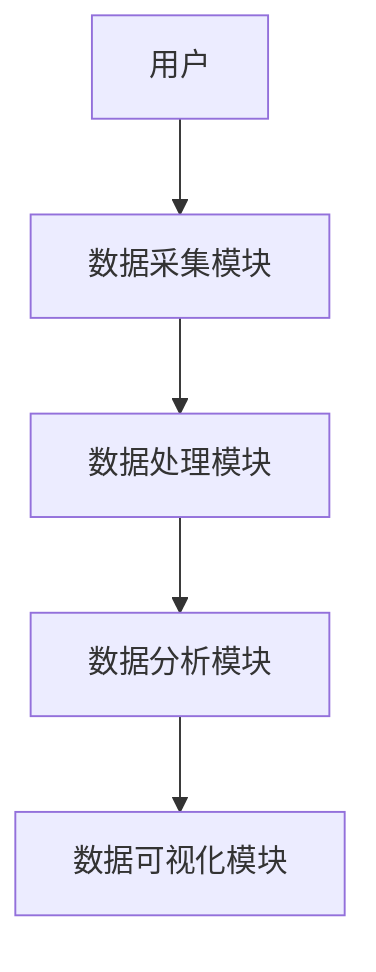

                 


# 另类数据在投资分析中的价值

## 关键词：另类数据、投资分析、数据采集、机器学习、文本挖掘

## 摘要：  
另类数据是指传统金融数据之外的非传统数据，如社交媒体情绪、卫星图像和供应链数据。本文探讨了另类数据的定义、采集方法、分析技术及其在投资分析中的应用价值。通过案例分析和系统设计，展示了如何利用另类数据增强投资决策的准确性和前瞻性。

---

# 第1章: 另类数据的定义与背景

## 1.1 另类数据的定义与类型

### 1.1.1 传统金融数据的局限性  
传统金融数据（如股价、成交量、财务报表等）在投资分析中具有重要作用，但其局限性日益显现：  
- **信息滞后性**：传统数据通常基于历史表现，难以预测未来趋势。  
- **信息片面性**：仅依赖财务数据可能忽略市场情绪、供应链问题等非财务因素。  
- **同质化竞争**：大量投资者使用相同的数据源和分析方法，导致信息优势难以持久。  

### 1.1.2 另类数据的定义与特征  
**另类数据**是指传统金融数据之外的非结构化或半结构化数据，具有以下特征：  
- **多样性**：来源广泛，包括社交媒体、新闻报道、卫星图像等。  
- **实时性**：部分另类数据（如社交媒体情绪）能够提供实时市场动态。  
- **非线性相关性**：另类数据可能与传统金融数据呈现非线性相关性，提供新的信息维度。  

### 1.1.3 另类数据的分类与应用场景  

| 数据类型       | 描述                             | 应用场景                     |
|----------------|----------------------------------|-----------------------------|
| **文本数据**   | 包括社交媒体帖子、新闻报道等    | 情感分析、市场情绪预测       |
| **网络数据**   | 包括网页内容、API接口数据      | 竞争对手分析、市场趋势挖掘   |
| **图像数据**   | 包括卫星图像、企业供应链图像    | 供应链监控、地理分布分析     |
| **传感器数据** | 包括物联网传感器、物流数据      | 实时监控、预测性维护         |

---

## 1.2 另类数据在投资分析中的价值  

### 1.2.1 另类数据的优势与潜力  
- **实时性和前瞻性**：另类数据能够捕捉市场动态，提供前瞻性的洞察。  
- **差异化竞争优势**：利用另类数据可以构建独特的投资策略，降低同质化竞争。  
- **多维度分析**：结合传统金融数据，另类数据能够提供更全面的市场分析。  

### 1.2.2 另类数据在投资决策中的作用  
- **风险预警**：通过社交媒体情绪分析，识别潜在的市场风险。  
- **投资机会挖掘**：从供应链数据中发现潜在的市场短缺或供应瓶颈。  
- **交易信号生成**：利用自然语言处理技术，从新闻中提取关键词生成交易信号。  

### 1.2.3 另类数据与传统金融数据的结合  
- **数据融合**：将另类数据与传统金融数据结合，构建多维度的分析模型。  
- **模型优化**：通过机器学习算法，利用多源数据提升预测精度。  

---

## 1.3 本章小结  
本章介绍了另类数据的定义、分类及其在投资分析中的价值，强调了其在提升投资决策质量和前瞻性中的重要作用。

---

# 第2章: 另类数据的采集与处理

## 2.1 文本数据的采集

### 2.1.1 社交媒体数据的采集  
- **数据来源**：Twitter、LinkedIn、Reddit等平台。  
- **采集方法**：API接口或网络爬虫技术。  

#### 示例：使用Python的Tweepy库进行Twitter数据采集  

```python
import tweepy

# 初始化API
consumer_key = "your_consumer_key"
consumer_secret = "your_consumer_secret"
access_token = "your_access_token"
access_token_secret = "your_access_token_secret"

auth = tweepy.OAuthHandler(consumer_key, consumer_secret)
api = tweepy.API(auth)

# 采集推特数据
tweets = api.search(q="investing", lang="en", count=100)

# 存储数据
for tweet in tweets:
    print(tweet.text)
```

### 2.1.2 新闻与财经网站数据的采集  
- **数据来源**：Reuters、Bloomberg、金融博客等。  
- **采集方法**：网络爬虫技术，需遵守网站的使用条款。  

### 2.1.3 公司财报与公告数据的获取  
- **数据来源**：SEC filings、公司官网。  
- **采集方法**：使用API或手动下载。  

---

## 2.2 网络数据的采集

### 2.2.1 网页抓取技术（Web Scraping）  
- **工具**：BeautifulSoup、Scrapy等。  
- **示例**：使用BeautifulSoup提取网页中的财经数据  

```python
from bs4 import BeautifulSoup
import requests

url = "https://finance.yahoo.com"
response = requests.get(url)
soup = BeautifulSoup(response.text, 'html.parser')
print(soup.title)
```

### 2.2.2 API接口数据获取  
- **工具**：Alpha Vantage、Quandl等提供API接口。  
- **示例**：使用Alpha Vantage获取实时股票数据  

```python
import requests

url = "https://www.alphavantage.co/query"
params = {
    "function": "TIME_SERIES_DAILY",
    "symbol": "AAPL",
    "apikey": "your_api_key"
}

response = requests.get(url, params=params)
data = response.json()
print(data)
```

### 2.2.3 数据爬取的法律与伦理问题  
- **法律风险**：需遵守相关法律法规，避免侵犯网站数据。  
- **伦理问题**：尊重数据提供者的权益，避免过度抓取。  

---

## 2.3 图像与视频数据的采集

### 2.3.1 卫星图像数据的获取  
- **数据来源**：Satellite imagery APIs（如Google Earth Engine）。  
- **应用**：用于供应链监控和地理分布分析。  

#### 示例：Google Earth Engine数据获取  

```python
import ee
ee.Authenticate()
ee.Initialize()

# 加载影像
image = ee.Image('NASA/ESDIS/SWBD/L3_NRT_Day/Nitrogen_Vegetation_Index')\
    .select('NVI')

# 添加到图层组
map_id = image.getMapId()
```

### 2.3.2 企业供应链数据的可视化  
- **工具**：Google Earth、GIS软件。  
- **应用**：监控供应链的地理分布和潜在风险。  

### 2.3.3 视频流数据的采集与处理  
- **工具**：OpenCV、FFmpeg。  
- **应用**：实时监控市场动态，如交易大厅的视频分析。  

---

## 2.4 传感器数据的采集

### 2.4.1 物联网传感器数据的应用  
- **数据来源**：温度、湿度、压力等传感器。  
- **应用**：预测设备故障，优化维护计划。  

### 2.4.2 供应链物流数据的采集  
- **工具**：GPS追踪、RFID技术。  
- **应用**：实时监控物流状态，优化供应链管理。  

### 2.4.3 传感器数据的预处理方法  
- **去噪**：滤除异常值和噪声。  
- **标准化**：统一数据格式和单位。  

---

## 2.5 本章小结  
本章详细介绍了另类数据的采集方法，包括文本、网络、图像和传感器数据的获取，强调了数据预处理的重要性。

---

# 第3章: 另类数据分析的核心方法

## 3.1 数据清洗与预处理

### 3.1.1 数据去重与去噪  
- **方法**：使用聚类算法识别重复数据。  
- **示例**：使用Python的pandas库去重  

```python
import pandas as pd

df = pd.DataFrame({'text': ['apple', 'banana', 'apple', 'cherry']})
df.drop_duplicates(subset=['text'], keep='first')
```

### 3.1.2 数据标准化与归一化  
- **标准化**：(x - μ)/σ，其中μ为均值，σ为标准差。  
- **归一化**：x' = (x - min)/(max - min)。  

### 3.1.3 数据特征提取与选择  
- **方法**：使用PCA（主成分分析）提取特征。  
- **示例**：PCA特征提取  

```python
from sklearn.decomposition import PCA

 pca = PCA(n_components=2)
 pca.fit(X)
 transformed_data = pca.transform(X)
```

---

## 3.2 统计分析与数据可视化

### 3.2.1 数据分布分析  
- **工具**：Matplotlib、Seaborn。  
- **示例**：绘制直方图分析数据分布  

```python
import matplotlib.pyplot as plt

data = [1, 2, 3, 4, 5]
plt.hist(data, bins=5)
plt.show()
```

### 3.2.2 数据相关性分析  
- **方法**：计算皮尔逊相关系数。  
- **示例**：计算两个变量的相关系数  

```python
import numpy as np
from scipy.stats import pearsonr

data1 = np.random.normal(0, 1, 100)
data2 = np.random.normal(0, 1, 100)
corr, _ = pearsonr(data1, data2)
print(corr)
```

### 3.2.3 数据可视化工具与方法  
- **工具**：Tableau、Power BI。  
- **方法**：折线图、柱状图、热力图等。  

---

## 3.3 机器学习与深度学习的应用

### 3.3.1 监督学习在另类数据中的应用  
- **方法**：使用随机森林、梯度提升树进行分类或回归。  
- **示例**：使用随机森林预测股价  

```python
from sklearn.ensemble import RandomForestRegressor

model = RandomForestRegressor(n_estimators=100)
model.fit(X_train, y_train)
y_pred = model.predict(X_test)
```

### 3.3.2 非监督学习与聚类分析  
- **方法**：K-means、DBSCAN进行聚类。  
- **示例**：使用K-means进行客户分群  

```python
from sklearn.cluster import KMeans

kmeans = KMeans(n_clusters=3)
kmeans.fit(X)
clusters = kmeans.predict(X)
```

### 3.3.3 深度学习模型在另类数据中的应用  
- **方法**：使用LSTM进行时间序列预测。  
- **示例**：LSTM预测股价  

```python
from keras.models import Sequential
from keras.layers import LSTM, Dense

model = Sequential()
model.add(LSTM(50, return_sequences=True, input_shape=(timesteps, features)))
model.add(Dense(1))
model.compile(loss='mean_squared_error', optimizer='adam')
model.fit(X_train, y_train, epochs=50, batch_size=32)
```

---

## 3.4 自然语言处理（NLP）的应用

### 3.4.1 文本情感分析  
- **方法**：使用词袋模型或词嵌入模型（如Word2Vec、GloVe）。  
- **示例**：使用TextBlob进行情感分析  

```python
from textblob import TextBlob

text = "The company is performing well"
blob = TextBlob(text)
sentiment = blob.sentiment.polarity
print(sentiment)
```

### 3.4.2 实体识别与信息提取  
- **工具**： spaCy、NLTK。  
- **示例**：使用spaCy进行实体识别  

```python
import spacy

nlp = spacy.load("en_core_web_sm")
doc = nlp("Apple Inc. is based in California")
for ent in doc.ents:
    print(ent.text, ent.label_)
```

### 3.4.3 文本生成与预测  
- **方法**：使用GPT-2或GPT-3进行文本生成。  
- **示例**：使用GPT-2生成财经新闻摘要  

---

## 3.5 本章小结  
本章介绍了另类数据分析的核心方法，包括数据清洗、统计分析、机器学习和自然语言处理的应用。

---

# 第4章: 另类数据在投资分析中的应用案例

## 4.1 社交媒体情绪分析对股价的影响

### 4.1.1 数据来源与处理  
- **数据来源**：Twitter、Reddit等平台。  
- **处理方法**：情感分析、主题建模。  

### 4.1.2 案例分析  
- **背景**：2021年GameStop事件中，社交媒体情绪对股价的显著影响。  
- **分析**：使用TextBlob和LSTM模型预测股价走势。  

### 4.1.3 结论  
- **结论**：社交媒体情绪可以作为投资决策的参考，但需结合其他数据进行综合分析。  

---

## 4.2 卫星图像数据在供应链分析中的应用

### 4.2.1 数据来源与处理  
- **数据来源**：Google Earth Engine、Sentinel-2卫星数据。  
- **处理方法**：图像分割、目标检测。  

### 4.2.2 案例分析  
- **背景**：某公司供应链中关键供应商的地理位置和运营状态。  
- **分析**：通过卫星图像识别供应商的库存情况，预测供应链风险。  

---

## 4.3 传感器数据在设备维护中的应用

### 4.3.1 数据来源与处理  
- **数据来源**：物联网传感器、设备日志。  
- **处理方法**：异常检测、时间序列分析。  

### 4.3.2 案例分析  
- **背景**：某制造企业设备的传感器数据，预测设备故障时间。  
- **分析**：使用LSTM模型预测设备故障，优化维护计划。  

---

## 4.4 本章小结  
本章通过具体案例展示了另类数据在投资分析中的实际应用，强调了多源数据结合的重要性。

---

# 第5章: 另类数据投资分析系统的架构与实现

## 5.1 系统架构设计

### 5.1.1 系统功能模块  
- **数据采集模块**：文本、网络、图像、传感器数据的采集。  
- **数据处理模块**：数据清洗、特征提取。  
- **数据分析模块**：统计分析、机器学习模型训练。  
- **数据可视化模块**：生成图表和报告。  

### 5.1.2 系统架构图  


---

## 5.2 系统接口设计

### 5.2.1 数据接口  
- **输入接口**：接收多源数据流。  
- **输出接口**：生成分析报告和交易信号。  

### 5.2.2 API接口  
- **RESTful API**：提供数据查询和分析结果的API接口。  

---

## 5.3 系统实现与优化

### 5.3.1 核心代码实现  
#### 示例：社交媒体情绪分析系统  

```python
import tweepy
from textblob import TextBlob
import pandas as pd

# 数据采集
def collect_tweets(api, keyword, count=100):
    tweets = []
    for tweet in api.search(q=keyword, count=count):
        tweets.append(tweet.text)
    return tweets

# 情感分析
def analyze_sentiment(tweets):
    sentiments = []
    for tweet in tweets:
        blob = TextBlob(tweet)
        sentiments.append(blob.sentiment.polarity)
    return sentiments

# 数据可视化
def visualize_sentiments(sentiments):
    plt.hist(sentiments, bins=10)
    plt.show()

# 系统运行
if __name__ == "__main__":
    # 初始化API
    api = initialize_api()
    keyword = "investing"
    count = 100
    
    tweets = collect_tweets(api, keyword, count)
    sentiments = analyze_sentiment(tweets)
    visualize_sentiments(sentiments)
```

### 5.3.2 系统优化  
- **性能优化**：使用分布式计算和并行处理。  
- **成本优化**：选择合适的云服务提供商，降低计算成本。  

---

## 5.4 本章小结  
本章详细介绍了另类数据投资分析系统的架构设计与实现，展示了如何构建一个多源数据结合的分析系统。

---

# 第6章: 结论与展望

## 6.1 结论  
- 另类数据为投资分析提供了新的视角和数据源。  
- 结合传统金融数据和另类数据，可以提升投资决策的准确性和前瞻性。  

## 6.2 展望  
- **技术进步**：随着AI和大数据技术的发展，另类数据的应用将更加广泛。  
- **行业趋势**：机构投资者将更多地利用另类数据构建差异化投资策略。  

## 6.3 最佳实践 Tips  
- **数据质量**：确保数据的准确性和实时性。  
- **技术选型**：根据需求选择合适的数据处理和分析工具。  
- **法律合规**：遵守数据采集和使用的法律法规。  

## 6.4 注意事项  
- 数据隐私保护：避免泄露敏感信息。  
- 模型解释性：确保模型的可解释性，便于调整和优化。  

## 6.5 拓展阅读  
- 《机器学习实战》  
- 《数据挖掘导论》  
- 《自然语言处理入门》  

---

# 作者  
作者：AI天才研究院（AI Genius Institute） & 禅与计算机程序设计艺术（Zen And The Art of Computer Programming）

---

# 结束语  
感谢您的阅读！希望本文能为您提供关于另类数据在投资分析中的价值的深刻见解，并启发您在实际投资决策中更好地利用这些数据。

